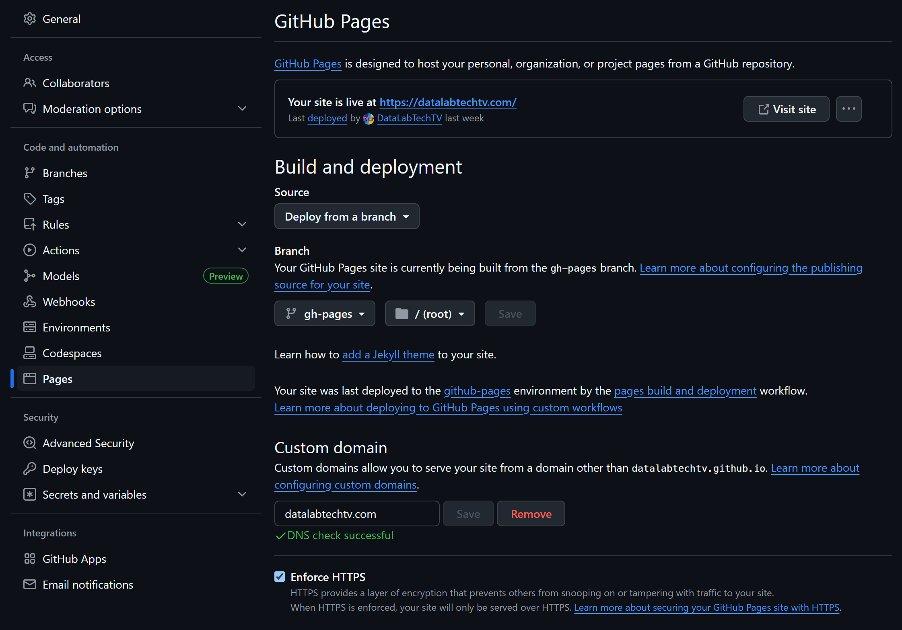
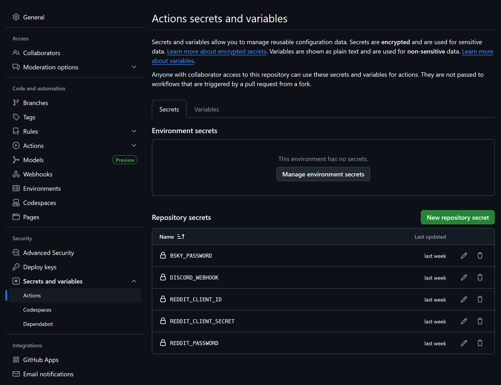
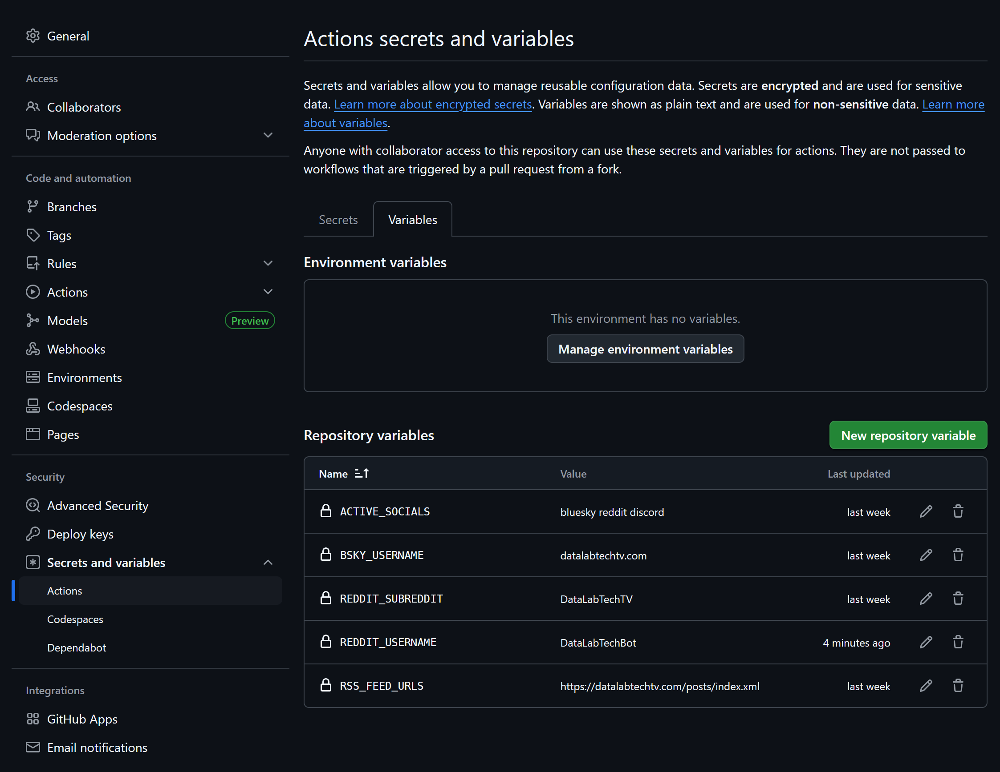

## Summary

Static sites, by definition, don't have a backend, but you can still automate a lot of your workflow using GitHub Actions. Read below if you want to learn how to setup your GitHub repo for managing and [deploying a Hugo static site](#deploying-a-static-site-on-github). You'll also learn how to [schedule blog posts](#scheduling-hugo-blog-posts), so they go online at a later date without the need for any manual action. And you'll learn how to use RSS and GitHub Actions to [automate social media posting](#automating-social-media-posts-with-rss) for Bluesky, Reddit, and Discord—you can easily add more options yourself, with a little Python coding.

## Deploying a Static Site on GitHub

A static website doesn't have a backend, so, in theory, you wouldn't be able to schedule posts. However, there is a way to circumvent this. Hosting a static site on GitHub can be done for free, if you create a repo named `<username>.github.io`. Once you do this, whatever you drop into the `main` branch of your repo will be published as a website on that page.

Let's use [Hugo](https://gohugo.io/) as an example for a static website generator. You have a few options, to manage the source code for Hugo.

### Source and Target Code: Repos vs Branches

You can either create a separate repository, where `public/` is added to `.gitignore`, and then you just setup `public/` as the `<username>.github.io` repo, by either keeping track of individual changes manually with proper commits, or by re-initializing and force pushing each time:

```bash
cd public/
rm -rf .git/
git init -b main
git config core.sshCommand "ssh -i ~/.ssh/<gh-key>"
git config user.name "Your Name"
git config user.email "your@email"
git add .
git commit -m "chore: local build deployment"
git remote add origin <pages-repo-url>
git push --force origin main:gh-pages
```

Or, you can use the `<username>.github.io` repo for everything, by setting a separate branch for your compiled website (usually `gh-pages`), under Settings → Pages → Branch.



Personally, I use the second option, either deploying via a [Makefile](https://github.com/DataLabTechTV/datalabtechtv.github.io/blob/main/Makefile) or, more often, via [GitHub Actions](https://github.com/DataLabTechTV/datalabtechtv.github.io/actions/workflows/deploy.yml) (GHA). This is where you can also set a [custom domain](https://docs.github.com/en/pages/configuring-a-custom-domain-for-your-github-pages-site/managing-a-custom-domain-for-your-github-pages-site#configuring-an-apex-domain), if you have one.

## Scheduling Hugo Blog Posts

When you create a blog post in Hugo, there are three relevant front matter flags you can set: `draft`, `date`, and `expiryDate`. If you set `draft` to `true`, use a `date` in the future, or an `expiryDate` in the past, then the post won't be compiled when running `hugo` without arguments.

You still can compile drafts with the `-D` flag, future content with the `-F` flag, or expired content with the `-E` flag. In my [Makefile](https://github.com/DataLabTechTV/datalabtechtv.github.io/blob/main/Makefile), I've got a few rules so I don't forget it:

```Makefile
build:
	hugo --minify

dev:
	hugo server -DF -b http://localhost:1313

future:
	hugo server -F -b http://localhost:1313

preview:
	hugo server -b http://localhost:1313
```

I use `make dev` when I'm working on a post, `make future` to confirm scheduled posts, and `make preview` to view the website as it will be published now.

### Build and Deploy via GitHub Actions

For public repos, GitHub provides free and unlimited usage for [a few runners](https://docs.github.com/en/actions/using-github-hosted-runners/using-github-hosted-runners/about-github-hosted-runners#standard-github-hosted-runners-for-public-repositories), out of which `ubuntu-latest` for x64 is included, providing 4 CPU cores, 16 GB of RAM, and 14 GB of storage. This is perfect to help us manage a few simple tasks, such as compiling and deploying a Hugo static site.

We can use future `dates` to schedule posts, as long as we rebuild the website, after that date, but doing this manually is not that much of a scheduling—I'd rather just unflag from draft. This is where [GitHub Actions](https://github.com/DataLabTechTV/datalabtechtv.github.io/blob/main/.github/workflows/deploy.yml) come in:

```yaml
name: Hugo Rebuild Weekly

on:
  schedule:
    - cron: '15 11 * * 2'
  workflow_dispatch:

jobs:
  build-deploy:
    if: github.ref != 'refs/heads/gh-pages'
    runs-on: ubuntu-latest
    steps:
      - uses: actions/checkout@v3
        with:
          submodules: true

      - name: Setup Hugo
        uses: peaceiris/actions-hugo@v2
        with:
          hugo-version: '0.111.3'

      - name: Build
        run: hugo --minify

      - name: Deploy
        uses: peaceiris/actions-gh-pages@v3
        with:
          github_token: ${{ secrets.GITHUB_TOKEN }}
          publish_branch: gh-pages
          publish_dir: ./public
```

Let's break it down, step by step.

When using GHAs, you can set it to activate manually, on push, and/or on a schedule. I avoid push, since I don't want my website to be published as I'm working on a blog post, or changing the website design, before the content is ready. Personally, I set it to run on a schedule, a few minutes after my weekly YouTube video release, which is also when I publish a companion blog post for it:

```yaml
name: Hugo Rebuild Weekly

on:
  schedule:
    - cron: '15 11 * * 2'
  workflow_dispatch:
```

You can keep other branches besides `main`, and work on those, without ever worrying about that version being published automatically, as `schedule` only triggers for the default branch (usually `main`). You can, however, manually trigger the workflow for any branch. This is why we setup a single job that can be triggered for any branch that is not `gh-pages`:

```yaml
jobs:
  build-deploy:
    if: github.ref != 'refs/heads/gh-pages'
    runs-on: ubuntu-latest
    steps:
		...
```

Let's now go through each step. First, we checkout the repo into the root of the runner, including submodules, which is required if you added your theme as a submodule, as is frequently the case:

```yaml
- uses: actions/checkout@v3
  with:
    submodules: true
```

Then, we install Hugo into the runner:

```yaml
- name: Setup Hugo
  uses: peaceiris/actions-hugo@v2
  with:
    hugo-version: '0.111.3'
```

And we compile the Hugo source code on the root of our repo:

```yaml
- name: Build
  run: hugo --minify
```

Finally, we use [peaceiris/actions-gh-pages](https://github.com/peaceiris/actions-gh-pages) to help us deploy the contents of `public/` to our `gh-pages` branch:

```yaml
- name: Deploy
  uses: peaceiris/actions-gh-pages@v3
  with:
    github_token: ${{ secrets.GITHUB_TOKEN }}
    publish_branch: gh-pages
    publish_dir: ./public
```

In order for this last step to work, we are required to go into Settings → Actions → General → Workflow permissions and switch to "Read and write permissions". This will let the actions for this repo write into the `gh-pages` branch, which is required for deploying a new version of the website.

Once this is setup, you can set your cron date:

```yaml
on:
  schedule:
    - cron: '15 11 * * 2'
```

And this action will run for the default branch (most likely `main`) whenever the date matches. You can use [Crontab.guru](https://crontab.guru/) to help you configure the date, which can be set with expressions like `@weekly`, `@daily` or `@hourly` as well.

On the set date, a new runner will be created, the repo's `main` branch checked out, `hugo` will run, and the output produce in `public/` will replace your `gh-pages` content. If a post scheduled for a future date is now in the past, it will be rendered automatically.

## Automating Social Media Posts with RSS

Once you've got your static site running, it will usually provide an RSS feed with the latest posts. Hugo does this by default, even if you or your theme don't provide a custom feed template. Each directory under content will contain its own `index.xml`.

For example, for my website, you'll find one in the root, which includes all pages, even the privacy and cookie policies:

- https://datalabtechtv.com/index.xml

Another one under `/posts`, which is the main RSS feed:

- https://datalabtechtv.com/posts/index.xml

And even one per category (e.g., Data Engineering):

- https://datalabtechtv.com/categories/data-engineering/index.xml

There are a few GitHub Actions on the [Marketplace](https://github.com/marketplace?query=rss&type=actions) to handle RSS (e.g., [Feed to Bluesky](https://github.com/marketplace/actions/feed-to-bluesky)), but I decided to create my own repo and workflow, based on a custom Python script that publishes to Bluesky, Reddit and Discord at the same time.

Let's go through the workflow first, and then through the Python script.

### GitHub Actions & Secrets and Variables

The overall strategy for the GitHub Actions workflow consisted of:

1. Installing [uv](https://docs.astral.sh/uv/) and creating a virtual environment with all Python dependencies.
2. Running a Python script to read RSS from my static site and produce social media posts from it, posting to my socials (for now, Bluesky, Reddit, and Discord).
3. Storing the last run dates (one per feed) directly on the repo, writing to the `.last_runs.json` file, committing and pushing.

Step 3 will be used as persistence so that, when there are no new RSS articles, nothing will be published to social media.

I also added the option to force post the latest `n` articles, when desired. I used this during development for testing, but it can also be used after you change your static site content and delete old social media posts, so that you can repost simultaneously to all your socials via manual trigger.

The action is setup to trigger weekly, 15 minutes after my static site is recompiled:

```yaml
name: Post from RSS

env:
  LAST_RUNS_PATH: .last_runs.json

on:
  schedule:
    - cron: '30 11 * * 2'
  workflow_dispatch:
    inputs:
      force_latest:
        description: force_latest
        type: number
        default: 0
```

You can customize the path where the last run dates will be stored via `LAST_RUNS_PATH` and, as you can see, we also provide a `force_latest` input, which defaults to zero (no forcing), that can optionally be set to a positive integer when manually running this workflow.

Our workflow then has five steps. First, we checkout the repo, install `uv` and run `uv sync` to install required Python dependencies:

```yaml
- name: Checkout repo
  uses: actions/checkout@v4

- name: Set up uv and Python
  uses: astral-sh/setup-uv@v6

- name: Create venv and install dependencies
  run: uv sync
```

Then we run our custom Python script, which is largely configured via environment variables that we set under Settings → Secrets and Variables → Actions.





We run the script and set all environment variables as follows:

```yaml
- name: Run RSS to Social
  env:
    FORCE_LATEST: ${{ github.event.inputs.force_latest }}
    RSS_FEED_URLS: ${{ vars.RSS_FEED_URLS }}
    ACTIVE_SOCIALS: ${{ vars.ACTIVE_SOCIALS }}
    BSKY_USERNAME: ${{ vars.BSKY_USERNAME }}
    BSKY_PASSWORD: ${{ secrets.BSKY_PASSWORD }}
    REDDIT_CLIENT_ID: ${{ secrets.REDDIT_CLIENT_ID }}
    REDDIT_CLIENT_SECRET: ${{ secrets.REDDIT_CLIENT_SECRET }}
    REDDIT_USERNAME: ${{ vars.REDDIT_USERNAME }}
    REDDIT_PASSWORD: ${{ secrets.REDDIT_PASSWORD }}
    REDDIT_SUBREDDIT: ${{ vars.REDDIT_SUBREDDIT }}
    DISCORD_WEBHOOK: ${{ secrets.DISCORD_WEBHOOK }}
  run: uv run rss_to_social.py
```

Any variables set under `env` will also be available to the script automatically (only `LAST_RUNS_PATH` in our case).

Here's a summary table for the required environment variables:

| Environment Variable   | Description                                                                                                                                                           | Secret? |
| ---------------------- | --------------------------------------------------------------------------------------------------------------------------------------------------------------------- | ------- |
| `FORCE_LATEST`         | Number of RSS articles to force post to social media, even their date is older than the last run.                                                                     | ❌       |
| `LAST_RUNS_PATH`       | Path for the JSON file that stores last runs dates per feed as an object. It must be relative to the repo's root (e.g., `.runs/last_runs.json`.                       | ❌       |
| `RSS_FEED_URLS`        | New line separated feed URLs (both RSS and Atom are supported). We use new lines, because it's easy to setup in GitHub vars and secrets, and it improves readability. | ❌       |
| `ACTIVE_SOCIALS`       | Only socials listed here will be posted to when the action runs. Values are new line separated and support: `bluesky`, `reddit`, and `discord`.                       | ❌       |
| `BSKY_USERNAME`        | The username for the Bluesky account you want to post to (e.g., `datalabtechtv.bsky.social` or `datalabtechtv.com`).                                                  | ❌       |
| `BSKY_PASSWORD`        | The password for the Bluesky account you want to post to.                                                                                                             | ✅       |
| `REDDIT_CLIENT_ID`     | The client ID for your Reddit app (you can create one by vising https://www.reddit.com/prefs/apps/.                                                                   | ✅       |
| `REDDIT_CLIENT_SECRET` | The client secret for your Reddit app.                                                                                                                                | ✅       |
| `REDDIT_USERNAME`      | The username for the Reddit account that will be posting. We recommend using a dedicated bot account (e.g., we use `DataLabTechBot`).                                 | ❌       |
| `REDDIT_PASSWORD`      | The password for the Reddit account that will be posting.                                                                                                             | ✅       |
| `REDDIT_SUBREDDIT`     | The name of the subreddit where you'll be posting to (e.g., we post to `DataLabTechTV`).                                                                              | ❌       |
| `DISCORD_WEBHOOK`      | The Discord webhook URL for a given channel. This can be created by going into Edit Channel → Integrations → Webhooks → Create Webhook.                               | ✅       |

The script also takes a `--force-latest` command line argument, which takes the value from the workflow input we set. Posts will be filtered based on the last run date and published to social media, and a new `.last_runs.json` file will be produced, committed and pushed:

```yaml
- name: Commit updated ${{ env.LAST_RUNS_PATH }} if changed
  run: |
    git config user.name "github-actions"
    git config user.email "github-actions@github.com"
    git add $LAST_RUNS_PATH
    git diff --cached --quiet \
        || git commit -m "Update $LAST_RUNS_PATH"
  continue-on-error: true

- name: Push changes
  if: success()
  uses: ad-m/github-push-action@v0.8.0
  with:
    github_token: ${{ secrets.GITHUB_TOKEN }}
```

Make sure to set "Read and write permissions" under Settings → Actions → General → Workflow, so that the `.last_runs.json` file can be committed.

### Python Script: RSS to Socials

The following flowchart provides an overview of how the [rss_to_social.py](https://github.com/DataLabTechTV/rss-to-social/blob/main/rss_to_social.py) script works.

<pre class="mermaid">
flowchart TB
LR[Last Runs] & FL[Force Latest] & FU[Feed URLs] & AS[Active Socials] --> NE
subgraph Each Feed
NE[Determine New Entries] --> CP[Create Post]
subgraph Each New Entry
CP --> PB & PR & PD
subgraph Post Socials
PB[Bluesky]
PR[Reddit]
PD[Discord]
end
end
end
</pre>

It first loads a dictionary of last run dates per feed from the file pointed by `LAST_RUNS_PATH`, as well as the values for the following environment variables:

- `FORCE_LATEST` – number of recent articles to force post (defaults to zero)
- `RSS_FEED_URLS` – one feed URL per line (usually a single feed per site).
- `ACTIVE_SOCIALS` – one social media platform name per line (can be `bluesky`, `reddit`, and/or `discord`).

It then determines the new (or forced) entries to be posted. An entry will be considered when any of the following conditions apply:
- There is no last run for the feed URL—all entries will be posted.
- The entry is one of the most recent, up to `FORCE_LATEST`.
- The entry's date is older than the last run date.

Each entry is then transformed into a `Post`, with a `title`, `description` (from the entry summary), `link`, and, if available, an `image_path` pointing to a temporary file with the downloaded image from the entry's media content, along with an `image_alt`.

Finally, for each of the `ACTIVE_SOCIALS`, we publish a post. For Bluesky, we use [atproto](https://atproto.blue/), for Reddit, we use [PRAW](https://praw.readthedocs.io/), and, for Discord, we just use [requests](https://requests.readthedocs.io/).

## Final Remarks

In the future, I might turn this into a reusable GitHub Action, but, for now, feel free to fork my repo at [DataLabTechTV/rss-to-social](https://github.com/DataLabTechTV/rss-to-social) and adapt it to your own needs. Remember that you'll need to setup your own "Secrets and variables" and enable "Read and write permissions" for GHA on your repo.

---

If you like content about all things data, including DevOps and other tangents, such as this one, make sure to subscribe to my YouTube channel at [@DataLabTechTV](https://www.youtube.com/@DataLabTechTV?sub_confirmation=1)!
