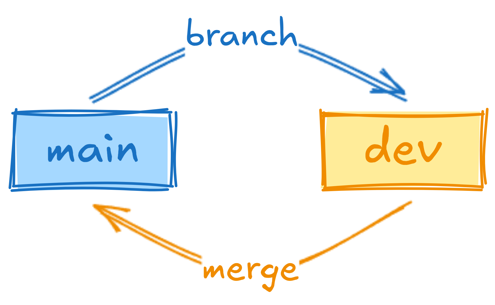
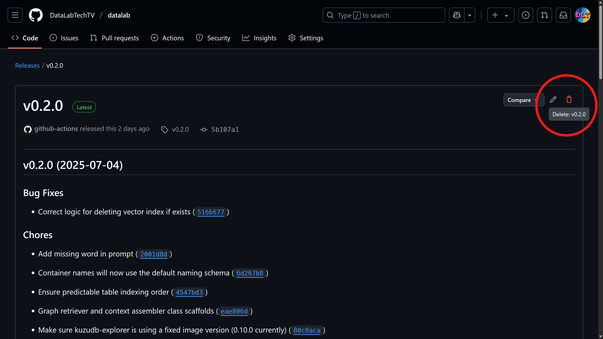

## Summary

Did you know you can rely on conventional commits, and a simple git branching workflow, to automate semantic releases for your Python projects, using GitHub Actions?

Conventional commits can help you standardize your commit messages and improve the readability of your git history, but they can also be used to automate releases by bumping up version components (`MAJOR.MINOR.PATCH`) based on the content of your commit messages, since the previous release, as identified by a git tag (e.g., `v0.1.0`). This is a must-have for any self-respecting developer, who maintains an evolving codebase, even when solo coding.

Read below, if you want to know how to 'set it and forget', adding automated semantic releases to your git repo, so you won't ever have to handle it yourself, or manually trigger a workflow to do a release.

<div style="position: relative; padding-bottom: 56.25%; height: 0; overflow: hidden; max-width: 100%;">
	<iframe
		src="https://www.youtube.com/embed/mxPfbwJ0FiU"
		frameborder="0"
		allow="accelerometer; autoplay; clipboard-write; encrypted-media; gyroscope; picture-in-picture; web-share"
		referrerpolicy="strict-origin-when-cross-origin"
		allowfullscreen
		style="position: absolute; top: 0; left: 0; width: 100%; height: 100%;">
	></iframe>
</div>

## Conventional Commits

[Conventional commits](https://www.conventionalcommits.org/en/v1.0.0/) is "a specification for adding human and machine readable meaning to commit messages". This means that it will, not only, make it easier for you and other coders to navigate through your repo history, but also enable software tools to advantage of this standard—this is what makes semantic release possible.

In the table below, there is an overview of conventional commits, based on message types from the Angular convention, which is widely adopted—used by [commitlint](https://commitlint.js.org/), [Dependabot](https://github.com/dependabot), etc. I also describe my personal logic for using each message type, and what version component it affects.

The conventional commits spec provides a well-defined template for commit messages, but, at the same time, it's quite loose regarding which message types to use, relying mostly on the Angular convention, softly introduced in the spec as an example tied to commitlint. This is why I believe further comment is required, and I would go as far as to proposing the next revision to conventional commits should include a consensual list of valid, non-overlapping, message types.

Check out the following table for my comments on this.

| Type       | Usage                                                                                                                                                                                                                                                                                                                                                                                                                                                                                                                                                                                                                                                                                                                                                                                                                                                                | Version |
| ---------- | -------------------------------------------------------------------------------------------------------------------------------------------------------------------------------------------------------------------------------------------------------------------------------------------------------------------------------------------------------------------------------------------------------------------------------------------------------------------------------------------------------------------------------------------------------------------------------------------------------------------------------------------------------------------------------------------------------------------------------------------------------------------------------------------------------------------------------------------------------------------- | ------- |
| `<type>!`  | The most common trigger for breaking changes and major releases is `feat!`. I usually don't use `BREAKING CHANGE` in the message body, since I might want to do a MAJOR bump up regardless of whether there is a breaking change (e.g., when reaching the next maturity level).<br><br>It's less likely that other types will introduce breaking changes, but it can still happen. For example, a `chore!(deps)` might update a dependency that changed its output file format and provides no backward compatibility from that point on.<br><br>I know I'm being opinionated, but, personally, I avoid breaking changes at all cost in my software. This is why I break convention here. I prefer the idea of 'maturity level' to 'breaking change', and maybe we should discuss this for future versions of the conventional commits spec.                         | MAJOR   |
| `feat`     | This is just a regular feature, large or small, added to your software.<br><br>We avoid constant version bump ups by not having a rolling release here (i.e., avoid using only the `main` branch—see bellow for our proposed minimal git branching workflow.                                                                                                                                                                                                                                                                                                                                                                                                                                                                                                                                                                                                         | MINOR   |
| `fix`      | This represents a bug fix—that's what patches mostly are.<br><br>Sometimes we might consider a change in coding logic to be a kind of fix, but that's a `refactor`, not a `fix`. Be critical about it.                                                                                                                                                                                                                                                                                                                                                                                                                                                                                                                                                                                                                                                               | PATCH   |
| `perf`     | Performance improvements are tagged with `perf`, and these do represent a patch—rightfully so, in my opinion.<br><br>This is also the default for `python-semantic-release` when `commit_parser` is set to `conventional` (also the default).                                                                                                                                                                                                                                                                                                                                                                                                                                                                                                                                                                                                                        | PATCH   |
| `chore`    | This is not a part of the Angular convention, but it's still [supported by commitlint](https://commitlint.js.org/reference/rules.html#type-enum), and I prefer to use it with a scope instead of the `build` type—e.g., `chore(dep)`.                                                                                                                                                                                                                                                                                                                                                                                                                                                                                                                                                                                                                                | none    |
| `refactor` | Should be strictly used to signal code rewritings that change nothing besides structure or naming (i.e., code might be reorganized into functions, separate modules, etc., and these might be renamed, but no fixes, features, or performance improvements are to be added in a refactor).<br><br>I use this a lot, as I tend to begin with a single file per Python package, and then refactor it into multiple modules (i.e., separate files) as the code grows.<br><br>In the course of a refactor, if I find a bug, I usually commit all other files first with `refactor` and then commit that specific file using `fix` . Similarly, I give priority to `feat` over `fix`. This avoids having commits with multiple message types, which break the convention. It's best to avoid this workflow altogether, as much as possible, but, you know, stuff happens. | none    |
| `style`    | Any purely cosmetic changes, like reformatting or theming, should be tagged with the `style` type.<br><br>I rarely use this, as I tend to just enable automatic formatting, on save, with [black](https://black.readthedocs.io/). An obvious application of `style` in this context might include switching from `black` to another formatting approach, or switching to lower case SQL strings, when you had been using upper case before. It might also include fringe cases, like mixing different line endings by mistake, when coding in a different OS. It should also be used when visually changing components, for example based on CSS.                                                                                                                                                                                                                    | none    |
| `test`     | Anything done on tests is tagged with `test`.<br><br>Regardless of whether the commit is for a new test, a bug fix inside a test, a refactoring within tests, I always use this tag for my tests-related commits.                                                                                                                                                                                                                                                                                                                                                                                                                                                                                                                                                                                                                                                    | none    |
| `ci`       | Used when modifying GitHub Actions and similar workflows. This includes any CI/CD configuration files.<br><br>I mostly use it when changing files inside the `.github` directory, as I haven't found any other case for my personal repos yet. I find it awkward that the type isn't named with CD as well, but maybe I'm missing something—why only CI?                                                                                                                                                                                                                                                                                                                                                                                                                                                                                                             | none    |
| `docs`     | Any update to documentation, be it files like `README.md` or docstrings inside your code, should be tagged `docs`.<br><br>Another use case is when you produce web pages with the documentation for your project (e.g., building and updating the `/docs` directory that's being served as GitHub Pages).                                                                                                                                                                                                                                                                                                                                                                                                                                                                                                                                                            | none    |
| `build`    | It can be used to signal any change to the build system, including dependencies, or changes to a docker image.<br><br>I personally don't use it all, preferring `chore` instead—e.g., `chore(deps)` or `chore(docker)`. What other non-build-related chores would you have? It's just too tiny of a use case to consider using another type, in my view.                                                                                                                                                                                                                                                                                                                                                                                                                                                                                                             | none    |
| `revert`   | When you run `git revert`, make sure to edit the message so that it uses the `revert` type. This is not the default, and I've broken this rule a few times, but I will stick to it in the future.<br><br>A `revert` might also imply a rollback in version, but this usually requires manual input. Since it's not automated, I consider that the version is unaffected for `revert` commits.                                                                                                                                                                                                                                                                                                                                                                                                                                                                        | none    |

## Git Branching Workflow

In order to avoid a constant trigger of the semantic release process, we bundle all commits, to be considered for a potential release, in a separate branch called `dev`. Then, we use merge commits to merge to `main`. The process is simple and it looks something like this:



In a scenario where multiple contributors exist, it might make sense to use multiple `feat/*` branches as well, that would merge to `dev`. For our particular case, however, keeping only two branches also enables us to keep a tidy git history, without loss of information—if we used squash merging, we'd lose individual commits, and, if we used rebase merging, we'd lose the branch of origin instead.

### Semantic Release

Below, you'll find a few examples of how the proposed git branching workflow will affect version updates when using semantic release.

#### MINOR Release

The following diagram shows an example of a `MINOR` version bump up. We branch from `main` into `dev` and create three commits, a `feat`, a `fix`, and a `docs` update. We then merge to `main` and a semantic release happens, bumping up the version from `v0.1.0` to `v0.2.0`. Out of the three commits, only `feat` or `fix` could influence version bump up, but `feat` takes precedence over `fix`, so we only bump up the `MINOR`.

<pre class="mermaid">
gitGraph
   commit id: " "
   commit id: "0.1.0" tag: "v0.1.0"
   branch dev
   checkout dev
   commit id: "feat: tiny feature" type: HIGHLIGHT
   commit id: "fix: small bug"
   commit id: "docs: update readme"
   checkout main
   merge dev
   commit id: "0.2.0" tag: "v0.2.0"
   commit id: "  "
</pre>

#### PATCH Release

Below you'll find two examples, one where there is no version bump up, and another one where `PATCH` is bumped up. The first merge to `main` includes only two commits with types `chore` and `docs`—these do not trigger a version update (see the table above). Then, we keep working on `dev` and create a `fix` commit, with no other commits—this triggers a PATCH bump up from `v0.2.0` to `v0.2.1`.

<pre class="mermaid">
gitGraph
   commit id: " "
   commit id: "0.2.0" tag: "v0.2.0"
   branch dev
   checkout dev
   commit id: "chore(deps): bump up"
   commit id: "docs: install instructions"
   checkout main
   merge dev
   checkout dev
   commit id: "fix(graph.ops): embedder" type: HIGHLIGHT
   checkout main
   merge dev
   commit id: "0.2.1" tag: "v0.2.1"
   commit id: "  "
</pre>

#### MAJOR Release

Finally, we have an example of a MAJOR bump up, which, according to conventional commits, should only happen when there is a breaking change. In the diagram below, this is identified by `feat!`, with `BREAKING CHANGE` being merely decorative, as it's not a part of the message body—were we to remove the `!` and a MINOR bump up would occur instead.

<pre class="mermaid">
gitGraph
   commit id: " "
   commit id: "0.2.1" tag: "v0.2.1"
   branch dev
   checkout dev
   commit
   commit
   commit id: "feat!: BREAKING CHANGE" type: HIGHLIGHT
   commit
   checkout main
   merge dev
   commit id: "1.0.0" tag: "v1.0.0"
   commit id: "  "
</pre>

## Release Automation

We use [python-semantic-release](https://python-semantic-release.readthedocs.io/) to automate version tagging and release creation on GitHub. This tool will decide, based on your git log, which part of the [semantic version](https://semver.org/)  to bump up—`MAJOR.MINOR.PATCH`—as long as you follow [conventional commits](https://www.conventionalcommits.org/).

### GitHub Actions

We automate semantic releases using GitHub Actions, based on a [very simple workflow](https://github.com/DataLabTechTV/datalab/blob/v0.2.0/.github/workflows/release.yml) that we break down next.

The following block creates a Git Workflow named "Release" that activates on push to `main`, which means that, once we merge `dev` into `main`, it will be triggered. Since the workflow will need to create a commit, push it to `main`, and tag it with the correct version (e.g., `v0.2.0`), we also need to give it `write` permissions—this is a better approach than setting "Read and write permissions" for all actions on your GitHub repo.

```yaml
name: Release

on:
  push:
    branches:
      - main

permissions:
  contents: write

jobs:
  release:
    runs-on: ubuntu-latest

    steps:
	    ...
```

The first step on the `release` job is to checkout the repo with `fetch-depth: 0` to make sure that all history will be fetched, including previous tags, which are factored into the release logic.

```yaml
      - uses: actions/checkout@v4
        with:
          fetch-depth: 0
```

Then, we setup `uv`, to help ups run `semantic-release` via `uvx`. We could have, instead, used the [official GHA](https://python-semantic-release.readthedocs.io/en/latest/configuration/automatic-releases/github-actions.html) provided as part of `python-semantic-release`, but, since that required a Docker image to be built on each run, we decided to use this simpler and faster approach instead.

```yaml
      - name: Set up uv and python
        uses: astral-sh/setup-uv@v6
        with:
          python-version: 3.13
```

We define a shell function `sr` that call `semantic-release` and then run `version` and `publish`. When `version` is run, it updates the `CHANGELOG.md` and the project version under `pyproject.toml`, commits these changes, and tags the commit (e.g., `v0.2.0`). Then we run `publish`, which pushes the changes to the repo—thus requiring `GH_TOKEN`—and creates a GitHub Release adding the appropriate section from `CHANGELOG.md` to the release description, along with `zip` and `tar.gz` archives containing the source code for the release version.

```yaml
      - name: Run semantic-release
        env:
          GH_TOKEN: ${{ secrets.GITHUB_TOKEN }}
        run: | #shell
          sr() {
            uvx --from="python-semantic-release@9.21.1" \
	            semantic-release "$@"
          }

          sr version
          sr publish
```

### pyproject.toml

This is the configuration we're using under [pyproject.toml](https://github.com/DataLabTechTV/datalab/blob/v0.2.0/pyproject.toml):

```toml
[tool.semantic_release]
commit_parser = "conventional"
version_toml = ["pyproject.toml:project.version"]
allow_zero_version = true

[tool.semantic_release.changelog.default_templates]
changelog_file = "CHANGELOG.md"
```

In here, `commit_parser` will be set to work with conventional commits, `version_toml` ensures that the release version under `pyproject.toml` is bumped up, and `allow_zero_version` will produce versions starting from `0.1.0` rather than `1.0.0`. While we were also explicit with `changelog_file`, this was already the default.

## Rollback Strategy

Finally, if, for some reason, you need to rollback a release, you can use the following workflow.

### Prepare `dev`

First, switch to `dev` and make sure it contains all changes from `main`:

```shell
git merge-base --is-ancestor main dev && \
    echo "OK" || \
    echo "NOT OK"
```

If it doesn't (`NOT OK`), then rebase `main`—with the git branching workflow we're following, there should be no conflicts, specially if you had just merged `dev` into `main`:

```shell
git rebase main
```

### Revert Commit

Once `dev` is synced up with `main`, let's revert the automatic commit generated by semantic-release (e.g., undo `v0.2.0`). Don't forget to edit the commit message, when the editor opens (default behavior), and use <code>revert:&nbsp;...</code> to comply with conventional commits.

```shell
git revert v0.2.0
git push
```

### Delete Tag

Then, we'll need to delete the `v0.2.0` tag:

```shell
git tag -d v0.2.0
git push origin :refs/tags/v0.2.0
```

### Delete Release

And finally just go into the GitHub release that you want to undo and press the delete button on the UI to remove it:


