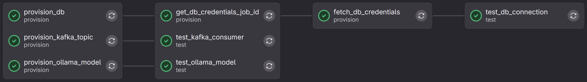
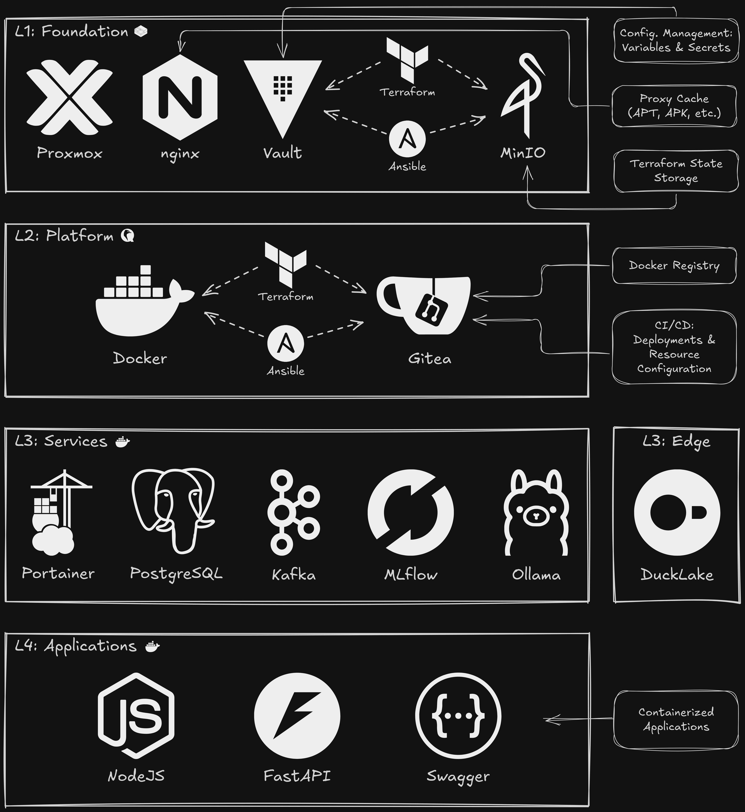

## Summary

On part 5 of this series, you'll learn how to

<div style="position: relative; padding-bottom: 56.25%; height: 0; overflow: hidden; max-width: 100%;">
	<iframe
		src="https://www.youtube.com/embed/TBD"
		frameborder="0"
		allow="accelerometer; autoplay; clipboard-write; encrypted-media; gyroscope; picture-in-picture; web-share"
		referrerpolicy="strict-origin-when-cross-origin"
		allowfullscreen
		style="position: absolute; top: 0; left: 0; width: 100%; height: 100%;">
	></iframe>
</div>

## Changes to CI/CD

### Attempted Refactoring

At first, we attempted to refactor the CI/CD pipeline as follows:

```
.ci/
├── scripts/
│   ├── kafka/
│   ├── ollama/
│   └── postgres/
└── templates/
    ├── deploy.yml
    ├── kafka.yml
    ├── ollama.yml
    └── postgres.yml
```

However, if we run a script instead of defining it inline, we won't be able to run these jobs from another repository, which is a concern for our current workflow, as we want to be able to provision databases and credentials, or other resources, by calling jobs within the `datalab` repository as effortlessly as possible. We ended up going back to the original approach, with templates on the root of `.ci/`.

We also fixed an error in the `changes` globbing, where `infra/services/docker/**` should have been `infra/services/docker/**/*` so that files were matched rather than directories.

### Custom Ubuntu Image

Since we were continuously in need of a few common command line tools, like `curl` or `jq`, we decided to build a custom Ubuntu image that we pushed to the container registry for the `datalab` project. This let us reuse this image directly from our container registry, without the need to add a `before_script` block to setup the Ubuntu instance each time a new runner was launched for jobs requiring additional commands beyond the base image.

Building and pushing for this image was done through the Terraform project under `infra/services/gitlab`, so the workflow remains unchanged, assuming you setup your CI/CD variables using your `.env` via Terraform.

The first attempt to push a large image into our container registry failed. This ended up being fixed by adding `checksum_disabled` to `/etc/gitlab/gitlab.rb` as follows:

```ruby
registry['storage'] = {
  's3_v2' => {
    ...
    'checksum_disabled' => true,
  }
}
```

And then SSHing into the GitLab VM and running:

```bash
sudo gitlab-ctl reconfigure
```

This configuration was also added to the L2 (Platform) Terraform project, to the cloud-config for GitLab, so if you're deploying this now, you don't have to worry about this.

We also had to change the project visibility to "Public" for `datalab`, otherwise CI/CD job were unable to pull from the container registry. Of course our GitLab instance is not exposed to the outside, otherwise we would need a different strategy to handle access.

### Improving Postgres Workflow

 We also improved the `postgres` template in order to store credentials as JSON, using a CI/CD variable, so that we could return them, if run multiple times, as opposed to just producing a new password and not providing access to the original credentials. This is a requirement that we missed during the initial design of this workflow, as we'll need these credentials on our external application projects during deployment. This also makes the workflow idempotent.

 Here's a summary of changes:

- Credentials no longer printed in logs.
- Credentials stored as JSON, using a CI/CD variable.
- External projects will always need to call this workflow to load credentials into the env during application container deployment.
- Database and credentials will be created as required, if they don't exist.

Notice that any project can access any database and credentials, as this wasn't a concern here, but the JSON format and workflow can be expanded to handle this if required. A better way, as we'll see next, is to just stop resisting using an extra service to handle secrets.

## Multi-Project CI/CD on GitLab Free Tier

### Templates for Provisioning

We provide, on the original `datalab` project, CI/CD templates that can be included as required, on external projects, as well as internally, to provision resources, be it within PostgreSQL, Kafka, or Ollama.

Since we are using the GitLab Free tier, we lack the syntactic sugar to trigger jobs on an external project, particularly when we need artifacts from that project. So, the best way to handle this is via the REST API.

We provide the following CI/CD templates:

```
.ci/provision/
├── kafka.yml
├── ollama.yml
└── postgres.yml
```

These are set to call the CI/CD pipeline with the appropriate input values to provision resources. The strategy is similar for all three templates. Here's how we do it for `.ci/provision/ollama.yml`:

```yaml
spec:
  inputs:
    pull:
      description: "Pull Ollama model"
      type: string

---

stages:
  - provision

variables:
  PROVISIONER_ID: datalabtechtv%2Fdatalab

provision_ollama_model:
  stage: provision
  image: gitlab:5050/datalabtechtv/datalab/ubuntu:custom
  variables:
    PULL: $[[ inputs.pull ]]
  script:
    - echo "Triggering downstream pipeline"
    - |
      PIPELINE_ID=$(curl -s -X POST \
        --form token=$GITLAB_TRIGGER_TOKEN \
        --form ref=infra \
        --form inputs[ollama_pull]=$PULL \
        $CI_API_V4_URL/projects/$PROVISIONER_ID/trigger/pipeline | jq -r '.id')
    - echo "Triggered pipeline $PIPELINE_ID"
    - |
      while true; do
        STATUS=$(curl -s -H "PRIVATE-TOKEN: $GITLAB_TOKEN" \
          $CI_API_V4_URL/projects/$PROVISIONER_ID/pipelines/$PIPELINE_ID \
          | jq -r '.status')
        echo "Pipeline status: $STATUS"
        [[ "$STATUS" == "success" || "$STATUS" == "failed" ]] && break
        sleep 10
      done
```

The `spec.inputs` will be set to whatever information you need from an external project to provision the required resource:

```yaml
spec:
  inputs:
    pull:
      description: "Pull Ollama model"
      type: string

---
```

Then, we set stages to `provision`, which is the only one required for these template:

```yaml
stages:
  - provision
```

External projects that include this template must make sure that this stage is defined for them as well.

We set a global variable, `PROVISIONER_ID`, with the project ID for `datalab` in its string format:

```yaml
variables:
  PROVISIONER_ID: datalabtechtv%2Fdatalab
```

And, finally, we define the provisioning job, which always triggers the `datalab` pipeline regardless of where it's called from. Let's take a look at the script for the `provision_ollama_model` job.

First, we trigger the pipeline, obtaining it's run ID:

```bash
echo "Triggering downstream pipeline"

PIPELINE_ID=$(curl -s -X POST \
  --form token=$GITLAB_TRIGGER_TOKEN \
  --form ref=infra \
  --form inputs[ollama_pull]=$PULL \
  $CI_API_V4_URL/projects/$PROVISIONER_ID/trigger/pipeline | jq -r '.id')

echo "Triggered pipeline $PIPELINE_ID"
```

Notice that we need the `GITLAB_TRIGGER_TOKEN` we previously set. As you can see, we send the user configs via `inputs[...]` form data fields.

We then poll the API every 10 seconds to check if the pipeline has finished:

```bash
while true; do
  STATUS=$(curl -s -H "PRIVATE-TOKEN: $GITLAB_TOKEN" \
    $CI_API_V4_URL/projects/$PROVISIONER_ID/pipelines/$PIPELINE_ID \
    | jq -r '.status')

  echo "Pipeline status: $STATUS"

  [[ "$STATUS" == "success" || "$STATUS" == "failed" ]] && break

  sleep 10
done
```

Once this is run, control will be ceded to the external project CI/CD pipeline.

### External Test Project

We created an external test project called [datalab-infra-test](https://github.com/DataLabTechTV/datalab-infra-test) to demo how this works.

First, we needed a trigger token from the `datalab` project, which was created by navigating to Settings → CI/CD → Pipeline trigger tokens → Add new token, under `datalab`. We then stored the token in the `GITLAB_TRIGGER_TOKEN` CI/CD variable under `datalab-infra-test`.

Additionally, we had to reconfigure `/etc/gitlab-runner/config.toml` to increase job concurrency, otherwise we wouldn't be able to trigger a job, and wait for it from another job—with the default concurrency of 1, the pipeline would just freeze completely.

We SSHed into the GitLab VM, set `concurrency = 4`, and restarted the runner with:

```bash
sudo sed -i 's/^concurrent = 1/concurrent = 4/' /etc/gitlab-runner/config.toml
sudo gitlab-runner restart
```

This configuration was also added to the L2 (Platform) Terraform project, within the cloud-config for GitLab, so if you're deploying this now you won't have to worry about it.

For example, if you need a Postgres database and credentials, you can configure your CI/CD jobs as follows:

```yaml
stages:
  - provision
  - test

variables:
  POSTGRES_DB_USER: ci_cd_user
  POSTGRES_DB_NAME: ci_cd_db

include:
  - project: datalabtechtv/datalab
    ref: infra
    file: '.ci/provision/postgres.yml'
    inputs:
      db_user: $POSTGRES_DB_USER
      db_name: $POSTGRES_DB_NAME

test_db_connection:
  stage: test
  image: postgres:18.0-alpine
  needs:
    - fetch_db_credentials
  script:
    - 'echo Connecting to database: $DB_NAME'
    - 'echo Connecting with user: $DB_USER'
    - PGPASSWORD=$DB_PASS psql -h docker-shared -U $DB_USER -d $DB_NAME -c '\q'
```

Here, `test_db_connection` would usually be replaced by something like a `docker compose up` for your own application. The point here is that this workflow will ensure that the database you need is created, and it will handle the secrets for you, making them available as env vars.

For Kafka and Ollama, we only run a provisioning job, since we don't need any credentials back from the job, but for Postgres, the pipeline will also fetch the job ID for `psql_create_db`, which contains the `credentials.env` artifact (this expires after 15m), loading those credentials as environment variables. The pipeline for the test project looks like this:



And now you know of a CI/CD strategy, running on top of the GitLab Free tier, for provisioning resources in your data lab infrastructure! It might not be the best, but it works. Of course, we'll keep improving on it, and we'll share everything with you, as we go!

## Model Deployment

### Starting Point

Last time, on our [ML End-to-End Workflow](../mlops-ab-testing/) we had produced a REST endpoint, using FastAPI, that provided a way to run inference over one or multiple models (A/B/n testing) that had been previously logged to MLflow. Optionally, we could log the inference to DuckLake, which was running on top of a local SQLite catalog and a remote MinIO storage. Logged inferences were streamed to a Kafka topic, and then consumed and buffered, up to a point when they were inserted into the appropriate DuckLake table.

What we want to do now is prepare this REST API to be deployed on the Docker instance running on the `docker-apps` VM, while using available services running on `docker-shared`. This includes MLflow and Kafka, but also PostgreSQL and MinIO (L1) for DuckLake. Today, we'll only be concerned with ensuring MLflow and Kafka are integrated, as we'll have a blog post (and video) focusing on migrating your catalog from SQLite to PostgreSQL, at which time we'll configure DuckLake adequately to run on top of `docker-shared` services.

### Asking CI/CD for Kafka Topics

Since our goal is essentially to expose `ml.server`, which is a part of the `datalab` project, we'll setup the CI/CD within this project. This time, we use two trigger jobs, for each of our Kafka topics, one for the logging the inference results (`provision_mlserver_results_topic`), and the other one to handle inference feedback sent by our users (`provision_mlserver_feedback_topic`).

Both jobs will be similar, so let's take a look at `provision_mlserver_results_topic`:

```yaml
provision_mlserver_results_topic:
  stage: deploy
  trigger:
    include:
      - local: .ci/provision/kafka.yml
        inputs:
          topic: ml_inference_results
          group: lakehouse-inference-result-consumer
    strategy: depend
  rules:
    - if: $CI_PIPELINE_SOURCE == "push"
      changes:
        - .ci/deploy.yml
        - infra/apps/docker/**/*
    - if: '"$[[ inputs.force_apps_deploy ]]" == "true"'
```

Similarly to what we did for the `datalab-infra-test` project, we include the provision template, but this time it's a local include. We ask that it creates topic `ml_inference_results`, initializing a consumer for it with group `lakehouse-inference-result-consumer`.

The job triggering rules match the ones that we use for our `apps_deploy` job.

### Deploying Applications

The `apps_deploy` job is defined under `.ci/deploy.yml`, for the `datalab` project, as follows:

```yaml
apps_deploy:
  stage: deploy
  image: docker:28.4.0-cli
  needs:
    - provision_mlserver_results_topic
    - provision_mlserver_feedback_topic
  variables:
    DOCKER_HOST: tcp://docker-apps:2375
    DOCKER_BUILDKIT: 1
    INFERENCE_RESULTS_TOPIC: ml_inference_results
    INFERENCE_FEEDBACK_TOPIC: lakehouse-inference-result-consumer
    INFERENCE_RESULTS_GROUP: ml_inference_feedback
    INFERENCE_FEEDBACK_GROUP: lakehouse-inference-feedback-consumer
  script:
    - docker compose -p datalab -f infra/apps/docker/compose.yml up -d --build
    - docker ps
  rules:
    - if: $CI_PIPELINE_SOURCE == "push"
      changes:
        - .ci/deploy.yml
        - infra/apps/docker/**/*
    - if: '"$[[ inputs.force_apps_deploy ]]" == "true"'
```

Regarding the rules, notice that we provide a new boolean input that we can set during pipeline triggering to force redeploy the docker compose for our applications. This is useful when we just want to update the env vars for it.

As you can see, we set the two topic provisioning jobs as a dependency, and we then configure the environment variables required by our `ml.server` REST API. Also notice that we set `DOCKER_BUILDKIT`, which will reduce the overhead of redeploying with the `--build` flag, as image layers will be cached between deployments.

### Docker Compose

Let's take a look at `infra/apps/docker/compose.yml`:

```yaml
services:
  mlserver:
    build:
      context: ../../../
      dockerfile: infra/apps/docker/mlserver/Dockerfile
    ports:
      - "8000:8000"
    environment:
      MLFLOW_TRACKING_URI: ${MLFLOW_TRACKING_URI}
      KAFKA_BROKER_ENDPOINT: ${KAFKA_BROKER_ENDPOINT}
    healthcheck:
      test: ["CMD", "curl", "-f", "http://localhost:8000/health"]
      interval: 10s
      retries: 5
    restart: unless-stopped
```

Notice that we set our build context to the root of the `datalab` project, so that it will pickup our `.env` when building locally. Otherwise, environment variables will either be set via the `apps_deploy` CI/CD job, or as a CI/CD variable, as is the case for `MLFLOW_TRACKING_URI` and `KAFKA_BROKER_ENDPOINT`, which are set to:

```bash
MLFLOW_TRACKING_URI="http://docker-shared:5000"
KAFKA_BROKER_ENDPOINT="docker-shared:9092"
```

#### Dockerfile

The `Dockerfile` for `ml.server` is quite minimal, and based on the official `uv` image bundled with Python 3.13 and running on Debian Trixie:

```Dockerfile
FROM astral/uv:python3.13-trixie-slim

RUN apt update && apt install -y git curl

WORKDIR /datalab
COPY pyproject.toml pyproject.toml
COPY uv.lock uv.lock

RUN uv sync --frozen

COPY . .

RUN uv sync --frozen

ENTRYPOINT ["./infra/apps/docker/mlserver/docker-entrypoint.sh"]
```

Order matters, if you want to optimize caching.

First we install system dependencies—our `pyproject.toml` is using a dependency straight from a git repo, so we'll need the `git` command:

```Dockerfile
RUN apt update && apt install -y git curl
```

Then, we switch to `/datalab` and copy only the require files to install `uv` dependencies:

```Dockerfile
WORKDIR /datalab
COPY pyproject.toml pyproject.toml
COPY uv.lock uv.lock

RUN uv sync --frozen
```

Installing dependencies before copying the source code for `datalab` will ensure that, unless dependencies change, we'll be able to change the code in `datalab` and redeploy without having to reinstall all dependencies again, which takes quite a while.

Then, we finally copy our complete `datalab` repo and install our source code as the last missing dependency:

```Dockerfile
COPY . .

RUN uv sync --frozen
```

#### docker-entrypoint.sh

We set the entry point for our container as a shell script that loads the Python virtual environment and then calls the CLI command to start the REST API server:

```bash
###!/usr/bin/env bash

set -e

### shellcheck source=/dev/null
. .venv/bin/activate

dlctl ml server "$@"
```

Using `set -e` will ensure that, if any command fails, the script will terminate there.

## Retrospective No. 1


We'll now do a retrospective on the architecture that we designed for our data lab infrastructure, identifying the good and the bad, and proposing a redesigned architecture that takes all of this into account.

These are my fairly unedited notes. For a more digestible version, please what the video on this topic, where I restructure this into smaller topics fitting of a slide deck.

### What Went Well

- The architecture was deployable, and everything works!
- Having a custom Ubuntu image for GitLab runners was useful to avoid constant `apt update` and package installs, which take time to download and install, each time a job with these requirements is run.
- Container registry was already useful for the Ubuntu custom image.

### To Improve

- Splitting Docker into multiple VMs was a bad move—a single beefier instance would have been better. It's easier to pool resources, but it also lowers the overhead of communicating among services within the same Docker instance.
- Using GitLab for secret management along with `.env` and `terraform.tfvars` is a pain—we might have been better off deploying HashiCorp Vault into Layer 1 and just using that for everything, with a `dev` version on docker compose for a local deployment. We might use a Vault Agent to load secrets as env vars as well.
- We have a container registry, but we haven't used it yet—we might need a workflow to manage images separately while tracking their versions.
- It might have been better to go with Gitea, which still has a container registry as well as CI/CD runners, rather than GitLab, given resource constraints.
	- GitLab is also quite bloated for a small home lab, running a few redundant services by default, like its own PostgreSQL instance, which we don't need, Prometheus, which we don't care about, or Praefect for HA, which we don't use.
	- GitLab's CI/CD must be defined in a single pipeline, as there are no separate workflows, like with GitHub Actions, or Gitea CI/CD for that matter.
	- Documentation is hard to browse, mainly due to the project's complexity and dimension.
	- Some components can be quite slow likely due to the interpreted nature of the Ruby language (e.g., starting `gitlab-rails console` takes nearly 30 seconds🥶).
	- Monetization is dependent on feature tiers, which makes it harder to get into (e.g., multi-project pipelines that require [needs:project](https://docs.gitlab.com/ci/yaml/#needsproject) only work in Premium or Ultimate tiers).
- Given the single workflow/pipeline approach of GitLab CI/CD, and assuming we would continue to use GitLab, a cleaner way to activate different workflows would have been to use a boolean input for each workflow to determine whether to activate the corresponding jobs—this is cleaner and more general than relying on non-empty values.
- We used a few init services on our Docker Compose project, but we could have just implemented this via CI/CD and strip it completely from Compose.
- Maybe we could have produced a single Terraform project for all layers of the infrastructure, although it's unclear whether setting layer dependencies would be needlessly complex to manage.
- Not using Ansible was a bad move—cloud-init is great for provisioning standard VMs, but not to handle configs, specially when we might need to change them.
- Having a proxy cache would be useful to avoid too many requests to package repositories (e.g., `apt`), specially during the initial setup stage, but also if we're continuously installing packages within runners for a few workflows, it will make sense to avoid constantly connecting to the base servers, both to ease load on the servers and to improve speed locally.
- MLflow is running on a SQLite backend, but we do have a PostgreSQL instance that we should switch to.

### Redesigning the Architecture



Here are the overall changes for each layer:

- L1: Foundation
	- Add nginx to serve as a proxy cache for `apt`, `apk`, or others.
	- Add HashiCorp Vault, since it integrates with the shell environment, via the vault agent, with Terraform, via its official provider, and with CI/CD, either via the vault agent, or through the Terraform provider, depending on whether we prefer a more or less real-time configuration update.
	- Keep Terraform for deployment, but replace mutable configuration management with Ansible.
- L2: Platform
	- Combine the three Docker VMs into a single VM.
	- Keep Terraform for deployment, but replace mutable configuration management with Ansible.
- L3: Services
	- Nothing changes here, except we extracted DuckLake into its own "L3: Edge" layer, since it doesn't really run on the infrastructure, at least not directly, but on client machines, like a desktop or laptop, connecting to the PostgreSQL and MinIO instances.
- L4: Applications
	- Added NodeJS as an example, since we might want to deploy our own web apps (e.g., dynamic visualizations for our data science projects).
	- Made it clear that all apps are deployed as containers in this layer.

Notice that it might also be the case that Gitea cannot adequately replace GitLab for our needs, and there is nothing free capable of doing it in a satisfactory way. We'll need to test and compare Gitea with GitLab first. We might end up keeping GitLab in the stack—it's hard to predict at this time.
