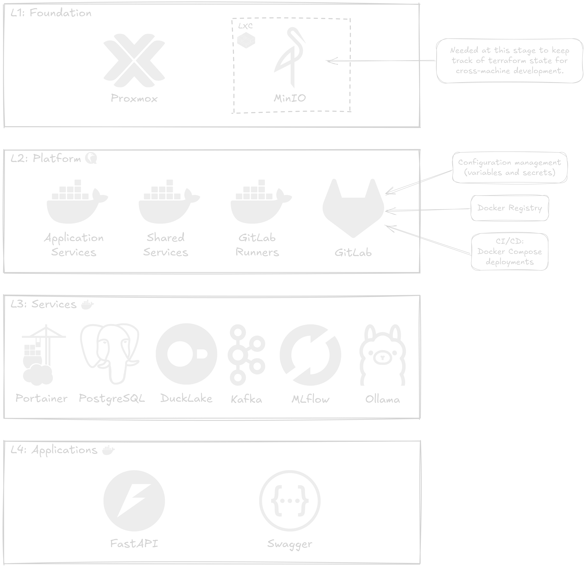

## Summary

In this video, we'll learn how to design a modern data stack, built for home labs, freelancing data experts, or general on-premise needs.

<div style="position: relative; padding-bottom: 56.25%; height: 0; overflow: hidden; max-width: 100%;">
	<iframe
		src="https://www.youtube.com/embed/hN3yNT_TP5E"
		frameborder="0"
		allow="accelerometer; autoplay; clipboard-write; encrypted-media; gyroscope; picture-in-picture; web-share"
		referrerpolicy="strict-origin-when-cross-origin"
		allowfullscreen
		style="position: absolute; top: 0; left: 0; width: 100%; height: 100%;">
	></iframe>
</div>

## Architecture Overview

We split our infrastructure 4 layers due to the following reasons:

1. Layer 1 provides a foundation based on Proxmox and a single LXC running MinIO (or any other S3 object store). We add nothing more to this layer, because we will rely on S3 to track the Terraform state in layer 2, so that we can update or add to our VMs or CTs from any location with access to Proxmox.
2. Layer 2 provides a platform for all the services that we want to run, provisioning three Docker VMs for different needs, and a VM with GitLab, which we will use mostly for configuration management (variables and secrets), as a Docker registry to track custom images we might need to build, and for CI/CD to automate docker compose stack deployment.
3. Layer 3 is concerned with core or shared services, like PostgreSQL or MLflow, which we deploy to the corresponding Docker instance.
4. Layer 4 is concerned with application services, like REST APIs or documentation, which we deploy to the corresponding Docker instance.

Here is a diagram for the described 4-layer architecture, with the core services we aim to deploy:



Each layer from L1 to L4 will live in the `datalab` repo under the `infra/` directory, each on its own subfolder:

- `foundation/`
- `platform/`
- `services/`
- `applications/`

We'll have a mirror of the `datalab` repo on GitLab, exclusively meant for deploying into production—and it conveniently works as a backup as well. The deployment workflow is run whenever a change in `docker-compose.yml` files are detected in the `main` branch, particularly under the `services/` and `applications/` directories.

```bash
cd datalab/infra/
git switch -c dev

# Do work
git add <work>
git commit -m "work"
git push

# Once ready for production...
git switch main
git merge --no-ff dev
git push

# And then deploy your infra.
git remote add prod git@gitlab.lan:DataLabTechTV/datalab.git
git push -u prod main
```

L4, the application layer, can also be implemented under project-specific repos, when unrelated to `datalab`. If service initializations need to be run for a specific app (e.g., issue credentials, or create a database), then a GitLab job will be exposed on the `datalab` repo that will be callable from any application repo to provision the required resources without exposing any admin credentials.

### Layer 1: Foundation - Bootstrapping

- Proxmox
	- **LXC:** MinIO
		- **ID:** `101`
		- **Name:** `minio`
		- **Function:**
			- Terraform state storage
			- General-purpose object store

Setup using [bpg/proxmox](https://registry.terraform.io/providers/bpg/proxmox/latest) provider, which provides more granular configuration options than the [Telmate/proxmox](https://registry.terraform.io/providers/Telmate/proxmox/latest) provider. Access can be configured either using the root password (not recommended), an API key (limited to API based requests—won't fully cover all available features for the provider), or a private key (preferred option for more control).

### Layer 2: Platform - Core Infrastructure

- **VM:** GitLab
	- **ID:** `201`
	- **Name:** `gitlab`
	- **Function:**
		- Docker registry – custom service images, project-specific microservices, etc.
		- CI/CD – production configs as variables/secrets, deploy docker compose stacks
- **VM:** Docker
	- **ID:** `202`
	- **Name:** `docker-gitlab`
	- **Function:** GitLab runners
- **VM:** Docker
	- **ID:** `203`
	- **Name:** `docker-shared`
	- **Function:** core services (e.g., PostgreSQL)
- **VM:** Docker (project-specific services)
	- **ID:** `204`
	- **Name:** `docker-apps`
	- **Function:** project-specific services

GitLab will be installed and configured using Packer, producing a `QCOW2` image to be deployed to Proxmox, under a QEMU VM. This will include the GitLab runners configuration pointing to `docker-gitlab`.

A Portainer instance will run under `docker-shared`, letting us monitor and manage the Docker instances in the three VMs—`docker-gitlab`, `docker-shared`, and `docker-apps`. Deployments will be based on one or multiple docker compose stacks. Docker compose will be triggered via CI/CD on a push to `main`, using variables and secrets stored in GitLab, for a production deployment. For testing, during development, a `.env` and local Docker instance can be used instead. This also leaves room, when local resources are scarce, for a setup CI/CD where a push to a `dev` branch will deploy to a separate staging VM.

### Layer 3: Services - Core/Shared Services

- PostgreSQL
	- **Description:** Shared instance for the whole home lab—even beyond the data lab—also much easier to backup.
- DuckLake
	- **Description:** Data Lakehouse
	- **Dependencies:**
		- PostgreSQL (catalog)
		- MinIO (storage)
- Apache Kafka
	- **Description:** Event log
- MLflow
	- **Description:** ML model tracking and registry
- Ollama
	- **Description:** LLM server
- Open WebUI
	- **Description:** ChatGPT like UI for Ollama
	- **Dependencies:**
		- Ollama

A single PostgreSQL instance will be shared among all services. On the first deployment, a root password will be set and stored on the `datalab` GitLab repo. Application-level deployments will rely on a GitLab's CI/CD task for initializations (e.g., credentials, a database) that will be triggered from any application repo but always run on the `datalab` GitLab repo, thus keeping admin credentials isolated.

### Layer 4: Applications - Project-Specific Services

- Microservices
- REST APIs
- Documentation

Microservices usually have their own isolated storage layer, but in a lab setting, where resources are scarce, we won't fully respect this constraint. An example of application-specific containers, already in our present context, would be a classifier REST API endpoint. It is at this layer that we will do such deployments.

## Understanding Decisions

### DevOps

We considered multiple alternative tools

- Terraform vs OpenTofu
	- [OpenTofu](https://opentofu.org/)—it exists because Terraform's license went from MPL 2.0 to BSL 1.1 on August 2023; the community didn't like this restriction and OpenTofu was born.
	- [Terraform](https://developer.hashicorp.com/terraform)—the BSL license is essentially designed for non-competing; if this doesn't affect you, there's no reason not to go with Terraform.

- Docker vs Podman
	- [Podman](https://podman.io/)—looks interesting, but requires you to think about `podman machine`, or manually setup `podman.socket` to integrate with other tools, like Portainer.
	- [Docker](https://www.docker.com/)—no reason not to use Docker, but there are a few to not use Podman, so we went with good old Docker.

- Secrets Management
	- `.env`—non-committed, a `.env.example` is provided instead.
	- `direnv`—similar to `.env`, but uses a `.envrc` that is automatically loaded in the shell when you switch to a path inside the root directory.
	- [SOPS](https://github.com/getsops/sops)—started at Mozilla, it's similar to Ansible Vault, but encrypts only the values in structured formats like JSON or YAML; can be committed to a git repo and even diffed.
	- [HashiCorp Vault](https://www.hashicorp.com/en/products/vault)—beautiful web app; well-loved by the community; good integration and support all around; there is even a browser extension for it, called [VaultPass](https://chromewebstore.google.com/detail/vaultpass/kbndeonibamcpiibocdhlagccdlmefco); but using it represents using yet another service, and adding to the complexity of our infrastructure.
	- [GitLab](https://docs.gitlab.com/ci/variables/)—not exactly made for secrets management, but it does provide variables and a way to mask and hide them (secrets); as a bonus it provides CI/CD for convenient deployments; this is the overall best choice, and a general-purpose good thing to have.

- Docker Registry
	- [Docker Registry UI](https://joxit.dev/docker-registry-ui/)—lightweight UI for the [registry](https://hub.docker.com/_/registry).
	- [Harbor](https://goharbor.io/docs/2.13.0/install-config/demo-server/)—full fledged artifact registry, with policies and role-based access control; supports multiple registries and replication; overkill for our use-case; perhaps a better option when deploying to Kubernetes.
	- [GitLab](https://docs.gitlab.com/user/packages/container_registry/)—already using it for secrets management, so it's perfect as a Docker Registry as well; a no-brainer.

- Configuration Management
	- [Ansible](https://galaxy.ansible.com/ui/)—have used it before and know that works well; its approach can be overly complicated, with simple tasks requiring multiple configuration files.
	- [Packer](https://developer.hashicorp.com/packer)—prioritizes building pre-configured, ready-to-use images, with the added bonus that these can easily be deployed to a cloud platform with very little effort; great skill to have; simpler solution based on HCL, the same language used in Terraform.

### Data Stack

- [Portainer](https://docs.portainer.io/user/home)
	- To use or not to use? We wanted a minimal stack, but...
	- This is useful for quick testing or to easily monitor containers, volumes, and images.

- [PostgreSQL](https://www.postgresql.org/)
	- Great as a general-purpose relational database, and not only that.
	- Required by GitLab, although we'll probably keep the instances separate (lives in a higher level layers).
	- Can be used as a DuckLake catalog, or to support most apps.

- [DuckLake](https://ducklake.select/docs/stable/duckdb/introduction)
	- Simplest available solution.
	- Perfect for any scale.
	- Separates catalog, storage, and compute, and compute will be local for us.
	- Catalog can be setup with PostgreSQL, which we already run.
	- Storage can be setup with an S3 object store, and we've got MinIO.
	- Compute will be done on local machines, in an edge computing fashion, based on DuckDB.

- [Apache Kafka](https://kafka.apache.org/uses)
	- Why include Kafka? Why not a Redis queue or pub/sub? Or even custom gRPC microservices?
	- Having middleware for inter-process communication is always easier to handle than custom gRPC solutions.
	- But why not Redis or other lightweight solutions like ZeroMQ? Well, mostly for the learning experience, and because Kafka might be the single most useful piece of software you could use in production systems, because it can help your app scale up or down as required, and it will help you stay compliant or debug your system, since it provides replayability.
	- A base deployment just requires ~600 MB of RAM anyway.
	- We also thought about Apache Flink for stream processing from Kafka topics, but there is also [Faust](https://faust.readthedocs.io/en/latest/), a Python-native solution, which we're likely to use later instead.

- [MLflow](https://mlflow.org/classical-ml/experiment-tracking)
	- When you need open source self-hostable ML model tracking and registration, it's hard to find a better alternative.
	- Other options include Weights & Biases (not fully open source), Neptune.ai (cloud-based service), or Kubeflow (requires Kubernetes, which is overkill for our single-machine home lab).

- [Ollama](https://ollama.com/search) + [Open WebUI](https://docs.openwebui.com/)
	- Used for self-hosted LLMs.
	- With Open WebUI, we get our own local ChatGPT
	- Or we can use Ollama for LangChain or other implementations.
	- Requires GPU support, which might be hard to setup, as it needs to be configured in the Proxmox host machine, as well as the VM, and possible Docker as well.

## From On-Premise to Cloud

Let's establish a parallel between on-premise Proxmox based services and their cloud platform alternatives. This will help you understand how to transfer knowledge from working on your home lab into a cloud platform like AWS, GCP, or Azure.

### L1: Foundation

A cloud platform is essentially our foundation layer. These are a given for AWS, GCP, Azure, or any other cloud platform.

- VMs
	- [GCP Compute Engine](https://cloud.google.com/products/compute)
	- [Amazon EC2 (Elastic Compute Cloud)](https://aws.amazon.com/ec2/)
	- [Azure Virtual Machines](https://azure.microsoft.com/en-us/products/virtual-machines)

- Object Stores
	- [Google Cloud Storage](https://cloud.google.com/storage)
	- [Amazon S3 (Simple Storage Service)](https://aws.amazon.com/s3/)
	- [Azure Blob Storage](https://azure.microsoft.com/en-au/products/storage/blobs/)

### L2: Platform

In a cloud platform, L1 and L2 are essentially at the same level, at least for Docker on L2. For the Git, filling the role of our GitLab instance, it depends—if we're talking secrets management, then each cloud platform has its own dedicated product for it, but, if we're talking code tracking git workflows, then we might look at Git as a service instead.

- Docker
	- [AWS Fargate](https://aws.amazon.com/fargate/)
	- [GCP Cloud Run](https://cloud.google.com/run)
	- [Azure Container Instances](https://azure.microsoft.com/en-us/products/container-instances/)

- Git
	- [AWS CodeCommit](https://aws.amazon.com/codecommit/)
	- [GCP Cloud Source Repositories](https://cloud.google.com/source-repositories/docs) (sunset)
	- [GCP Secure Source Manager](https://cloud.google.com/secure-source-manager/docs)
	- [Azure Repos](https://azure.microsoft.com/en-us/products/devops/repos/)

### L3: Services

There are often multiple options per service, depending on your needs. For example, you might want to be able to administer a database yourself, via the command line (e.g., use `psql` to login to the Postgres root user), or you might want a single database that scales horizontally transparently. Being familiar with the product catalog and knowing how to distinguish between such services is at the root of cloud engineering. Below you'll find a few examples for our use case.

- PostgreSQL
	- [Amazon RDS](https://aws.amazon.com/rds/)
	- [Amazon Aurora](https://aws.amazon.com/rds/aurora/)
	- [GCP Cloud SQL](https://cloud.google.com/sql?hl=en)
	- [GCP AlloyDB](https://cloud.google.com/products/alloydb?hl=en)
	- [Azure Database for PostgreSQL](https://azure.microsoft.com/en-us/products/postgresql/)
	- [Cosmos DB](https://azure.microsoft.com/en-us/products/cosmos-db) (not relational, but built on top of PostgreSQL)

- DuckLake
	- Easily integrates with most of the PostgreSQL alternatives, regarding the catalog.
	- And with each of the cloud object store alternatives, regarding storage.

- Apache Kafka
	- [Amazon MSK (Managed Streaming for Apache Kafka)](https://aws.amazon.com/msk/)
	- [Confluent Cloud](https://www.confluent.io/) on [GCP](https://www.confluent.io/partner/google-cloud/), [Azure](https://www.confluent.io/partner/microsoft-azure/), or [AWS](https://www.confluent.io/partner/amazon-web-services/)

- MLflow
	- Can be deployed on a VM or as Docker a container, on either of the alternatives listed above.
	- It integrates with most of the PostgreSQL alternatives, regarding the backend store.
	- And with each of the cloud object store alternatives, regarding artifact storage.

- Ollama
	- [Titan on Amazon Bedrock](https://docs.aws.amazon.com/bedrock/latest/userguide/titan-models.html)
	- [Gemini on Google Vertex AI](https://cloud.google.com/vertex-ai/generative-ai/docs/models/gemini/2-5-pro)
	- [Phi on Azure AI Foundry](https://azure.microsoft.com/en-us/pricing/details/phi-3/)
	- [Azure OpenAI Service](https://azure.microsoft.com/en-us/pricing/details/cognitive-services/openai-service/)

### L4: Applications

Deploying a layer 4 application will depend on the requirements, but for our use cases—REST API, microservices, web apps—it could easily be done using container services, like AWS Fargate, along with storage services, like AWS S3. There's nothing specifically designed on a cloud platform for this, as the cloud platform is itself designed to support your applications.

### Final Remarks

What a cloud platform offers in simplicity, it also takes in cost. Storage is cheap, and basic services like VMs are accessible as well, but once you go deeper into specialized services, e.g., for AI or highly scalable or available databases, then the cost skyrockets. At that point, you're most likely better off just hiring someone to handle it using traditional infrastructure. Managing your cloud infrastructure cost might be the difference between staying in business or shutting down. Sometimes considering on-premise or cheaper cloud infrastructure, like basic VMs, even outside the major cloud providers, can be a cheaper and even better solution for your use case.
