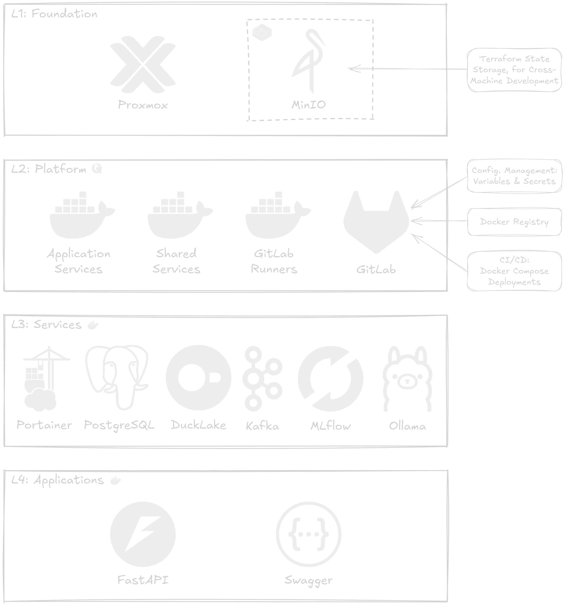

## Summary

In this video, we'll learn how to design a modern data stack, built for home labs, freelancing data experts, or general on-premise needs.

<div style="position: relative; padding-bottom: 56.25%; height: 0; overflow: hidden; max-width: 100%;">
	<iframe
		src="https://www.youtube.com/embed/TBD"
		frameborder="0"
		allow="accelerometer; autoplay; clipboard-write; encrypted-media; gyroscope; picture-in-picture; web-share"
		referrerpolicy="strict-origin-when-cross-origin"
		allowfullscreen
		style="position: absolute; top: 0; left: 0; width: 100%; height: 100%;">
	></iframe>
</div>

## 4-Layer Architecture

We split our infrastructure 4 layers due to the following reasons:

1. Layer 1 provides a foundation based on Proxmox and a single LXC running MinIO (or any other S3 object store). We add nothing more to this layer, because we will rely on S3 to track the Terraform state in layer 2, so that we can update or add to our VMs or CTs from any location with access to Proxmox.
2. Layer 2 provides a platform for all the services that we want to run, provisioning three Docker VMs for different needs, and a VM with GitLab, which we will use mostly for configuration management (variables and secrets), as a Docker registry to track custom images we might need to build, and for CI/CD to automate docker compose stack deployment.
3. Layer 3 is concerned with core or shared services, like PostgreSQL or MLflow, which we deploy to the corresponding Docker instance.
4. Layer 4 is concerned with application services, like REST APIs or documentation, which we deploy to the corresponding Docker instance.

Here is a diagram for the described 4-layer architecture, with the core services we aim to deploy:



Each layer from L1 to L4 will live in the `datalab` repo under the `infra/` directory, each on its own subfolder:

- `foundation/`
- `platform/`
- `services/`
- `applications/`

We'll have a mirror of the `datalab` repo on GitLab, exclusively meant for deploying into production—and it conveniently works as a backup as well. The deployment workflow is run whenever a change in `docker-compose.yml` files are detected in the `main` branch, particularly under the `services/` and `applications/` directories.

```bash
cd datalab/infra/
git switch -c dev

# Do work
git add <work>
git commit -m "work"
git push

# Once ready for production...
git switch main
git merge --no-ff dev
git push

# And then deploy your infra.
git remote add prod git@gitlab.lan:DataLabTechTV/datalab.git
git push -u prod main
```

L4, the application layer, can also be implemented under project-specific repos, when unrelated to `datalab`. If service initializations need to be run for a specific app (e.g., issue credentials, or create a database), then a GitLab job will be exposed on the `datalab` repo that will be callable from any application repo to provision the required resources without exposing any admin credentials.

### Layer 1: Foundation - Bootstrapping

- Proxmox
	- **LXC:** MinIO
		- **ID:** `101`
		- **Name:** `minio`
		- **Function:**
			- Terraform state storage
			- General-purpose object store

Setup using [bpg/proxmox](https://registry.terraform.io/providers/bpg/proxmox/latest) provider, which provides more granular configuration options than the [Telmate/proxmox](https://registry.terraform.io/providers/Telmate/proxmox/latest) provider. Access can be configured either using the root password (not recommended), an API key (limited to API based requests—won't fully cover all available features for the provider), or a private key (preferred option for more control).

### Layer 2: Platform - Core Infrastructure

- **VM:** GitLab
	- **ID:** `201`
	- **Name:** `gitlab`
	- **Function:**
		- Docker registry – custom service images, project-specific microservices, etc.
		- CI/CD – production configs as variables/secrets, deploy docker compose stacks
- **VM:** Docker
	- **ID:** `202`
	- **Name:** `docker-gitlab`
	- **Function:** GitLab runners
- **VM:** Docker
	- **ID:** `203`
	- **Name:** `docker-shared`
	- **Function:** core services (e.g., PostgreSQL)
- **VM:** Docker (project-specific services)
	- **ID:** `204`
	- **Name:** `docker-apps`
	- **Function:** project-specific services

GitLab will be installed and configured using Packer, producing a `QCOW2` image to be deployed to Proxmox, under a QEMU VM. This will include the GitLab runners configuration pointing to `docker-gitlab`.

A Portainer instance will run under `docker-shared`, letting us monitor and manage the Docker instances in the three VMs—`docker-gitlab`, `docker-shared`, and `docker-apps`. Deployments will be based on one or multiple docker compose stacks. Docker compose will be triggered via CI/CD on a push to `main`, using variables and secrets stored in GitLab, for a production deployment. For testing, during development, a `.env` and local Docker instance can be used instead. This also leaves room, when local resources are scarce, for a setup CI/CD where a push to a `dev` branch will deploy to a separate staging VM.

### Layer 3: Services - Core/Shared Services

- PostgreSQL
	- **Description:** Shared instance for the whole home lab—even beyond the data lab—also much easier to backup.
- DuckLake
	- **Description:** Data Lakehouse
	- **Dependencies:**
		- PostgreSQL (catalog)
		- MinIO (storage)
- Apache Kafka
	- **Description:** Event log
- MLflow
	- **Description:** ML model tracking and registry
- Ollama
	- **Description:** LLM server
- Open WebUI
	- **Description:** ChatGPT like UI for Ollama
	- **Dependencies:**
		- Ollama

A single PostgreSQL instance will be shared among all services. On the first deployment, a root password will be set and stored on the `datalab` GitLab repo. Application-level deployments will rely on a GitLab's CI/CD task for initializations (e.g., credentials, a database) that will be triggered from any application repo but always run on the `datalab` GitLab repo, thus keeping admin credentials isolated.

### Layer 4: Applications - Project-Specific Services

- Microservices
- REST APIs
- Documentation

Microservices usually have their own isolated storage layer, but in a lab setting, where resources are scarce, we won't fully respect this constraint. An example of application-specific containers, already in our present context, would be a classifier REST API endpoint. It is at this layer that we will do such deployments.
