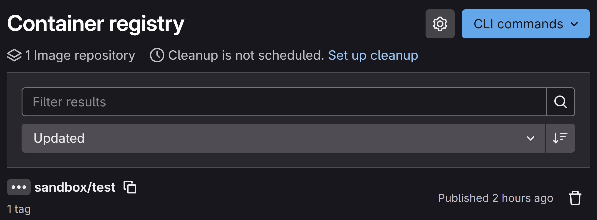
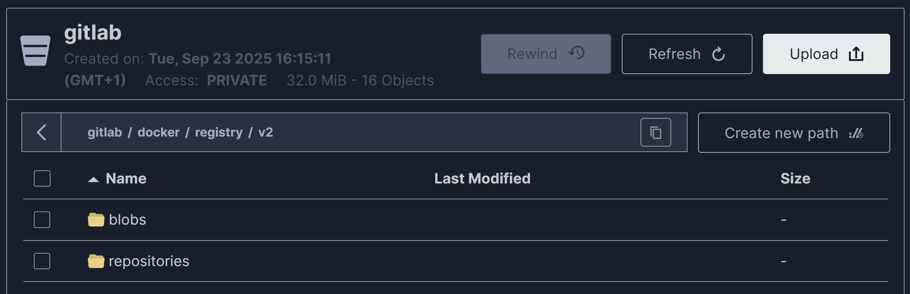
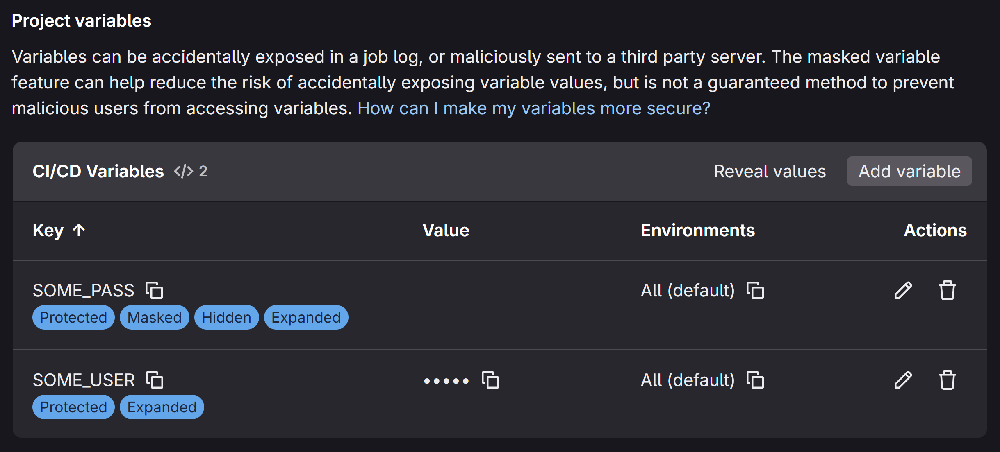
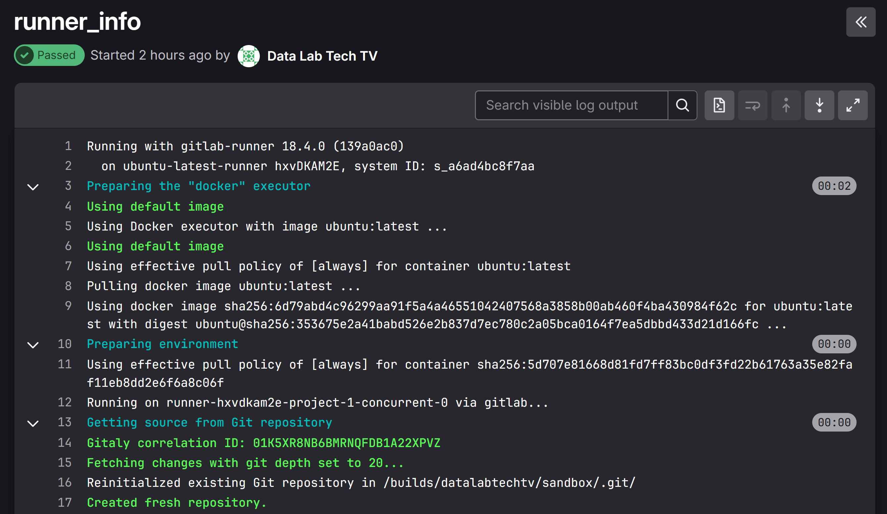
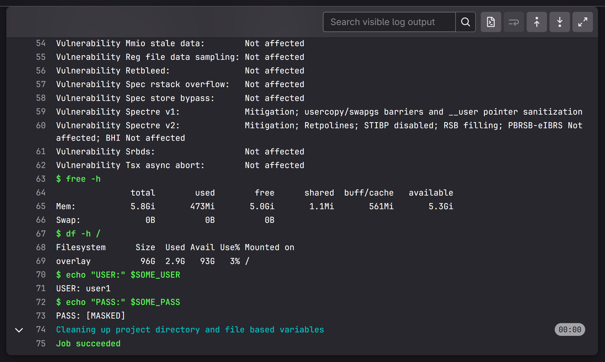

## Summary

On part 3 of this series, you'll learn how to provision Proxmox VMs with Terraform, using QEMU to build on top of the Ubuntu's official cloud image (qcow2).

We'll deploy GitLab and Docker using cloud-init, configuring GitLab as a container registry, and deploying a shared Docker runner for CI/CD, which will run on a separate VM from GitLab.

We'll also learn how to setup CI/CD variables and secrets, and how to write a simple CI/CD job, using a `.gitlab-ci.yaml` file, to print information about the runner instance, as well as a couple of variables that we set in via the web UI.

Again, keep in mind that these skills are loosely transferable to cloud platforms like AWS, GCP or Azure, with the advantage that it costs zero to setup Proxmox at home, if you've got some old hardware lying around.

<div style="position: relative; padding-bottom: 56.25%; height: 0; overflow: hidden; max-width: 100%;">
	<iframe
		src="https://www.youtube.com/embed/TBD"
		frameborder="0"
		allow="accelerometer; autoplay; clipboard-write; encrypted-media; gyroscope; picture-in-picture; web-share"
		referrerpolicy="strict-origin-when-cross-origin"
		allowfullscreen
		style="position: absolute; top: 0; left: 0; width: 100%; height: 100%;">
	></iframe>
</div>

## Resource Planning

Our Proxmox node has 16 CPU cores, 32 GiB RAM, and a 1 TiB hard drive, that we can allocate to CTs and VMs. For the foundation layer (L1), we allocated 2 CPU cores and 2048 MiB RAM to an LXC, but, for the platform layer (L2), we'll need to plan a bit better, as L2 handles the most load, particularly on the `docker-shared` VM, as it runs all core services that are accessed by the other data stack components and applications.

We also want to keep 2 CPU cores available to the Proxmox hypervisor at all times. Proxmox also requires a minimum of 1 GiB RAM to run, but our node was using 2 GiB RAM, so this is our target free RAM.

Below, we plan global memory allocation based on the maximum active memory for a single VM, while assuming other VMs remain at the minimum usage set by floating memory. Such an assumption is based on the fact that this infrastructure will be used by a single person. You should do a similar exercise for your hardware and use case, but the overall logic remains useful.

Notice that we might still observe a heavy load on `gitlab`, `docker-gitlab`, and `docker-shared`, at the same time—e.g., `gitlab` launches a `docker-gitlab` runner to update the docker compose stack on `docker-shared`. Regardless, the worst case scenario based on a single VM is still a good average to target.

Below, you find the resource allocation table for all the CTs and VMs in our Proxmox node. You'll find the ID and name for the VM or CT, along with the allocated number of CPU cores, disk space (GiB), dedicated memory (MiB), and floating memory (MiB). We also include a "Max. Mem." column with the maximum memory that the VM can consume (dedicated + floating), as well as a "Free on Max." column with the free or unallocated memory when the given VM is using "Max. Mem." This is calculated by subtracting the total floating memory (22,528 MiB) and the difference between the VM's dedicated and floating memory (e.g., 20,480 MiB and 12,288 MiB for VM 203) from the total available memory (32,768 MiB). As such, for VM 203, the free memory on maximum usage is calculated as $32768 - 22528 - (20480 - 12288) = 2048$.

| ID      | VM/CT           |  Cores |    Disk | Dedicated Mem. | Floating Mem. | Free on Max. |
| ------- | --------------- | -----: | ------: | -------------: | ------------: | -----------: |
| 101     | `minio`         |      2 |     200 |           2048 |          2048 |        10240 |
| 201     | `gitlab`        |      1 |     100 |           6144 |          2048 |         6144 |
| 202     | `docker-gitlab` |      1 |     100 |           6144 |          2048 |         6144 |
| 203     | `docker-shared` |      8 |     200 |          20480 |         12288 |         2048 |
| 204     | `docker-apps`   |      2 |     100 |          12288 |          4096 |         2048 |
| **ALL** | **TOTALS**      | **14** | **700** |      **47104** |     **22528** |   **-14336** |

As we can see, worst case scenario, assuming maximum memory usage only happens for a single VM at a time, we get 2,048 MiB RAM free at all times.

If we look at the totals, we find only 14 CPU cores were allocated, leaving 2 cores for Proxmox, as required. We can also see that, at maximum usage for all CTs and VMs, our system would require 14,336 MiB of additional RAM.

This is an estimate, but, with real-world usage statistics, we can better tune VM configurations simply by editing our Terraform variables for `cpu.cores` and `memory.*`. And, if there aren't enough resources, this is a good reason to go look for a mini PC to expand our home lab! 😉

## Backup Strategy?

During foundation layer deployment, we had setup a separate volume for `/data`. In most cloud platforms, we can easily detach a data volume while recreating the root volume, or even create snapshots for it that we can later restore. On the other hand, Proxmox only provides snapshots for the whole VM, which is not practical to manage as a backup solution. As such, we simplified our MinIO LXC to use a single root disk, and we do the same for the VMs in the platform layer.

Backups will be added later on and they will be application-specific. The overall strategy will be based on mounting an external volume from a NAS under `/backups` for each VM, and scheduling a backup process based on a systemd timer and service, which will write to that directory.

For our current use-case, backups are not particularly concerning, as we can always re-ingest our lakehouse datasets, or recreate our GitLab repos, as these will only be used for CI/CD, which obvious also require that Docker images are re-registered, and variables and secrets are re-added. While this might justify setting up a proper backup strategy, failure wouldn't be catastrophic. This is perfectly fine for a home lab setting, where we're constantly tearing down and re-deploying our infrastructure.

## GitLab VM

We'll provision a GitLab instance, which will power multiple features of our home lab, including the container registry for custom docker images—be it our own project-specific services or extended installations for core services—and also GitOps, using CI/CD to run docker compose deployment jobs, along with variables to store configurations and secrets.

### MinIO Bucket

As a requirement to setup the container registry component, we added the `gitlab` bucket to our foundation layer MinIO instance, both to the provisioning config and manually via `mc` (to avoid redeploying):

```bash
cd infra/foundation
mc alias set lab http://minio:9000 admin \
	$(terraform output -raw minio_admin_password)
mc mb lab/gitlab
```

This is used on the cloud-init config shown in the following section.

### Cloud-Init

Wait,  so did we drop Packer? Yes, we did. We ended up going with a simpler cloud-init config instead, since there really isn't much to deploy on each VM, or too much to gain from building a single image to deploy only three Docker VMs. We might still do Packer in the future, for the educational value, but, for the home lab, we want to keep it as minimalistic as possible.

Here's the cloud-init config that we used to setup our GitLab VM. This was directly extracted from our Terraform config, which is currently available at the `dev` branch of the [datalab](https://github.com/DataLabTechTV/datalab/) repo, so you'll find `${...}` blocks which represent variable or resource output replacements.

```yaml
#cloud-config
hostname: ${local.gitlab.name}
password: "${random_password.gitlab_vm.result}"
chpasswd:
  expire: false
ssh_pwauth: true
package_update: true
package_upgrade: true
packages:
  - qemu-guest-agent
  - curl
write_files:
  - path: /etc/gitlab/gitlab.rb
	owner: 'root:root'
	permissions: '0600'
	content: |
	  external_url 'http://${local.gitlab.name}'
	  gitlab_rails['initial_root_password'] = '${random_password.gitlab_root.result}'

	  gitlab_rails['registry_enabled'] = true
	  registry_external_url 'http://${local.gitlab.name}:5050'

	  registry['database'] = {
		'enabled' => true,
	  }

	  registry['storage'] = {
		's3_v2' => {
		  'regionendpoint' => '${var.s3_endpoint}',
		  'region' => '${var.s3_region}',
		  'accesskey' => '${var.s3_access_key}',
		  'secretkey' => '${var.s3_secret_key}',
		  'pathstyle' => ${var.s3_path_style},
		  'bucket' => '${var.gitlab_s3_registry_bucket}',
		}
	  }
runcmd:
  - systemctl enable --now qemu-guest-agent
  - netplan apply
  - curl "https://packages.gitlab.com/install/repositories/gitlab/gitlab-ce/script.deb.sh" | sudo bash
  - apt install -y gitlab-ce
  - gitlab-ctl reconfigure
  - |
	gitlab-rails console -e production <<EOT
	  s = ApplicationSetting.current
	  s.update!(
		signup_enabled: false,
		version_check_enabled: false,
		usage_ping_enabled: false,
		usage_ping_generation_enabled: false,
		whats_new_variant: 'disabled'
	  )
	EOT
  - curl -L https://packages.gitlab.com/install/repositories/runner/gitlab-runner/script.deb.sh | sudo bash
  - apt install -y gitlab-runner
  - |
	gitlab-runner register --non-interactive \
	  --url "http://${local.gitlab.name}/" \
	  --registration-token "$(gitlab-rails runner 'puts ApplicationSetting.current.runners_registration_token')" \
	  --executor "docker" \
	  --docker-image "ubuntu:latest" \
	  --description "ubuntu-latest-runner" \
	  --tag-list "docker,remote,ubuntu" \
	  --run-untagged="true" \
	  --docker-host "tcp://${local.docker[0].name}:2375"
  - reboot
```

Let's break it down into. We begin by setting a few basic properties for the VM, including its hostname and password (setting to not expire, thus avoiding having to change it on the first login). We also enable password authentication for SSH, so that we can login with the default `ubuntu` user.

```yaml
#cloud-config
hostname: ${local.gitlab.name}
password: "${random_password.gitlab_vm.result}"
chpasswd:
  expire: false
ssh_pwauth: true
```

Then, we update the system packages and install the guest agent to help Proxmox monitor the VM and handle memory ballooning, and we install `curl`, which will be required during GitLab installation.

```yaml
package_update: true
package_upgrade: true
packages:
  - qemu-guest-agent
  - curl
```

Next, we write the `gitlab.rb` file, which is used to configure GitLab when running `gitlab-ctl reconfigure`.

```yaml
write_files:
  - path: /etc/gitlab/gitlab.rb
	owner: 'root:root'
	permissions: '0600'
	content: |
		...
```

You'll find the `content` value below. We set the `external_url` to the host where GitLab will run, as well as the initial root account password. We then enable the container registry, setting it up to use the existing database, as well as our existing MinIO instance, with the newly created bucket, to store the image layers that will be pushed to the container. As you can see, most of these settings are directly managed via Terraform variables.

```ruby
external_url 'http://${local.gitlab.name}'
gitlab_rails['initial_root_password'] = '${random_password.gitlab_root.result}'

gitlab_rails['registry_enabled'] = true
registry_external_url 'http://${local.gitlab.name}:5050'

registry['database'] = {
	'enabled' => true,
}

registry['storage'] = {
	's3_v2' => {
		'regionendpoint' => '${var.s3_endpoint}',
		'region' => '${var.s3_region}',
		'accesskey' => '${var.s3_access_key}',
		'secretkey' => '${var.s3_secret_key}',
		'pathstyle' => ${var.s3_path_style},
		'bucket' => '${var.gitlab_s3_registry_bucket}',
	}
}
```

Finally, under the `runcmd` block, which is an array of commands, we'll essentially run the following script, which we reformat and comment:

```bash
# This enables and starts the guest agent.
systemctl enable --now qemu-guest-agent

# This ensures that the hostname is broadcast to DHCP, otherwise
# we'd need to sign in once using the IP address.
netplan apply

# Here we install GitLab, but this doesn't start it.
curl "https://packages.gitlab.com/install/repositories/gitlab/gitlab-ce/script.deb.sh" | sudo bash
apt install -y gitlab-ce

# This will configure and start GitLab using the settings from
# /etc/gitlab/gitlab.rb.
gitlab-ctl reconfigure

gitlab-rails console -e production <<EOT
  s = ApplicationSetting.current
  s.update!(
	signup_enabled: false,
	version_check_enabled: false,
	usage_ping_enabled: false,
	usage_ping_generation_enabled: false,
	whats_new_variant: 'disabled'
  )
EOT

# We also install the GitLab Runner locally.
curl -L https://packages.gitlab.com/install/repositories/runner/gitlab-runner/script.deb.sh | sudo bash
apt install -y gitlab-runner

# And we set it up as a shared runner that executes using an Ubuntu
# image on a separate Docker VM (docker-gitlab).
gitlab-runner register --non-interactive \
  --url "http://${local.gitlab.name}/" \
  --registration-token "$(gitlab-rails runner 'puts ApplicationSetting.current.runners_registration_token')" \
  --executor "docker" \
  --docker-image "ubuntu:latest" \
  --description "ubuntu-latest-runner" \
  --tag-list "docker,remote,ubuntu" \
  --run-untagged="true" \
  --docker-host "tcp://${local.docker[0].name}:2375"

# We reboot, as it's likely Ubuntu will ask you to anyway, on first
# login.
reboot
```

### Testing

#### Repository Management

In order to test a basic git repo workflow, we do the following:

1. Create a new user with the root account, e.g., `datalabtechtv`.
2. Edit the user to be able to set a default password.
3. Sign in to the new user and change your password
4. Create a `sandbox` repo.
5. Generate a `gitlab` SSH key on the client machine.
6. Add the SSH key to the new user's settings.
7. Clone the `sandbox` repo on the client machine.

#### Container Registry

For testing the container registry, on the cloned `sandbox` repo, we create the following `Dockerfile`:

```Dockerfile
FROM ubuntu:latest
CMD ["echo", "Hello GitLab Container Registry!"]
```

We can optionally commit and push it:

```bash
git add Dockerfile
git config user.name "Data Lab Tech TV"
git config user.email "mail@datalabtechtv.com"
git commit Dockerfile -m "feat: add a testing Dockerfile"
git push
```

Because we're not using SSL for our GitLab instance, we'll need to add the following config to `/etc/docker/daemon.json` on our client machine (also available via Docker Desktop, under Settings → Docker Engine):

```json
{
  "insecure-registries": ["gitlab:5050"]
}
```

We can optionally create a personal access token (PAT) with `read_registry` and `write_registry` permissions for our user account, under Settings → Access tokens to use as a password, but we can also login using our regular user and password, which is what we do. Either way, the command is the same:

```bash
docker login gitlab:5050
```

We can then build, tag, and push an image, making sure our tag includes the user account (e.g., `datalabtechtv`) and the project/repo name (e.g., `sandbox`), followed by our image name and version (e.g., `test:latest`):

```bash
docker build -t test:latest .
docker tag test:latest gitlab:5050/datalabtechtv/sandbox/test:latest
docker push gitlab:5050/datalabtechtv/sandbox/test:latest
```

Once this is done, the image should be listed on GitLab's UI under Deploy → Container registry for the `sandbox` project. I recommend that you pin Container registry, as we'll be using it often on our home lab in the future.



Also, check the `gitlab` bucket on MinIO to make sure that the image blobs are being written to the proper storage.



#### CI/CD Workflows

Again, on the `sandbox` repo, create the following `.gitlab-ci.yml` file:

```yml
runner_info:
  script:
    - lscpu
    - free -h
    - df -h /
    - echo "USER:" $SOME_USER
    - echo "PASS:" $SOME_PASS
```

Go into GitLab and, under the `sandbox` project, go to Settings → CI/CD → Variables → CI/CD Variables → Add variable, and add the `SOME_USER` and `SOME_PASS` variables—set the first one to "Visible" and the second one to "Masked and hidden".



Then you can add, commit and push:

```bash
git add .gitlab-ci.yml
git commit .gitlab-ci.yml -m "ci: basic task to test runner"
git push
```

The job will trigger immediately, and you'll be able to find its status and output under Build → Jobs for the `sandbox` project. I also recommend that you pin this menu entry. You'll notice that the value of `SOME_USER` was correctly printed, while the value of `SOME_PASS` was be printed as `[MASKED]`.





Moving forward, we'll take advantage of the CI/CD features to setup a GitOps workflow to manage the docker compose stack for our data lab. Stay tuned for part 4 of this series!

## Docker VMs

We'll provision three Docker VMs using [Terraform](https://developer.hashicorp.com/terraform), the [bpg/proxmox](https://registry.terraform.io/providers/bpg/proxmox/latest) provider, and [cloud-init](https://cloudinit.readthedocs.io/en/latest/):

- `docker-gitlab`, where our GitLab Runner will run CI/CD jobs;
- `docker-shared`, to deploy the core services for our data stack (PostgreSQL, Apache Kafka, etc.);
- `docker-apps`, where project-specific services will live.

### Cloud-Init

The cloud-init config for Docker VMs is the following:

```yaml
#cloud-config
hostname: "${local.docker[count.index].name}"
password: "${random_password.docker_vm[count.index].result}"
chpasswd:
  expire: false
ssh_pwauth: true
apt:
  sources:
	docker:
	  source: "deb [arch=amd64 signed-by=/etc/apt/trusted.gpg.d/docker.gpg] https://download.docker.com/linux/ubuntu noble stable"
	  key: |
		${indent(8, chomp(data.http.docker_gpg.response_body))}
package_update: true
package_upgrade: true
packages:
  - qemu-guest-agent
  - docker-ce
write_files:
  - path: /etc/systemd/system/docker.service.d/override.conf
	owner: 'root:root'
	permissions: '0600'
	content: |
	  [Service]
	  ExecStart=
	  ExecStart=/usr/bin/dockerd
  - path: /etc/docker/daemon.json
	owner: 'root:root'
	permissions: '0600'
	content: |
	  {
		"hosts": ["fd://", "tcp://0.0.0.0:2375"],
		"containerd": "/run/containerd/containerd.sock"
	  }
runcmd:
  - systemctl enable --now qemu-guest-agent
  - netplan apply
  - usermod -aG docker ubuntu
  - reboot
```

This is less complex than the GitLab one, so I'll just make a few notes. We essentially use the `apt` block to add the official repo for Docker, so that we can install `docker-ce` with the latest version of Docker. Then, we override the config for `docker.service`, which essentially means removing arguments from `dockerd` so that `/etc/docker/daemon.json` gets used instead. We then reproduce the original CLI config under this file and add `tcp://0.0.0.0:2375` to the listening hosts for Docker. This will let us access Docker externally, as described in the following section.

### Client Access

On your local machine, create a context for each Docker VM:

```bash
docker context create docker-gitlab --docker "host=tcp://docker-gitlab:2375"
docker context create docker-shared --docker "host=tcp://docker-shared:2375"
docker context create docker-apps --docker "host=tcp://docker-apps:2375"
```

You can then switch to any context and run Docker commands as usual:

```bash
docker context use docker-gitlab
docker ps
```

Often, custom shell prompts, like [Starship](https://starship.rs/), will display your current Docker context, when it's something other than the default ones. I definitely recommend Starship for this, as it supports any shell, including Bash, Fish, or even PowerShell, and it will display your Docker context by default.

## Final Remarks

Despite a few bumps on the road, and questioning some decisions, we got it working smoothly in the end. Always expect the unexpected, a bit of a bumpy road, when working in operations. And be ready to make changes. Prioritize the robustness of your infrastructure rather than the successful execution of your original plan!

### On Configuration Management...

To me, it remains unclear which configuration solution is preferrable, since, to be honest, I dislike them all.

Prebuilt images with Packer would have been ideal in a real-world scenario, if we wanted to eventually move out of qcow2 images on Proxmox VMs and into AMIs (Amazon Machine Images) on AWS EC2, but frankly this is overkill for a home lab.

I questioned my decision not to use Ansible, which might still be the best overall solution, but it still felt slightly overkill for this. So, I ended up going with cloud-init, as it's easily available on Proxmox, providing a few of the features that Ansible provides, but having a much simpler syntax. Although, of course, Ansible is more powerful and provides idempotency, while cloud-init is enough for most use cases, but runs only once per deployment.

### On GitLab...

After working on GitLab deployment for a while, I questioned the decision to go with GitLab and asked myself if Gitea would have been a better and more lightweight option, with it being written in Go rather than Ruby, like GitLab.

While the apt package for GitLab installs flawlessly, and all the tooling is robust, there's a lot to improve as well. For example, most configs can be done via `/etc/gitlab/gitlab.rb`, which is not the best file format for configurations. Why not `toml` or `yaml` instead? And even disregarding that, a few configurations cannot be done via `gitlab.rb`, requiring `gitlab-rails console` instead. Fortunately it can read from the standard input, but it's also extremely slow—I even thought there was some error as it was starting, because it took quite a while without producing any message whatsoever.

Regardless, I cannot complain much. Everything worked pretty much at first try, after following the documentation and asking ChatGPT a few things. Also, once deployed, performance is quite satisfactory, with GitLab being quite smooth to use.
