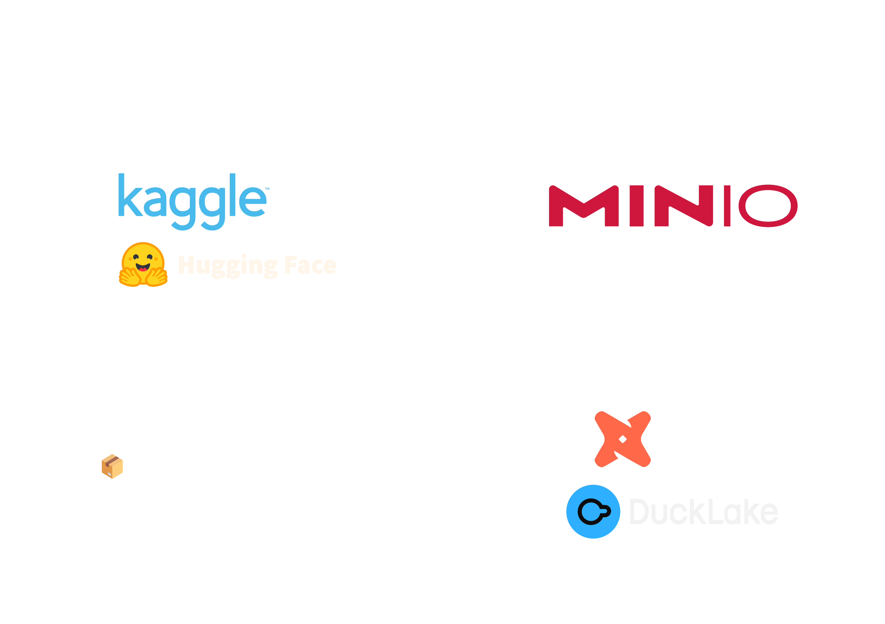

## Summary

Now that you can use [DuckDB](https://duckdb.org/) to power your data lakehouse through [DuckLake](https://ducklake.select/), you'll also save space on snapshots due to the ability to reference parts of parquet files (yes, you can keep all old versions, with little impact to storage), and you'll get improved performance for small change operations due to data inlining, which lets data be stored directly within the metadata database ([SQLite](https://www.sqlite.org/), [PostgreSQL](https://www.postgresql.org/), etc.).

With a little help from [dbt](https://docs.getdbt.com/) and an [unreleased branch](https://github.com/duckdb/dbt-duckdb/issues/564) of [dbt-duckdb](https://github.com/duckdb/dbt-duckdb) adapter, we were able to design a data lakehouse strategy, covering data ingestion, transformation, and exporting, almost exclusively based on SQL!

This project is available as open source on GitHub, at [DataLabTechTV/datalab](https://github.com/DataLabTechTV/datalab), and the `README` will cover most of the details you need to understand it and get it running. In this blog post, we cover some of the most interesting components or issues, and provide a few comments about the whole process. You can also see data lab in action, and learn more about it, by watching the video below!

<div style="position: relative; padding-bottom: 56.25%; height: 0; overflow: hidden; max-width: 100%;">
	<iframe
		src="https://www.youtube.com/embed/zn69Q7FiFfo?si=hUoNsb3bioUR20J6"
		frameborder="0"
		allow="accelerometer; autoplay; clipboard-write; encrypted-media; gyroscope; picture-in-picture; web-share"
		referrerpolicy="strict-origin-when-cross-origin"
		allowfullscreen
		style="position: absolute; top: 0; left: 0; width: 100%; height: 100%;">
	></iframe>
</div>

## Architecture

Here's an overview of a Data Lab workflow to retrieve and organize a dataset (`ingest`), transform it into structured tables tracked by DuckLake (`transform`), and export them for external use (`export`):



### Storage Layout

Let's begin with the storage layout. We use an S3 compatible object store (MinIO), but you could store your files locally as well (not supported by Data Lab, but easy to implement, as DuckLake supports it).

```
s3://lakehouse/
├── backups/
│   └── catalog/
│       ├── YYYY_MM_DD/
│       │   └── HH_mm_SS_sss/
│       │       ├── engine.duckdb
│       │       ├── stage.sqlite
│       │       └── marts/*.sqlite
│       └── manifest.json
├── raw/
│   └── <dataset-name>/
│       ├── YYYY_MM_DD/
│       │   └── HH_mm_SS_sss/
│       │       ├── *.csv
│       │       ├── *.json
│       │       └── *.parquet
│       └── manifest.json
├── stage/
│   └── ducklake-*.parquet
├── marts/
│   └── <domain>/
│           └── ducklake-*.parquet
└── exports/
    └── <domain>/
        └── <dataset-name>/
            ├── YYYY_MM_DD/
            │   └── HH_mm_SS_sss/
            │       ├── *.csv
            │       ├── *.json
            │       └── *.parquet
            └── manifest.json
```

The directory structure above contains:

- `raw/`, which is where you drop your datasets, as they come (usually uncompressed, e.g., if it's a zip file), and you can do this either manually or exclusively via the CLI.
- `stage/` is where parquet files for DuckLake are stored for intermediate transformations.
- `marts/` contains a subdirectory per data mart—I set up mine based on types of data (e.g., `graphs`) or relevant subjects I'm exploring (e.g., `economics`), but the classical setup is by company department (this shouldn't be your case, as this is not production-ready, it's a lab).
- `exports/` contains exported datasets, usually in parquet format (the only one supported by Data Lab right now), ready to be used or loaded elsewhere.
- `backups/` contains snapshots of the catalog databases, including the DuckDB engine DB and the SQLite DuckLake metadata DBs.

In some cases, you'll find a path containing a directory representing a date and a subdirectory representing a time—this is the timestamp from when the associated operation was started. We call these 'dated directories'. Each dated directory contains a `manifest.json` with the dataset name (or snapshot name, for backups), along with the S3 path with the location of the latest version of that dataset.

## Tech Stack

### MinIO

We used MinIO, but you can use any S3-compatible object storage. If you're using MinIO and are having trouble connecting, make sure that your `S3_REGION` matches the MinIO region. You might have to setup a custom region (e.g. `eu-west-1`) via the Web UI under `Configurations → Region`.

Unfortunately, that feature, along with most features for the Community Edition of MinIO, was [recently scraped](https://biggo.com/news/202505261334_MinIO_Removes_Web_UI_Features)—yes, sadly this includes users, groups, and policies as well.

We will soon research other viable S3-compatible object storage alternatives, perhaps in the neighborhood of [SeaweedFS](https://github.com/seaweedfs/seaweedfs).

### DuckDB and DuckLake

While MinIO provides storage, DuckDB provides compute (we call it the "engine"), and DuckLake provides a catalog layer to manage metadata and external tables, tracking changes and offering snapshots, schema evolution, and time travel.

### dbt

Tools like dbt (data-build-tool) appear once in a lifetime—much like DuckDB.

> ❓ Did you know that...
>
> dbt is lower case—like sushi chefs that don't like you to use a fork, the
> community also dislikes it when you wrongly spell dbt in upper case.

dbt is for SQL templating and organization (models), and data documentation and testing (schemas). It provides a few configuration files to help you link up to external data sources as well, but, overall, this is it. Beautifully simple, yet extremely useful. Truly a gem!

Since dbt provides multiple adapters, we were able to use the `dbt-duckdb` adapter and, through an unreleased branch, connect to our DuckLake catalogs via DuckDB. We then used pure DuckDB SQL queries to extract our data from the S3 ingestion bucket (`raw/`) and transform it into usable structured tables (`stage/` and `marts/`).

## Operations

Below is an overview of the main lakehouse-related operations that Data Lab supports.

When required, the `dlctl` CLI tool will read the manifests and export environment variables pointing to the S3 path with the latest version for each dataset. For example, `RAW__DEEZER_SOCIAL_NETWORKS__HR__HR_EDGES` will point to something like `s3://lakehouse/raw/deezer_social_networks/2025_06_11/11_56_29_470/HR/hr_edges.csv`, where the key point here is the date, `2025-06-11T11:56:29.470`, which points to the most recent ingestion of this dataset.

Both ingestions (`raw/`) and exports (`exports/`) can be listed using the CLI:

```bash
dlctl ingest ls
dlctl ingest ls -a

dlctl export ls
dlctl export ls -a
```

As well as pruned (i.e., all versions except the last one are deleted, per dataset):

```bash
dlctl ingest prune

dlctl export prune
```

Other than that, catalog backups can be created:

```bash
# Create a backup and update manifest.json accordingly
dlctl backup create
```

Listed:

```bash
# List backup root directories
dlctl backup ls

# List all backed up files
dlctl backup ls -a
```

And restored:

```bash
# Restore the latest catalog snapshot into local/
dlctl backup restore

# Restore the latest catalog snapshot into /tmp/xpto
# instead of local/
dlctl backup restore --target /tmp/xpto

# Restore a specific snapshot into local/
dlctl backup restore --source 2025-06-17T16:24:31.349
```

### Ingestion

The `dlctl ingestion dataset` command supports directory structure creation for manual uploads, as well as direct retrieval from Kaggle or Hugging Face.

This will create a dated directory for dataset `snap_facebook_large` (snake case is always used):

```bash
dlctl ingest dataset --manual "SNAP Facebook Large"
```

And the following commands will ingest two datasets, from Kaggle and Hugging Face, respectively:

```bash
dlctl ingest dataset "https://www.kaggle.com/datasets/andreagarritano/deezer-social-networks"
dlctl ingest dataset "https://huggingface.co/datasets/agusbegue/spotify-artists"
```

### Transformation

The `dlctl transform`, `dlctl test`, and `dlctl docs` commands are wrappers for dbt, although parametrization is specific to `dlctl` (at least for now).

We can run a specific model (and, therefore, its SQL transformations) as follows:

```bash
dlctl transform -m stage.deezer_social_networks
dlctl transform -m stage.million_song_dataset_spotify_lastfm

dlctl transform -m marts.graphs.music_taste.nodes_genres
```

Notice that the first two runs are for schemas (and all of their tables), while the last run is for a specific table, `nodes_genres`, within the `graphs` catalog and the `music_taste` schema, which is organized under the `marts/` models.

This is the stage that produces DuckLake catalogs, storing DuckLake managed parquet files under the `stage/` and `marts/` S3 directories.

Downstream/upstream triggering is also supported, using the regular dbt syntax (`+`):

```bash
dlctl transform -m +marts.graphs.music_taste
```

Finally, you can also run all data tests as follows:

```bash
dlctl test
```

And generate and serve model documentation as follows:

```bash
dlctl docs generate
dlctl docs serve
```

### Export

In order to be able to use a dataset externally, you first need to export it, from the DuckLake-specific parquet format into a usable format, like parquet (or CSV, or JSON).

This can be done by running:

```bash
dlctl export dataset graphs music_taste
```

Where `graphs` is a data mart catalog and `music_taste` is the schema. A few specific table exports, with names matching `*nodes*` and `*edges*`, will be stored in subdirectories—`nodes/` and `edges/` in this case. A similar logic can be added to the export process in the future, for other categorizable tables. Otherwise, files will live directly in the root directory, matching the schema name (e.g., `music_taste`).

## DuckDB Highlights

Most of our SQL code was boring, standard stuff, which is not unusual, but there were also a few interesting points that we cover next.

### Handling DuckDB MinIO Secret

Secrets in DuckDB are ephemeral, and exist only for the active session. As such, we store them in a `.env` file, which we automatically load via `dlctl`. We also offer a command to create  an `init.sql` file under the `local/`  directory, directly generated from your `.env` configuration, once you set it up.

Accordingly, you can access your Data Lakehouse locally by running:

```bash
# Generate local/init.sql from your .env
dlctl tools generate-init-sql

# Connect to the data lakehouse
duckdb -init local/init.sql local/engine.duckdb
```

### Useful List Functions

Datasets frequently contain string columns with comma-separated lists of items—in our case, it was tags—so having access to list functions was extremely useful. Here's the transformation that we used:

```sql
SELECT
	list_transform(
        string_split(tags, ', '),
        tag -> list_aggregate(
            list_transform(
                string_split(tag, '_'),
                tag_word ->
                    ucase(substring(tag_word, 1, 1)) ||
                    lcase(substring(tag_word, 2))
            ),
            'string_agg',
            ' '
        )
    ) AS tags
FROM
	...
```

Let's go through it.

1. `list_transform` will apply a lambda to each tag, given by `string_split` (we split by comma and space).
2. `list_aggregate` just applies `string_agg` to concatenate all words in a tag with spaces.
3. Words are obtained from `string_split` on underscore, and `list_transform` is used to convert to title case.
4. Title case was achieved by taking the first letter of a word via `substring` and converting to `ucase` (upper case). The remaining `substring` was converted to `lcase` (lower case)—if not already.

For step 4, we could have used a Python UDF (user-defined function) which took a `str` and just returned `input.title()`, or we could have implemented it fully in Python,  taking the original comma-separated string of tags as the argument. There would have been a slight overhead, since C++ is faster than Python, but it would have been perfectly viable for such tiny data.

Setting up such a function using `dbt-duckdb` is done on top of the [plugins API](https://github.com/duckdb/dbt-duckdb?tab=readme-ov-file#writing-your-own-plugins), and would look something like this:

```python
# Module: funcs

from duckdb import DuckDBPyConnection
from dbt.adapters.duckdb.plugins import BasePlugin

# Title case conversion function
def to_title(input: str) -> str:
	return input.title()

# Data-specific tag parsing function
def parse_tags(tags: str) -> list[str]:
	return [
        t.replace("_", " ").title()
        for t in tags.split(", ")
    ]

class Plugin(BasePlugin):
    def configure_connection(self, conn: DuckDBPyConnection):
	    # Register as UDFs, with the same name, in DuckDB
        conn.create_function("to_title", to_title)
        conn.create_function("parse_tags", parse_tags)
```

A reference to this module would need to be added to the `duckdb` profile config:

```yml
transform:
  outputs:
    lakehouse:
      type: duckdb
      # ...
      plugins:
        - module: funcs
```

Either way, I would avoid using this unless strictly necessary—if a working implementation exists in pure SQL, it's usually more efficient than Python.

### Abnormally Slow JSON Parsing

One of the datasets we ingested and ran transformations for was [andreagarritano/deezer-social-networks](https://www.kaggle.com/datasets/andreagarritano/deezer-social-networks), which is found on Kaggle. It contains user data and friendship relationships for three subsets of Deezer users from Croatia (`HR`), Hungary (`HU`), and Romania (`RO`). For each country, there are two files: `*_edges.csv` and `*_genres.json`. The genres JSON looks something like this, but unformatted:

```json
{
    "13357": ["Pop"],
    "11543": ["Dance", "Pop", "Rock"],
    "11540": ["International Pop", "Jazz", "Pop"],
	"11541": ["Rap/Hip Hop"],
    // ...
}
```

These files were extremely slow to parse in DuckDB. The largest genres JSON file is for Croatia, and is only 4.89 MiB. However, when we tried to load and transform this file using the following query, we got extremely high memory usage (hitting 14 GiB for DuckDB), and abnormally slow response time:

```sql
CREATE TABLE users AS
SELECT
    CAST(je.key AS INTEGER) AS user_id,
    CAST(je.value AS VARCHAR[]) AS genres
FROM
    read_json('HR/HR_genres.json') j,
    json_each(j.json) je;
```

```
Run Time (s): real 638.958 user 837.703249 sys 438.916651
```

That's nearly 14m‼️

So, we tried to turn the JSON object into JSON lines, using:

```bash
jq "to_entries[] | {key: .key, value: .value}" \
	HR/HR_genres.json >HR/HR_genres.jsonl
```

Which ran in sub-second time, as expected:

```
Executed in  481.52 millis    fish           external
   usr time  407.70 millis  596.00 micros  407.10 millis
   sys time   68.76 millis  914.00 micros   67.85 millis
```

Reading `HR/HR_genres.jsonl` inside DuckDB was then instant and completely RAM-efficient, also as expected:

```sql
CREATE TABLE users AS
SELECT
    CAST(j.key AS INTEGER) AS user_id,
    CAST(j.value AS VARCHAR[]) AS genres
FROM
    read_json('HR/HR_genres.jsonl') j;
```

```
Run Time (s): real 0.082 user 0.106543 sys 0.032145
```

At first, since so much RAM was in use, we thought the query was actually a `CROSS JOIN` that replicated the whole JSON object for each produced line in the final table, but then we noticed that this is not the case, since the docs mentioned `json_each` as being a `LATERAL JOIN` (see [here](https://duckdb.org/docs/stable/data/json/json_functions#json-table-functions)).

We also tried several other approaches, like first creating a table with the JSON object preloaded and querying over that, but this changed nothing. Besides parsing and transforming the file outside DuckDB before reading it in SQL, I don't think there was much else we could do here, which was disappointing, as this would mean we'd have to add another layer to Data Lab, between ingestion and transformation, that would also do transformation but now in Python.

I decided in favor of sticking with a pure SQL solution, so we posted a [question](https://github.com/duckdb/duckdb/discussions/17981) in the GitHub Discussion for DuckDB, describing the issue, and one of the users was kind enough to debug the problem with us.

#### First Proposed Solution

The first suggestion was to use one of the following approaches:

```sql
FROM read_json('HR/HR_genres.json', records=false)
SELECT
  unnest(json_keys(json)) AS user_id,
  unnest(list_value(unpack(columns(json.*)))) AS genres
```

```sql
UNPIVOT (FROM read_json('HR/HR_genres.json')) ON *
```

Let's quickly unpack what is going on with these two queries.

##### Query #1

Let's start with the first one. First, we call `read_json` with `records=false`. By default, `records` is set to `auto`. For `records=true`, each key will become a column with its corresponding value. For `records=false`, it will either return a `map(varchar, varchar[])` or a `struct` with each user ID identified as a field (the latter is what we want to happen here). You can read more about `records` [here](https://duckdb.org/docs/stable/data/json/format_settings.html#records-settings).

According to the [docs](https://duckdb.org/docs/stable/sql/dialect/friendly_sql#query-features), `COLUMNS` is essentially an expansion on column selection, like `j.*, col1, *`, but where we can apply filtering by, or manipulate, the column name(s):

> `COLUMNS()` expression can be used to execute the same expression on multiple columns:
>   - with regular expressions
>   - with `EXCLUDE` and `REPLACE`
>   - with lambda functions

For details on `COLUMNS()`, go [here](https://duckdb.org/docs/stable/sql/expressions/star.html#columns-expression).

Then, `UNPACK` works essentially like `*lst` would do in Python (i.e., it will expand the elements of a list into arguments for a function). In this example, the target function is `list_value`, which takes multiple arguments and returns a list with those arguments.

Finally, for completion sake, `unnest` just unwinds a list or array into rows, and `json_keys` returns the keys in a JSON object.

##### Query #2

For the second query, we're just reading the JSON object using `records=auto`, which translates into `records=true` for the small sample JSON. Then, we are applying `UNPIVOT` on all columns (the user IDs), so that each becomes a row of user ID and list of genres.

Docs about `UNPIVOT` [here](https://duckdb.org/docs/stable/sql/statements/unpivot).

Both Query #1 and Query #2 worked fine for the small example that we provided (same as above), but failed for the larger original file.

#### Second Proposed (Working) Solution

We found out that the JSON object was parsed differently from 200 user records onward, and discovered there is a default of `map_inference_threshold=200` for `read_json`. For long JSON objects like the one we have, this means that it will stop parsing object keys as structure fields from 200 keys onward, thus returning a `map(varchar, varchar[])` instead of a `struct`, making the original query fail.

Knowing this, the suggestion was to disable the threshold for map inference and run the query:

```sql
FROM read_json(
	'HR/HR_genres.json',
	records=false,
	map_inference_threshold=-1
)
SELECT
  unnest(json_keys(json)) AS user_id,
  unnest(list_value(unpack(columns(json.*)))) AS genres
```

This brough down the run time from 14m to 24s, which is a significant speedup, but still extremely slow compared to the sub-second run time we got from first parsing the JSON object via `jq` to turn it into JSON lines.

This also made it possible to run the `UNPIVOT` query, which was even faster, taking only 6s to run:

```sql
UNPIVOT (
	FROM read_json(
		'HR/HR_genres.json',
		records=true,
		map_inference_threshold=-1
	)
) ON *;
```

#### Third Proposed (Creative) Solution

Finally, a third solution based on a variable to store the JSON object keys was also proposed:

```sql
SET variable user_ids = (
	FROM read_json_objects('HR/HR_genres.json')
	SELECT json_keys(json)
);

FROM read_json_objects('HR/HR_genres.json')
SELECT
	unnest(
        getvariable('user_ids')
    )::INTEGER AS user_id,
	unnest(
		json_extract(
            json,
            getvariable('user_ids')
	    )::VARCHAR[]
    ) AS genres
```

We find it interesting that such a solution design is possible in DuckDB. Regardless, this version was less efficient than the `UNPIVOT` query on the second solution, so we went with that.

The question remains. If the best solution takes 6s to run for a 5 MiB file, is this something that we might need to address in DuckDB, specially when the same process can run in milliseconds with a little command line magic?

### DuckDB and DuckLake Wishlist

While we were working with DuckDB and DuckLake, we created a bit of a wishlist, which we share with you below.

#### 1. Externally Loadable Parquet Files

Currently, using data from DuckLake tables externally requires exporting (e.g., to parquet). Maybe there isn't a better solution, but it also defies the purpose of a data lakehouse, as data won't be ready to use without a DuckLake adapter on target tools, which doesn't seem reasonable to expect any time soon.

It's not clear whether an DuckLake parquet file can be directly read by external processes, but it seems unlikely to be the case. Whether this is desirable, or a solid design choice, it is surely up for discussion, but, if we're building on top of external storage, shouldn't the stored files be ready to use directly?

If we follow that direction, then there is no clear way to match external files to the tables in DuckLake, as the current naming schema is not designed for identifying which parquet files are which.

#### 2. Hierarchical Schemas

Hierarchical schemas would be useful (e.g., `marts.graphs.music.nodes`), as this comes up a lot.

It is how dbt sets up its model logic—they use an `_`  for different levels—and it is also the way disk storage works (i.e., directories are hierarchical), and the natural way to organize data.

Some teams are even looking into graph-based structures for data cataloging (e.g., [Netflix](https://netflixtechblog.com/uda-unified-data-architecture-6a6aee261d8d)). Maybe that could be an interesting as a feature for DuckDB and DuckLake, not to mention an additional distinguishing factor.

#### 3. Sequences in DuckLake

It would be nice to have access to sequences in DuckLake, if that makes sense technically as well. For example, while preparing nodes, generating node IDs could be done using sequences a opposed to something like:

```sql
WITH other_nodes AS (
	SELECT max(node_id) AS last_node_id
	FROM ...
)
SELECT o.last_node_id + row_number() OVER () AS node_id
FROM ..., other_nodes o
```
