## Summary

In this video, we reproduce the approach that predicts Survivor winners and apply it to Economic Competition Networks to better understand world trade and economical leaders. We build a country to country competition network based on the Export Similarity Index (ESI), and we use several techniques from network science, like PageRank, community detection, weak component analysis, or the recent common out-neighbor (CON) score, to better understand how countries compete with each other within the world economy, identifying dominating or leading economies, as well as their counterpart weaker or smaller economies.

<div style="position: relative; padding-bottom: 56.25%; height: 0; overflow: hidden; max-width: 100%;">
	<iframe
		src="https://www.youtube.com/embed/pIwN7oe54i4?si=_1m5GMG8oyeS7KnQ"
		frameborder="0"
		allow="accelerometer; autoplay; clipboard-write; encrypted-media; gyroscope; picture-in-picture; web-share"
		referrerpolicy="strict-origin-when-cross-origin"
		allowfullscreen
		style="position: absolute; top: 0; left: 0; width: 100%; height: 100%;">
	></iframe>
</div>

## Dataset

We use [The Atlas of Economic Complexity](https://atlas.hks.harvard.edu/data-downloads) dataset, which is summarized in the following table. We only provide a top-level overview of the data here. For an in-depth detailed description, click the Download button in each table row of the link above—that will open a popup with detailed information on the fields for each CSV file.

|     | Title                                    | Description                                                                                                                                                                                                                                                                                                                                                                                                                                                                                                                                                                                                                                                                                                                                                                                                                                                                        |
| --- | ---------------------------------------- | ---------------------------------------------------------------------------------------------------------------------------------------------------------------------------------------------------------------------------------------------------------------------------------------------------------------------------------------------------------------------------------------------------------------------------------------------------------------------------------------------------------------------------------------------------------------------------------------------------------------------------------------------------------------------------------------------------------------------------------------------------------------------------------------------------------------------------------------------------------------------------------- |
|     | Complexity Rankings & Growth Projections | Economic Complexity Index (ECI) and partial growth projections for world economies from 1995 to 2023.                                                                                                                                                                                                                                                                                                                                                                                                                                                                                                                                                                                                                                                                                                                                                                              |
|     | Country Trade by Product                 | Exports and imports, per country and product, over the years. Different files provide a different product category granularity based on the number of HS92, HS12 or SITC digits. Different files are also provided for services, using a non-standard classification internal to Growth Labs that also provides different digit-based granularities.                                                                                                                                                                                                                                                                                                                                                                                                                                                                                                                               |
|     | Total Trade by Country                   | Total exports and imports, per country, over the years. Different files provide data about products and services.<br><br>How big is the economy for a country?<br>How did it progress over the last 28 years?                                                                                                                                                                                                                                                                                                                                                                                                                                                                                                                                                                                                                                                                      |
|     | Total Trade by Product                   | Total exports and imports, per product, over the years. Again, this is provided at different product granularities based on HS92, HS12 or SITC digits. Different files are also provided for services, using a non-standard classification internal to Growth Labs that also provides different digit-based granularities.<br><br>How big is the market for a product?<br>How did it progress over the last 28 years?                                                                                                                                                                                                                                                                                                                                                                                                                                                              |
|     | Country Trade by Partner                 | Bilateral exports and imports between pairs of countries, over the years.                                                                                                                                                                                                                                                                                                                                                                                                                                                                                                                                                                                                                                                                                                                                                                                                          |
| ✅   | Country Trade by Partner and Product     | Bilateral exports and imports between pairs of countries, for a given product, over the years. This is provided at 6-digit granularity based on HS92, HS12 or SITC digits. This is partitioned into multiple files in blocks of 10 years (or 5 years only for 1995-1999).<br><br>A granularity of 4 digits would be enough to distinguish between main product types (e.g., beef vs pork vs poultry, fresh vs frozen; gasoline engines vs diesel engines). With 6 digits we get a lot more detail (e.g., carcasses and half-carcasses of bovine animals, fresh or chilled; engines for aircraft). We use the HS92 data with 6 digits—the only one available, but also ideal to capture trade competition between countries, as true competition is only uncovered at a smaller scale. We only look at the 2020-2023 period, for recency, aggregating totals for those three years. |
| ✅   | Country Classification                   | Country metadata.                                                                                                                                                                                                                                                                                                                                                                                                                                                                                                                                                                                                                                                                                                                                                                                                                                                                  |
|     | Regional Classification                  | Regional classification for countries—continent it belongs to, political region (e.g., European Union), subregion (e.g., Central America, Western Africa), trade regions (e.g., NAFTA, OPEC), etc.                                                                                                                                                                                                                                                                                                                                                                                                                                                                                                                                                                                                                                                                                 |
|     | HS12 Product Classification              | Product metadata according to HS12 codes.                                                                                                                                                                                                                                                                                                                                                                                                                                                                                                                                                                                                                                                                                                                                                                                                                                          |
| ✅   | HS92 Product Classification              | Product metadata according to HS92 codes.<br><br>We use this to inspect products traded by salient countries during the analysis.                                                                                                                                                                                                                                                                                                                                                                                                                                                                                                                                                                                                                                                                                                                                                  |
|     | Services Product Classification          | Services metadata according to a non-standard classification internal to Growth Labs.<br><br>We use this to inspect services traded by salient countries during the analysis.                                                                                                                                                                                                                                                                                                                                                                                                                                                                                                                                                                                                                                                                                                      |
|     | SITC Product Classification              | Product metadata according to SITC codes.                                                                                                                                                                                                                                                                                                                                                                                                                                                                                                                                                                                                                                                                                                                                                                                                                                          |
|     | Product Space Related Edges              | HS92 4-digit codes for source and target products in the same space (e.g., women's coats ⇄ sweaters).                                                                                                                                                                                                                                                                                                                                                                                                                                                                                                                                                                                                                                                                                                                                                                              |
|     | Product Space Layout                     | HS92 4-digit codes for products along with their 2D embedding, where close products are co-exported by countries.                                                                                                                                                                                                                                                                                                                                                                                                                                                                                                                                                                                                                                                                                                                                                                  |

Here are the citations for the datasets that we use:

Country Trade by Partner and Product:

> The Growth Lab at Harvard University, 2025, "International Trade Data (HS92)", https://doi.org/10.7910/DVN/T4CHWJ, Harvard Dataverse

Country Classification & HS92 Product Classification:

> The Growth Lab at Harvard University, 2025, "Classifications Data", https://doi.org/10.7910/DVN/3BAL1O, Harvard Dataverse

## Graph Schema

Out of the three CSV files that we identified above as being used, we produce the following nodes and relationship labels:

- Nodes
	- `Country`
		- `node_id` – globally unique node identifier – `INT64`
		- Properties from all Country Classification columns
	- `Product`
		- `node_id` – globally unique node identifier – `INT64`
		- Properties from all HS92 Product Classification columns
- Relationships
	- `(:Country)-[:CompetesWith]->(:Country)`
		- `ESI` – Export Similarity Index – `DOUBLE`
	- `(:Country)-[:Exports]->(:Product)`
		- `amount_usd` – exports dollar amount (2020-2023) – `INT128`
	- `(:Country)<-[:Imports]->(:Product)`
		- `amount_usd` – imports dollar amount (2020-2023) – `INT128`

Take a look at the following diagram, where rectangles represent the raw CSV files, with dashed arrows illustrating the data source, and circles represent nodes, with solid arrows representing relationships.

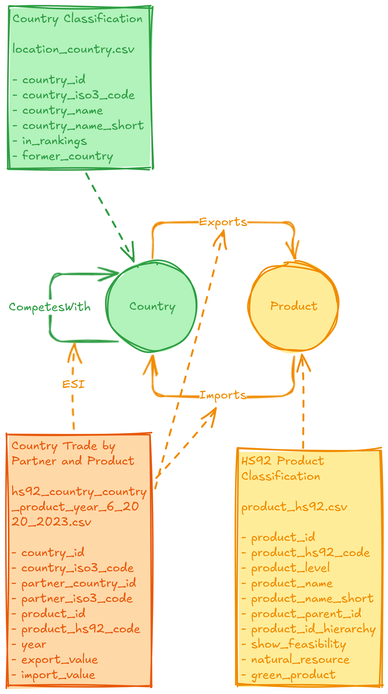

---

## Jupyter Notebook

The following sections are an adaptation of the Jupyter Notebook that we created to analyze the Economic Competition Network.

---

## Setup

### ETL

For ETL, we directly call the appropriate `dlctl` commands for:

1. Ingesting the dataset
2. Transforming using SQL on top of DuckLake
3. Exporting from the data lakehouse into Parquet
4. Loading the graph into Kuzu
5. Computing general analytics scores

Be sure to uncomment the cell below and run it once.


```python
!dlctl ingest dataset -t atlas \
    "The Atlas of Economic Complexity"
!dlctl transform -m +marts.graphs.econ_comp
!dlctl export dataset graphs econ_comp
!dlctl graph load econ_comp
!dlctl graph compute con-score econ_comp Country CompetesWith
```

### Imports


```python
from pathlib import Path
from string import Template
from textwrap import dedent
from typing import Any, Literal, Optional

import kuzu
import matplotlib.pyplot as plt
import networkx as nx
import numpy as np
import pandas as pd
from scipy.special import expit

import graph.visualization as vis
from shared.settings import LOCAL_DIR, env
```

### Globals

We setup access to the appropriate Kuzu path, based on the shared `.env` configuration, ensuring the graph exists before running the notebook. Once setup, `conn` will be used to query the graph directly throughout this notebook.


```python
db_path = Path(LOCAL_DIR) / env.str("ECON_COMP_GRAPH_DB")
assert db_path.exists(), \
    "You need to create the graph DB using dlctl first"
```


```python
db = kuzu.Database(db_path)
conn = kuzu.Connection(db)
```

### Constants

In order to ensure color consistency for our plots, we extract the color palette from `matplotlib` into `MPL_PALETTE`.


```python
MPL_PALETTE = (
    plt.rcParams["axes.prop_cycle"]
    .by_key()["color"]
)
```

We also map a display attribute for each of our note labels, `Country` and `Product`. We'll use the short names for both when plotting graph visualizations or related charts.


```python
LABEL_PROPS = {
    "Country": "country_name_short",
    "Product": "product_name_short",
}
```

### Functions

We create a few reusable functions, where we run Kuzu queries. In a few cases, it was helpful to debug the query with parameters (e.g., using Kuzu Explorer), so we created a helper function for this (note that this doesn't support string parameters, as we didn't ned them).


```python
def print_query(query: str, params: dict[str, Any]):
    dbg_query = dedent(query).strip()
    dbg_query = Template(dbg_query)
    dbg_query = dbg_query.substitute(params)
    print(dbg_query)
```

We'll also cluster nodes using different strategies and compare groups, so we implement a basic Jaccard similarity function.


```python
def jaccard_sim(a: pd.Series, b: pd.Series) -> float:
    a = set(a)
    b = set(b)
    return len(a & b) / len(a | b)
```

We might want to look at the top x% of traded products, based ona USD. The following function will help filter this.


```python
def top_frac(df: pd.DataFrame, col: str, frac: float = 0.25):
    mask = (df[col] / df[col].sum()).cumsum() <= frac
    return df[mask]
```

## Analysis

 We focus on the `CompetesWith` projection, a relationship given by the [Export Similarity Index (ESI)](https://www.federalreserve.gov/econres/notes/feds-notes/the-sectoral-evolution-of-chinas-trade-20250228.html). Our graph analysis includes:

1. Dynamic competition analysis.
   1. Dominating and weaker economy identification, based on the [CON score](https://arxiv.org/pdf/1909.06810) for each country.
   2. Trade basket overlap analysis for top and bottom economies.
2. Competition network analysis.
   1. Community analysis, including community mapping, top traded product identification, and trade alignment study (self-sufficiency, external competitiveness).
   2. Weak component analysis, following a similar approach to the community analysis—weak components widen community reach.
   3. Community and weak component comparison.
   4. Economical pressure analysis.

### Dynamic Competition Analysis

#### Top 10 Dominating Economies

These are highly spread economies, able to compete with several other countries, i.e., with a high number of common out-neighbors (CON).


```python
dom_econ_df = conn.execute(
    """
    MATCH (c:Country)
    RETURN
        c,
        c.node_id AS node_id,
        c.country_name_short AS country
    ORDER BY c.con_score DESC
    LIMIT 10
    """
).get_as_df()[["node_id", "country"]]

dom_econ_df.index = pd.RangeIndex(
    start=1,
    stop=len(dom_econ_df) + 1,
    name="rank"
)

dom_econ_df
```


<div>
<style scoped>
    .dataframe tbody tr th:only-of-type {
        vertical-align: middle;
    }

    .dataframe tbody tr th {
        vertical-align: top;
    }

    .dataframe thead th {
        text-align: right;
    }
</style>
<table border="1" class="dataframe">
  <thead>
    <tr style="text-align: right;">
      <th></th>
      <th>node_id</th>
      <th>country</th>
    </tr>
    <tr>
      <th>rank</th>
      <th></th>
      <th></th>
    </tr>
  </thead>
  <tbody>
    <tr>
      <th>1</th>
      <td>206</td>
      <td>United States of America</td>
    </tr>
    <tr>
      <th>2</th>
      <td>55</td>
      <td>Canada</td>
    </tr>
    <tr>
      <th>3</th>
      <td>34</td>
      <td>United Arab Emirates</td>
    </tr>
    <tr>
      <th>4</th>
      <td>107</td>
      <td>Netherlands</td>
    </tr>
    <tr>
      <th>5</th>
      <td>132</td>
      <td>United Kingdom</td>
    </tr>
    <tr>
      <th>6</th>
      <td>175</td>
      <td>Belgium</td>
    </tr>
    <tr>
      <th>7</th>
      <td>134</td>
      <td>Italy</td>
    </tr>
    <tr>
      <th>8</th>
      <td>223</td>
      <td>Spain</td>
    </tr>
    <tr>
      <th>9</th>
      <td>131</td>
      <td>France</td>
    </tr>
    <tr>
      <th>10</th>
      <td>145</td>
      <td>Thailand</td>
    </tr>
  </tbody>
</table>
</div>


##### Top 3 Exports

Looking at the top exports will help contextualize these economies. We only look at the top 3 products, to keep the visualization clean and readable.


```python
dom_econ_g = conn.execute(
    """
    MATCH (c:Country)
    WITH c
    ORDER BY c.con_score DESC
    LIMIT 10

    MATCH (c)-[e:Exports]->(p:Product)
    MATCH (c2:Country)-[:Exports]->(p)

    WITH c, e, p, count(DISTINCT c2) AS exporters
    WHERE exporters > 1
    WITH c, e, p
    ORDER BY c.node_id, e.amount_usd DESC
    SKIP 0

    WITH c, collect({p: p, e: e}) AS export_list

    UNWIND list_slice(export_list, 0, 3) AS r
    RETURN c, r.e, r.p
    ORDER BY c.node_id, r.p.node_id
    """
).get_as_networkx()

vis.set_labels(dom_econ_g, LABEL_PROPS)
vis.plot(dom_econ_g, scale=1.25, seed=3)
```


#### Bottom 10 Weaker Economies

These are smaller or weaker economies, in the sense that they have a lower competition power. We also find the `Undeclared` special country node at rank 1, showing that only a small number of products are undeclared worldwide.


```python
weak_econ_df = conn.execute(
    """
    MATCH (c:Country)
    RETURN
        c,
        c.node_id AS node_id,
        c.country_name_short AS country
    ORDER BY c.con_score ASC
    LIMIT 10
    """
).get_as_df()[["node_id", "country"]]

weak_econ_df.index = pd.RangeIndex(
    start=1,
    stop=len(weak_econ_df) + 1,
    name="rank"
)

weak_econ_df
```


<div>
<style scoped>
    .dataframe tbody tr th:only-of-type {
        vertical-align: middle;
    }

    .dataframe tbody tr th {
        vertical-align: top;
    }

    .dataframe thead th {
        text-align: right;
    }
</style>
<table border="1" class="dataframe">
  <thead>
    <tr style="text-align: right;">
      <th></th>
      <th>node_id</th>
      <th>country</th>
    </tr>
    <tr>
      <th>rank</th>
      <th></th>
      <th></th>
    </tr>
  </thead>
  <tbody>
    <tr>
      <th>1</th>
      <td>193</td>
      <td>Undeclared</td>
    </tr>
    <tr>
      <th>2</th>
      <td>72</td>
      <td>Bouvet Island</td>
    </tr>
    <tr>
      <th>3</th>
      <td>170</td>
      <td>Wallis and Futuna</td>
    </tr>
    <tr>
      <th>4</th>
      <td>106</td>
      <td>Norfolk Island</td>
    </tr>
    <tr>
      <th>5</th>
      <td>167</td>
      <td>Saint Pierre and Miquelon</td>
    </tr>
    <tr>
      <th>6</th>
      <td>216</td>
      <td>Niue</td>
    </tr>
    <tr>
      <th>7</th>
      <td>66</td>
      <td>South Georgia and South Sandwich Islds.</td>
    </tr>
    <tr>
      <th>8</th>
      <td>121</td>
      <td>Northern Mariana Islands</td>
    </tr>
    <tr>
      <th>9</th>
      <td>161</td>
      <td>Heard and McDonald Islands</td>
    </tr>
    <tr>
      <th>10</th>
      <td>100</td>
      <td>Western Sahara</td>
    </tr>
  </tbody>
</table>
</div>


##### Top 3 Exports

If we look at the top 3 exports for each competing country in the bottom of the ranking according CON scores, as expected we find that these are more disconnected economies, mostly focusing on raw materials, or components and machinery.


```python
weak_econ_g = conn.execute(
    """
    MATCH (c:Country)
    WITH c
    ORDER BY c.con_score ASC
    LIMIT 10

    MATCH (c)-[e:Exports]->(p:Product)
    MATCH (c2:Country)-[:Exports]->(p)

    WITH c, e, p, count(DISTINCT c2) AS exporters
    WHERE exporters > 1
    WITH c, e, p
    ORDER BY c.node_id, e.amount_usd DESC
    SKIP 0

    WITH c, collect({p: p, e: e}) AS export_list

    UNWIND list_slice(export_list, 0, 3) AS r
    RETURN c, r.e, r.p
    ORDER BY c.node_id, r.p.node_id
    """
).get_as_networkx()

vis.set_labels(weak_econ_g, LABEL_PROPS)
vis.plot(weak_econ_g, scale=1.25, seed=3)
```


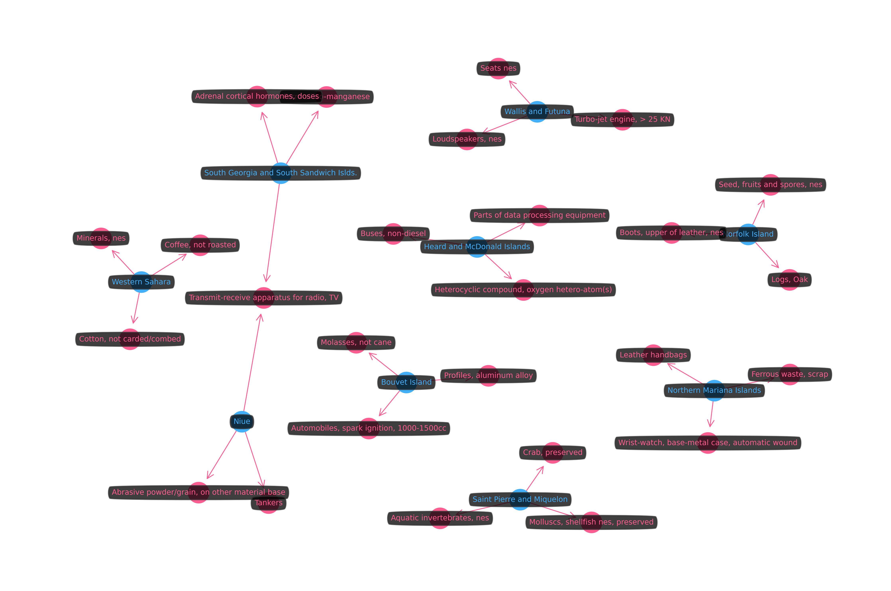


#### Dominating vs Weaker Economies

- Do dominating economies compete in the same markets as weaker economies?
  - If so, maybe that's why those weaker economies are being pushed to the bottom. ☑️
  - If not, maybe the products exported by those weaker economies are not the most competitive.

Here, we find that, due to the small export diversity, weaker economies are being crushed by dominating economies. Their position of vulnerability comes mostly from geographical isolation and limited area, leading to a lower amount of competition opportunities, where any competitor becomes a risk to the economy.

Below, country node classes are visually translated to a colored node border and label text. We assign two classes, for the top and bottom 10 economies, with top economies in the center, and the products and bottom economies in the surrounding area. This forms a star layout, where each arm is a weaker economy or a small cluster of weaker economies.

We look at the top 3 most exported products in weaker economies, but relaxing the filter on number of exported products for the weaker economies and looking at more than 3 exported products will reproduce the displayed behavior, with dominating economies still competing for the same products. This doesn't necessarily mean that both dominating and weaker economies produce the same products, as some of them can simply be re-exported.


```python
dom_vs_weak_econ_g = conn.execute(
    """
    MATCH (wea)-[we:Exports]->(p:Product)
    MATCH (dom)-[de:Exports]->(p)
    WHERE dom.node_id IN $dominating_node_ids
        AND wea.node_id IN $weaker_node_ids

    WITH wea, we, p, count(DISTINCT dom) AS dom_competitors
    WHERE dom_competitors > 0

    WITH wea, we, p
    ORDER BY wea.node_id, we.amount_usd DESC
    SKIP 0

    WITH wea, collect({p: p, e: we}) AS export_list
    UNWIND list_slice(export_list, 0, 3) AS r

    WITH wea, r.p.node_id AS prod_node_id
    MATCH (wea)-[we:Exports]
        ->(prod:Product { node_id: prod_node_id })
    MATCH (dom:Country)-[de:Exports]->(prod)
    WHERE dom.node_id IN $dominating_node_ids
    RETURN wea, we, prod, de, dom
    ORDER BY wea.node_id, prod.node_id, dom.node_id
    """,
    dict(
        dominating_node_ids=dom_econ_df.node_id.to_list(),
        weaker_node_ids=weak_econ_df.node_id.to_list(),
    ),
).get_as_networkx()

node_classes = dict(
    dominating=dom_econ_df.node_id.to_list(),
    weaker=weak_econ_df.node_id.to_list(),
)

# This adjusts the visualization edge weights
# to improve readability
for u, v, data in dom_vs_weak_econ_g.edges(data=True):
    if (
        dom_vs_weak_econ_g.nodes[u]["node_id"]
          in node_classes["dominating"]
        and dom_vs_weak_econ_g.nodes[v]["_label"]
          == "Product"
    ):
        data["vis_weight"] = 1e-5

    if (
        dom_vs_weak_econ_g.nodes[u]["node_id"]
          in node_classes["weaker"]
        and dom_vs_weak_econ_g.nodes[v]["_label"]
          == "Product"
    ):
        data["vis_weight"] = 1e-3

vis.set_labels(dom_vs_weak_econ_g, LABEL_PROPS)

vis.plot(
    dom_vs_weak_econ_g,
    node_classes=node_classes,
    scale=1.25,
    seed=5,
)
```


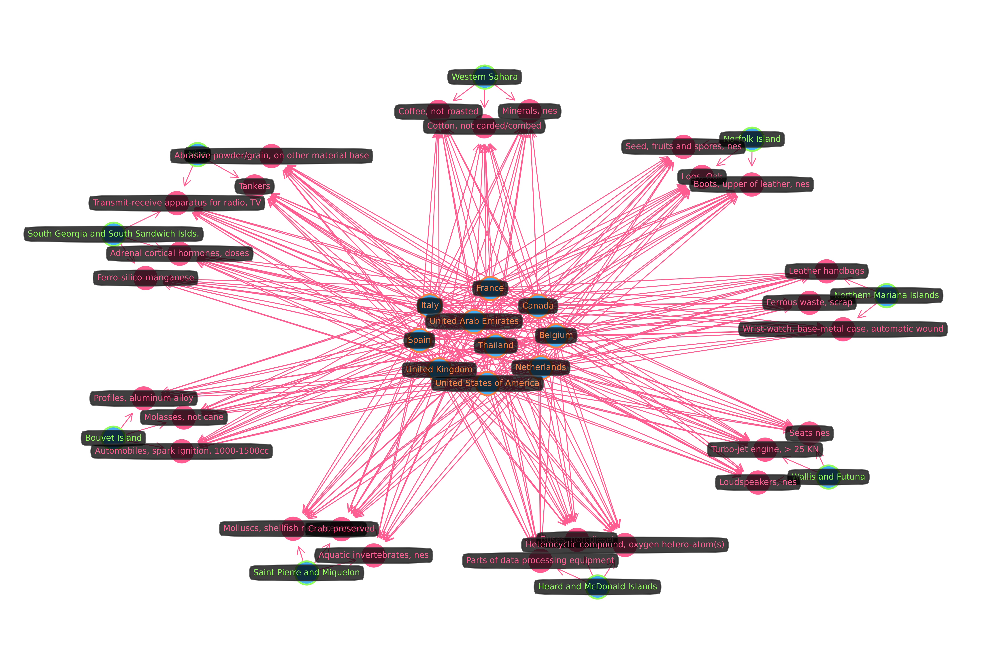


### Competition Network

Let's look at the competition network projection for `Country` nodes and `CompetesWith` edges. We first install the `algo` extension for Kuzu and create the `compnet` projection and NetworkX graph for it.


```python
try:
    conn.execute(
        """
        INSTALL algo;
        LOAD algo;
        """
    )
except Exception as e:
    print(e)
```

```python
try:
    conn.execute(
        """
        CALL drop_projected_graph("compnet")
        """
    )
except Exception as e:
    print(e)

conn.execute(
    """
    CALL project_graph(
        "compnet",
        {"Country": "n.country_name_short <> 'Undeclared'"},
        {"CompetesWith": "true"}
    )
    """
)
```

```python
compnet_g = conn.execute(
    """
    MATCH (a:Country)-[cw:CompetesWith]->(b:Country)
    WHERE a.country_name_short <> "Undeclared"
        AND b.country_name_short <> "Undeclared"
    RETURN a, cw, b
    """,
).get_as_networkx()
```

#### Inspection Functions

The following functions will be useful to plot the cluster and analyze the top exports for a specific cluster ID property:


```python
def plot_cluster(
    prop_name: str,
    prop_value: int,
    kind: Literal["graph", "map"] = "graph",
):
    match kind:
        case "graph":
            compnet_cluster_g = conn.execute(
                f"""
                MATCH (a:Country)-[cw:CompetesWith]->
                    (b:Country)
                WHERE a.country_name_short <> "Undeclared"
                    AND b.country_name_short <> "Undeclared"
                    AND a.`{prop_name}` = $prop_value
                    AND b.`{prop_name}` = $prop_value
                RETURN a, cw, b
                """,
                dict(prop_value=prop_value),
            ).get_as_networkx()

            vis.set_labels(compnet_cluster_g, LABEL_PROPS)
            vis.plot(compnet_cluster_g)

        case "map":
            compnet_cluster_df = conn.execute(
                f"""
                MATCH (c:Country)
                WHERE c.country_name_short <> "Undeclared"
                    AND c.`{prop_name}` = $prop_value
                RETURN
                    c.country_iso3_code AS iso3_code,
                    c.`{prop_name}` AS `{prop_name}`
                """,
                dict(prop_value=prop_value),
            ).get_as_df()

            vis.plot_map(
              compnet_cluster_df,
              code_col="iso3_code",
              class_col=prop_name,
            )
```


```python
def trade_per_cluster(
    prop_name: str,
    prop_value: int,
    method: Literal["imports", "exports"],
    n: Optional[int] = None,
    debug: bool = False,
) -> pd.DataFrame:
    match method:
        case "exports":
            match_stmt = """
                MATCH (c:Country)-[ie:Exports]->(p:Product)
            """
        case "imports":
            match_stmt = """
                MATCH (c:Country)<-[ie:Imports]-(p:Product)
            """

    if n is None:
        limit_stmt = ""
        limit_param = dict()
    else:
        limit_stmt = "LIMIT $n"
        limit_param = dict(n=n)

    query = f"""
        {match_stmt}
        WHERE c.country_name_short <> "Undeclared"
            AND c.`{prop_name}` = $prop_value
        RETURN
            p.product_name_short AS product,
            sum(ie.amount_usd) AS total_amount_usd
        ORDER BY total_amount_usd DESC
        {limit_stmt}
    """

    params = dict(prop_value=prop_value) | limit_param

    if debug:
        print_query(query, params)

    products_df = conn.execute(query, params).get_as_df()

    return products_df
```

Partner clusters are clusters that import what a cluster is exporting. These are likely to match all clusters due to high connectivity in the world economy, but it might not always be the case, depending on the clustering criteria.


```python
def partner_clusters(
    prop_name: str,
    prop_value: int,
    include_self: bool = True,
    debug: bool = False,
) -> list[int]:
    include_self_stmt = (
        "" if include_self
        else f"AND c2.`{prop_name}` <> $prop_value"
    )

    query = f"""
        MATCH (c:Country)-[:Exports]-(p:Product)
        MATCH (c2:Country)<-[:Imports]-(p)
        WHERE c.country_name_short <> "Undeclared"
            AND c.`{prop_name}` = $prop_value
            AND c2.`{prop_name}` IS NOT NULL
            {include_self_stmt}
        RETURN DISTINCT c2.`{prop_name}` AS cid
    """

    params = dict(prop_value=prop_value)

    if debug:
        print_query(query, params)

    result = conn.execute(query, params)
    partner_cluster_ids = sorted(
      c[0] for c in result.get_all()
    )

    return partner_cluster_ids
```

The following functions will help us compute the intra-cluster and inter-cluster trade alignments, i.e., self-sufficiency and external competitiveness, based on cluster-aggregated market share.


```python
def trade_alignment_by_cluster(
    prop_name: str,
    prop_value: int,
    method: Literal["intra", "inter"],
) -> pd.DataFrame:
    exports_df = trade_per_cluster(
        prop_name,
        prop_value,
        method="exports",
    )

    match method:
        case "intra":
            imports_df = trade_per_cluster(
                prop_name,
                prop_value,
                method="imports",
            )

        case "inter":
            imports_df = []

            for partner_cid in partner_clusters(
                prop_name,
                prop_value,
            ):
                partner_imports_df = trade_per_cluster(
                    prop_name,
                    partner_cid,
                    method="imports",
                )
                imports_df.append(partner_imports_df)

            imports_df = (
                pd.concat(imports_df)
                .groupby(["product"])
                .sum()
            )
        case _:
            raise ValueError(
              f"method not supported: {method}"
            )

    trade_df = exports_df.merge(
        imports_df,
        on="product",
        how="right" if method == "intra" else "left",
        suffixes=("_exports", "_imports"),
    ).fillna(0)

    trade_df["sdr"] = (
        trade_df.total_amount_usd_exports
        / trade_df.total_amount_usd_imports
    )

    trade_df = trade_df.sort_values("sdr", ascending=False)

    return trade_df
```

As a score for measuring either self-sufficiency or external competitiveness, we use weighted average of the Supply-Demand Ration (SDR), where weights are the total export amount (USD) for a given cluster.


```python
def global_sdr_score(
    trade_df: pd.DataFrame,
    eps=1e-9,
) -> float:
    df = trade_df[~np.isinf(trade_df.sdr)]

    df["log_sdr"] = np.log(np.clip(df.sdr, eps, None))

    weights = df.total_amount_usd_exports
    score = expit(
      (weights * df.log_sdr).sum() / weights.sum()
    )

    return score.item()
```

#### Competing Communities

- Are there any communities representing closely tied competitor clusters?
  - If so, maybe there are specific products per cluster? ☑️
  - If not, we have a global economy that is fairly homogenous and diverse.

For each property computed with the `algo` extension, we'll alter the corresponding node table, recreating the property each time.


```python
conn.execute(
    """
    ALTER TABLE Country DROP IF EXISTS louvain_id;
    ALTER TABLE Country ADD IF NOT EXISTS louvain_id INT64;

    CALL louvain("compnet")
    WITH node, louvain_id
    SET node.louvain_id = louvain_id;
    """
)
```

The Louvain method partitions the network by optimizing modularity, which essentially means it will find the best partition of communities within the graph, a community being a dense subgraph, i.e., a subgraph where connections among members are more frequent than to outside nodes.


```python
compnet_louvain_df = conn.execute(
    """
    MATCH (c:Country)
    WHERE c.country_name_short <> "Undeclared"
    RETURN
        c.node_id AS node_id,
        c.country_name_short AS label,
        c.louvain_id AS louvain_id
    """
).get_as_df()

node_classes = {
    k: g.node_id.to_list()
    for k, g in compnet_louvain_df.groupby("louvain_id")
}

vis.set_labels(compnet_g, LABEL_PROPS)

vis.plot(
    compnet_g,
    node_classes=node_classes,
    hide_edges=True,
)
```


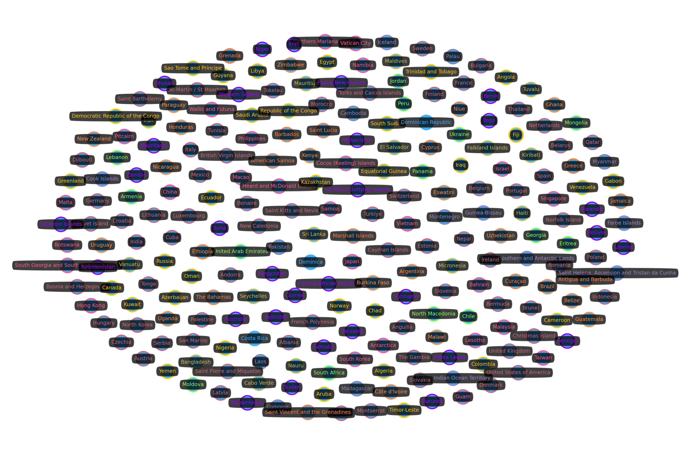


In complex networks, it is not uncommon for a huge community to emerge, along with a low number of moderately large communities, and then a lot of smaller communities. This behavior is not particularly exacerbated here, but it's still visible. Below, we inspect the community size distribution.


```python
comm_sizes_df = (
    compnet_louvain_df[["louvain_id", "node_id"]]
    .groupby("louvain_id")
    .count()
    .rename(columns=dict(node_id="num_nodes"))
)

comm_sizes_df = comm_sizes_df.reindex(
    comm_sizes_df.num_nodes.sort_values(ascending=False).index
)

comm_sizes_df
```


<div>
<style scoped>
    .dataframe tbody tr th:only-of-type {
        vertical-align: middle;
    }

    .dataframe tbody tr th {
        vertical-align: top;
    }

    .dataframe thead th {
        text-align: right;
    }
</style>
<table border="1" class="dataframe">
  <thead>
    <tr style="text-align: right;">
      <th></th>
      <th>num_nodes</th>
    </tr>
    <tr>
      <th>louvain_id</th>
      <th></th>
    </tr>
  </thead>
  <tbody>
    <tr>
      <th>5</th>
      <td>67</td>
    </tr>
    <tr>
      <th>6</th>
      <td>33</td>
    </tr>
    <tr>
      <th>4</th>
      <td>30</td>
    </tr>
    <tr>
      <th>8</th>
      <td>26</td>
    </tr>
    <tr>
      <th>7</th>
      <td>19</td>
    </tr>
    <tr>
      <th>1</th>
      <td>14</td>
    </tr>
    <tr>
      <th>2</th>
      <td>14</td>
    </tr>
    <tr>
      <th>0</th>
      <td>13</td>
    </tr>
    <tr>
      <th>3</th>
      <td>8</td>
    </tr>
    <tr>
      <th>9</th>
      <td>7</td>
    </tr>
    <tr>
      <th>10</th>
      <td>3</td>
    </tr>
  </tbody>
</table>
</div>


```python
fig, ax = plt.subplots(figsize=(18, 3))
comm_sizes_df.plot.bar(xlabel="Community ID", rot=0, ax=ax)
plt.legend(["No. Nodes"])
plt.show()
```


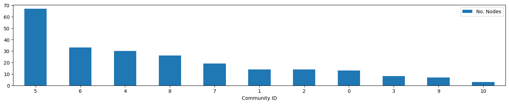


Let's also take a look at the members of each community, from largest to smallest.


```python
for louvain_id in comm_sizes_df.index:
    display(f"LOUVAIN ID: {louvain_id}")
    display(
        compnet_louvain_df[
            compnet_louvain_df.louvain_id == louvain_id
        ]
        .drop(columns="louvain_id")
        .sort_values("label")
    )
```


    'LOUVAIN ID: 5'


<div>
<style scoped>
    .dataframe tbody tr th:only-of-type {
        vertical-align: middle;
    }

    .dataframe tbody tr th {
        vertical-align: top;
    }

    .dataframe thead th {
        text-align: right;
    }
</style>
<table border="1" class="dataframe">
  <thead>
    <tr style="text-align: right;">
      <th></th>
      <th>node_id</th>
      <th>label</th>
    </tr>
  </thead>
  <tbody>
    <tr>
      <th>115</th>
      <td>116</td>
      <td>Albania</td>
    </tr>
    <tr>
      <th>205</th>
      <td>207</td>
      <td>Andorra</td>
    </tr>
    <tr>
      <th>114</th>
      <td>115</td>
      <td>Anguilla</td>
    </tr>
    <tr>
      <th>173</th>
      <td>174</td>
      <td>Austria</td>
    </tr>
    <tr>
      <th>126</th>
      <td>127</td>
      <td>Belarus</td>
    </tr>
    <tr>
      <th>...</th>
      <td>...</td>
      <td>...</td>
    </tr>
    <tr>
      <th>49</th>
      <td>50</td>
      <td>Tunisia</td>
    </tr>
    <tr>
      <th>232</th>
      <td>234</td>
      <td>Turkiye</td>
    </tr>
    <tr>
      <th>123</th>
      <td>124</td>
      <td>Turks and Caicos Islands</td>
    </tr>
    <tr>
      <th>131</th>
      <td>132</td>
      <td>United Kingdom</td>
    </tr>
    <tr>
      <th>204</th>
      <td>206</td>
      <td>United States of America</td>
    </tr>
  </tbody>
</table>
<p>67 rows × 2 columns</p>
</div>


    'LOUVAIN ID: 6'


<div>
<style scoped>
    .dataframe tbody tr th:only-of-type {
        vertical-align: middle;
    }

    .dataframe tbody tr th {
        vertical-align: top;
    }

    .dataframe thead th {
        text-align: right;
    }
</style>
<table border="1" class="dataframe">
  <thead>
    <tr style="text-align: right;">
      <th></th>
      <th>node_id</th>
      <th>label</th>
    </tr>
  </thead>
  <tbody>
    <tr>
      <th>209</th>
      <td>211</td>
      <td>Algeria</td>
    </tr>
    <tr>
      <th>171</th>
      <td>172</td>
      <td>Angola</td>
    </tr>
    <tr>
      <th>51</th>
      <td>52</td>
      <td>Aruba</td>
    </tr>
    <tr>
      <th>11</th>
      <td>12</td>
      <td>Azerbaijan</td>
    </tr>
    <tr>
      <th>177</th>
      <td>178</td>
      <td>Cameroon</td>
    </tr>
    <tr>
      <th>54</th>
      <td>55</td>
      <td>Canada</td>
    </tr>
    <tr>
      <th>154</th>
      <td>155</td>
      <td>Chad</td>
    </tr>
    <tr>
      <th>55</th>
      <td>56</td>
      <td>Colombia</td>
    </tr>
    <tr>
      <th>15</th>
      <td>16</td>
      <td>Democratic Republic of the Congo</td>
    </tr>
    <tr>
      <th>220</th>
      <td>222</td>
      <td>Ecuador</td>
    </tr>
    <tr>
      <th>57</th>
      <td>58</td>
      <td>Egypt</td>
    </tr>
    <tr>
      <th>158</th>
      <td>159</td>
      <td>Equatorial Guinea</td>
    </tr>
    <tr>
      <th>100</th>
      <td>101</td>
      <td>Fiji</td>
    </tr>
    <tr>
      <th>75</th>
      <td>76</td>
      <td>Gabon</td>
    </tr>
    <tr>
      <th>223</th>
      <td>225</td>
      <td>Greenland</td>
    </tr>
    <tr>
      <th>211</th>
      <td>213</td>
      <td>Guyana</td>
    </tr>
    <tr>
      <th>17</th>
      <td>18</td>
      <td>Iran</td>
    </tr>
    <tr>
      <th>89</th>
      <td>90</td>
      <td>Iraq</td>
    </tr>
    <tr>
      <th>184</th>
      <td>185</td>
      <td>Kazakhstan</td>
    </tr>
    <tr>
      <th>152</th>
      <td>153</td>
      <td>Kuwait</td>
    </tr>
    <tr>
      <th>135</th>
      <td>136</td>
      <td>Libya</td>
    </tr>
    <tr>
      <th>138</th>
      <td>139</td>
      <td>Nigeria</td>
    </tr>
    <tr>
      <th>139</th>
      <td>140</td>
      <td>Norway</td>
    </tr>
    <tr>
      <th>26</th>
      <td>27</td>
      <td>Oman</td>
    </tr>
    <tr>
      <th>219</th>
      <td>221</td>
      <td>Republic of the Congo</td>
    </tr>
    <tr>
      <th>63</th>
      <td>64</td>
      <td>Russia</td>
    </tr>
    <tr>
      <th>229</th>
      <td>231</td>
      <td>Sao Tome and Principe</td>
    </tr>
    <tr>
      <th>64</th>
      <td>65</td>
      <td>Saudi Arabia</td>
    </tr>
    <tr>
      <th>28</th>
      <td>29</td>
      <td>South Sudan</td>
    </tr>
    <tr>
      <th>7</th>
      <td>8</td>
      <td>Timor-Leste</td>
    </tr>
    <tr>
      <th>31</th>
      <td>32</td>
      <td>Trinidad and Tobago</td>
    </tr>
    <tr>
      <th>112</th>
      <td>113</td>
      <td>Venezuela</td>
    </tr>
    <tr>
      <th>67</th>
      <td>68</td>
      <td>Yemen</td>
    </tr>
  </tbody>
</table>
</div>


    'LOUVAIN ID: 4'


<div>
<style scoped>
    .dataframe tbody tr th:only-of-type {
        vertical-align: middle;
    }

    .dataframe tbody tr th {
        vertical-align: top;
    }

    .dataframe thead th {
        text-align: right;
    }
</style>
<table border="1" class="dataframe">
  <thead>
    <tr style="text-align: right;">
      <th></th>
      <th>node_id</th>
      <th>label</th>
    </tr>
  </thead>
  <tbody>
    <tr>
      <th>170</th>
      <td>171</td>
      <td>Afghanistan</td>
    </tr>
    <tr>
      <th>206</th>
      <td>208</td>
      <td>Australia</td>
    </tr>
    <tr>
      <th>12</th>
      <td>13</td>
      <td>Benin</td>
    </tr>
    <tr>
      <th>24</th>
      <td>25</td>
      <td>Bhutan</td>
    </tr>
    <tr>
      <th>207</th>
      <td>209</td>
      <td>Bolivia</td>
    </tr>
    <tr>
      <th>52</th>
      <td>53</td>
      <td>Burundi</td>
    </tr>
    <tr>
      <th>116</th>
      <td>117</td>
      <td>Central African Republic</td>
    </tr>
    <tr>
      <th>101</th>
      <td>102</td>
      <td>Guinea</td>
    </tr>
    <tr>
      <th>163</th>
      <td>164</td>
      <td>Kyrgyzstan</td>
    </tr>
    <tr>
      <th>185</th>
      <td>186</td>
      <td>Liberia</td>
    </tr>
    <tr>
      <th>77</th>
      <td>78</td>
      <td>Mali</td>
    </tr>
    <tr>
      <th>137</th>
      <td>138</td>
      <td>Mauritania</td>
    </tr>
    <tr>
      <th>4</th>
      <td>5</td>
      <td>Mozambique</td>
    </tr>
    <tr>
      <th>165</th>
      <td>166</td>
      <td>Niger</td>
    </tr>
    <tr>
      <th>5</th>
      <td>6</td>
      <td>Papua New Guinea</td>
    </tr>
    <tr>
      <th>78</th>
      <td>79</td>
      <td>Rwanda</td>
    </tr>
    <tr>
      <th>141</th>
      <td>142</td>
      <td>Senegal</td>
    </tr>
    <tr>
      <th>202</th>
      <td>204</td>
      <td>Sierra Leone</td>
    </tr>
    <tr>
      <th>142</th>
      <td>143</td>
      <td>Solomon Islands</td>
    </tr>
    <tr>
      <th>109</th>
      <td>110</td>
      <td>Somalia</td>
    </tr>
    <tr>
      <th>187</th>
      <td>188</td>
      <td>Sudan</td>
    </tr>
    <tr>
      <th>230</th>
      <td>232</td>
      <td>Suriname</td>
    </tr>
    <tr>
      <th>29</th>
      <td>30</td>
      <td>Syria</td>
    </tr>
    <tr>
      <th>124</th>
      <td>125</td>
      <td>Tajikistan</td>
    </tr>
    <tr>
      <th>111</th>
      <td>112</td>
      <td>Tanzania</td>
    </tr>
    <tr>
      <th>110</th>
      <td>111</td>
      <td>Togo</td>
    </tr>
    <tr>
      <th>167</th>
      <td>168</td>
      <td>Turkmenistan</td>
    </tr>
    <tr>
      <th>8</th>
      <td>9</td>
      <td>US Minor Outlying Islands</td>
    </tr>
    <tr>
      <th>99</th>
      <td>100</td>
      <td>Western Sahara</td>
    </tr>
    <tr>
      <th>216</th>
      <td>218</td>
      <td>Zambia</td>
    </tr>
  </tbody>
</table>
</div>


    'LOUVAIN ID: 8'


<div>
<style scoped>
    .dataframe tbody tr th:only-of-type {
        vertical-align: middle;
    }

    .dataframe tbody tr th {
        vertical-align: top;
    }

    .dataframe thead th {
        text-align: right;
    }
</style>
<table border="1" class="dataframe">
  <thead>
    <tr style="text-align: right;">
      <th></th>
      <th>node_id</th>
      <th>label</th>
    </tr>
  </thead>
  <tbody>
    <tr>
      <th>96</th>
      <td>97</td>
      <td>Antarctica</td>
    </tr>
    <tr>
      <th>125</th>
      <td>126</td>
      <td>Bahrain</td>
    </tr>
    <tr>
      <th>176</th>
      <td>177</td>
      <td>Botswana</td>
    </tr>
    <tr>
      <th>97</th>
      <td>98</td>
      <td>China</td>
    </tr>
    <tr>
      <th>14</th>
      <td>15</td>
      <td>Cocos (Keeling) Islands</td>
    </tr>
    <tr>
      <th>210</th>
      <td>212</td>
      <td>Guam</td>
    </tr>
    <tr>
      <th>160</th>
      <td>161</td>
      <td>Heard and McDonald Islands</td>
    </tr>
    <tr>
      <th>87</th>
      <td>88</td>
      <td>Hong Kong</td>
    </tr>
    <tr>
      <th>162</th>
      <td>163</td>
      <td>Israel</td>
    </tr>
    <tr>
      <th>134</th>
      <td>135</td>
      <td>Japan</td>
    </tr>
    <tr>
      <th>102</th>
      <td>103</td>
      <td>Lesotho</td>
    </tr>
    <tr>
      <th>195</th>
      <td>197</td>
      <td>Macao</td>
    </tr>
    <tr>
      <th>46</th>
      <td>47</td>
      <td>Malaysia</td>
    </tr>
    <tr>
      <th>62</th>
      <td>63</td>
      <td>Malta</td>
    </tr>
    <tr>
      <th>164</th>
      <td>165</td>
      <td>Namibia</td>
    </tr>
    <tr>
      <th>120</th>
      <td>121</td>
      <td>Northern Mariana Islands</td>
    </tr>
    <tr>
      <th>215</th>
      <td>217</td>
      <td>Philippines</td>
    </tr>
    <tr>
      <th>47</th>
      <td>48</td>
      <td>Pitcairn</td>
    </tr>
    <tr>
      <th>233</th>
      <td>235</td>
      <td>Samoa</td>
    </tr>
    <tr>
      <th>48</th>
      <td>49</td>
      <td>Singapore</td>
    </tr>
    <tr>
      <th>65</th>
      <td>66</td>
      <td>South Georgia and South Sandwich Islds.</td>
    </tr>
    <tr>
      <th>76</th>
      <td>77</td>
      <td>South Korea</td>
    </tr>
    <tr>
      <th>113</th>
      <td>114</td>
      <td>Taiwan</td>
    </tr>
    <tr>
      <th>79</th>
      <td>80</td>
      <td>Vatican City</td>
    </tr>
    <tr>
      <th>95</th>
      <td>96</td>
      <td>Vietnam</td>
    </tr>
    <tr>
      <th>169</th>
      <td>170</td>
      <td>Wallis and Futuna</td>
    </tr>
  </tbody>
</table>
</div>


    'LOUVAIN ID: 7'


<div>
<style scoped>
    .dataframe tbody tr th:only-of-type {
        vertical-align: middle;
    }

    .dataframe tbody tr th {
        vertical-align: top;
    }

    .dataframe thead th {
        text-align: right;
    }
</style>
<table border="1" class="dataframe">
  <thead>
    <tr style="text-align: right;">
      <th></th>
      <th>node_id</th>
      <th>label</th>
    </tr>
  </thead>
  <tbody>
    <tr>
      <th>10</th>
      <td>11</td>
      <td>Argentina</td>
    </tr>
    <tr>
      <th>127</th>
      <td>128</td>
      <td>Belize</td>
    </tr>
    <tr>
      <th>217</th>
      <td>219</td>
      <td>Brazil</td>
    </tr>
    <tr>
      <th>34</th>
      <td>35</td>
      <td>Burkina Faso</td>
    </tr>
    <tr>
      <th>156</th>
      <td>157</td>
      <td>Côte d'Ivoire</td>
    </tr>
    <tr>
      <th>94</th>
      <td>95</td>
      <td>Eswatini</td>
    </tr>
    <tr>
      <th>129</th>
      <td>130</td>
      <td>Ethiopia</td>
    </tr>
    <tr>
      <th>38</th>
      <td>39</td>
      <td>Ghana</td>
    </tr>
    <tr>
      <th>86</th>
      <td>87</td>
      <td>Guatemala</td>
    </tr>
    <tr>
      <th>117</th>
      <td>118</td>
      <td>Honduras</td>
    </tr>
    <tr>
      <th>151</th>
      <td>152</td>
      <td>Kenya</td>
    </tr>
    <tr>
      <th>91</th>
      <td>92</td>
      <td>Malawi</td>
    </tr>
    <tr>
      <th>108</th>
      <td>109</td>
      <td>New Zealand</td>
    </tr>
    <tr>
      <th>197</th>
      <td>199</td>
      <td>Nicaragua</td>
    </tr>
    <tr>
      <th>93</th>
      <td>94</td>
      <td>Paraguay</td>
    </tr>
    <tr>
      <th>50</th>
      <td>51</td>
      <td>Uganda</td>
    </tr>
    <tr>
      <th>168</th>
      <td>169</td>
      <td>Uruguay</td>
    </tr>
    <tr>
      <th>146</th>
      <td>147</td>
      <td>Uzbekistan</td>
    </tr>
    <tr>
      <th>68</th>
      <td>69</td>
      <td>Zimbabwe</td>
    </tr>
  </tbody>
</table>
</div>


    'LOUVAIN ID: 1'


<div>
<style scoped>
    .dataframe tbody tr th:only-of-type {
        vertical-align: middle;
    }

    .dataframe tbody tr th {
        vertical-align: top;
    }

    .dataframe thead th {
        text-align: right;
    }
</style>
<table border="1" class="dataframe">
  <thead>
    <tr style="text-align: right;">
      <th></th>
      <th>node_id</th>
      <th>label</th>
    </tr>
  </thead>
  <tbody>
    <tr>
      <th>69</th>
      <td>70</td>
      <td>Bangladesh</td>
    </tr>
    <tr>
      <th>16</th>
      <td>17</td>
      <td>Cabo Verde</td>
    </tr>
    <tr>
      <th>143</th>
      <td>144</td>
      <td>El Salvador</td>
    </tr>
    <tr>
      <th>1</th>
      <td>2</td>
      <td>Falkland Islands</td>
    </tr>
    <tr>
      <th>39</th>
      <td>40</td>
      <td>Haiti</td>
    </tr>
    <tr>
      <th>59</th>
      <td>60</td>
      <td>Kiribati</td>
    </tr>
    <tr>
      <th>43</th>
      <td>44</td>
      <td>Maldives</td>
    </tr>
    <tr>
      <th>19</th>
      <td>20</td>
      <td>Mauritius</td>
    </tr>
    <tr>
      <th>74</th>
      <td>75</td>
      <td>Micronesia</td>
    </tr>
    <tr>
      <th>107</th>
      <td>108</td>
      <td>Nauru</td>
    </tr>
    <tr>
      <th>122</th>
      <td>123</td>
      <td>Seychelles</td>
    </tr>
    <tr>
      <th>136</th>
      <td>137</td>
      <td>Sri Lanka</td>
    </tr>
    <tr>
      <th>66</th>
      <td>67</td>
      <td>Tuvalu</td>
    </tr>
    <tr>
      <th>191</th>
      <td>192</td>
      <td>Vanuatu</td>
    </tr>
  </tbody>
</table>
</div>


    'LOUVAIN ID: 2'


<div>
<style scoped>
    .dataframe tbody tr th:only-of-type {
        vertical-align: middle;
    }

    .dataframe tbody tr th {
        vertical-align: top;
    }

    .dataframe thead th {
        text-align: right;
    }
</style>
<table border="1" class="dataframe">
  <thead>
    <tr style="text-align: right;">
      <th></th>
      <th>node_id</th>
      <th>label</th>
    </tr>
  </thead>
  <tbody>
    <tr>
      <th>172</th>
      <td>173</td>
      <td>Armenia</td>
    </tr>
    <tr>
      <th>218</th>
      <td>220</td>
      <td>Chile</td>
    </tr>
    <tr>
      <th>181</th>
      <td>182</td>
      <td>Eritrea</td>
    </tr>
    <tr>
      <th>2</th>
      <td>3</td>
      <td>Georgia</td>
    </tr>
    <tr>
      <th>150</th>
      <td>151</td>
      <td>Jordan</td>
    </tr>
    <tr>
      <th>41</th>
      <td>42</td>
      <td>Lebanon</td>
    </tr>
    <tr>
      <th>42</th>
      <td>43</td>
      <td>Moldova</td>
    </tr>
    <tr>
      <th>25</th>
      <td>26</td>
      <td>Mongolia</td>
    </tr>
    <tr>
      <th>225</th>
      <td>227</td>
      <td>North Macedonia</td>
    </tr>
    <tr>
      <th>140</th>
      <td>141</td>
      <td>Panama</td>
    </tr>
    <tr>
      <th>92</th>
      <td>93</td>
      <td>Peru</td>
    </tr>
    <tr>
      <th>32</th>
      <td>33</td>
      <td>South Africa</td>
    </tr>
    <tr>
      <th>190</th>
      <td>191</td>
      <td>Ukraine</td>
    </tr>
    <tr>
      <th>33</th>
      <td>34</td>
      <td>United Arab Emirates</td>
    </tr>
  </tbody>
</table>
</div>


    'LOUVAIN ID: 0'


<div>
<style scoped>
    .dataframe tbody tr th:only-of-type {
        vertical-align: middle;
    }

    .dataframe tbody tr th {
        vertical-align: top;
    }

    .dataframe thead th {
        text-align: right;
    }
</style>
<table border="1" class="dataframe">
  <thead>
    <tr style="text-align: right;">
      <th></th>
      <th>node_id</th>
      <th>label</th>
    </tr>
  </thead>
  <tbody>
    <tr>
      <th>0</th>
      <td>1</td>
      <td>American Samoa</td>
    </tr>
    <tr>
      <th>80</th>
      <td>81</td>
      <td>Antigua and Barbuda</td>
    </tr>
    <tr>
      <th>13</th>
      <td>14</td>
      <td>Barbados</td>
    </tr>
    <tr>
      <th>82</th>
      <td>83</td>
      <td>Curaçao</td>
    </tr>
    <tr>
      <th>179</th>
      <td>180</td>
      <td>Cyprus</td>
    </tr>
    <tr>
      <th>159</th>
      <td>160</td>
      <td>Greece</td>
    </tr>
    <tr>
      <th>85</th>
      <td>86</td>
      <td>Grenada</td>
    </tr>
    <tr>
      <th>58</th>
      <td>59</td>
      <td>Jamaica</td>
    </tr>
    <tr>
      <th>119</th>
      <td>120</td>
      <td>Marshall Islands</td>
    </tr>
    <tr>
      <th>214</th>
      <td>216</td>
      <td>Niue</td>
    </tr>
    <tr>
      <th>60</th>
      <td>61</td>
      <td>Saint Lucia</td>
    </tr>
    <tr>
      <th>9</th>
      <td>10</td>
      <td>Saint Vincent and the Grenadines</td>
    </tr>
    <tr>
      <th>35</th>
      <td>36</td>
      <td>The Bahamas</td>
    </tr>
  </tbody>
</table>
</div>


    'LOUVAIN ID: 3'


<div>
<style scoped>
    .dataframe tbody tr th:only-of-type {
        vertical-align: middle;
    }

    .dataframe tbody tr th {
        vertical-align: top;
    }

    .dataframe thead th {
        text-align: right;
    }
</style>
<table border="1" class="dataframe">
  <thead>
    <tr style="text-align: right;">
      <th></th>
      <th>node_id</th>
      <th>label</th>
    </tr>
  </thead>
  <tbody>
    <tr>
      <th>212</th>
      <td>214</td>
      <td>Cambodia</td>
    </tr>
    <tr>
      <th>56</th>
      <td>57</td>
      <td>Comoros</td>
    </tr>
    <tr>
      <th>3</th>
      <td>4</td>
      <td>Laos</td>
    </tr>
    <tr>
      <th>90</th>
      <td>91</td>
      <td>Madagascar</td>
    </tr>
    <tr>
      <th>226</th>
      <td>228</td>
      <td>Montenegro</td>
    </tr>
    <tr>
      <th>44</th>
      <td>45</td>
      <td>Myanmar</td>
    </tr>
    <tr>
      <th>227</th>
      <td>229</td>
      <td>Pakistan</td>
    </tr>
    <tr>
      <th>186</th>
      <td>187</td>
      <td>Palau</td>
    </tr>
  </tbody>
</table>
</div>


    'LOUVAIN ID: 9'


<div>
<style scoped>
    .dataframe tbody tr th:only-of-type {
        vertical-align: middle;
    }

    .dataframe tbody tr th {
        vertical-align: top;
    }

    .dataframe thead th {
        text-align: right;
    }
</style>
<table border="1" class="dataframe">
  <thead>
    <tr style="text-align: right;">
      <th></th>
      <th>node_id</th>
      <th>label</th>
    </tr>
  </thead>
  <tbody>
    <tr>
      <th>132</th>
      <td>133</td>
      <td>British Indian Ocean Territory</td>
    </tr>
    <tr>
      <th>36</th>
      <td>37</td>
      <td>Cook Islands</td>
    </tr>
    <tr>
      <th>182</th>
      <td>183</td>
      <td>Faroe Islands</td>
    </tr>
    <tr>
      <th>155</th>
      <td>156</td>
      <td>French Southern and Antarctic Lands</td>
    </tr>
    <tr>
      <th>222</th>
      <td>224</td>
      <td>Guinea-Bissau</td>
    </tr>
    <tr>
      <th>161</th>
      <td>162</td>
      <td>Iceland</td>
    </tr>
    <tr>
      <th>201</th>
      <td>203</td>
      <td>Saint Helena, Ascension and Tristan da Cunha</td>
    </tr>
  </tbody>
</table>
</div>


    'LOUVAIN ID: 10'


<div>
<style scoped>
    .dataframe tbody tr th:only-of-type {
        vertical-align: middle;
    }

    .dataframe tbody tr th {
        vertical-align: top;
    }

    .dataframe thead th {
        text-align: right;
    }
</style>
<table border="1" class="dataframe">
  <thead>
    <tr style="text-align: right;">
      <th></th>
      <th>node_id</th>
      <th>label</th>
    </tr>
  </thead>
  <tbody>
    <tr>
      <th>192</th>
      <td>194</td>
      <td>Costa Rica</td>
    </tr>
    <tr>
      <th>83</th>
      <td>84</td>
      <td>Dominica</td>
    </tr>
    <tr>
      <th>157</th>
      <td>158</td>
      <td>Dominican Republic</td>
    </tr>
  </tbody>
</table>
</div>


```python
largest_louvain_id = comm_sizes_df.index[0].item()
largest_louvain_id
```


    5


```python
smallest_louvain_id = comm_sizes_df.index[-1].item()
smallest_louvain_id
```


    10


##### Community Subgraphs

Community subgraphs illustrates clusters where competition is more prevalent among its members than countries outside of the community. For this graph (our Econ CompNet, or `compnet`), they are almost always (if not always) complete subgraphs. We can plot any cluster by its ID.


```python
plot_cluster("louvain_id", largest_louvain_id)
```


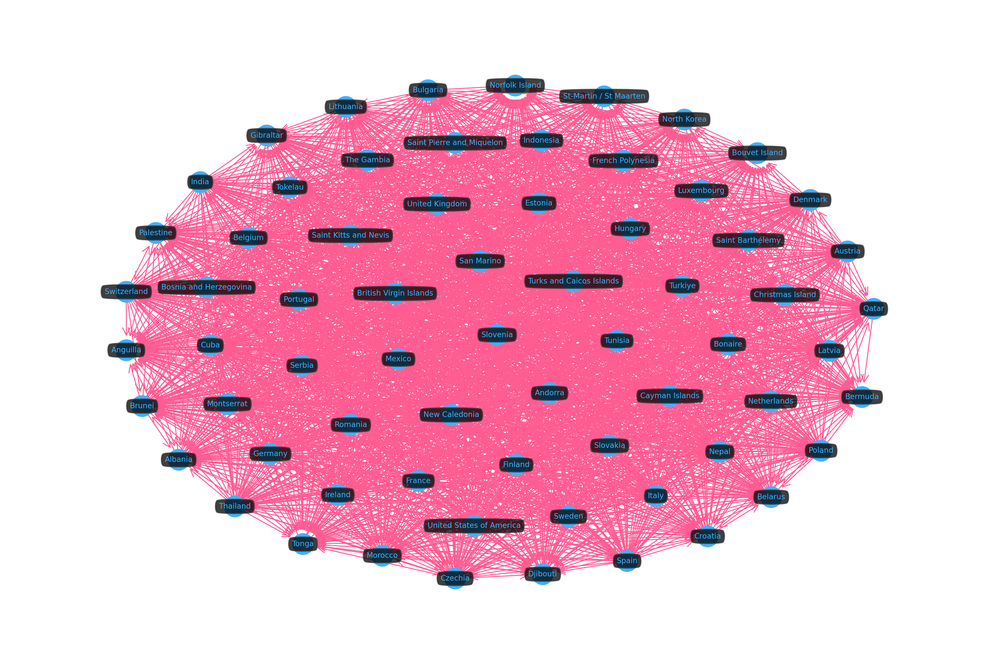


##### Community Mapping

Network visualization is not always the best approach to understand your data. This is a good example of this. Since we're working with a complete (or nearly complete) subgraph, looking at relationships is less helpful, but looking at a map for a community is a lot more helpful, as we can see below.


```python
plot_cluster("louvain_id", largest_louvain_id, kind="map")
```


##### Top Exported Products

- Is there any export overlap between large and small communities?


```python
largest_comm_top_exported = top_frac(
    trade_per_cluster(
        "louvain_id",
        largest_louvain_id,
        method="exports"
    ),
    "total_amount_usd",
)
largest_comm_top_exported
```


<div>
<style scoped>
    .dataframe tbody tr th:only-of-type {
        vertical-align: middle;
    }

    .dataframe tbody tr th {
        vertical-align: top;
    }

    .dataframe thead th {
        text-align: right;
    }
</style>
<table border="1" class="dataframe">
  <thead>
    <tr style="text-align: right;">
      <th></th>
      <th>product</th>
      <th>total_amount_usd</th>
    </tr>
  </thead>
  <tbody>
    <tr>
      <th>0</th>
      <td>Commodities not specified, according to kind</td>
      <td>1.506978e+12</td>
    </tr>
    <tr>
      <th>1</th>
      <td>Oils petroleum, bituminous, distillates</td>
      <td>1.382886e+12</td>
    </tr>
    <tr>
      <th>2</th>
      <td>Medicaments, doses, nes</td>
      <td>1.110865e+12</td>
    </tr>
    <tr>
      <th>3</th>
      <td>Blood</td>
      <td>7.572479e+11</td>
    </tr>
    <tr>
      <th>4</th>
      <td>Petroleum oils, crude</td>
      <td>5.977950e+11</td>
    </tr>
    <tr>
      <th>5</th>
      <td>Automobiles nes, gas turbine powered</td>
      <td>5.668137e+11</td>
    </tr>
    <tr>
      <th>6</th>
      <td>Gold in unwrought forms</td>
      <td>5.482768e+11</td>
    </tr>
    <tr>
      <th>7</th>
      <td>Automobiles, spark ignition, 1500-3000cc</td>
      <td>5.231797e+11</td>
    </tr>
    <tr>
      <th>8</th>
      <td>Transmit-receive apparatus for radio, TV</td>
      <td>4.899130e+11</td>
    </tr>
    <tr>
      <th>9</th>
      <td>Monolithic integrated circuits, digital</td>
      <td>4.366876e+11</td>
    </tr>
    <tr>
      <th>10</th>
      <td>Trade data discrepancies</td>
      <td>3.521978e+11</td>
    </tr>
    <tr>
      <th>11</th>
      <td>Parts of data processing equipment</td>
      <td>3.358087e+11</td>
    </tr>
    <tr>
      <th>12</th>
      <td>Automobiles, spark ignition, 1000-1500cc</td>
      <td>2.657018e+11</td>
    </tr>
    <tr>
      <th>13</th>
      <td>Fixed wing aircraft, &gt;15,000kg</td>
      <td>2.641497e+11</td>
    </tr>
    <tr>
      <th>14</th>
      <td>Motor vehicle parts nes</td>
      <td>2.565987e+11</td>
    </tr>
    <tr>
      <th>15</th>
      <td>Vaccines, human</td>
      <td>2.412159e+11</td>
    </tr>
    <tr>
      <th>16</th>
      <td>Natural gas, liquefied</td>
      <td>2.406005e+11</td>
    </tr>
    <tr>
      <th>17</th>
      <td>Gold, semi-manufactured forms</td>
      <td>2.394518e+11</td>
    </tr>
  </tbody>
</table>
</div>


```python
smallest_comm_top_exported = top_frac(
    trade_per_cluster(
        "louvain_id",
        smallest_louvain_id,
        method="exports",
    ),
    "total_amount_usd",
)
smallest_comm_top_exported
```


<div>
<style scoped>
    .dataframe tbody tr th:only-of-type {
        vertical-align: middle;
    }

    .dataframe tbody tr th {
        vertical-align: top;
    }

    .dataframe thead th {
        text-align: right;
    }
</style>
<table border="1" class="dataframe">
  <thead>
    <tr style="text-align: right;">
      <th></th>
      <th>product</th>
      <th>total_amount_usd</th>
    </tr>
  </thead>
  <tbody>
    <tr>
      <th>0</th>
      <td>Instruments for medical science, nes</td>
      <td>1.032487e+10</td>
    </tr>
    <tr>
      <th>1</th>
      <td>Medical needles, catheters</td>
      <td>8.305035e+09</td>
    </tr>
    <tr>
      <th>2</th>
      <td>Trade data discrepancies</td>
      <td>7.981437e+09</td>
    </tr>
  </tbody>
</table>
</div>


```python
jaccard_sim(
    largest_comm_top_exported["product"],
    smallest_comm_top_exported["product"]
)
```


    0.05


##### Top Imported Products

- Is there any import overlap between large and small communities?


```python
largest_comm_top_imported = top_frac(
    trade_per_cluster(
        "louvain_id",
        largest_louvain_id,
        method="imports",
    ),
    "total_amount_usd",
)
largest_comm_top_imported
```


<div>
<style scoped>
    .dataframe tbody tr th:only-of-type {
        vertical-align: middle;
    }

    .dataframe tbody tr th {
        vertical-align: top;
    }

    .dataframe thead th {
        text-align: right;
    }
</style>
<table border="1" class="dataframe">
  <thead>
    <tr style="text-align: right;">
      <th></th>
      <th>product</th>
      <th>total_amount_usd</th>
    </tr>
  </thead>
  <tbody>
    <tr>
      <th>0</th>
      <td>Petroleum oils, crude</td>
      <td>1.933629e+12</td>
    </tr>
    <tr>
      <th>1</th>
      <td>Commodities not specified, according to kind</td>
      <td>1.411868e+12</td>
    </tr>
    <tr>
      <th>2</th>
      <td>Oils petroleum, bituminous, distillates</td>
      <td>1.197450e+12</td>
    </tr>
    <tr>
      <th>3</th>
      <td>Transmit-receive apparatus for radio, TV</td>
      <td>9.829336e+11</td>
    </tr>
    <tr>
      <th>4</th>
      <td>Medicaments, doses, nes</td>
      <td>8.788548e+11</td>
    </tr>
    <tr>
      <th>5</th>
      <td>Trade data discrepancies</td>
      <td>7.574121e+11</td>
    </tr>
    <tr>
      <th>6</th>
      <td>Gold in unwrought forms</td>
      <td>7.455694e+11</td>
    </tr>
    <tr>
      <th>7</th>
      <td>Blood</td>
      <td>6.453376e+11</td>
    </tr>
    <tr>
      <th>8</th>
      <td>Automobiles nes, gas turbine powered</td>
      <td>5.992672e+11</td>
    </tr>
    <tr>
      <th>9</th>
      <td>Natural gas, as gas</td>
      <td>5.284708e+11</td>
    </tr>
    <tr>
      <th>10</th>
      <td>Parts of data processing equipment</td>
      <td>5.119915e+11</td>
    </tr>
    <tr>
      <th>11</th>
      <td>Automobiles, spark ignition, 1500-3000cc</td>
      <td>4.830173e+11</td>
    </tr>
    <tr>
      <th>12</th>
      <td>Monolithic integrated circuits, digital</td>
      <td>4.750667e+11</td>
    </tr>
  </tbody>
</table>
</div>


```python
smallest_comm_top_imported = top_frac(
    trade_per_cluster(
        "louvain_id",
        smallest_louvain_id,
        method="imports",
    ),
    "total_amount_usd",
)
smallest_comm_top_imported
```


<div>
<style scoped>
    .dataframe tbody tr th:only-of-type {
        vertical-align: middle;
    }

    .dataframe tbody tr th {
        vertical-align: top;
    }

    .dataframe thead th {
        text-align: right;
    }
</style>
<table border="1" class="dataframe">
  <thead>
    <tr style="text-align: right;">
      <th></th>
      <th>product</th>
      <th>total_amount_usd</th>
    </tr>
  </thead>
  <tbody>
    <tr>
      <th>0</th>
      <td>Oils petroleum, bituminous, distillates</td>
      <td>1.373957e+10</td>
    </tr>
    <tr>
      <th>1</th>
      <td>Commodities not specified, according to kind</td>
      <td>7.539036e+09</td>
    </tr>
    <tr>
      <th>2</th>
      <td>Transmit-receive apparatus for radio, TV</td>
      <td>3.136932e+09</td>
    </tr>
    <tr>
      <th>3</th>
      <td>Automobiles, spark ignition, 1500-3000cc</td>
      <td>2.425662e+09</td>
    </tr>
    <tr>
      <th>4</th>
      <td>Jewellery of precious metal</td>
      <td>2.326848e+09</td>
    </tr>
    <tr>
      <th>5</th>
      <td>Instruments for medical science, nes</td>
      <td>2.297871e+09</td>
    </tr>
    <tr>
      <th>6</th>
      <td>Monolithic integrated circuits, digital</td>
      <td>2.243517e+09</td>
    </tr>
    <tr>
      <th>7</th>
      <td>Maize except seed corn</td>
      <td>2.138190e+09</td>
    </tr>
    <tr>
      <th>8</th>
      <td>Natural gas, liquefied</td>
      <td>2.103650e+09</td>
    </tr>
    <tr>
      <th>9</th>
      <td>Petroleum oils, crude</td>
      <td>2.089410e+09</td>
    </tr>
    <tr>
      <th>10</th>
      <td>Propane, liquefied</td>
      <td>2.061530e+09</td>
    </tr>
  </tbody>
</table>
</div>


```python
jaccard_sim(
    largest_comm_top_imported["product"],
    smallest_comm_top_imported["product"],
)
```


    0.3333333333333333


##### Trade Alignment

Trade alignment can be used to determine a cluster's self-sufficiency by looking at internal country-country trade, or it can be used to determine a cluster's external competitiveness by looking at inter-cluster country-country trade. We determine both dimensions of trade alignment (intra and inter cluster) based on the supply/demand ratio, more specifically the weighted average of log-SDR, with weights being total amounts (USD) of exports/imports, globally per cluster.

This score is scaled to a `0..1` range using a sigmoid transformation, so anything above 0.5 should be good. The log-transformation ensures the distribution is not skewed.

###### Self-Sufficiency

Most communities are self-sufficient or nearly self-sufficient, with only community 5 showing a little more vulnerability.


```python
comm_self_sufficiency_df = pd.DataFrame(
    dict(
        louvain_id=louvain_id,
        score=global_sdr_score(
            trade_alignment_by_cluster(
                "louvain_id",
                louvain_id,
                method="intra",
            )
        ),
    )
    for louvain_id in comm_sizes_df.index
).sort_values("score", ascending=False)

comm_self_sufficiency_df
```


<div>
<style scoped>
    .dataframe tbody tr th:only-of-type {
        vertical-align: middle;
    }

    .dataframe tbody tr th {
        vertical-align: top;
    }

    .dataframe thead th {
        text-align: right;
    }
</style>
<table border="1" class="dataframe">
  <thead>
    <tr style="text-align: right;">
      <th></th>
      <th>louvain_id</th>
      <th>score</th>
    </tr>
  </thead>
  <tbody>
    <tr>
      <th>9</th>
      <td>9</td>
      <td>0.985065</td>
    </tr>
    <tr>
      <th>2</th>
      <td>4</td>
      <td>0.970089</td>
    </tr>
    <tr>
      <th>5</th>
      <td>1</td>
      <td>0.959150</td>
    </tr>
    <tr>
      <th>8</th>
      <td>3</td>
      <td>0.939180</td>
    </tr>
    <tr>
      <th>10</th>
      <td>10</td>
      <td>0.895896</td>
    </tr>
    <tr>
      <th>1</th>
      <td>6</td>
      <td>0.869495</td>
    </tr>
    <tr>
      <th>4</th>
      <td>7</td>
      <td>0.860508</td>
    </tr>
    <tr>
      <th>6</th>
      <td>2</td>
      <td>0.742791</td>
    </tr>
    <tr>
      <th>3</th>
      <td>8</td>
      <td>0.644520</td>
    </tr>
    <tr>
      <th>7</th>
      <td>0</td>
      <td>0.564580</td>
    </tr>
    <tr>
      <th>0</th>
      <td>5</td>
      <td>0.493976</td>
    </tr>
  </tbody>
</table>
</div>


```python
colors = comm_self_sufficiency_df.score.apply(
    lambda s: MPL_PALETTE[0] if s >= 0.5 else MPL_PALETTE[1]
)

fig, ax = plt.subplots(figsize=(18, 3))

comm_self_sufficiency_df.plot.bar(
    x="louvain_id",
    y="score",
    xlabel="Community ID",
    color=colors,
    rot=0,
    ax=ax,
)

plt.axhline(
    y=0.5,
    color=MPL_PALETTE[1],
    linestyle="--",
    linewidth=2,
)
plt.legend([
    "Self-Sufficiency Threshold",
    "Global Log-SDR Score"
])
plt.show()
```


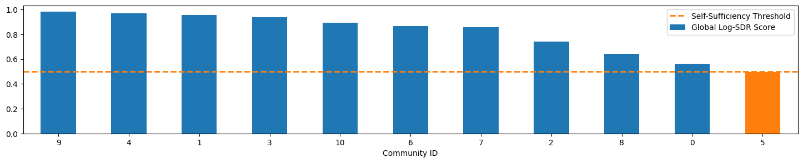


```python
compnet_louvain_df[compnet_louvain_df.louvain_id == 5]
```


<div>
<style scoped>
    .dataframe tbody tr th:only-of-type {
        vertical-align: middle;
    }

    .dataframe tbody tr th {
        vertical-align: top;
    }

    .dataframe thead th {
        text-align: right;
    }
</style>
<table border="1" class="dataframe">
  <thead>
    <tr style="text-align: right;">
      <th></th>
      <th>node_id</th>
      <th>label</th>
      <th>louvain_id</th>
    </tr>
  </thead>
  <tbody>
    <tr>
      <th>6</th>
      <td>7</td>
      <td>Qatar</td>
      <td>5</td>
    </tr>
    <tr>
      <th>18</th>
      <td>19</td>
      <td>Lithuania</td>
      <td>5</td>
    </tr>
    <tr>
      <th>20</th>
      <td>21</td>
      <td>Portugal</td>
      <td>5</td>
    </tr>
    <tr>
      <th>21</th>
      <td>22</td>
      <td>Palestine</td>
      <td>5</td>
    </tr>
    <tr>
      <th>22</th>
      <td>23</td>
      <td>British Virgin Islands</td>
      <td>5</td>
    </tr>
    <tr>
      <th>...</th>
      <td>...</td>
      <td>...</td>
      <td>...</td>
    </tr>
    <tr>
      <th>221</th>
      <td>223</td>
      <td>Spain</td>
      <td>5</td>
    </tr>
    <tr>
      <th>224</th>
      <td>226</td>
      <td>India</td>
      <td>5</td>
    </tr>
    <tr>
      <th>228</th>
      <td>230</td>
      <td>Romania</td>
      <td>5</td>
    </tr>
    <tr>
      <th>231</th>
      <td>233</td>
      <td>Slovenia</td>
      <td>5</td>
    </tr>
    <tr>
      <th>232</th>
      <td>234</td>
      <td>Turkiye</td>
      <td>5</td>
    </tr>
  </tbody>
</table>
<p>67 rows × 3 columns</p>
</div>


###### External Competitiveness

Most communities are not particularly competitive externally, but this was to be expected due to the criteria used to cluster—community dense subgraphs also point to higher internal competition.


```python
comm_external_comp_df = pd.DataFrame(
    dict(
        louvain_id=louvain_id,
        score=global_sdr_score(
            trade_alignment_by_cluster(
                "louvain_id",
                louvain_id,
                method="inter",
            )
        ),
    )
    for louvain_id in comm_sizes_df.index
).sort_values("score", ascending=False)

comm_external_comp_df
```


<div>
<style scoped>
    .dataframe tbody tr th:only-of-type {
        vertical-align: middle;
    }

    .dataframe tbody tr th {
        vertical-align: top;
    }

    .dataframe thead th {
        text-align: right;
    }
</style>
<table border="1" class="dataframe">
  <thead>
    <tr style="text-align: right;">
      <th></th>
      <th>louvain_id</th>
      <th>score</th>
    </tr>
  </thead>
  <tbody>
    <tr>
      <th>0</th>
      <td>5</td>
      <td>0.360300</td>
    </tr>
    <tr>
      <th>3</th>
      <td>8</td>
      <td>0.304639</td>
    </tr>
    <tr>
      <th>1</th>
      <td>6</td>
      <td>0.200342</td>
    </tr>
    <tr>
      <th>2</th>
      <td>4</td>
      <td>0.121624</td>
    </tr>
    <tr>
      <th>4</th>
      <td>7</td>
      <td>0.089482</td>
    </tr>
    <tr>
      <th>6</th>
      <td>2</td>
      <td>0.072207</td>
    </tr>
    <tr>
      <th>5</th>
      <td>1</td>
      <td>0.055127</td>
    </tr>
    <tr>
      <th>8</th>
      <td>3</td>
      <td>0.033868</td>
    </tr>
    <tr>
      <th>9</th>
      <td>9</td>
      <td>0.018567</td>
    </tr>
    <tr>
      <th>10</th>
      <td>10</td>
      <td>0.012569</td>
    </tr>
    <tr>
      <th>7</th>
      <td>0</td>
      <td>0.010781</td>
    </tr>
  </tbody>
</table>
</div>


```python
colors = comm_external_comp_df.score.apply(
    lambda s: MPL_PALETTE[0] if s >= 0.5 else MPL_PALETTE[1]
)

fig, ax = plt.subplots(figsize=(18, 3))

comm_external_comp_df.plot.bar(
    x="louvain_id",
    y="score",
    xlabel="Community ID",
    color=colors,
    rot=0,
    ax=ax,
)

plt.axhline(
    y=0.5,
    color=MPL_PALETTE[1],
    linestyle="--",
    linewidth=2,
)
plt.legend([
    "External Competitiveness Threshold",
    "Global SDR Score"
])
plt.show()
```


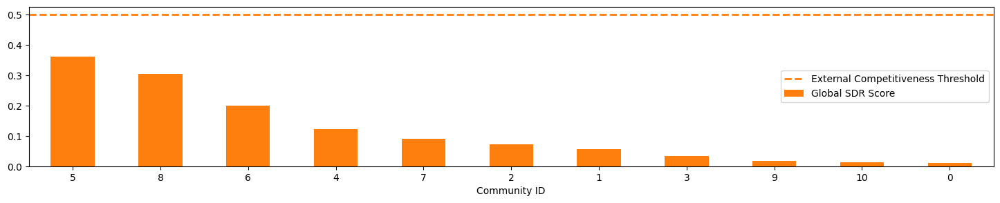


```python
compnet_louvain_df[compnet_louvain_df.louvain_id == 8]
```


<div>
<style scoped>
    .dataframe tbody tr th:only-of-type {
        vertical-align: middle;
    }

    .dataframe tbody tr th {
        vertical-align: top;
    }

    .dataframe thead th {
        text-align: right;
    }
</style>
<table border="1" class="dataframe">
  <thead>
    <tr style="text-align: right;">
      <th></th>
      <th>node_id</th>
      <th>label</th>
      <th>louvain_id</th>
    </tr>
  </thead>
  <tbody>
    <tr>
      <th>14</th>
      <td>15</td>
      <td>Cocos (Keeling) Islands</td>
      <td>8</td>
    </tr>
    <tr>
      <th>46</th>
      <td>47</td>
      <td>Malaysia</td>
      <td>8</td>
    </tr>
    <tr>
      <th>47</th>
      <td>48</td>
      <td>Pitcairn</td>
      <td>8</td>
    </tr>
    <tr>
      <th>48</th>
      <td>49</td>
      <td>Singapore</td>
      <td>8</td>
    </tr>
    <tr>
      <th>62</th>
      <td>63</td>
      <td>Malta</td>
      <td>8</td>
    </tr>
    <tr>
      <th>65</th>
      <td>66</td>
      <td>South Georgia and South Sandwich Islds.</td>
      <td>8</td>
    </tr>
    <tr>
      <th>76</th>
      <td>77</td>
      <td>South Korea</td>
      <td>8</td>
    </tr>
    <tr>
      <th>79</th>
      <td>80</td>
      <td>Vatican City</td>
      <td>8</td>
    </tr>
    <tr>
      <th>87</th>
      <td>88</td>
      <td>Hong Kong</td>
      <td>8</td>
    </tr>
    <tr>
      <th>95</th>
      <td>96</td>
      <td>Vietnam</td>
      <td>8</td>
    </tr>
    <tr>
      <th>96</th>
      <td>97</td>
      <td>Antarctica</td>
      <td>8</td>
    </tr>
    <tr>
      <th>97</th>
      <td>98</td>
      <td>China</td>
      <td>8</td>
    </tr>
    <tr>
      <th>102</th>
      <td>103</td>
      <td>Lesotho</td>
      <td>8</td>
    </tr>
    <tr>
      <th>113</th>
      <td>114</td>
      <td>Taiwan</td>
      <td>8</td>
    </tr>
    <tr>
      <th>120</th>
      <td>121</td>
      <td>Northern Mariana Islands</td>
      <td>8</td>
    </tr>
    <tr>
      <th>125</th>
      <td>126</td>
      <td>Bahrain</td>
      <td>8</td>
    </tr>
    <tr>
      <th>134</th>
      <td>135</td>
      <td>Japan</td>
      <td>8</td>
    </tr>
    <tr>
      <th>160</th>
      <td>161</td>
      <td>Heard and McDonald Islands</td>
      <td>8</td>
    </tr>
    <tr>
      <th>162</th>
      <td>163</td>
      <td>Israel</td>
      <td>8</td>
    </tr>
    <tr>
      <th>164</th>
      <td>165</td>
      <td>Namibia</td>
      <td>8</td>
    </tr>
    <tr>
      <th>169</th>
      <td>170</td>
      <td>Wallis and Futuna</td>
      <td>8</td>
    </tr>
    <tr>
      <th>176</th>
      <td>177</td>
      <td>Botswana</td>
      <td>8</td>
    </tr>
    <tr>
      <th>195</th>
      <td>197</td>
      <td>Macao</td>
      <td>8</td>
    </tr>
    <tr>
      <th>210</th>
      <td>212</td>
      <td>Guam</td>
      <td>8</td>
    </tr>
    <tr>
      <th>215</th>
      <td>217</td>
      <td>Philippines</td>
      <td>8</td>
    </tr>
    <tr>
      <th>233</th>
      <td>235</td>
      <td>Samoa</td>
      <td>8</td>
    </tr>
  </tbody>
</table>
</div>


#### Weakly Connected Competitors

Strongly connected components in our graph would have capture mutual competition among peers, cyclical or balanced rivalries, or equivalent strategic positions. However, once we removed the "Undeclared" pseudo-country, we weren't able to find any strongly connected components that were not singletons.

As such, we compute the weakly connected components, instead capturing the individual or isolated components of countries competing among themselves, regardless of export amount (which establishes direction, in our graph).


```python
conn.execute(
    """
    ALTER TABLE Country DROP IF EXISTS wcc_id;
    ALTER TABLE Country ADD IF NOT EXISTS wcc_id INT64;

    CALL weakly_connected_components("compnet")
    WITH node, group_id
    SET node.wcc_id = group_id;
    """
)
```

```python
compnet_wcc_df = conn.execute(
    """
    MATCH (c:Country)
    WHERE c.country_name_short <> "Undeclared"
    RETURN
        c.node_id AS node_id,
        c.country_name_short AS label,
        c.wcc_id AS wcc_id
    """
).get_as_df()

node_classes = {
  k: g.node_id.to_list()
  for k, g in compnet_wcc_df.groupby("wcc_id")
}

vis.set_labels(compnet_g, LABEL_PROPS)

vis.plot(
    compnet_g,
    node_classes=node_classes,
    hide_edges=True,
)
```


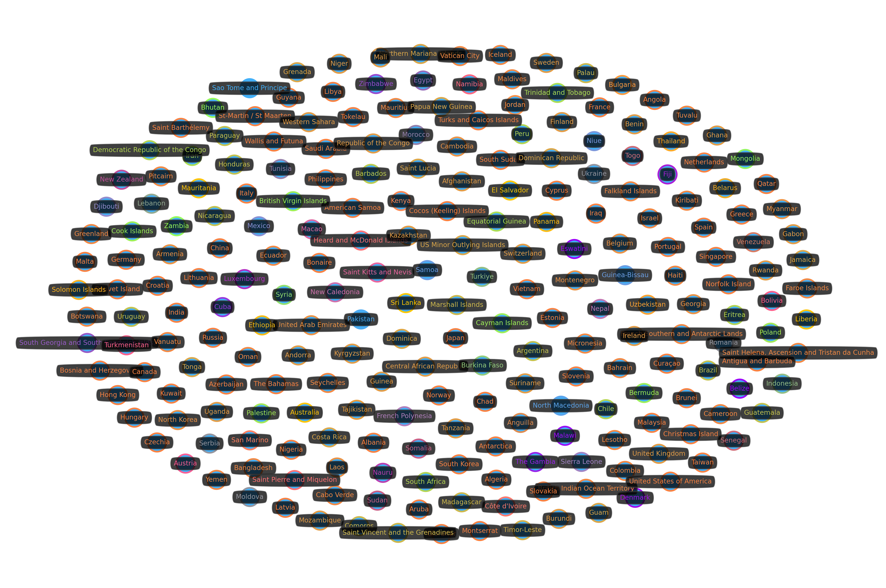


As we can see, there a multiple weakly connected competitors, but most of them are single nodes in their own SCC. Other than that, there is a large component of 64 countries, and then two other smaller components with over 20 nodes each, that we'll inspect below.


```python
wcc_sizes_df = (
    compnet_wcc_df[["wcc_id", "node_id"]]
    .groupby("wcc_id")
    .count()
    .rename(columns=dict(node_id="num_nodes"))
)

wcc_sizes_df = wcc_sizes_df.reindex(
    wcc_sizes_df.num_nodes.sort_values(ascending=False).index
)

wcc_sizes_df
```


<div>
<style scoped>
    .dataframe tbody tr th:only-of-type {
        vertical-align: middle;
    }

    .dataframe tbody tr th {
        vertical-align: top;
    }

    .dataframe thead th {
        text-align: right;
    }
</style>
<table border="1" class="dataframe">
  <thead>
    <tr style="text-align: right;">
      <th></th>
      <th>num_nodes</th>
    </tr>
    <tr>
      <th>wcc_id</th>
      <th></th>
    </tr>
  </thead>
  <tbody>
    <tr>
      <th>0</th>
      <td>64</td>
    </tr>
    <tr>
      <th>1</th>
      <td>28</td>
    </tr>
    <tr>
      <th>4</th>
      <td>24</td>
    </tr>
    <tr>
      <th>5</th>
      <td>11</td>
    </tr>
    <tr>
      <th>2</th>
      <td>9</td>
    </tr>
    <tr>
      <th>...</th>
      <td>...</td>
    </tr>
    <tr>
      <th>209</th>
      <td>1</td>
    </tr>
    <tr>
      <th>215</th>
      <td>1</td>
    </tr>
    <tr>
      <th>226</th>
      <td>1</td>
    </tr>
    <tr>
      <th>228</th>
      <td>1</td>
    </tr>
    <tr>
      <th>230</th>
      <td>1</td>
    </tr>
  </tbody>
</table>
<p>68 rows × 1 columns</p>
</div>


```python
wcc_sizes_ord_df = wcc_sizes_df.reset_index(drop=True)

wcc_singleton_threshold = (
    wcc_sizes_ord_df[wcc_sizes_ord_df.num_nodes <= 1]
    .index[0]
    .item()
)

fig, ax = plt.subplots(figsize=(30, 5))

wcc_sizes_df.plot.bar(rot=0, ax=ax)

plt.axvline(
    x=wcc_singleton_threshold,
    color=MPL_PALETTE[1],
    linestyle="--",
    linewidth=2,
)

plt.legend(["Singleton Threshold", "No. Nodes"])

plt.show()
```


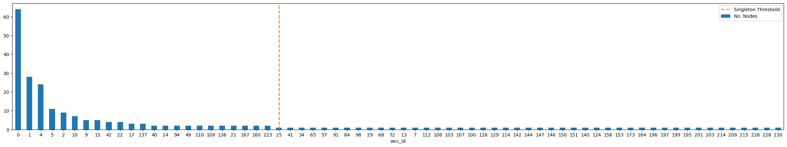


Let's take a look at the members of each weak component, from largest to smallest.


```python
for wcc_id in wcc_sizes_df[wcc_sizes_df.num_nodes > 1].index:
    display(f"WCC ID: {wcc_id}")
    display(
        compnet_wcc_df[compnet_wcc_df.wcc_id == wcc_id]
        .drop(columns="wcc_id")
    )
```


    'WCC ID: 0'


<div>
<style scoped>
    .dataframe tbody tr th:only-of-type {
        vertical-align: middle;
    }

    .dataframe tbody tr th {
        vertical-align: top;
    }

    .dataframe thead th {
        text-align: right;
    }
</style>
<table border="1" class="dataframe">
  <thead>
    <tr style="text-align: right;">
      <th></th>
      <th>node_id</th>
      <th>label</th>
    </tr>
  </thead>
  <tbody>
    <tr>
      <th>0</th>
      <td>1</td>
      <td>American Samoa</td>
    </tr>
    <tr>
      <th>6</th>
      <td>7</td>
      <td>Qatar</td>
    </tr>
    <tr>
      <th>11</th>
      <td>12</td>
      <td>Azerbaijan</td>
    </tr>
    <tr>
      <th>14</th>
      <td>15</td>
      <td>Cocos (Keeling) Islands</td>
    </tr>
    <tr>
      <th>18</th>
      <td>19</td>
      <td>Lithuania</td>
    </tr>
    <tr>
      <th>...</th>
      <td>...</td>
      <td>...</td>
    </tr>
    <tr>
      <th>211</th>
      <td>213</td>
      <td>Guyana</td>
    </tr>
    <tr>
      <th>215</th>
      <td>217</td>
      <td>Philippines</td>
    </tr>
    <tr>
      <th>221</th>
      <td>223</td>
      <td>Spain</td>
    </tr>
    <tr>
      <th>224</th>
      <td>226</td>
      <td>India</td>
    </tr>
    <tr>
      <th>231</th>
      <td>233</td>
      <td>Slovenia</td>
    </tr>
  </tbody>
</table>
<p>64 rows × 2 columns</p>
</div>


    'WCC ID: 1'


<div>
<style scoped>
    .dataframe tbody tr th:only-of-type {
        vertical-align: middle;
    }

    .dataframe tbody tr th {
        vertical-align: top;
    }

    .dataframe thead th {
        text-align: right;
    }
</style>
<table border="1" class="dataframe">
  <thead>
    <tr style="text-align: right;">
      <th></th>
      <th>node_id</th>
      <th>label</th>
    </tr>
  </thead>
  <tbody>
    <tr>
      <th>1</th>
      <td>2</td>
      <td>Falkland Islands</td>
    </tr>
    <tr>
      <th>16</th>
      <td>17</td>
      <td>Cabo Verde</td>
    </tr>
    <tr>
      <th>19</th>
      <td>20</td>
      <td>Mauritius</td>
    </tr>
    <tr>
      <th>26</th>
      <td>27</td>
      <td>Oman</td>
    </tr>
    <tr>
      <th>39</th>
      <td>40</td>
      <td>Haiti</td>
    </tr>
    <tr>
      <th>43</th>
      <td>44</td>
      <td>Maldives</td>
    </tr>
    <tr>
      <th>47</th>
      <td>48</td>
      <td>Pitcairn</td>
    </tr>
    <tr>
      <th>55</th>
      <td>56</td>
      <td>Colombia</td>
    </tr>
    <tr>
      <th>59</th>
      <td>60</td>
      <td>Kiribati</td>
    </tr>
    <tr>
      <th>66</th>
      <td>67</td>
      <td>Tuvalu</td>
    </tr>
    <tr>
      <th>67</th>
      <td>68</td>
      <td>Yemen</td>
    </tr>
    <tr>
      <th>69</th>
      <td>70</td>
      <td>Bangladesh</td>
    </tr>
    <tr>
      <th>74</th>
      <td>75</td>
      <td>Micronesia</td>
    </tr>
    <tr>
      <th>79</th>
      <td>80</td>
      <td>Vatican City</td>
    </tr>
    <tr>
      <th>102</th>
      <td>103</td>
      <td>Lesotho</td>
    </tr>
    <tr>
      <th>122</th>
      <td>123</td>
      <td>Seychelles</td>
    </tr>
    <tr>
      <th>125</th>
      <td>126</td>
      <td>Bahrain</td>
    </tr>
    <tr>
      <th>132</th>
      <td>133</td>
      <td>British Indian Ocean Territory</td>
    </tr>
    <tr>
      <th>155</th>
      <td>156</td>
      <td>French Southern and Antarctic Lands</td>
    </tr>
    <tr>
      <th>161</th>
      <td>162</td>
      <td>Iceland</td>
    </tr>
    <tr>
      <th>162</th>
      <td>163</td>
      <td>Israel</td>
    </tr>
    <tr>
      <th>176</th>
      <td>177</td>
      <td>Botswana</td>
    </tr>
    <tr>
      <th>177</th>
      <td>178</td>
      <td>Cameroon</td>
    </tr>
    <tr>
      <th>182</th>
      <td>183</td>
      <td>Faroe Islands</td>
    </tr>
    <tr>
      <th>191</th>
      <td>192</td>
      <td>Vanuatu</td>
    </tr>
    <tr>
      <th>201</th>
      <td>203</td>
      <td>Saint Helena, Ascension and Tristan da Cunha</td>
    </tr>
    <tr>
      <th>220</th>
      <td>222</td>
      <td>Ecuador</td>
    </tr>
    <tr>
      <th>223</th>
      <td>225</td>
      <td>Greenland</td>
    </tr>
  </tbody>
</table>
</div>


    'WCC ID: 4'


<div>
<style scoped>
    .dataframe tbody tr th:only-of-type {
        vertical-align: middle;
    }

    .dataframe tbody tr th {
        vertical-align: top;
    }

    .dataframe thead th {
        text-align: right;
    }
</style>
<table border="1" class="dataframe">
  <thead>
    <tr style="text-align: right;">
      <th></th>
      <th>node_id</th>
      <th>label</th>
    </tr>
  </thead>
  <tbody>
    <tr>
      <th>4</th>
      <td>5</td>
      <td>Mozambique</td>
    </tr>
    <tr>
      <th>12</th>
      <td>13</td>
      <td>Benin</td>
    </tr>
    <tr>
      <th>38</th>
      <td>39</td>
      <td>Ghana</td>
    </tr>
    <tr>
      <th>50</th>
      <td>51</td>
      <td>Uganda</td>
    </tr>
    <tr>
      <th>52</th>
      <td>53</td>
      <td>Burundi</td>
    </tr>
    <tr>
      <th>73</th>
      <td>74</td>
      <td>Finland</td>
    </tr>
    <tr>
      <th>75</th>
      <td>76</td>
      <td>Gabon</td>
    </tr>
    <tr>
      <th>77</th>
      <td>78</td>
      <td>Mali</td>
    </tr>
    <tr>
      <th>78</th>
      <td>79</td>
      <td>Rwanda</td>
    </tr>
    <tr>
      <th>99</th>
      <td>100</td>
      <td>Western Sahara</td>
    </tr>
    <tr>
      <th>101</th>
      <td>102</td>
      <td>Guinea</td>
    </tr>
    <tr>
      <th>111</th>
      <td>112</td>
      <td>Tanzania</td>
    </tr>
    <tr>
      <th>116</th>
      <td>117</td>
      <td>Central African Republic</td>
    </tr>
    <tr>
      <th>121</th>
      <td>122</td>
      <td>Sweden</td>
    </tr>
    <tr>
      <th>128</th>
      <td>129</td>
      <td>Switzerland</td>
    </tr>
    <tr>
      <th>131</th>
      <td>132</td>
      <td>United Kingdom</td>
    </tr>
    <tr>
      <th>163</th>
      <td>164</td>
      <td>Kyrgyzstan</td>
    </tr>
    <tr>
      <th>165</th>
      <td>166</td>
      <td>Niger</td>
    </tr>
    <tr>
      <th>170</th>
      <td>171</td>
      <td>Afghanistan</td>
    </tr>
    <tr>
      <th>184</th>
      <td>185</td>
      <td>Kazakhstan</td>
    </tr>
    <tr>
      <th>193</th>
      <td>195</td>
      <td>Ireland</td>
    </tr>
    <tr>
      <th>205</th>
      <td>207</td>
      <td>Andorra</td>
    </tr>
    <tr>
      <th>219</th>
      <td>221</td>
      <td>Republic of the Congo</td>
    </tr>
    <tr>
      <th>230</th>
      <td>232</td>
      <td>Suriname</td>
    </tr>
  </tbody>
</table>
</div>


    'WCC ID: 5'


<div>
<style scoped>
    .dataframe tbody tr th:only-of-type {
        vertical-align: middle;
    }

    .dataframe tbody tr th {
        vertical-align: top;
    }

    .dataframe thead th {
        text-align: right;
    }
</style>
<table border="1" class="dataframe">
  <thead>
    <tr style="text-align: right;">
      <th></th>
      <th>node_id</th>
      <th>label</th>
    </tr>
  </thead>
  <tbody>
    <tr>
      <th>5</th>
      <td>6</td>
      <td>Papua New Guinea</td>
    </tr>
    <tr>
      <th>8</th>
      <td>9</td>
      <td>US Minor Outlying Islands</td>
    </tr>
    <tr>
      <th>58</th>
      <td>59</td>
      <td>Jamaica</td>
    </tr>
    <tr>
      <th>60</th>
      <td>61</td>
      <td>Saint Lucia</td>
    </tr>
    <tr>
      <th>83</th>
      <td>84</td>
      <td>Dominica</td>
    </tr>
    <tr>
      <th>85</th>
      <td>86</td>
      <td>Grenada</td>
    </tr>
    <tr>
      <th>120</th>
      <td>121</td>
      <td>Northern Mariana Islands</td>
    </tr>
    <tr>
      <th>145</th>
      <td>146</td>
      <td>Tonga</td>
    </tr>
    <tr>
      <th>157</th>
      <td>158</td>
      <td>Dominican Republic</td>
    </tr>
    <tr>
      <th>192</th>
      <td>194</td>
      <td>Costa Rica</td>
    </tr>
    <tr>
      <th>210</th>
      <td>212</td>
      <td>Guam</td>
    </tr>
  </tbody>
</table>
</div>


    'WCC ID: 2'


<div>
<style scoped>
    .dataframe tbody tr th:only-of-type {
        vertical-align: middle;
    }

    .dataframe tbody tr th {
        vertical-align: top;
    }

    .dataframe thead th {
        text-align: right;
    }
</style>
<table border="1" class="dataframe">
  <thead>
    <tr style="text-align: right;">
      <th></th>
      <th>node_id</th>
      <th>label</th>
    </tr>
  </thead>
  <tbody>
    <tr>
      <th>2</th>
      <td>3</td>
      <td>Georgia</td>
    </tr>
    <tr>
      <th>3</th>
      <td>4</td>
      <td>Laos</td>
    </tr>
    <tr>
      <th>27</th>
      <td>28</td>
      <td>North Korea</td>
    </tr>
    <tr>
      <th>33</th>
      <td>34</td>
      <td>United Arab Emirates</td>
    </tr>
    <tr>
      <th>44</th>
      <td>45</td>
      <td>Myanmar</td>
    </tr>
    <tr>
      <th>172</th>
      <td>173</td>
      <td>Armenia</td>
    </tr>
    <tr>
      <th>174</th>
      <td>175</td>
      <td>Belgium</td>
    </tr>
    <tr>
      <th>212</th>
      <td>214</td>
      <td>Cambodia</td>
    </tr>
    <tr>
      <th>226</th>
      <td>228</td>
      <td>Montenegro</td>
    </tr>
  </tbody>
</table>
</div>


    'WCC ID: 10'


<div>
<style scoped>
    .dataframe tbody tr th:only-of-type {
        vertical-align: middle;
    }

    .dataframe tbody tr th {
        vertical-align: top;
    }

    .dataframe thead th {
        text-align: right;
    }
</style>
<table border="1" class="dataframe">
  <thead>
    <tr style="text-align: right;">
      <th></th>
      <th>node_id</th>
      <th>label</th>
    </tr>
  </thead>
  <tbody>
    <tr>
      <th>10</th>
      <td>11</td>
      <td>Argentina</td>
    </tr>
    <tr>
      <th>86</th>
      <td>87</td>
      <td>Guatemala</td>
    </tr>
    <tr>
      <th>93</th>
      <td>94</td>
      <td>Paraguay</td>
    </tr>
    <tr>
      <th>117</th>
      <td>118</td>
      <td>Honduras</td>
    </tr>
    <tr>
      <th>168</th>
      <td>169</td>
      <td>Uruguay</td>
    </tr>
    <tr>
      <th>197</th>
      <td>199</td>
      <td>Nicaragua</td>
    </tr>
    <tr>
      <th>217</th>
      <td>219</td>
      <td>Brazil</td>
    </tr>
  </tbody>
</table>
</div>


    'WCC ID: 9'


<div>
<style scoped>
    .dataframe tbody tr th:only-of-type {
        vertical-align: middle;
    }

    .dataframe tbody tr th {
        vertical-align: top;
    }

    .dataframe thead th {
        text-align: right;
    }
</style>
<table border="1" class="dataframe">
  <thead>
    <tr style="text-align: right;">
      <th></th>
      <th>node_id</th>
      <th>label</th>
    </tr>
  </thead>
  <tbody>
    <tr>
      <th>9</th>
      <td>10</td>
      <td>Saint Vincent and the Grenadines</td>
    </tr>
    <tr>
      <th>56</th>
      <td>57</td>
      <td>Comoros</td>
    </tr>
    <tr>
      <th>90</th>
      <td>91</td>
      <td>Madagascar</td>
    </tr>
    <tr>
      <th>119</th>
      <td>120</td>
      <td>Marshall Islands</td>
    </tr>
    <tr>
      <th>186</th>
      <td>187</td>
      <td>Palau</td>
    </tr>
  </tbody>
</table>
</div>


    'WCC ID: 15'


<div>
<style scoped>
    .dataframe tbody tr th:only-of-type {
        vertical-align: middle;
    }

    .dataframe tbody tr th {
        vertical-align: top;
    }

    .dataframe thead th {
        text-align: right;
    }
</style>
<table border="1" class="dataframe">
  <thead>
    <tr style="text-align: right;">
      <th></th>
      <th>node_id</th>
      <th>label</th>
    </tr>
  </thead>
  <tbody>
    <tr>
      <th>15</th>
      <td>16</td>
      <td>Democratic Republic of the Congo</td>
    </tr>
    <tr>
      <th>32</th>
      <td>33</td>
      <td>South Africa</td>
    </tr>
    <tr>
      <th>92</th>
      <td>93</td>
      <td>Peru</td>
    </tr>
    <tr>
      <th>181</th>
      <td>182</td>
      <td>Eritrea</td>
    </tr>
    <tr>
      <th>218</th>
      <td>220</td>
      <td>Chile</td>
    </tr>
  </tbody>
</table>
</div>


    'WCC ID: 42'


<div>
<style scoped>
    .dataframe tbody tr th:only-of-type {
        vertical-align: middle;
    }

    .dataframe tbody tr th {
        vertical-align: top;
    }

    .dataframe thead th {
        text-align: right;
    }
</style>
<table border="1" class="dataframe">
  <thead>
    <tr style="text-align: right;">
      <th></th>
      <th>node_id</th>
      <th>label</th>
    </tr>
  </thead>
  <tbody>
    <tr>
      <th>42</th>
      <td>43</td>
      <td>Moldova</td>
    </tr>
    <tr>
      <th>190</th>
      <td>191</td>
      <td>Ukraine</td>
    </tr>
    <tr>
      <th>203</th>
      <td>205</td>
      <td>Serbia</td>
    </tr>
    <tr>
      <th>228</th>
      <td>230</td>
      <td>Romania</td>
    </tr>
  </tbody>
</table>
</div>


    'WCC ID: 22'


<div>
<style scoped>
    .dataframe tbody tr th:only-of-type {
        vertical-align: middle;
    }

    .dataframe tbody tr th {
        vertical-align: top;
    }

    .dataframe thead th {
        text-align: right;
    }
</style>
<table border="1" class="dataframe">
  <thead>
    <tr style="text-align: right;">
      <th></th>
      <th>node_id</th>
      <th>label</th>
    </tr>
  </thead>
  <tbody>
    <tr>
      <th>22</th>
      <td>23</td>
      <td>British Virgin Islands</td>
    </tr>
    <tr>
      <th>36</th>
      <td>37</td>
      <td>Cook Islands</td>
    </tr>
    <tr>
      <th>81</th>
      <td>82</td>
      <td>Bermuda</td>
    </tr>
    <tr>
      <th>178</th>
      <td>179</td>
      <td>Cayman Islands</td>
    </tr>
  </tbody>
</table>
</div>


    'WCC ID: 17'


<div>
<style scoped>
    .dataframe tbody tr th:only-of-type {
        vertical-align: middle;
    }

    .dataframe tbody tr th {
        vertical-align: top;
    }

    .dataframe thead th {
        text-align: right;
    }
</style>
<table border="1" class="dataframe">
  <thead>
    <tr style="text-align: right;">
      <th></th>
      <th>node_id</th>
      <th>label</th>
    </tr>
  </thead>
  <tbody>
    <tr>
      <th>17</th>
      <td>18</td>
      <td>Iran</td>
    </tr>
    <tr>
      <th>31</th>
      <td>32</td>
      <td>Trinidad and Tobago</td>
    </tr>
    <tr>
      <th>158</th>
      <td>159</td>
      <td>Equatorial Guinea</td>
    </tr>
  </tbody>
</table>
</div>


    'WCC ID: 137'


<div>
<style scoped>
    .dataframe tbody tr th:only-of-type {
        vertical-align: middle;
    }

    .dataframe tbody tr th {
        vertical-align: top;
    }

    .dataframe thead th {
        text-align: right;
    }
</style>
<table border="1" class="dataframe">
  <thead>
    <tr style="text-align: right;">
      <th></th>
      <th>node_id</th>
      <th>label</th>
    </tr>
  </thead>
  <tbody>
    <tr>
      <th>137</th>
      <td>138</td>
      <td>Mauritania</td>
    </tr>
    <tr>
      <th>185</th>
      <td>186</td>
      <td>Liberia</td>
    </tr>
    <tr>
      <th>206</th>
      <td>208</td>
      <td>Australia</td>
    </tr>
  </tbody>
</table>
</div>


    'WCC ID: 40'


<div>
<style scoped>
    .dataframe tbody tr th:only-of-type {
        vertical-align: middle;
    }

    .dataframe tbody tr th {
        vertical-align: top;
    }

    .dataframe thead th {
        text-align: right;
    }
</style>
<table border="1" class="dataframe">
  <thead>
    <tr style="text-align: right;">
      <th></th>
      <th>node_id</th>
      <th>label</th>
    </tr>
  </thead>
  <tbody>
    <tr>
      <th>40</th>
      <td>41</td>
      <td>Indonesia</td>
    </tr>
    <tr>
      <th>232</th>
      <td>234</td>
      <td>Turkiye</td>
    </tr>
  </tbody>
</table>
</div>


    'WCC ID: 24'


<div>
<style scoped>
    .dataframe tbody tr th:only-of-type {
        vertical-align: middle;
    }

    .dataframe tbody tr th {
        vertical-align: top;
    }

    .dataframe thead th {
        text-align: right;
    }
</style>
<table border="1" class="dataframe">
  <thead>
    <tr style="text-align: right;">
      <th></th>
      <th>node_id</th>
      <th>label</th>
    </tr>
  </thead>
  <tbody>
    <tr>
      <th>24</th>
      <td>25</td>
      <td>Bhutan</td>
    </tr>
    <tr>
      <th>216</th>
      <td>218</td>
      <td>Zambia</td>
    </tr>
  </tbody>
</table>
</div>


    'WCC ID: 94'


<div>
<style scoped>
    .dataframe tbody tr th:only-of-type {
        vertical-align: middle;
    }

    .dataframe tbody tr th {
        vertical-align: top;
    }

    .dataframe thead th {
        text-align: right;
    }
</style>
<table border="1" class="dataframe">
  <thead>
    <tr style="text-align: right;">
      <th></th>
      <th>node_id</th>
      <th>label</th>
    </tr>
  </thead>
  <tbody>
    <tr>
      <th>94</th>
      <td>95</td>
      <td>Eswatini</td>
    </tr>
    <tr>
      <th>127</th>
      <td>128</td>
      <td>Belize</td>
    </tr>
  </tbody>
</table>
</div>


    'WCC ID: 49'


<div>
<style scoped>
    .dataframe tbody tr th:only-of-type {
        vertical-align: middle;
    }

    .dataframe tbody tr th {
        vertical-align: top;
    }

    .dataframe thead th {
        text-align: right;
    }
</style>
<table border="1" class="dataframe">
  <thead>
    <tr style="text-align: right;">
      <th></th>
      <th>node_id</th>
      <th>label</th>
    </tr>
  </thead>
  <tbody>
    <tr>
      <th>49</th>
      <td>50</td>
      <td>Tunisia</td>
    </tr>
    <tr>
      <th>61</th>
      <td>62</td>
      <td>Morocco</td>
    </tr>
  </tbody>
</table>
</div>


    'WCC ID: 110'


<div>
<style scoped>
    .dataframe tbody tr th:only-of-type {
        vertical-align: middle;
    }

    .dataframe tbody tr th {
        vertical-align: top;
    }

    .dataframe thead th {
        text-align: right;
    }
</style>
<table border="1" class="dataframe">
  <thead>
    <tr style="text-align: right;">
      <th></th>
      <th>node_id</th>
      <th>label</th>
    </tr>
  </thead>
  <tbody>
    <tr>
      <th>110</th>
      <td>111</td>
      <td>Togo</td>
    </tr>
    <tr>
      <th>141</th>
      <td>142</td>
      <td>Senegal</td>
    </tr>
  </tbody>
</table>
</div>


    'WCC ID: 109'


<div>
<style scoped>
    .dataframe tbody tr th:only-of-type {
        vertical-align: middle;
    }

    .dataframe tbody tr th {
        vertical-align: top;
    }

    .dataframe thead th {
        text-align: right;
    }
</style>
<table border="1" class="dataframe">
  <thead>
    <tr style="text-align: right;">
      <th></th>
      <th>node_id</th>
      <th>label</th>
    </tr>
  </thead>
  <tbody>
    <tr>
      <th>109</th>
      <td>110</td>
      <td>Somalia</td>
    </tr>
    <tr>
      <th>187</th>
      <td>188</td>
      <td>Sudan</td>
    </tr>
  </tbody>
</table>
</div>


    'WCC ID: 136'


<div>
<style scoped>
    .dataframe tbody tr th:only-of-type {
        vertical-align: middle;
    }

    .dataframe tbody tr th {
        vertical-align: top;
    }

    .dataframe thead th {
        text-align: right;
    }
</style>
<table border="1" class="dataframe">
  <thead>
    <tr style="text-align: right;">
      <th></th>
      <th>node_id</th>
      <th>label</th>
    </tr>
  </thead>
  <tbody>
    <tr>
      <th>136</th>
      <td>137</td>
      <td>Sri Lanka</td>
    </tr>
    <tr>
      <th>143</th>
      <td>144</td>
      <td>El Salvador</td>
    </tr>
  </tbody>
</table>
</div>


    'WCC ID: 21'


<div>
<style scoped>
    .dataframe tbody tr th:only-of-type {
        vertical-align: middle;
    }

    .dataframe tbody tr th {
        vertical-align: top;
    }

    .dataframe thead th {
        text-align: right;
    }
</style>
<table border="1" class="dataframe">
  <thead>
    <tr style="text-align: right;">
      <th></th>
      <th>node_id</th>
      <th>label</th>
    </tr>
  </thead>
  <tbody>
    <tr>
      <th>21</th>
      <td>22</td>
      <td>Palestine</td>
    </tr>
    <tr>
      <th>199</th>
      <td>201</td>
      <td>Poland</td>
    </tr>
  </tbody>
</table>
</div>


    'WCC ID: 167'


<div>
<style scoped>
    .dataframe tbody tr th:only-of-type {
        vertical-align: middle;
    }

    .dataframe tbody tr th {
        vertical-align: top;
    }

    .dataframe thead th {
        text-align: right;
    }
</style>
<table border="1" class="dataframe">
  <thead>
    <tr style="text-align: right;">
      <th></th>
      <th>node_id</th>
      <th>label</th>
    </tr>
  </thead>
  <tbody>
    <tr>
      <th>167</th>
      <td>168</td>
      <td>Turkmenistan</td>
    </tr>
    <tr>
      <th>207</th>
      <td>209</td>
      <td>Bolivia</td>
    </tr>
  </tbody>
</table>
</div>


    'WCC ID: 160'


<div>
<style scoped>
    .dataframe tbody tr th:only-of-type {
        vertical-align: middle;
    }

    .dataframe tbody tr th {
        vertical-align: top;
    }

    .dataframe thead th {
        text-align: right;
    }
</style>
<table border="1" class="dataframe">
  <thead>
    <tr style="text-align: right;">
      <th></th>
      <th>node_id</th>
      <th>label</th>
    </tr>
  </thead>
  <tbody>
    <tr>
      <th>160</th>
      <td>161</td>
      <td>Heard and McDonald Islands</td>
    </tr>
    <tr>
      <th>166</th>
      <td>167</td>
      <td>Saint Pierre and Miquelon</td>
    </tr>
  </tbody>
</table>
</div>


    'WCC ID: 223'


<div>
<style scoped>
    .dataframe tbody tr th:only-of-type {
        vertical-align: middle;
    }

    .dataframe tbody tr th {
        vertical-align: top;
    }

    .dataframe thead th {
        text-align: right;
    }
</style>
<table border="1" class="dataframe">
  <thead>
    <tr style="text-align: right;">
      <th></th>
      <th>node_id</th>
      <th>label</th>
    </tr>
  </thead>
  <tbody>
    <tr>
      <th>222</th>
      <td>224</td>
      <td>Guinea-Bissau</td>
    </tr>
    <tr>
      <th>233</th>
      <td>235</td>
      <td>Samoa</td>
    </tr>
  </tbody>
</table>
</div>


```python
largest_wcc_id = wcc_sizes_df.index[0].item()
largest_wcc_id
```


    0


```python
smallest_wcc_id = wcc_sizes_df.index[-1].item()
smallest_wcc_id
```


    230


##### Component Subgraphs


```python
plot_cluster("wcc_id", largest_wcc_id)
```


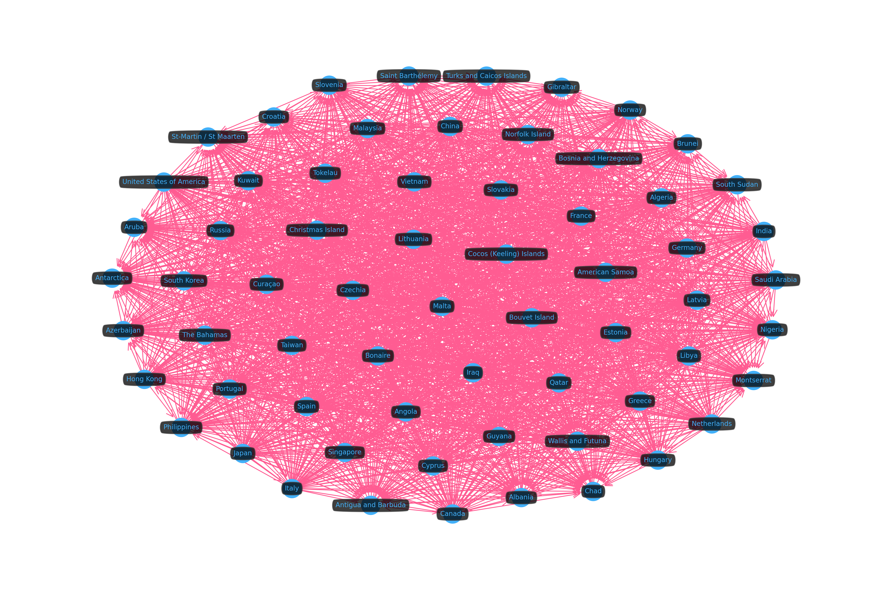


##### Component Mapping


```python
plot_cluster("wcc_id", largest_wcc_id, kind="map")
```


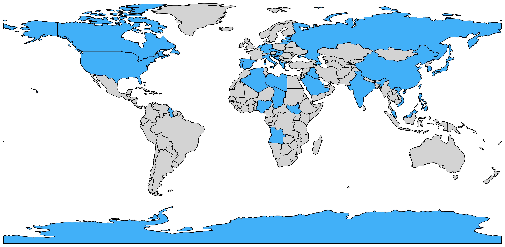


##### Top Exported Products

- Is there any export overlap between large and small components?


```python
largest_wcc_top_exported = top_frac(
    trade_per_cluster("wcc_id", largest_wcc_id, "exports"),
    "total_amount_usd",
)
largest_wcc_top_exported
```


<div>
<style scoped>
    .dataframe tbody tr th:only-of-type {
        vertical-align: middle;
    }

    .dataframe tbody tr th {
        vertical-align: top;
    }

    .dataframe thead th {
        text-align: right;
    }
</style>
<table border="1" class="dataframe">
  <thead>
    <tr style="text-align: right;">
      <th></th>
      <th>product</th>
      <th>total_amount_usd</th>
    </tr>
  </thead>
  <tbody>
    <tr>
      <th>0</th>
      <td>Monolithic integrated circuits, digital</td>
      <td>2.880361e+12</td>
    </tr>
    <tr>
      <th>1</th>
      <td>Petroleum oils, crude</td>
      <td>2.815121e+12</td>
    </tr>
    <tr>
      <th>2</th>
      <td>Oils petroleum, bituminous, distillates</td>
      <td>2.185186e+12</td>
    </tr>
    <tr>
      <th>3</th>
      <td>Commodities not specified, according to kind</td>
      <td>1.859842e+12</td>
    </tr>
    <tr>
      <th>4</th>
      <td>Transmit-receive apparatus for radio, TV</td>
      <td>1.629116e+12</td>
    </tr>
    <tr>
      <th>5</th>
      <td>Trade data discrepancies</td>
      <td>9.872075e+11</td>
    </tr>
    <tr>
      <th>6</th>
      <td>Parts of data processing equipment</td>
      <td>7.646240e+11</td>
    </tr>
    <tr>
      <th>7</th>
      <td>Medicaments, doses, nes</td>
      <td>7.542306e+11</td>
    </tr>
  </tbody>
</table>
</div>


```python
smallest_wcc_top_exported = top_frac(
    trade_per_cluster("wcc_id", smallest_wcc_id, "exports"),
    "total_amount_usd",
)
smallest_wcc_top_exported
```


<div>
<style scoped>
    .dataframe tbody tr th:only-of-type {
        vertical-align: middle;
    }

    .dataframe tbody tr th {
        vertical-align: top;
    }

    .dataframe thead th {
        text-align: right;
    }
</style>
<table border="1" class="dataframe">
  <thead>
    <tr style="text-align: right;">
      <th></th>
      <th>product</th>
      <th>total_amount_usd</th>
    </tr>
  </thead>
  <tbody>
    <tr>
      <th>0</th>
      <td>Petroleum oils, crude</td>
      <td>24676511.0</td>
    </tr>
  </tbody>
</table>
</div>


```python
jaccard_sim(
    largest_wcc_top_exported["product"],
    smallest_wcc_top_exported["product"]
)
```


    0.125


##### Top Imported Products

- Is there any import overlap between large and small components?


```python
largest_wcc_top_imported = top_frac(
    trade_per_cluster("wcc_id", largest_wcc_id, "imports"),
    "total_amount_usd",
)
largest_wcc_top_imported
```


<div>
<style scoped>
    .dataframe tbody tr th:only-of-type {
        vertical-align: middle;
    }

    .dataframe tbody tr th {
        vertical-align: top;
    }

    .dataframe thead th {
        text-align: right;
    }
</style>
<table border="1" class="dataframe">
  <thead>
    <tr style="text-align: right;">
      <th></th>
      <th>product</th>
      <th>total_amount_usd</th>
    </tr>
  </thead>
  <tbody>
    <tr>
      <th>0</th>
      <td>Petroleum oils, crude</td>
      <td>3.075323e+12</td>
    </tr>
    <tr>
      <th>1</th>
      <td>Monolithic integrated circuits, digital</td>
      <td>2.780868e+12</td>
    </tr>
    <tr>
      <th>2</th>
      <td>Commodities not specified, according to kind</td>
      <td>1.510984e+12</td>
    </tr>
    <tr>
      <th>3</th>
      <td>Oils petroleum, bituminous, distillates</td>
      <td>1.420618e+12</td>
    </tr>
    <tr>
      <th>4</th>
      <td>Transmit-receive apparatus for radio, TV</td>
      <td>1.332514e+12</td>
    </tr>
    <tr>
      <th>5</th>
      <td>Trade data discrepancies</td>
      <td>1.248542e+12</td>
    </tr>
    <tr>
      <th>6</th>
      <td>Medicaments, doses, nes</td>
      <td>8.050835e+11</td>
    </tr>
    <tr>
      <th>7</th>
      <td>Parts of data processing equipment</td>
      <td>6.992992e+11</td>
    </tr>
    <tr>
      <th>8</th>
      <td>Automobiles, spark ignition, 1500-3000cc</td>
      <td>6.571986e+11</td>
    </tr>
  </tbody>
</table>
</div>


```python
smallest_wcc_top_imported = top_frac(
    trade_per_cluster("wcc_id", smallest_wcc_id, "imports"),
    "total_amount_usd",
)
smallest_wcc_top_imported
```


<div>
<style scoped>
    .dataframe tbody tr th:only-of-type {
        vertical-align: middle;
    }

    .dataframe tbody tr th {
        vertical-align: top;
    }

    .dataframe thead th {
        text-align: right;
    }
</style>
<table border="1" class="dataframe">
  <thead>
    <tr style="text-align: right;">
      <th></th>
      <th>product</th>
      <th>total_amount_usd</th>
    </tr>
  </thead>
  <tbody>
    <tr>
      <th>0</th>
      <td>Oils petroleum, bituminous, distillates</td>
      <td>88922018.0</td>
    </tr>
    <tr>
      <th>1</th>
      <td>Cargo vessels, not tanker or refrigerated</td>
      <td>23292230.0</td>
    </tr>
    <tr>
      <th>2</th>
      <td>Commodities not specified, according to kind</td>
      <td>21288342.0</td>
    </tr>
    <tr>
      <th>3</th>
      <td>Rice, semi- or wholly-milled</td>
      <td>15654678.0</td>
    </tr>
  </tbody>
</table>
</div>


```python
jaccard_sim(
    largest_comm_top_imported["product"],
    smallest_wcc_top_imported["product"]
)
```


    0.13333333333333333


##### Trade Alignment

Again, trade alignment can be used to determine a cluster's self-sufficiency by looking at internal country-country trade, or it can be used to determine a cluster's external competitiveness by looking at inter-cluster country-country trade. We determine both dimensions of trade alignment (intra and inter cluster) based on the supply/demand ratio, more specifically the weighted average of log-SDR, with weights being total amounts (USD) of exports/imports, globally per cluster.

This score is scaled to a `0..1` range using a sigmoid transformation, so anything above 0.5 should be good. The log-transformation ensures the distribution is not skewed.

###### Self-Sufficiency

Most components are self-sufficient or nearly self-sufficient, with only three of them, components 209, 22 and 196, showing a little more vulnerability.


```python
wcc_self_sufficiency_df = pd.DataFrame(
    dict(
        wcc_id=wcc_id,
        score=global_sdr_score(
            trade_alignment_by_cluster(
                "wcc_id",
                wcc_id,
                method="intra",
            )
        ),
    )
    for wcc_id in wcc_sizes_df.index
).sort_values("score", ascending=False)

wcc_self_sufficiency_df
```


<div>
<style scoped>
    .dataframe tbody tr th:only-of-type {
        vertical-align: middle;
    }

    .dataframe tbody tr th {
        vertical-align: top;
    }

    .dataframe thead th {
        text-align: right;
    }
</style>
<table border="1" class="dataframe">
  <thead>
    <tr style="text-align: right;">
      <th></th>
      <th>wcc_id</th>
      <th>score</th>
    </tr>
  </thead>
  <tbody>
    <tr>
      <th>20</th>
      <td>167</td>
      <td>0.999962</td>
    </tr>
    <tr>
      <th>57</th>
      <td>197</td>
      <td>0.999932</td>
    </tr>
    <tr>
      <th>25</th>
      <td>34</td>
      <td>0.999926</td>
    </tr>
    <tr>
      <th>23</th>
      <td>25</td>
      <td>0.999721</td>
    </tr>
    <tr>
      <th>52</th>
      <td>156</td>
      <td>0.999568</td>
    </tr>
    <tr>
      <th>...</th>
      <td>...</td>
      <td>...</td>
    </tr>
    <tr>
      <th>2</th>
      <td>4</td>
      <td>0.586408</td>
    </tr>
    <tr>
      <th>0</th>
      <td>0</td>
      <td>0.518923</td>
    </tr>
    <tr>
      <th>63</th>
      <td>209</td>
      <td>0.464203</td>
    </tr>
    <tr>
      <th>9</th>
      <td>22</td>
      <td>0.300144</td>
    </tr>
    <tr>
      <th>56</th>
      <td>196</td>
      <td>0.280055</td>
    </tr>
  </tbody>
</table>
<p>68 rows × 2 columns</p>
</div>


```python
colors = wcc_self_sufficiency_df.score.apply(
    lambda s: MPL_PALETTE[0] if s >= 0.5 else MPL_PALETTE[1]
)

fig, ax = plt.subplots(figsize=(30, 5))

wcc_self_sufficiency_df.plot.bar(
    x="wcc_id",
    y="score",
    xlabel="Weak Component ID",
    color=colors,
    rot=0,
    ax=ax,
)

plt.axhline(
    y=0.5,
    color=MPL_PALETTE[1],
    linestyle="--",
    linewidth=2,
)
plt.legend([
    "Self-Sufficiency Threshold",
    "Global SDR Score"
])
plt.show()
```


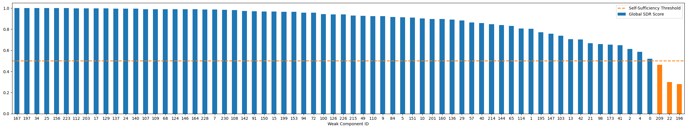


```python
compnet_wcc_df[compnet_wcc_df.wcc_id == 0]
```


<div>
<style scoped>
    .dataframe tbody tr th:only-of-type {
        vertical-align: middle;
    }

    .dataframe tbody tr th {
        vertical-align: top;
    }

    .dataframe thead th {
        text-align: right;
    }
</style>
<table border="1" class="dataframe">
  <thead>
    <tr style="text-align: right;">
      <th></th>
      <th>node_id</th>
      <th>label</th>
      <th>wcc_id</th>
    </tr>
  </thead>
  <tbody>
    <tr>
      <th>0</th>
      <td>1</td>
      <td>American Samoa</td>
      <td>0</td>
    </tr>
    <tr>
      <th>6</th>
      <td>7</td>
      <td>Qatar</td>
      <td>0</td>
    </tr>
    <tr>
      <th>11</th>
      <td>12</td>
      <td>Azerbaijan</td>
      <td>0</td>
    </tr>
    <tr>
      <th>14</th>
      <td>15</td>
      <td>Cocos (Keeling) Islands</td>
      <td>0</td>
    </tr>
    <tr>
      <th>18</th>
      <td>19</td>
      <td>Lithuania</td>
      <td>0</td>
    </tr>
    <tr>
      <th>...</th>
      <td>...</td>
      <td>...</td>
      <td>...</td>
    </tr>
    <tr>
      <th>211</th>
      <td>213</td>
      <td>Guyana</td>
      <td>0</td>
    </tr>
    <tr>
      <th>215</th>
      <td>217</td>
      <td>Philippines</td>
      <td>0</td>
    </tr>
    <tr>
      <th>221</th>
      <td>223</td>
      <td>Spain</td>
      <td>0</td>
    </tr>
    <tr>
      <th>224</th>
      <td>226</td>
      <td>India</td>
      <td>0</td>
    </tr>
    <tr>
      <th>231</th>
      <td>233</td>
      <td>Slovenia</td>
      <td>0</td>
    </tr>
  </tbody>
</table>
<p>64 rows × 3 columns</p>
</div>


###### External Competitiveness

Most components are not particularly competitive externally, even less so than communities, with the large majority having a SDR-based score lower than 0.1.


```python
wcc_external_comp_df = pd.DataFrame(
    dict(
        wcc_id=wcc_id,
        score=global_sdr_score(
            trade_alignment_by_cluster(
                "wcc_id",
                wcc_id,
                method="inter",
            )
        ),
    )
    for wcc_id in wcc_sizes_df.index
).sort_values("score", ascending=False)

wcc_external_comp_df
```


<div>
<style scoped>
    .dataframe tbody tr th:only-of-type {
        vertical-align: middle;
    }

    .dataframe tbody tr th {
        vertical-align: top;
    }

    .dataframe thead th {
        text-align: right;
    }
</style>
<table border="1" class="dataframe">
  <thead>
    <tr style="text-align: right;">
      <th></th>
      <th>wcc_id</th>
      <th>score</th>
    </tr>
  </thead>
  <tbody>
    <tr>
      <th>0</th>
      <td>0</td>
      <td>0.424935</td>
    </tr>
    <tr>
      <th>11</th>
      <td>137</td>
      <td>0.135049</td>
    </tr>
    <tr>
      <th>2</th>
      <td>4</td>
      <td>0.112296</td>
    </tr>
    <tr>
      <th>7</th>
      <td>15</td>
      <td>0.086413</td>
    </tr>
    <tr>
      <th>5</th>
      <td>10</td>
      <td>0.084617</td>
    </tr>
    <tr>
      <th>...</th>
      <td>...</td>
      <td>...</td>
    </tr>
    <tr>
      <th>59</th>
      <td>195</td>
      <td>0.000212</td>
    </tr>
    <tr>
      <th>21</th>
      <td>160</td>
      <td>0.000073</td>
    </tr>
    <tr>
      <th>67</th>
      <td>230</td>
      <td>0.000053</td>
    </tr>
    <tr>
      <th>43</th>
      <td>114</td>
      <td>0.000023</td>
    </tr>
    <tr>
      <th>26</th>
      <td>65</td>
      <td>0.000009</td>
    </tr>
  </tbody>
</table>
<p>68 rows × 2 columns</p>
</div>


```python
colors = wcc_external_comp_df.score.apply(
    lambda s: MPL_PALETTE[0] if s >= 0.5 else MPL_PALETTE[1]
)

fig, ax = plt.subplots(figsize=(30, 5))

wcc_external_comp_df.plot.bar(
    x="wcc_id",
    y="score",
    xlabel="Weak Component ID",
    color=colors,
    rot=0,
    ax=ax,
)

plt.axhline(
    y=0.5,
    color=MPL_PALETTE[1],
    linestyle="--",
    linewidth=2,
)
plt.legend([
    "External Competitiveness Threshold",
    "Global SDR Score"
])
plt.show()
```


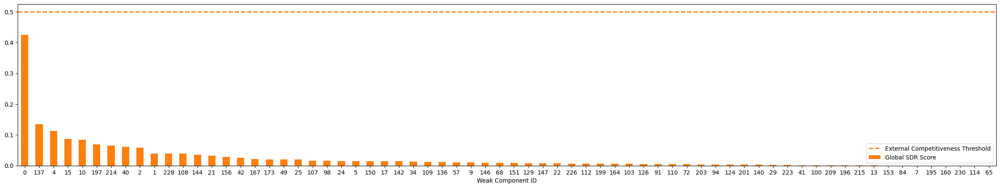


```python
compnet_louvain_df[compnet_louvain_df.louvain_id == 0]
```


<div>
<style scoped>
    .dataframe tbody tr th:only-of-type {
        vertical-align: middle;
    }

    .dataframe tbody tr th {
        vertical-align: top;
    }

    .dataframe thead th {
        text-align: right;
    }
</style>
<table border="1" class="dataframe">
  <thead>
    <tr style="text-align: right;">
      <th></th>
      <th>node_id</th>
      <th>label</th>
      <th>louvain_id</th>
    </tr>
  </thead>
  <tbody>
    <tr>
      <th>0</th>
      <td>1</td>
      <td>American Samoa</td>
      <td>0</td>
    </tr>
    <tr>
      <th>9</th>
      <td>10</td>
      <td>Saint Vincent and the Grenadines</td>
      <td>0</td>
    </tr>
    <tr>
      <th>13</th>
      <td>14</td>
      <td>Barbados</td>
      <td>0</td>
    </tr>
    <tr>
      <th>35</th>
      <td>36</td>
      <td>The Bahamas</td>
      <td>0</td>
    </tr>
    <tr>
      <th>58</th>
      <td>59</td>
      <td>Jamaica</td>
      <td>0</td>
    </tr>
    <tr>
      <th>60</th>
      <td>61</td>
      <td>Saint Lucia</td>
      <td>0</td>
    </tr>
    <tr>
      <th>80</th>
      <td>81</td>
      <td>Antigua and Barbuda</td>
      <td>0</td>
    </tr>
    <tr>
      <th>82</th>
      <td>83</td>
      <td>Curaçao</td>
      <td>0</td>
    </tr>
    <tr>
      <th>85</th>
      <td>86</td>
      <td>Grenada</td>
      <td>0</td>
    </tr>
    <tr>
      <th>119</th>
      <td>120</td>
      <td>Marshall Islands</td>
      <td>0</td>
    </tr>
    <tr>
      <th>159</th>
      <td>160</td>
      <td>Greece</td>
      <td>0</td>
    </tr>
    <tr>
      <th>179</th>
      <td>180</td>
      <td>Cyprus</td>
      <td>0</td>
    </tr>
    <tr>
      <th>214</th>
      <td>216</td>
      <td>Niue</td>
      <td>0</td>
    </tr>
  </tbody>
</table>
</div>


#### Communities vs Components

By matching the clustering (communities and weak components) with the highest number of clusters, and therefore smaller clusters, to the clustering with the lowest number of clusters, we can run a pairwise cluster comparison:

- Which countries belong to a community, but not the weak component?
- Which countries belong to a weak component, but not the community?
- Which countries belong to both?
- Is there a particular semantic to these countries?


```python
len(wcc_sizes_df), len(comm_sizes_df)
```


    (68, 11)


##### NN-Clusters

We compute community to weak component similarities, selecting the nearest-neighbor community for each component. Given the higher number of components when compared to communities, we'll necessarily have repeated nearest-neighbor communities.


```python
cluster_sim_df = []

for wcc_id, wcc in compnet_wcc_df.groupby("wcc_id"):
    for louvain_id, comm in (
        compnet_louvain_df.groupby("louvain_id")
    ):
        cluster_sim_df.append(
            dict(
                wcc_id=wcc_id,
                louvain_id=louvain_id,
                sim=jaccard_sim(wcc.label, comm.label),
            )
        )

cluster_sim_df = pd.DataFrame(cluster_sim_df)
cluster_sim_df = cluster_sim_df.loc[
    cluster_sim_df
    .groupby(["wcc_id"])
    .idxmax()
    .sim
]
cluster_sim_df
```


<div>
<style scoped>
    .dataframe tbody tr th:only-of-type {
        vertical-align: middle;
    }

    .dataframe tbody tr th {
        vertical-align: top;
    }

    .dataframe thead th {
        text-align: right;
    }
</style>
<table border="1" class="dataframe">
  <thead>
    <tr style="text-align: right;">
      <th></th>
      <th>wcc_id</th>
      <th>louvain_id</th>
      <th>sim</th>
    </tr>
  </thead>
  <tbody>
    <tr>
      <th>5</th>
      <td>0</td>
      <td>5</td>
      <td>0.297030</td>
    </tr>
    <tr>
      <th>12</th>
      <td>1</td>
      <td>1</td>
      <td>0.354839</td>
    </tr>
    <tr>
      <th>25</th>
      <td>2</td>
      <td>3</td>
      <td>0.307692</td>
    </tr>
    <tr>
      <th>37</th>
      <td>4</td>
      <td>4</td>
      <td>0.317073</td>
    </tr>
    <tr>
      <th>54</th>
      <td>5</td>
      <td>10</td>
      <td>0.272727</td>
    </tr>
    <tr>
      <th>...</th>
      <td>...</td>
      <td>...</td>
      <td>...</td>
    </tr>
    <tr>
      <th>693</th>
      <td>215</td>
      <td>0</td>
      <td>0.076923</td>
    </tr>
    <tr>
      <th>713</th>
      <td>223</td>
      <td>9</td>
      <td>0.125000</td>
    </tr>
    <tr>
      <th>717</th>
      <td>226</td>
      <td>2</td>
      <td>0.071429</td>
    </tr>
    <tr>
      <th>729</th>
      <td>228</td>
      <td>3</td>
      <td>0.125000</td>
    </tr>
    <tr>
      <th>743</th>
      <td>230</td>
      <td>6</td>
      <td>0.030303</td>
    </tr>
  </tbody>
</table>
<p>68 rows × 3 columns</p>
</div>


For example, community 5 matches with 20 different weak components.


```python
cluster_sim_df.louvain_id.value_counts()
```


    louvain_id
    5     20
    7     10
    4     10
    2      7
    6      6
    8      4
    1      3
    3      3
    0      2
    9      2
    10     1
    Name: count, dtype: int64


```python
cluster_sim_df[cluster_sim_df.louvain_id == 5]
```


<div>
<style scoped>
    .dataframe tbody tr th:only-of-type {
        vertical-align: middle;
    }

    .dataframe tbody tr th {
        vertical-align: top;
    }

    .dataframe thead th {
        text-align: right;
    }
</style>
<table border="1" class="dataframe">
  <thead>
    <tr style="text-align: right;">
      <th></th>
      <th>wcc_id</th>
      <th>louvain_id</th>
      <th>sim</th>
    </tr>
  </thead>
  <tbody>
    <tr>
      <th>5</th>
      <td>0</td>
      <td>5</td>
      <td>0.297030</td>
    </tr>
    <tr>
      <th>126</th>
      <td>21</td>
      <td>5</td>
      <td>0.029851</td>
    </tr>
    <tr>
      <th>192</th>
      <td>40</td>
      <td>5</td>
      <td>0.029851</td>
    </tr>
    <tr>
      <th>225</th>
      <td>49</td>
      <td>5</td>
      <td>0.029851</td>
    </tr>
    <tr>
      <th>269</th>
      <td>72</td>
      <td>5</td>
      <td>0.014925</td>
    </tr>
    <tr>
      <th>280</th>
      <td>84</td>
      <td>5</td>
      <td>0.014925</td>
    </tr>
    <tr>
      <th>313</th>
      <td>98</td>
      <td>5</td>
      <td>0.014925</td>
    </tr>
    <tr>
      <th>335</th>
      <td>103</td>
      <td>5</td>
      <td>0.014925</td>
    </tr>
    <tr>
      <th>401</th>
      <td>114</td>
      <td>5</td>
      <td>0.014925</td>
    </tr>
    <tr>
      <th>423</th>
      <td>126</td>
      <td>5</td>
      <td>0.014925</td>
    </tr>
    <tr>
      <th>489</th>
      <td>144</td>
      <td>5</td>
      <td>0.014925</td>
    </tr>
    <tr>
      <th>511</th>
      <td>147</td>
      <td>5</td>
      <td>0.014925</td>
    </tr>
    <tr>
      <th>544</th>
      <td>153</td>
      <td>5</td>
      <td>0.014925</td>
    </tr>
    <tr>
      <th>599</th>
      <td>173</td>
      <td>5</td>
      <td>0.014925</td>
    </tr>
    <tr>
      <th>610</th>
      <td>195</td>
      <td>5</td>
      <td>0.014925</td>
    </tr>
    <tr>
      <th>632</th>
      <td>197</td>
      <td>5</td>
      <td>0.014925</td>
    </tr>
    <tr>
      <th>643</th>
      <td>199</td>
      <td>5</td>
      <td>0.014925</td>
    </tr>
    <tr>
      <th>654</th>
      <td>201</td>
      <td>5</td>
      <td>0.014925</td>
    </tr>
    <tr>
      <th>676</th>
      <td>209</td>
      <td>5</td>
      <td>0.014925</td>
    </tr>
    <tr>
      <th>687</th>
      <td>214</td>
      <td>5</td>
      <td>0.014925</td>
    </tr>
  </tbody>
</table>
</div>


##### Set Comparison

Let's select a weakest component and retrieve its NN community to compare.


```python
## comp_wcc_id = largest_wcc_id
comp_wcc_id = compnet_wcc_df.loc[
    compnet_wcc_df.label == "Australia",
    "wcc_id"
].item()

comp_comm_id = cluster_sim_df.loc[
    cluster_sim_df.wcc_id == comp_wcc_id,
    "louvain_id",
].item()

comp_wcc_id, comp_comm_id
```


    (137, 4)


```python
comp_wcc_countries = set(
    compnet_wcc_df.loc[
        compnet_wcc_df.wcc_id == comp_wcc_id,
        "label"
    ]
)

comp_louvain_countries = set(
    compnet_louvain_df.loc[
        compnet_louvain_df.louvain_id == comp_comm_id,
        "label"
    ]
)
```

###### WCC Exclusive


```python
pd.Series(
    list(comp_wcc_countries - comp_louvain_countries),
    name="country",
).sort_values().to_frame()
```


<div>
<style scoped>
    .dataframe tbody tr th:only-of-type {
        vertical-align: middle;
    }

    .dataframe tbody tr th {
        vertical-align: top;
    }

    .dataframe thead th {
        text-align: right;
    }
</style>
<table border="1" class="dataframe">
  <thead>
    <tr style="text-align: right;">
      <th></th>
      <th>country</th>
    </tr>
  </thead>
  <tbody>
  </tbody>
</table>
</div>


###### Community Exclusive


```python
pd.Series(
    list(comp_louvain_countries - comp_wcc_countries),
    name="country",
).sort_values().to_frame()
```


<div>
<style scoped>
    .dataframe tbody tr th:only-of-type {
        vertical-align: middle;
    }

    .dataframe tbody tr th {
        vertical-align: top;
    }

    .dataframe thead th {
        text-align: right;
    }
</style>
<table border="1" class="dataframe">
  <thead>
    <tr style="text-align: right;">
      <th></th>
      <th>country</th>
    </tr>
  </thead>
  <tbody>
    <tr>
      <th>5</th>
      <td>Afghanistan</td>
    </tr>
    <tr>
      <th>26</th>
      <td>Benin</td>
    </tr>
    <tr>
      <th>20</th>
      <td>Bhutan</td>
    </tr>
    <tr>
      <th>14</th>
      <td>Bolivia</td>
    </tr>
    <tr>
      <th>24</th>
      <td>Burundi</td>
    </tr>
    <tr>
      <th>18</th>
      <td>Central African Republic</td>
    </tr>
    <tr>
      <th>4</th>
      <td>Guinea</td>
    </tr>
    <tr>
      <th>1</th>
      <td>Kyrgyzstan</td>
    </tr>
    <tr>
      <th>23</th>
      <td>Mali</td>
    </tr>
    <tr>
      <th>8</th>
      <td>Mozambique</td>
    </tr>
    <tr>
      <th>25</th>
      <td>Niger</td>
    </tr>
    <tr>
      <th>17</th>
      <td>Papua New Guinea</td>
    </tr>
    <tr>
      <th>7</th>
      <td>Rwanda</td>
    </tr>
    <tr>
      <th>21</th>
      <td>Senegal</td>
    </tr>
    <tr>
      <th>2</th>
      <td>Sierra Leone</td>
    </tr>
    <tr>
      <th>13</th>
      <td>Solomon Islands</td>
    </tr>
    <tr>
      <th>0</th>
      <td>Somalia</td>
    </tr>
    <tr>
      <th>15</th>
      <td>Sudan</td>
    </tr>
    <tr>
      <th>12</th>
      <td>Suriname</td>
    </tr>
    <tr>
      <th>10</th>
      <td>Syria</td>
    </tr>
    <tr>
      <th>19</th>
      <td>Tajikistan</td>
    </tr>
    <tr>
      <th>6</th>
      <td>Tanzania</td>
    </tr>
    <tr>
      <th>3</th>
      <td>Togo</td>
    </tr>
    <tr>
      <th>9</th>
      <td>Turkmenistan</td>
    </tr>
    <tr>
      <th>11</th>
      <td>US Minor Outlying Islands</td>
    </tr>
    <tr>
      <th>16</th>
      <td>Western Sahara</td>
    </tr>
    <tr>
      <th>22</th>
      <td>Zambia</td>
    </tr>
  </tbody>
</table>
</div>


###### WCC and Community Overlap


```python
pd.Series(
    list(comp_wcc_countries | comp_louvain_countries),
    name="country",
).sort_values().to_frame()
```


<div>
<style scoped>
    .dataframe tbody tr th:only-of-type {
        vertical-align: middle;
    }

    .dataframe tbody tr th {
        vertical-align: top;
    }

    .dataframe thead th {
        text-align: right;
    }
</style>
<table border="1" class="dataframe">
  <thead>
    <tr style="text-align: right;">
      <th></th>
      <th>country</th>
    </tr>
  </thead>
  <tbody>
    <tr>
      <th>17</th>
      <td>Afghanistan</td>
    </tr>
    <tr>
      <th>9</th>
      <td>Australia</td>
    </tr>
    <tr>
      <th>14</th>
      <td>Benin</td>
    </tr>
    <tr>
      <th>10</th>
      <td>Bhutan</td>
    </tr>
    <tr>
      <th>5</th>
      <td>Bolivia</td>
    </tr>
    <tr>
      <th>29</th>
      <td>Burundi</td>
    </tr>
    <tr>
      <th>26</th>
      <td>Central African Republic</td>
    </tr>
    <tr>
      <th>2</th>
      <td>Guinea</td>
    </tr>
    <tr>
      <th>1</th>
      <td>Kyrgyzstan</td>
    </tr>
    <tr>
      <th>27</th>
      <td>Liberia</td>
    </tr>
    <tr>
      <th>28</th>
      <td>Mali</td>
    </tr>
    <tr>
      <th>8</th>
      <td>Mauritania</td>
    </tr>
    <tr>
      <th>19</th>
      <td>Mozambique</td>
    </tr>
    <tr>
      <th>13</th>
      <td>Niger</td>
    </tr>
    <tr>
      <th>6</th>
      <td>Papua New Guinea</td>
    </tr>
    <tr>
      <th>18</th>
      <td>Rwanda</td>
    </tr>
    <tr>
      <th>11</th>
      <td>Senegal</td>
    </tr>
    <tr>
      <th>15</th>
      <td>Sierra Leone</td>
    </tr>
    <tr>
      <th>4</th>
      <td>Solomon Islands</td>
    </tr>
    <tr>
      <th>0</th>
      <td>Somalia</td>
    </tr>
    <tr>
      <th>24</th>
      <td>Sudan</td>
    </tr>
    <tr>
      <th>23</th>
      <td>Suriname</td>
    </tr>
    <tr>
      <th>21</th>
      <td>Syria</td>
    </tr>
    <tr>
      <th>7</th>
      <td>Tajikistan</td>
    </tr>
    <tr>
      <th>3</th>
      <td>Tanzania</td>
    </tr>
    <tr>
      <th>16</th>
      <td>Togo</td>
    </tr>
    <tr>
      <th>20</th>
      <td>Turkmenistan</td>
    </tr>
    <tr>
      <th>22</th>
      <td>US Minor Outlying Islands</td>
    </tr>
    <tr>
      <th>25</th>
      <td>Western Sahara</td>
    </tr>
    <tr>
      <th>12</th>
      <td>Zambia</td>
    </tr>
  </tbody>
</table>
</div>


#### Economical Pressure (PageRank)

Economical pressure can easily be measured using PageRank, as it is a converging metric that aggregates the overall incoming competition strength, increasing its value as the contributing competing countries are themselves under economical pressure.


```python
conn.execute(
    """
    ALTER TABLE Country DROP IF EXISTS pagerank;
    ALTER TABLE Country ADD IF NOT EXISTS pagerank DOUBLE;

    CALL page_rank("compnet", maxIterations := 100)
    WITH node, rank
    SET node.pagerank = rank
    """
)
```


##### Most Pressured Countries


```python
most_pressured_df = conn.execute(
    """
    MATCH (c:Country)
    WHERE c.country_name_short <> "Undeclared"
    RETURN
        c.node_id AS node_id,
        c.country_name_short AS label,
        c.pagerank AS pagerank
    ORDER BY c.pagerank DESC
    LIMIT 25
    """
).get_as_df()

fig, ax = plt.subplots(figsize=(5, 8))
(
  most_pressured_df.iloc[::-1]
  .plot.barh(x="label", y="pagerank", ax=ax)
)
plt.ylabel(None)
plt.legend([])
plt.show()
```


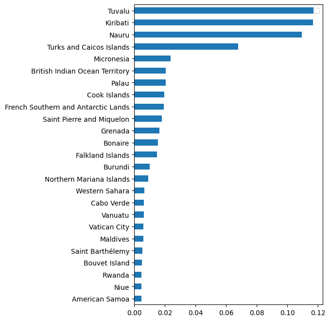


##### Least Pressured Countries


```python
least_pressured_df = conn.execute(
    """
    MATCH (c:Country)
    WHERE c.country_name_short <> "Undeclared"
    RETURN
        c.node_id AS node_id,
        c.country_name_short AS label,
        c.pagerank AS pagerank
    ORDER BY c.pagerank ASC
    LIMIT 25
    """
).get_as_df()

fig, ax = plt.subplots(figsize=(5, 8))
(
  least_pressured_df.iloc[::-1]
  .plot.barh(x="label", y="pagerank", ax=ax)
)
plt.ylabel(None)
plt.legend([])
plt.show()
```


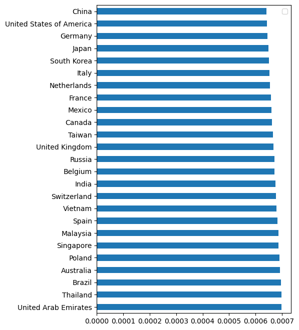


## Closing Remarks

Economies are complex systems, and the complex relations between markets can be captured using a graph. Determining which nodes and relationships to model is crucial to interpretation—our graph focused on competition relationships, and so our metrics and partition approaches illustrated this.

Network analysis tools are usually not as exotic as they want to make us believe. Useful graph data science is usually not that complex, particularly now that tooling is widely available, but it can certainly be extremely insightful, specially when the graph is correctly modeled.

This is only a small introduction to this topic, using world economy and trade as an example topic, which I have been particularly interested in.

The economy and the world overall is suffering. Graphs will help us find solution to complex problems, but it requires the commitment to always ask yourself: could I do this without a graph? When the answer is yes, then you should rethink your approach. If you're not looking at complex relations, you're just doing more of the same.

Bottom line, use graphs and use them correctly.
