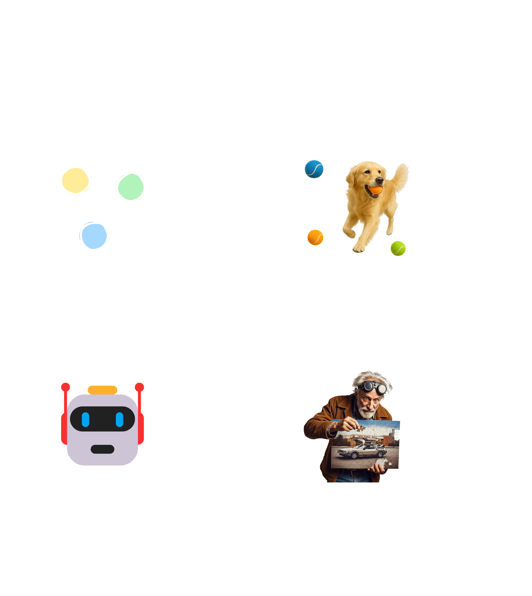
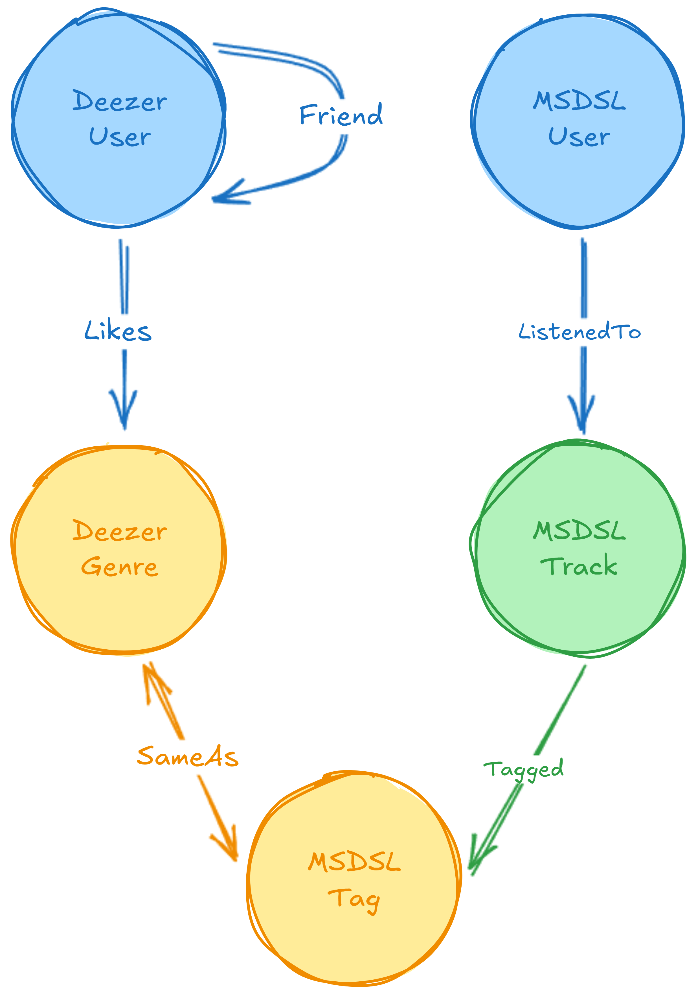
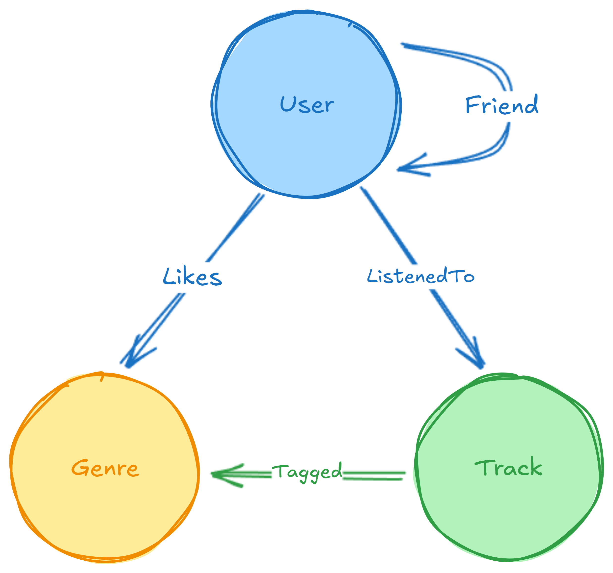
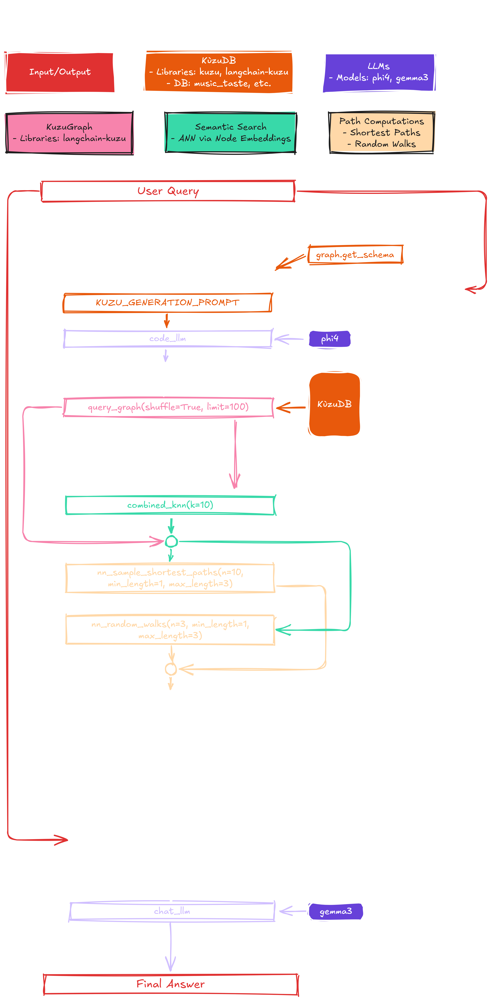

## Summary

In this video, I'll delve into GraphRAG, learning about KùzuDB, node embeddings vs text embeddings, and LangChain, running on top of Ollama with `phi4` and `gemma3`.

<div style="position: relative; padding-bottom: 56.25%; height: 0; overflow: hidden; max-width: 100%;">
	<iframe
		src="https://www.youtube.com/embed/TBD"
		frameborder="0"
		allow="accelerometer; autoplay; clipboard-write; encrypted-media; gyroscope; picture-in-picture; web-share"
		referrerpolicy="strict-origin-when-cross-origin"
		allowfullscreen
		style="position: absolute; top: 0; left: 0; width: 100%; height: 100%;">
	></iframe>
</div>


## What is GraphRAG?

RAG stands for Retrieval Augmented Generation, which means that, instead of simply providing an answer to the user via prompt engineering (i.e., just using an LLM), we also factor in a knowledge base into the process, to provide context and enrich the generated answer.  This knowledge base is usually an index that we can search (hence RAG), but it can also be a graph. If we're retrieving from a graph, to produce a context for an LLM, we're doing GraphRAG. That's it.

Generally, a GraphRAG task consists of taking a user query, mapping it into a knowledge graph—usually through text embedding—and querying that knowledge graph to build a context around relevant nodes and relationships. That context is then combined with the user query and fed to an LLM to produce a final and improved answer.

There also seems to be trend going around that's highlighting "context engineering" as the hot new skill in in AI—see [The rise of "context engineering"](https://blog.langchain.com/the-rise-of-context-engineering/) on LangChain's blog, and [The New Skill in AI is Not Prompting, It's Context Engineering](https://www.philschmid.de/context-engineering) on Philipp Schmid's blog, who is a Senior AI Relation Engineer at Google DeepMind.

If you want to stay on trend and learn something cool, then read bellow on how to use graphs to fetch context, and become better at "context engineering" right now!

## Our Approach

We approach GraphRAG in an unconventional way. Instead of relying on text embeddings, we add an extra step to the process, so that we can alternatively use node embeddings. I'll explain the reason for this decision in the following paragraphs.

When using text to describe nodes (text embeddings) rather than the neighboring graph structure (node embeddings), the user query, which is also text, can be embedded into the same vector space. This means that ANN (approximate nearest neighbors) is directly used to map the user query into a context subgraph—this is not only efficient, but also open ended—ANN based on text embeddings is able to reach semantically similar text, and therefore its associated nodes, rather than just doing exact matches.

On the other hand, when using node embeddings, we'll need an extra step to map named entities in the user query to nodes in the knowledge graph. Only then can we compute ANN for those nodes, working as an expansion stage that builds the context. This provides a higher specificity, since we try to exactly match the entities that the user mentions, but, more importantly, it's actually based on the graph and its structure rather than text.

When working with graphs, always ask yourself whether you could have implemented the same workflow without using a graph structure at all. If the answer is yes, then you're not really taking advantage of your graph. To me, that's just RAG, not GraphRAG. On the other hand, if you find yourself expanding to neighbors, computing shortest paths, clustering nodes, or ranking and selecting nodes based on centrality metrics, then you're definitely doing GraphRAG—and a bit of network science as well.

## Architecture

We'll be working with music data that includes friendship relations between users in a music platform, as well as user listening profiles pointing to preferred genres and genre-tagged tracks. As such, we are assuming that the system will take a music-related prompt as input. The high level workflow of a GraphRAG system is illustrated below, and then we detail each step for our specific use case.



### Step 1: User Query

1. The user asks for music recommendations, either mentioning artists, tracks, or genres that they like.

### Step 2: Graph Retriever

1. The user query is passed into the Graph Retriever module, which uses an LLM to build a cypher query that matches named entities to nodes in the graph. This will describe the user taste, working as a mini user profile.

### Step 3: Context Assembler

1. Each node will have precomputed node embeddings—we'll describe this process later on—which we use to find the approximate nearest neighbors, and extend the mini user profile.
2. For each identified node, we compute a sample of relevant paths to depict context—shortest paths between user profile nodes and neighbor nodes, and random walks from neighbor nodes.
3. Each path is described using its nodes and properties, along with pairwise relationships and their properties, in a format that naturally fits a natural language prompt—it's not valid cypher code, nor it's properly structured text, but rather a semi-structured, human-readable format.

### Step 4: Final Answer

1. The context is composed into the original user prompt and a final prompt is produced.
2. The user is presented with the final response generated using the contextualized prompt—this answer should leverage LLM knowledge and the contextual neighborhood of the user's taste according to the knowledge graph, to hopefully provide better or more informed recommendations.

## Integrating Data as a Graph

We use two Kaggle datasets to build our knowledge graph: [Deezer Social Networks](https://www.kaggle.com/datasets/andreagarritano/deezer-social-networks) and [Million Song Dataset + Spotify + Last.fm](https://www.kaggle.com/datasets/undefinenull/million-song-dataset-spotify-lastfm) (MSDSL). If you want to know more about the ETL process, you can read the blog post on [Data Lakehouse with dbt and DuckLake](https://datalabtechtv.com/posts/data-lakehouse-dbt-ducklake/), and watch the [video](https://youtu.be/zn69Q7FiFfo?si=ZFjfSl5vo8gcGACR) about it.

In this blog post, we assume that the required node and relationship data is already available as Apache Parquet files that are ready to load into KùzuDB. So, we'll focus on discussing possible integration strategies—direct mapping or integrated mapping—along with their pros and cons.

### Direct Mapping

From an ontological or information preservation perspective, directly mapping the entities in our two datasets to their own nodes would make sense. However, purely from a recommender system's perspective, there isn't a clear advantage to doing this, as long as we can identify where a user is from (e.g., via a node property or a connector node).



Keeping separate node labels with similar semantics—Deezer User and MSDSL User, or Genre and Tag—would be unhelpful for the recommendation task, as it would increase complexity while offering no real advantage in exchange.

### Integrated Mapping

Even if Deezer users will never overlap with MSDSL users, we still benefit from combining users as a single entity—and we can keep that additional information as a `source` property. While the `Friend` and `Likes` relationships exist only for Deezer users, and the `ListenedTo` and `Tagged` relationships exist only for MSDSL, we're still able to recommend tracks from MSDSL based on liked genres from Deezer users, or recommend new genres to MSDSL users based on the tags of listened tracks and liked genres by Deezer users.



This modeling approach is also more than enough to exemplify how GraphRAG can be useful in this task, showing off how different datasets can live in a common space, and how connections are established. The more data you have, the richer your knowledge graph will be, and the more detail you can provide to your users.

## Graph Storage with KùzuDB

For storage, we picked [KùzuDB](https://kuzudb.com/), an embedded graph database solution that, in my opinion, promises to shake the market for the first time since Neo4j and OrientDB were fighting for their place in the community. To me, KùzuDB feels like the DuckDB of graph databases—it's for analytics, it has a similar extensions system and functions API, and it even lets you [attach DuckDB](https://docs.kuzudb.com/extensions/attach/duckdb/), so they play well together.

I spent a few days bugging the team with a few questions on Discord, after having exchanged a couple of e-mails with them a few months ago, where I tried to understand whether it was worth checking it out or not. So many graph databases have come and gone, but this is not one of them. I have only good things to say about the product and the team—KùzuDB feels technically sound and robust, and the team is approachable, willing to help, and pragmatic. If you're reading this, thanks guys!

### Pointers vs Partitions

Let's delve a little into the storage scheme for KùzuDB, putting it in context by looking at its counterpart from Neo4j. While I'm partial to Neo4j's approach, and always look for index-free adjacency in graph databases, KùzuDB's columnar approach looks rock solid and ideal for batch operations, as expected from an analytical store.

#### Neo4j: Pointers

OLTP graph databases like Neo4j implement index-free adjacency using a pointer-based storage layout that supports chained traversals. When reading a node, we get a pointer to one of its incident relationships. That relationship then provides two other relationship pointers, one to the next relationship from the source node, and another one to the next relationship from the target node. This produces a linked list of incident relationships, making it possible to iterate over all rels for a given node, as well as traverse the graph by following the rels for source/target nodes that match or do not match the origin node, respectively.

To illustrate this, let's assume that, starting from `n1`, we reach `(n1)-[r1]-(n2)`, and from there we can choose to either jump to another rel incident in `n1` (origin node) or another rel incident in `n2` (neighbor node). When iterating over all incident rels on `n1`, then we might jump to `(n1)-[r2]-(n3)`, but if we're traversing we'll likely jump to another rel, such as `(n2)-[r3]-(n4)`, which forms the path `(n1)-[r1]-(n2)-[r3]-(n4)`. Each step in a traversal essentially costs one disk seek operation, including node-to-edge as a step, and not accounting for caching.

#### KùzuDB: Partitions

KùzuDB approaches storage as an OLAP database, using [Node-group based Storage (Issue #1474)](https://github.com/kuzudb/kuzu/issues/1474), which was inspired by the concept of row groups from columnar formats like Apache ORC or Apache Parquet.

Each node group represents a partition with a given number of nodes or edges with multiple column chunks. A basic column chunk stores a bitmap of null values as well as the values themselves—for string and list columns, offsets are also stored, with each value representing the length of the string or list for each value.

A node group can also represent a column chunk of relationships (rel-lists). Each rel-lists column chunk contains a non-null column of neighbor IDs, and a header with offsets representing the number of neighbors of each node at the corresponding offset in the equivalent node group of nodes. The rel-lists column chunk can also store relationship properties in the same way as node properties are stored. Bit/byte packing and string dictionary compression techniques are also used at the column level to accelerate querying. And a metadata file is kept in memory to help find column chunks based on the node group ID and column name (that can be a rel-lists).

While not index-free in the sense of pointer-chained traversals, KùzuDB still provides an extremely efficient low-level traversal logic, with the added advantage of columnar storage, which is ideal for analytical tasks—it really is the DuckDB of graph databases.

To illustrate the process, let's say that we start from `n1`. We lookup the corresponding node group for `n1` using the metadata file (always available in memory) and, knowing the node group ID, we repeat the process for the rels-list column chunk in the equivalent node group. Through offset arithmetic we can easily obtain the node IDs for neighboring nodes, and repeat the process to keep traversing. Traversing a path like `(n1)-[r1]-(n2)-[r3]-(n4)` should require at most one disk read per node group, similar in principle to Neo4j's per-hop seeks, though amortized over a batch of nodes and properties. While in Neo4j we traverse one pointer at a time, but filter in-memory, in KùzuDB we traverse by loading node groups, being able to filter out entire rows in a single batch, and skipping decompression for irrelevant rows, or irrelevant neighbor lists in rel-lists.

I might have missed a few details, or gotten a few of them wrong, but this is not meant as an in-depth comparison of the storage and querying approaches of Neo4j and KùzuDB. It's rather a testament to the effort that the KùzuDB team has put into designing a robust storage schema that is technically sound and efficient.

To put this into context, the graph operations we run in this study are for a graph with over 1.15M nodes and 11.62M relationships (see [Graph Statistics](#graph-statistics)), which KùzuDB easily supports on a single node with moderately-good specs (24 CPU cores, 24 GiB RAM allocated to WSL2).

## Graph Loading

If you watched [Data Lakehouse with dbt and DuckLake](https://youtu.be/zn69Q7FiFfo?si=bH8dyPwH56hnKzI9), then you already knew that we had gone with the integrated mapping approach, and we have our node and relationship parquet files ready to load into a graph database.

Below we will describe the steps taken to load the nodes and edges into KùzuDB. We implemented this in Python, under the [KuzuOps](https://github.com/DataLabTechTV/datalab/blob/v0.3.0/graph/ops.py) class, which run the cypher queries that we describe below.

### Create Schema

In KùzuDB, we are required to create tables for all of our nodes and relationships. This is what our schema looks like for the Deezer and MSDSL music data. Let's begin with nodes.

```sql
CREATE NODE TABLE User (
	node_id INT64,
	user_id STRING,
	source STRING,
	country STRING,
	PRIMARY KEY (node_id)
);

CREATE NODE TABLE Genre (
	node_id INT64,
	genre STRING,
	PRIMARY KEY (node_id)
);

CREATE NODE TABLE Track (
	node_id INT64,
	track_id STRING,
	name STRING,
	artist STRING,
	year INT16,
	PRIMARY KEY (node_id)
);
```

As you can see, we defined an `INT64` `node_id` property that is unique across all nodes, regardless of their label (i.e., there is no `node_id` collision for `User`, `Genre` and `Track`). This is set as the primary key for our nodes, which means an index is also created for `node_id`.

Then, we create our relationship tables.

```sql
CREATE REL TABLE Friend(
	FROM User TO User,
	MANY_MANY
);

CREATE REL TABLE Likes(
	FROM User TO Genre,
	MANY_MANY
);

CREATE REL TABLE ListenedTo(
	FROM User TO Track,
	play_count INT32,
	MANY_MANY
);

CREATE REL TABLE Tagged(
	FROM Track TO Genre,
	MANY_MANY
);
```

All of our relationships are `MANY_TO_MANY`, with `ListenedTo` also storing a `play_count` property.

This produces a graph schema with three node labels and four rel labels, as illustrated in [Integrated Mapping](#integrated-mapping).

### Import Nodes and Edges

Our node and edge parquet files are stored in S3 and, while KùzuDB can directly read from S3, it does not support disabling SSL, so we were unable to use an S3-based workflow. In production, it's common for SSL to be enabled, but in a lab or prototyping environment it's not. As such, we simply downloaded each parquet file using `boto3` and then ran the following `COPY` commands (we replace filenames with readable names, but we actually used temporary files).

We load nodes as follows:

```sql
COPY User(node_id, user_id, country, source)
FROM 'nodes/dsn_nodes_users.parquet';

COPY User(node_id, user_id, source)
FROM 'nodes/msdsl_nodes_users.parquet';

COPY Track(node_id, track_id, name, artist, year)
FROM 'nodes/msdsl_nodes_tracks.parquet';

COPY Genre(node_id, genre)
FROM 'nodes/nodes_genres.parquet';
```

We load relationships as follows:

```sql
COPY Friend FROM 'edges/dsn_edges_friendships.parquet';

COPY Likes FROM 'edges/dsn_edges_user_genres.parquet';

COPY ListenedTo FROM 'edges/msdsl_edges_user_tracks.parquet';

COPY Tagged FROM 'edges/msdsl_edges_track_tags.parquet';
```

### Graph Statistics

After loading our graph, we computed a few basic statistics using the following query:

```sql
MATCH (n)
RETURN "No. " + label(n) + " Nodes" AS stat, count(*) AS val

UNION

MATCH (n)
RETURN "Total No. Nodes" AS stat, count(*) AS val

UNION

MATCH ()-[r]->()
RETURN "No. " + label(r) + " Rels" AS stat, count(*) AS val

UNION

MATCH ()-[]->()
RETURN "Total No. Rels" AS stat, count(*) AS val;
```

| Statistic           |          Value |
| ------------------- | -------------: |
| No. User Nodes      |      1,105,921 |
| No. Genre Nodes     |            171 |
| No. Track Nodes     |         50,683 |
| **Total No. Nodes** |  **1,156,775** |
| No. Friend Rels     |        846,915 |
| No. Likes Rels      |        880,698 |
| No. ListenedTo Rels |      9,711,301 |
| No. Tagged Rels     |        185,313 |
| **Total No. Rels**  | **11,624,227** |

## Computing Node Embeddings

KùzuDB has a `vector` extension that supports HNSW indexing for vectors, similar to [Pinecone](https://www.pinecone.io/learn/series/faiss/hnsw/), [Weaviate](https://weaviate.io/developers/weaviate/concepts/vector-index), or [pgvector](https://github.com/pgvector/pgvector?tab=readme-ov-file#hnsw). It supports semantic search via ANN, which we'll use on the [Graph Retriever](#graph-retriever) component to establish a context based on graph paths.

We precompute node embeddings based on a PyTorch implementation—see the [graph.embedding](https://github.com/DataLabTechTV/datalab/blob/v0.3.0/graph/embedding.py) module in the [datalab](https://github.com/DataLabTechTV/datalab) repo. We use a simplified version of the Fast Random Projection (FastRP) algorithm, without an $L$ component (or, equivalently, setting $\beta=0$), and with the Multi-Layer Perceptron (MLP) extension. This implementation can be run for a graph (e.g., `music_taste`) by calling the following command:

```bash
dlctl graph compute embeddings "music_taste" \
    -d 256 -b 9216 -e 5
```

This will iterate over batches of `9216` nodes and compute embeddings of dimension `256` over `5` epochs, which are stored in the `embedding` property of each node. Batching is handled by the [KuzuNodeBatcher](https://github.com/DataLabTechTV/datalab/blob/main/graph/batch.py) class that we implement, which relies on the [query_nodes_batch](https://github.com/DataLabTechTV/datalab/blob/main/graph/ops.py#L197) and [query_neighbors](https://github.com/DataLabTechTV/datalab/blob/main/graph/ops.py#L218) methods from the `KuzuOps` class.

The first method implement the following cypher query for paginating nodes:

```sql
MATCH (n)
RETURN n.node_id AS node_id
ORDER BY n.node_id
SKIP $skip
LIMIT $limit
```

And the second method loads the source and target node IDs for all outgoing relationships starting any of the nodes in the batch:

```sql
MATCH (n)-->(m)
WHERE n.node_id IN CAST($nodes AS INT64[])
RETURN n.node_id AS source_id, m.node_id AS target_id
ORDER BY source_id, target_id
```

We can then create the HNSW indexes, dropping any existing indexes automatically, by running:

```bash
dlctl graph reindex "music_taste"
```

To make this possible, the previous command relies on `show_tables()`, `table_info()`, `show_indexes()`, `drop_vector_index()` and `create_vector_index()`, all of which are individually called and arguments are passed from functions like `show_tables()` to `table_index()` strictly via f-strings—since variables are not supported with `CALL`, this needs to be done programmatically. Check out the full [reindex_embeddings](https://github.com/DataLabTechTV/datalab/blob/v0.3.0/graph/ops.py#L272) methods to learn the details.

The whole process takes approximately 20m to run for the `music_taste` graph.

## GraphRAG Chain

We use two LLM models to support our operations: [phi4](https://ollama.com/library/phi4) and [gemma3](https://ollama.com/library/gemma3). Specifically, we rely on phi4 for tasks that involve following instructions and generating code (cypher), and we use gemma3 to produce user-facing text (the final answer). We tested gemma3 as a general model for all required tasks, replacing phi4 in code generation, but it struggled to generate valid cypher code—syntactically and conceptually. The same goes for several other models as well—phi4 seems to produce the best outcome when it comes to code generation (pending formal evaluation, of course,  but I'm vibing right now).

We implemented GraphRAG using [LangChain](https://www.langchain.com/), as a [Runnable](https://python.langchain.com/api_reference/core/runnables/langchain_core.runnables.base.Runnable.html), taking advantage of [langchain-kuzu](https://python.langchain.com/docs/integrations/graphs/kuzu_db/) by partially reusing some of its components, like the `KUZU_GENERATION_PROMPT` template, or `KuzuGraph` for getting a schema to feed to the prompt and to handle graph querying.

> 📌 Note
>
> When we decided to implement our workflow using LangChain, we also looked into [LangGraph](https://langchain-ai.github.io/langgraph/concepts/why-langgraph/), to determine whether it could be useful when working with Graph RAG.
>
> While LangGraph is quite an interesting framework, designed for the orchestration of stateful agents, it does not provide specific tooling for working with graphs—think about graphs in the sense of TensorFlow computational graphs, not graphs like knowledge graphs or social networks. LangGraph supports the integration of LLMs, tools, memory, and other useful features, by settings the conditions under which these components interact.
>
> Since we didn't need to setup something at this complexity level, we did not use LangGraph here. If you're focusing on stateless Graph RAG, then LangChain is really all you need. In the future, however, we might explore LangGraph, and add state to the implementation we describe here.

Below you'll find a diagram detailing the how the Graph RAG chain works, and covering the three major components: Graph Retriever, Context Assembler, and Answer Generator. The floating rectangles on top, with a filling, are the legend. Each small rectangle inside the three major components is a part of the [RunnableSequence](https://python.langchain.com/api_reference/core/runnables/langchain_core.runnables.base.RunnableSequence.html) that makes the component. The code that implements the diagram is available under the [graph.rag](https://github.com/DataLabTechTV/datalab/blob/v0.3.0/graph/rag.py) module—symbol names in the code should match the names in the small rectangles below.

<div style="position: relative; width: 600px; height: 1600px;">
  
</div>

### Graph Retriever

The Graph Retriever component extracts and maps named entities to nodes in the graph. It takes the `user_query` as input, which will be passed to the `entities_prompt` via the `entities_prompt_to_kuzu_inputs` step.

#### entities_prompt

At first, we tried a zero-shot prompt, but the only way we got a consistent outcome was by providing it an explicit example. Turning our prompt into one-shot was enough to get this to work for our specific graph. While this might not be generalizable—the example we provide is specific to our graph—it is enough to demonstrante an end-to-end pipeline, and it is also closer to what a real-world implementations would do, which are usually designed for a specific use case. This template expects only that the `{user_query}` slot is replaced.

<pre wrap>
You are an AI assistant that extracts entities from a given user query using named entity recognition and matches them to nodes in a knowledge graph, returning the node_id properties of those nodes, and nothing more.

Input:
User query: a sentence or question mentioning entities to retrieve from the knowledge graph.

Task:
Extract all relevant entities from the user query as nodes represented by their node_id property.

Rules:
- Only use node properties defined in the schema.
- Use exact property names and values as extracted from the user query.
- If a property value is not specified, do not guess it.
- Ignore user query requests, and just return the node_id property for nodes matching named entities explicitly mentioned in the user query.
- Do not make recommendations. Only return the node_id properties for extracted entities that have a node in the graph.

Example:

If the user mentions Nirvana and there is an artist property on a Track node, then all nodes matching Nirvana should be retrieved as follows:

MATCH (t:Track)
WHERE LOWER(t.artist) = LOWER("Nirvana")
RETURN t.node_id AS node_id;

If, in addition to Nirvana, the user algo mentions the grunge genre, and there is a genre property of a Genre node, then all nodes matching grunge should be added to be previous query as follows:

MATCH (t:Track)
WHERE LOWER(t.artist) = LOWER("Nirvana")
RETURN t.node_id AS node_id

UNION

MATCH (g:Genre)
WHERE LOWER(g.genre) = LOWER("grunge")
RETURN g.node_id AS node_id

User query:
"{user_query}"

---

Here are the node_id properties for all nodes matching the extracted entities:

[Your output here]
</pre>

#### langchain-kuzu

This is a [LangChain integration for KùzuDB](https://python.langchain.com/docs/integrations/graphs/kuzu_db/) that helps you query the graph, automatically taking into account its schema, through this prompt (directly extracted from [langchain-kuzu](https://github.com/kuzudb/langchain-kuzu/blob/v0.4.2/libs/kuzu/langchain_kuzu/chains/graph_qa/prompts.py)):

<pre wrap>
You are an expert in translating natural language questions into Cypher statements.
You will be provided with a question and a graph schema.
Use only the provided relationship types and properties in the schema to generate a Cypher
statement.
The Cypher statement could retrieve nodes, relationships, or both.
Do not include any explanations or apologies in your responses.
Do not respond to any questions that might ask anything else than for you to construct a
Cypher statement.

Task: Generate a Cypher statement to query a graph database.

Schema:
{schema}

The question is:
{question}
</pre>

This means that the final prompt that we pass to our LLM is this prompt with the `schema` slot replaced by the return value of `graph.get_schema`—from `KuzuGraph`, available after calling `graph.refresh_schema()`—and the `{question}` slot replaced by our `entities_prompt` prompt template.

#### Code LLM and KG Query

The previously generated prompt is passed to the `phi4` LLM model, running on a local instance of Ollama—this requires 8 GiB VRAM—producing cypher code that will match named entities, extracted from the original user query, to nodes in the knowledge graph.

As an example, let's consider the following user query:

<pre wrap>
If I like metal artists like Metallica or Iron Maiden, but also listen to IDM, what other artists and genres could I listen to?
</pre>

The cypher output produced by the code LLM will look something like this:

```sql
MATCH (g:Genre)
WHERE LOWER(g.genre) = LOWER("metal")
RETURN g.node_id AS node_id

UNION

MATCH (t:Track)
WHERE LOWER(t.artist) = LOWER("Metallica")
    OR LOWER(t.artist) = LOWER("Iron Maiden")
RETURN t.node_id AS node_id

UNION

MATCH (g:Genre)
WHERE LOWER(g.genre) = LOWER("idm")
RETURN g.node_id AS node_id
```

By calling `query_graph(shuffle=True, limit=100)`, we produce a runnable that will use `KuzuGraph` to run the generate cypher code, shuffling the output data frame and returning only the first 100 rows—if the user mentions more than 100 entities in the query, this will introduce a cap and some run time predictability.

### Context Assembler

The Context Assembler component expands source nodes to nearest neighbors, producing additional context to extend the prompt. It takes the `entities` data frame of nodes as input, computing nearest-neighbors and finding relevant paths to produce a context. The idea is that this context will guide the LLM into providing a better answer.

#### Approximate Nearest Neighbors

We use ANN to build a context with the top $k$ nodes that are the most similar overall to our source nodes (i.e., directly representing entities mentioned in the user query—for example, if an artist is mentioned, then the tracks for that artist will directly represent it). When a node appears multiple times, for a being NN with multiple source nodes, then the average distance is used to rank that node. Source nodes will be added to an exclusion list, so they will never be returned as a NN, and nodes are only considered up to a maximum distance, so we might return less than $k$-NN.

#### Computing Relevant Paths

Once we return the combined $k$-NN, we compute two types of paths to produce a context:

1. Sample of shortest paths between each node representing an entity in the user query, and its nearest neighbors.
2. Random length paths departing from nearest neighbors, as a way to profile the neighbors.

Think of individual relationships in paths as having the value of sentences—e.g., 'John, a Deezer user, listened to Metallica's Nothing Else Matters track 5 times' is represented in our graph by `(u:User)-[:ListenedTo]->(t:Track)`. While we could convert this into natural language, the LLM already has the ability to understand structured languages like cypher. As such, we use a minimal semi-structured representation to list node properties, and relationships from the selected paths:

<pre wrap>
Nodes:
Track(node_id=175760, track_id=TRLOVTV128F92E846E, name=Wrathchild, artist=Iron Maiden, year=1981)
Track(node_id=145255, track_id=TRVBEWU128F422E551, name=The Secrets Of Merlin, artist=Grave Digger, year=1999)
Genre(node_id=1156680, genre=Indie Rock)
Track(node_id=188155, track_id=TRGNOEX128F4265F3E, name=Snap Your Fingers, Snap Your Neck, artist=Prong, year=2014)
...
User(node_id=56121, user_id=36144, source=Deezer, country=RO)
User(node_id=114060, user_id=3007, source=Deezer, country=HU)
Genre(node_id=1156733, genre=Metal)
Genre(node_id=1156613, genre=Thrash Metal)

Relationships:
({ node_id: 175888 })-[:Tagged]-({ node_id: 1156613 })
({ node_id: 1156613 })-[:Tagged]-({ node_id: 192487 })
({ node_id: 113118 })-[:Likes]-({ node_id: 1156680 })
...
({ node_id: 175760 })-[:ListenedTo {play_count=3}]-({ node_id: 200466 })
({ node_id: 175748 })-[:Tagged]-({ node_id: 1156613 })
({ node_id: 1156733 })-[:Likes]-({ node_id: 122589 })
...
({ node_id: 53808 })-[:Friend]-({ node_id: 114060 })
...
</pre>

### Answer Generation

The text output from the previous component will be fed to the chat LLM, as context within its prompt, and a final answer will be produced by the `gemma3` model running on the local instance of Ollama:

<pre wrap>
Based on your interest in metal artists like Metallica and Iron Maiden, as well as your enjoyment of IDM (Intelligent Dance Music), you might appreciate exploring a blend of genres that incorporate complex rhythms, intricate compositions, and experimental sounds. Here are some suggestions for artists and genres to explore:

#### Artists:
1. **Meshuggah**: Known for their technical proficiency and polyrhythms, Meshuggah blends elements of metal with progressive and avant-garde influences.
2. **Opeth**: This band combines death metal with progressive rock and folk music, offering complex compositions that might appeal to your taste in IDM.
3. **Gojira**: With a focus on environmental themes and technical musicianship, Gojira's sound is both heavy and intricate.
4. **Tool**: Known for their complex rhythms and philosophical lyrics, Tool blends metal with progressive rock and experimental elements.
5. **Cynic**: A band that merges death metal with jazz fusion and ambient music, creating a unique and cerebral listening experience.

#### Genres:
1. **Progressive Metal**: This genre often features complex song structures, time signature changes, and intricate instrumental work, similar to the complexity found in IDM.
2. **Technical Death Metal**: Known for its fast tempos, complex guitar riffs, and precise drumming, this subgenre offers a challenging listening experience.
3. **Avant-Garde Metal**: This genre pushes the boundaries of traditional metal with experimental sounds and unconventional song structures.
4. **Math Rock**: Characterized by odd time signatures and syncopated rhythms, math rock shares some similarities with IDM in terms of complexity and structure.

#### Additional Recommendations:
- **Djent**: A subgenre of progressive metal known for its heavy use of palm-muted, low-pitched guitar riffs and complex rhythms.
- **Neoclassical Metal**: Combines elements of classical music with metal, often featuring virtuosic guitar solos and orchestral arrangements.

Exploring these artists and genres can provide a rich listening experience that bridges your interests in metal and IDM.
</pre>

And that's it! There's one way to do GraphRAG while actually taking advantage of the graph structure, despite its lower efficiency.

### Final Remarks

Keep in mind that this was an experiment! For production, I would still rely on text embeddings for to compute node vectors. This will enable us to directly embed a user query into the same vector space, and match it to nodes in the knowledge graph, while seamlessly expanding the context to nodes other than the named entities—we match semantically similar nodes rather than the exact entities mentioned in the user query It's a lot less overhead, if we rely purely on text.

When running graph algorithms based on the NN nodes is required—e.g., traversals or clustering that dynamically depend on those source nodes—then stick with GraphRAG. When you simply don't need to run computations on the graph, then just use plain RAG based on a vector store, although we KùzuDB you essentially get both.

## KùzuDB Consumer Notes

To close this study, I'll share a few of my notes, that I took as I was working on this project, starting with a few quick highlights on data types and functions, and then providing: a wishlist, with features I missed or would like KùzuDB to support; a snags list, with small annoyances that I hit during development; and a bugs list, with a few issues I found, some of them already resolved, while others that might require further investigation.

### Data Types and Functions

KùzuDB provides several specialized data types and functions, some of them similar to DuckDB, while others unique to kuzu or specific to graphs, Below, I list some of my favorites, as I went through the docs:

- **Lists** – with arrays being a special case of lists.
- **Arrays** – focusing on vector distance and similarity functions.
- **Maps** and **Structs** – maps/dictionaries, with added access options via struct operators (i.e., `my_map.my_field`).
- **Recursive Relationships** – node, edge and property accessors for paths, but also functions to test the trail or acyclic properties of paths, or to measure length and cost.
- **Text** – several standard text utilities (e.g., `initcap` for title case), also provides a `levenshtein` implementation for string similarity.
- **Unions** – makes it possible for multiple data types to be stored in the same column.

### Wishlist

1. Integration with [dbt](https://docs.getdbt.com/) 🙏🏻 — there is already a [dbt-duckdb](https://github.com/duckdb/dbt-duckdb), so this would fit nicely with the workflow (DuckDB for ETL and analytics, and KuzuDB for graph data science).
2. No support for `S3_USE_SSL`, which makes it hard to access object storage setup for testing (had to create a `boto3` wrapper based on temporary files).
3. In `kuzu` CLI, a query terminating with `;` should always run when `RETURN` is pressed, like DuckDB does, even in `:multiline` mode. And `:singleline` mode should actually be single line—pasting might convert new lines to spaces. Alternatively, there could be a secondary shortcut, like `Shift+Enter`, that would run the query regardless of where the cursor is.
4. Having better schema introspection for edge tables with `table_info()` would be useful—specifically, showing information about `FROM` and `TO`.
5. Calling functions using variables and parameters instead of just literals would also be appreciated, e.g., `table_info()`.
6. Altering a column's type is essential, for a schema-full graph database—a practical example was when creating a vector index over a `DOUBLE[]`, without a fixed dimension, and it wouldn't work.
7. It would be nice if KùzuDB Explorer supported multitenancy—e.g., I'd like to be able to provide a read-only graph catalog to my data scientists.
8. A catalog of node embedding algorithms would be appreciated as well—I had to implement my own Fast Random Projection. I didn't use [PyG](https://pyg.org/), but considered it—something to look forward to, in the future, for sure.
9. A `rand()` cypher function and a random walk algorithm, maybe using pattern matching—both are essential for sampling the graph in different ways. Random walks need to be efficient, so implementing this using cypher, in python, is not the best idea, unless absolutely necessary. This is a fundamental feature for an OLAP graph database!

### Snags

1. While having `NODE` and `REL` tables with a fixed schema is interesting, this also limits operations a bit. For example, we cannot create an embeddings index over nodes of different types, as KùzuDB does not support multi-labelled nodes.
	- Having to create individual indexes still works, but it makes it harder to generalize APIs—e.g., in Neo4j I'd use something like a `base` node label where all nodes of this type were expected to have a specific set of properties, like `embedding`—but, on Kuzu, I'll need to know all relevant node types and also create and query $N$ separate vector indexes, one for each node type.
2. "Current Pipeline Progress" stuck at 0% until completed for many cases—tested in KùzuDB Explorer, e.g., `CALL create_vector_index(...)`. This is not as useful as it could be—it needs more granularity.
3. Creating vector indexes requires fixed size arrays, created with `DOUBLE[n]` or `FLOAT[n]`, but this is not clear from the docs. Spent a couple of hours computing embeddings only to find they couldn't be indexed—also, the error wasn't clear, telling me it only worked with `DOUBLE[]` or `FLOAT[]`, which I was using, but not with fixed size.
4. Functions like `show_indexes()` have column names with a space—why not just use an underscore, instead of making me use backticks?
5. There is no real support for subqueries—something like `CALL { ... }` in Neo4j.

### Bugs

1. When `SKIP` is over the maximum number of records, the query will never return and a CPU core will be maxed out *ad aeternum*.
2. There was a bug with `COPY`, when running twice for the same table, with different data. This was reported via Discord, and the team promptly confirmed it was in fact a bug and fixed it ([PR #5534](https://github.com/kuzudb/kuzu/pull/5534)).
3. When creating a vector index, then dropping it and recreating, it will sometimes fail with what seems to be an upper/lower-case related bug, e.g.:
	- `Error: Binder exception: _1_genre_embedding_idx_UPPER already exists in catalog`
	- According to one of the devs, a workaround is to run `CALL enable_internal_catalog=true;` and then manually drop any tables that should have been dropped along with the index.
	- This unblocked me, but the issue was also reported and should be fixed in a future version—I was using `0.10.0`.
4. For `UNION` queries, the final `ORDER` statement should affect the global result, not just the last statement—either that, or add support for subqueries.
