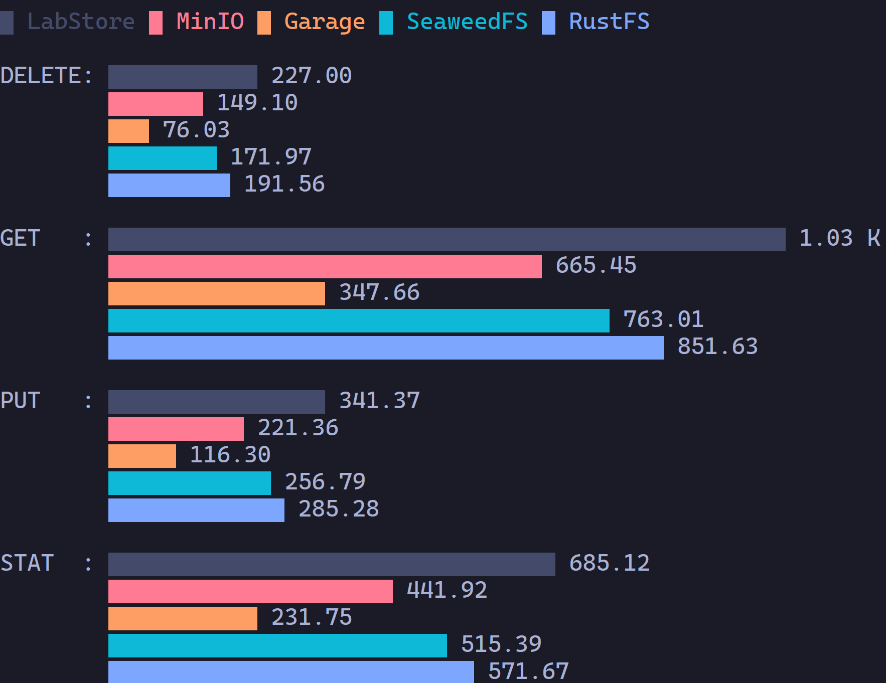
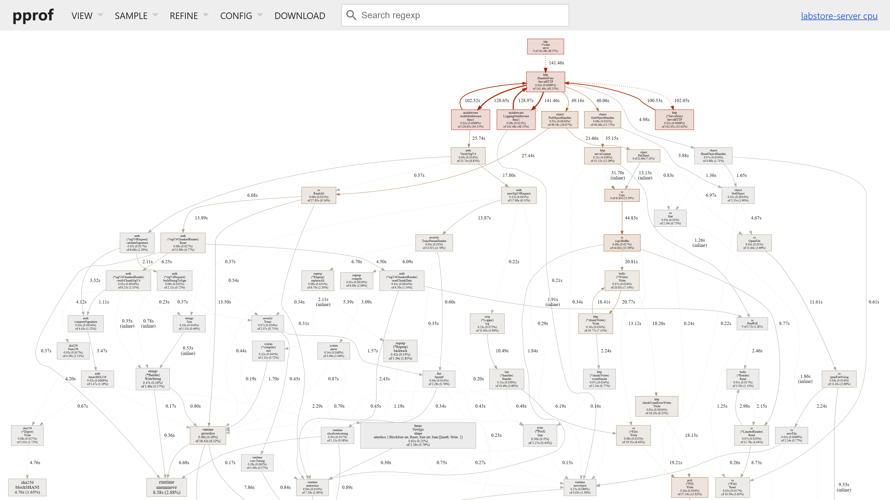
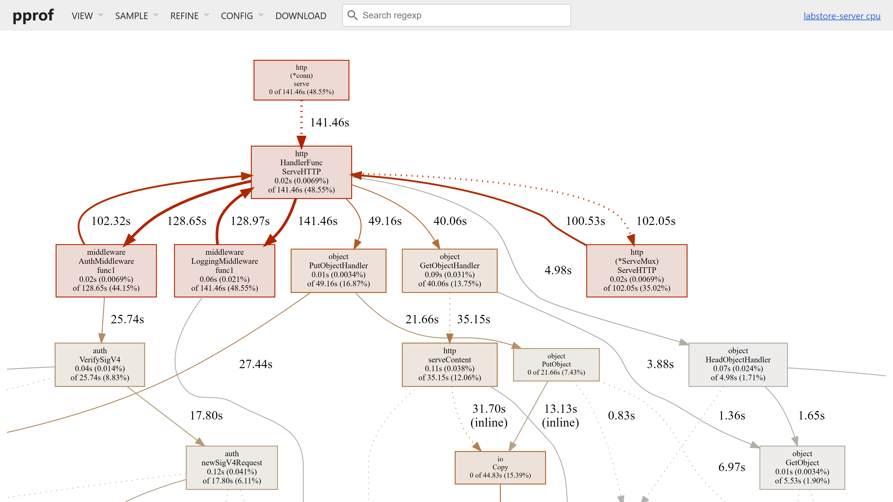

## Summary

Learn how to deploy multiple S3-compatible object stores, including LabStore, MinIO, Garage, SeaweedFS, and RustFS, using Docker Compose. Once the stack is running, you'll learn how to benchmark throughput using warp by MinIO. You'll also learn how to setup Go profiling, which we use in LabStore to help us identify bottlenecks and drive performance optimization. Everything is orchestrated with Just commands, split into two modules, infra for provisioning the Docker stack, and benchmark for running tests and analyzing throughput.

Follow this series with IllumiKnow Labs, and let's see where this journey takes us. Hopefully you'll learn a lot along the way!

<div style="position: relative; padding-bottom: 56.25%; height: 0; overflow: hidden; max-width: 100%;">
	<iframe
		src="https://www.youtube.com/embed/TBD"
		frameborder="0"
		allow="accelerometer; autoplay; clipboard-write; encrypted-media; gyroscope; picture-in-picture; web-share"
		referrerpolicy="strict-origin-when-cross-origin"
		allowfullscreen
		style="position: absolute; top: 0; left: 0; width: 100%; height: 100%;">
	></iframe>
</div>

## Open Source S3 Object Stores

### Deployment with Docker Compose

We selected the following S3-compatible object stores to benchmark alongside LabStore, just because these are the most discussed among the community:

- [MinIO](https://github.com/minio/minio/)
- [Garage](https://git.deuxfleurs.fr/Deuxfleurs/garage)
- [SeaweedFS](https://github.com/seaweedfs/seaweedfs)
- [RustFS](https://github.com/rustfs/rustfs)

We also considered [Ceph](https://ceph.com/en/) with [RADOS Gateway](https://docs.ceph.com/en/reef/radosgw/), but deployment was too costly in terms of time/effort, and it only really shines in a distributed scenario, which is not critical for us given the current stage of development for LabStore—we're still at the MVP stage (or even pre-MVP). We also considered including [Vitastor](https://github.com/vitalif/vitastor) and [Zenko CloudServer](https://github.com/scality/cloudserver), but these aren't as prevalent in online discussions, and we didn't set to do an exhaustive analysis anyway.

Below, we cover the setup basics for each store, as a Docker Compose service, as well as a few setup details.

#### LabStore

##### Dockerfile

For LabStore, we only require the backend to be running for our benchmark. We have a `Dockerfile.backend` under `infra/` that is split into two stages, one for building the Go project as a single binary, and another one to deploy the LabStore server.

For building the `labstore-server` binary, we use the Alpine-based `golang` image for the platform where we're building the Go project, given by `BUILDPLATFORM`. We take two arguments, `TARGETOS` and `TARGETACH` with the target operating system and architecture to build the binary for. We copy `go.mod` and `go.sum` to the working directory and download all dependencies with `go mod download`. Finally, we copy the code and compile the binary for the target platform.

```dockerfile
# =================
# Go builder
# =================

FROM --platform=$BUILDPLATFORM \
  golang:1.25-alpine3.22 AS builder

ARG TARGETOS
ARG TARGETARCH

WORKDIR /labstore/backend

COPY backend/go.mod backend/go.sum ./
RUN go mod download

COPY backend .

RUN GOOS=$TARGETOS GOARCH=$TARGETARCH go build \
  -o bin/labstore-server ./cmd/labstore-server
```

On the same `Dockerfile.backend`, we begin a second stage using Alpine, where we copy the binary from the previous `builder` stage. We create the appropriate `labstore` user and group, create a `/data` directory with the required ownership, that we exposed as a volume, switch to user `labstore` and set `labstore-server` as the entry point, making this usable in Docker Compose with any arguments that we'd like to use.

```dockerfile
# =================
# LabStore backend
# =================

FROM alpine:3.22

COPY --from=builder \
  /labstore/backend/bin/labstore-server \
  /usr/local/bin/labstore-server

RUN addgroup -S labstore \
  && adduser -S labstore -G labstore

RUN mkdir /data
RUN chown -R labstore:labstore /data

VOLUME /data

USER labstore

ENTRYPOINT ["labstore-server"]
```

##### Service

Then, on our Docker Compose project, defined under `infra/compose.yml`, we build the `infra/Dockerfile.backend` image from the root of the repo, loading the environment variables from the `labstore.yml` config file via `just` and `yq`.

```yaml
benchmark-labstore:
  profiles:
    - benchmark
  build:
    context: ..
    dockerfile: infra/Dockerfile.backend
  ports:
    - ${BENCHMARK_LABSTORE_PORT:-7789}:${LABSTORE_SERVER_PORT}
  networks:
    - benchmark
  volumes:
    - benchmark-labstore:/data
  environment:
    - LABSTORE_SERVER_HOST=${LABSTORE_SERVER_HOST}
    - LABSTORE_SERVER_PORT=${LABSTORE_SERVER_PORT}
    - LABSTORE_SERVER_ADMIN_ACCESS_KEY=${LABSTORE_SERVER_ADMIN_ACCESS_KEY}
    - LABSTORE_SERVER_ADMIN_SECRET_KEY=${LABSTORE_SERVER_ADMIN_SECRET_KEY}
  command: serve --storage-path /data
  restart: unless-stopped
```

We use the following environment variables:

- `BENCHMARK_LABSTORE_PORT`, which defaults to `6789`, but can be set to overwrite this.
- `LABSTORE_SERVER_HOST` should be set to a valid Docker network IP (i.e., not `localhost`), otherwise it won't be properly exposed (`0.0.0.0` is fine here).
- `LABSTORE_SERVER_PORT` sets the default exposed port, as well as the internal port for LabStore Server.
- `LABSTORE_SERVER_ADMIN_ACCESS_KEY` and `LABSTORE_SERVER_ADMIN_SECRET_KEY` set the user and password for admin.

Note that `LABSTORE_SERVER_STORAGE_PATH`, despite being available in our config, this is ignored for the Docker service, defaulting to `/data`, as set by `--storage-path`, and being exposed as a mountable volume instead.

#### MinIO

As there are no security dependencies for running a benchmark, we rely on the latest Docker image release for MinIO that was provided as a build by MinIO: `RELEASE.2025-09-07T16-13-09Z`. We use the default port `9000` to expose the S3-compatible API, and exposed the UI port as well, but this is not required for the benchmark.

```yaml
benchmark-minio:
  profiles:
    - benchmark
    - testing
  image: minio/minio:RELEASE.2025-09-07T16-13-09Z
  ports:
    - ${BENCHMARK_MINIO_PORT:-9000}:9000
    - 9001:9001
  networks:
    - benchmark
    - testing
  volumes:
    - benchmark-minio:/data
  environment:
    - MINIO_ROOT_USER=${BENCHMARK_STORE_ACCESS_KEY}
    - MINIO_ROOT_PASSWORD=${BENCHMARK_STORE_SECRET_KEY}
  command: server /data --console-address ":9001"
  healthcheck:
    test: [
      "CMD", "curl", "-f",
      "http://localhost:9000/minio/health/live"
    ]
    interval: 10s
    retries: 5
  restart: unless-stopped
```

We use the following environment variables:

- `BENCHMARK_MINIO_PORT` to optionally set a different port for MinIO.
- `BENCHMARK_STORE_ACCESS_KEY` and `BENCHMARK_STORE_SECRET_KEY` to set the user and password for admin.

#### Garage

##### Configuration

In order to make it easier to deploy on a remote Docker context, we also built a custom image to bundle the preconfigured `garage.toml`. The alternative would have been to manually copy over this file into the Docker host machine, so that we could mount it using Docker Compose. However, since our Docker VMs are to remain accessible only via the Docker API, this wasn't compatible with our home lab workflow, and so that option was discarded.

Our `garage.toml` looks like this:

```toml
metadata_dir = "/var/lib/garage/meta"
data_dir = "/var/lib/garage/data"
db_engine = "sqlite"
metadata_auto_snapshot_interval = "6h"

replication_factor = 1
compression_level = 2

rpc_bind_addr = "[::]:3901"
rpc_public_addr = "localhost:3901"
rpc_secret = "6864f83ced8f82b688eabfd49ce67687892776908e3f8d4714..."

[s3_api]
s3_region = "eu-west-1"
api_bind_addr = "[::]:3900"
root_domain = ".s3.domain.com"

[s3_web]
bind_addr = "[::]:3902"
root_domain = ".web.domain.com"
index = "index.html"

[admin]
api_bind_addr = "[::]:3903"
admin_token = "0p0Au4l6WWRCV9EUNd+cdEu1Sy+16ez2ZGrtWa0EZnQ="
metrics_token = "MNguY7hRyQ2sMdCSrfm8KCSKEKtLx+IjMwFsRvRh5gE="
```

Remember to keep the `rpc_secret`, as well as the `admin_token` and `metrics_token` safe for production environments. For our use case this is not relevant, as this deployment is purely for benchmarking.

We build a custom Docker image with this configuration, as follows:

```dockerfile
FROM dxflrs/garage:v2.1.0
COPY infra/garage.toml /etc/garage.toml
```

##### Compose Service

```yaml
benchmark-garage:
  profiles:
    - benchmark
  build:
    context: ..
    dockerfile: infra/Dockerfile.garage
  networks:
    - benchmark
  volumes:
    - benchmark-garage:/var/lib/garage
  ports:
    - ${BENCHMARK_GARAGE_PORT:-3900}:3900
    - 3901:3901
    - 3902:3903
    - 3903:3903
  restart: unless-stopped
```

We use the following environment variables:

- `BENCHMARK_GARAGE_PORT` to optionally set a different port for the Garage S3 API.

Notice we don't use `BENCHMARK_STORE_ACCESS_KEY` and `BENCHMARK_STORE_SECRET_KEY` here, as Garage doesn't support specifying credentials for an admin user.

##### Initialization

Like we said, Garage was the only S3-compatible object store, out of those that we tested, that did not provide an easy setup process for testing. As such, we were required to implement a `just` command named `garage-init` to take care of:

1. Layout setup (single node with enough space).
2. Access key creation (credentials for benchmarking).
3. Benchmark bucket creation (`warp-benchmark-bucket`).
4. Read/write permission granting.

Creating an access key on Garage doesn't let you specify the key ID or secret key, since this must be generated by Garage directly. Since we rely on shared credentials for the whole benchmark process (`BENCHMARK_STORE_ACCESS_KEY` and `BENCHMARK_STORE_SECRET_KEY`), we had to set up a separate benchmarking procedure for Garage.

Garage should definitely make it easier to setup their object store for testing, providing environment variables to configure an initial admin user, like the other object stores do, and granting it permissions to create buckets, as well as to read and write to all buckets by default.

You can find the working implementation for `just benchmark garage-init` over [here](https://github.com/IllumiKnowLabs/labstore/blob/91d9e1b0d3d5634950cc68ee430b761596828a44/benchmark/justfile#L60), but here's the basic workflow we're trying to reproduce (assume `garage` is in the `PATH` and this is the first run):

```bash
node_id=$(garage status 2>/dev/null \
	| tail -n1 | awk '{print $1}')

garage layout assign $node_id \
	--capacity 5G -z "eu-west-1"
garage layout apply --version 1

create_key_output=$(garage key create admin 2>/dev/null)

store_access_key=$(printf "%s\n" "$create_key_output" \
	| grep "Key ID:" | awk '{print $3}')

store_secret_key=$(printf "%s\n" "$create_key_output" \
	| grep "Secret key:" | awk '{print $3}')

garage bucket create "warp-benchmark-bucket"

garage bucket allow --read --write --owner \
	"warp-benchmark-bucket" --key "$store_access_key"
```

Once the initialization is done, we use a separate `just` command named `garage` that is similar to the remaining benchmarking commands, but uses the created credentials (`store_access_key` and `store_secret_key`) instead of the shared credentials set globally for the whole benchmark process. We'll describe the benchmarking approach in the next major section.

#### SeadweedFS

Unlike Garage, SeaweedFS offers a single convenience `server` command that takes care of starting the `master`, `volume`, `filer` and `s3` gateway servers, the latter only when `-s3` is specified. At first, we were setting up separate compose services for each of these components, which is also an option for a proper production setup, but we ended up following the easier route, once we found the `server` command.

This is how we setup the compose service, which will expose the S3 API on port `8333` (we ignore the remaining ports during benchmarking):

```yaml
benchmark-seaweedfs:
  profiles:
    - benchmark
  image: chrislusf/seaweedfs:4.00
  networks:
    - benchmark
  volumes:
    - benchmark-seaweedfs:/data
  ports:
    - 9333:9333
    - 8080:8080
    - 8888:8888
    - ${BENCHMARK_SEAWEEDFS_PORT:-8333}:8333
  environment:
    - AWS_ACCESS_KEY_ID=${BENCHMARK_STORE_ACCESS_KEY}
    - AWS_SECRET_ACCESS_KEY=${BENCHMARK_STORE_SECRET_KEY}
  command: server -dir=/data -s3 -s3.port=8333
  restart: unless-stopped
```

We use the following environment variables:

- `BENCHMARK_SEAWEEDFS_PORT` to optionally set a different port for the SeaweedFS S3 API.
- `BENCHMARK_STORE_ACCESS_KEY` and `BENCHMARK_STORE_SECRET_KEY` to set the user and password for admin.

#### RustFS

For RustFS we hit a snag, where we had to switch the CPU type to `host` on the Proxmox Docker VM, otherwise it would complain about not finding `SSE4.1` and `PCLMULQDQ`. The CPU type we were using before was a preset called `x86-64-v2-AES` that did list `SSE4.1`, but not `PCLMULQDQ`. The Docker VM had to be rebooted to apply the changes and enable the new CPU type, but we also had to destroy and recreate the RustFS service for it to stop complaining about the missing CPU features.

While using the appropriate CPU flags for optimization is ideal—and, in all fairness, these have been around for over 15 years now—RustFS might benefit from proper runtime checks, as the Docker image shouldn't fail to run as long as the architecture matches.

Either way, once this was fixed, we deployed RustFS as follows, exposing port 9000 as 10000 to avoid colliding with MinIO (we ignored the UI port 10001 during benchmarking):

```yaml
benchmark-rustfs:
  profiles:
    - benchmark
  image: rustfs/rustfs:1.0.0-alpha.69
  ports:
    - ${BENCHMARK_RUSTFS_PORT:-10000}:9000
    - 10001:9001
  networks:
    - benchmark
  volumes:
    - benchmark-rustfs:/data
  environment:
    - RUSTFS_ACCESS_KEY=${BENCHMARK_STORE_ACCESS_KEY}
    - RUSTFS_SECRET_KEY=${BENCHMARK_STORE_SECRET_KEY}
    - RUSTFS_CONSOLE_ENABLE=true
  restart: unless-stopped
```

We use the following environment variables:

- `BENCHMARK_RUSTFS_PORT` to optionally set a different port for the RustFS.
- `BENCHMARK_STORE_ACCESS_KEY` and `BENCHMARK_STORE_SECRET_KEY` to set the user and password for admin.

### Benchmarking with Warp

Benchmarking was implemented using [warp](https://github.com/minio/warp), by MinIO, and results analyzed using [DuckDB](https://duckdb.org/), with everything orchestrated using [just](https://just.systems/). We created a top-level project under `benchmark/` inside our [LabStore](https://github.com/IllumiKnowLabs/labstore) monorepo (see the `release/backend/v0.1.0` branch, if unreleased). All infrastructure was deployed on a remote Docker host running inside a Proxmox VM with 2 vCPUs, 10 GiB of RAM, and 1 Gbps Ethernet.

#### Just Commands

In order to run the benchmark process, we first need to ensure we have deployed the required infrastructure using Docker, by running `just infra benchmark-up` from the root of the repo. This will provision the Docker Compose services described in the previous sections.

Then, from the root of the repo, running `just benchmark all` will trigger the benchmark process. This will measure the available bandwidth using `iperf3`, via the `bandwidth` command, and then run the benchmark for LabStore, MinIO, Garage, SeaweedFS, and RustFS, in this order, via the `stores` command. Both `bandwidth` and `stores` will produce several JSON output files that we then process using DuckDB via the `analysis` command. The output will be the ranking tables for `DELETE`, `GET`, `PUT`, and `STAT` requests, as we run `warp` in `mixed` mode, followed by a `termgraph` plot, both based on the median objects per second, processed for each request.

#### Results

Here are the results, depicting the median for processed objects per second for each operation.



As we can see, LabStore is ranked first for all four operations, but please read on for a more critical insight. Below, we provide a more detailed view, including median bandwidth in MiB/s and percentages of bandwidth used. Please note that an operation is randomly picked during benchmarking, with the following assigned probabilities:

- DELETE: 10%
- GET: 45%
- PUT: 15%
- STAT: 30%

As such, there might not be enough requests of a given type to exhaust the available bandwidth. Nevertheless, this is helpful for understanding efficiency and ranking the object stores. Regardless, in the tables below, we use Median Objects per Second for ranking, as bandwidth is not always available.

##### DELETE

| Rank | Store     | Median Objects per Second | Median MebiBytes per Second | Bandwidth Usage Percentage |
| ---: | --------- | ------------------------: | --------------------------: | -------------------------: |
|    1 | LabStore  |                    227.00 |                        0.00 |                      0.00% |
|    2 | RustFS    |                    191.56 |                        0.00 |                      0.00% |
|    3 | SeaweedFS |                    171.97 |                        0.00 |                      0.00% |
|    4 | MinIO     |                     149.1 |                        0.00 |                      0.00% |
|    5 | Garage    |                     76.03 |                        0.00 |                      0.00% |

##### GET

| Rank | Store     | Median Objects per Second | Median MebiBytes per Second | Bandwidth Usage Percentage |
| ---: | --------- | ------------------------: | --------------------------: | -------------------------: |
|    1 | LabStore  |                   1028.76 |                      100.46 |                     89.52% |
|    2 | RustFS    |                    851.63 |                       83.17 |                     74.11% |
|    3 | SeaweedFS |                    763.01 |                       74.51 |                     66.40% |
|    4 | MinIO     |                    665.45 |                       64.99 |                     57.91% |
|    5 | Garage    |                    347.66 |                       33.95 |                     30.25% |

##### PUT

| Rank | Store     | Median Objects per Second | Median MebiBytes per Second | Bandwidth Usage Percentage |
| ---: | --------- | ------------------------: | --------------------------: | -------------------------: |
|    1 | LabStore  |                    341.37 |                       33.34 |                     29.68% |
|    2 | RustFS    |                    285.28 |                       27.86 |                     24.80% |
|    3 | SeaweedFS |                    256.79 |                       25.08 |                     22.32% |
|    4 | MinIO     |                    221.36 |                       21.62 |                     19.24% |
|    5 | Garage    |                     116.3 |                       11.36 |                     10.11% |

##### STAT

| Rank | Store     | Median Objects per Second | Median MebiBytes per Second | Bandwidth Usage Percentage |
| ---: | --------- | ------------------------: | --------------------------: | -------------------------: |
|    1 | LabStore  |                    685.12 |                        0.00 |                      0.00% |
|    2 | RustFS    |                    571.67 |                        0.00 |                      0.00% |
|    3 | SeaweedFS |                    515.39 |                        0.00 |                      0.00% |
|    4 | MinIO     |                    441.92 |                        0.00 |                      0.00% |
|    5 | Garage    |                    231.75 |                        0.00 |                      0.00% |

#### Final Results

As we can see, the rankings for all operations are in agreement, positioning the object stores as follows, in terms of single node/drive performance, under Docker:

1. LabStore
2. RustFS
3. SeaweedFS
4. MinIO
5. Garage

##### LabStore's Performance

Wait, did LabStore, an object store written in Go, just beat RustFS?! Well... Let's be fair. A few notes on this to follow.

First of all, with LabStore, we're still early days. This means that, feature-wise, we aren't nearly as complete as the competition, which might explain why we blasted through the rankings to first place. Keep in mind that most of the other object stores in the benchmark implement a lot more features than we do, which will surely add some overhead. For example, handling permissions and policies will require some sort of database to be queried, as well as proper security, so maybe next week RustFS will have us beat, when we add a basic IAM layer.

Regardless, this is a pretty sweet start to the project, and it shows that Go can compete with Rust, definitely beat it in development flow—debugging, compilation time, etc. At this stage, I'm looking back less and less, having decided to pick Go as the language for this project.

## Profiling in Go

It's fairly easy to setup profiling in Go, using `pprof`, as this is provided as part of the Go tooling, via `go tool pprof`.

The required steps were the following:

1. Add profiling support to LabStore, enabling it through a CLI flag (we use `--pprof`).
2. Launch `labstore-server` with profiling enabled, and run `go tool pprof` for our module, to capture data over 60 seconds, and expose the results via a web ui on port 8081.
3. Simultaneously trigger the benchmark, right after `pprof` is launched, to simulate service load.

Once the benchmark runs, we are able to explore the corresponding profiling results, to help us identify the time spent on each part of our code. A profiler is a tool as fundamental as a debugger, when performance matters (e.g., web services, databases, search engines, etc.).

Below we detail each of the previous three steps, showing the output from `pprof`, after running `warp` in mixed mode for benchmarking.

### In-Code Profiler Support

The profiler is started using a goroutine that is a part of our code. The following snippet illustrates the main code that enables profiling in Go using `pprof`:

```go
import (
	_ "net/http/pprof"
)

func (profiler *Profiler) Start() {
	slog.Info("starting pprof profiler", "port", profiler.Port)

	go func() {
		addr := fmt.Sprintf("%s:%d", profiler.Host, profiler.Port)
		fmt.Printf("🕵️‍♂️ Profiler listening on http://%s\n", addr)
		log.Fatal(http.ListenAndServe(addr, nil))
	}()
}
```

You can find the full code to instance and start a profiler in LabStore [here](https://github.com/IllumiKnowLabs/labstore/blob/91d9e1b0d3d5634950cc68ee430b761596828a44/backend/internal/profiler/profiler.go).

That code is run from the root command in `labstore-server`, whenever the `--pprof` flag is set, based on the following block of code:

```go
run_pprof := helper.Must(cmd.Flags().GetBool("pprof"))

if run_pprof {
	pprof_host := helper.Must(cmd.Flags().GetString("pprof-host"))
	pprof_port := helper.Must(cmd.Flags().GetInt("pprof-port"))

	pprof := profiler.NewProfiler(
		profiler.WithHost(pprof_host),
		profiler.WithPort(pprof_port),
	)

	pprof.Start()
}
```

You can find the full code for the `labstore-server` root command [here](https://github.com/IllumiKnowLabs/labstore/blob/91d9e1b0d3d5634950cc68ee430b761596828a44/backend/cmd/labstore-server/root.go#L31).

### Running App with Profiling

In order to run the profiler, we need to launch the following two commands.

First, we run `labstore-server serve`, passing it the `--pprof` flag so that the goroutine opens a secondary profiling service, exposed on port 6060 by default, while LabStore will run on port 6789 by default as usual:

```bash
bin/labstore-server --pprof serve
```

Then, we run `go tool pprof`, pointing it to the module that we want to focus on (our backend), setting the web ui port to 8081—this will open automatically once data capturing ends—and pointing it to the `pprof` service that we implemented on LabStore as described above—the query parameter `seconds` will determine how long the profiler will capture data before opening the web ui to display the results:

```bash
go tool pprof \
	-focus=github.com/IllumiKnowLabs/labstore/backend \
	-http=:8081 \
	http://localhost:6060/debug/pprof/profile?seconds=60
```

In LabStore, we conveniently implement this process as a single `Makefile` target:

```makefile
profile: backend
	npx concurrently \
		-n backend,pprof \
		-c blue,red \
		"$(BACKEND_CMD) --pprof serve" \
		"go tool pprof \
			-focus=github.com/IllumiKnowLabs/labstore/backend \
			-http=:8081 \
			http://localhost:6060/debug/pprof/profile?seconds=60"
```

This relies on the [concurrently](https://www.npmjs.com/package/concurrently) CLI tool (via npm) to run LabStore's backend with profiling enabled, in parallel with Go's built-in `pprof` tool to capture and inspect performance data.

So we can simply run the profiler for 60 seconds with:

```bash
make profile
```


### Triggering the Benchmark

Once the profiler is running, we have 60 seconds to run whatever operation we want to analyze. A good default is to just trigger our benchmark, with:

```bash
just benchmark store labstore
```


You should see the access log for LabStore rapidly scrolling with `DELETE`, `GET`, `PUT`, and `HEAD` (`STAT`) requests, from within the terminal where you ran `make profile`:


### Inspecting Results

Once the 60 seconds are up, the web ui for `pprof` should open automatically in your browser, on the specified port 8081, displaying the graph view by default:



This will display a node per function in your app, with arrows representing function calls and the total time spent in the subroutine. Each node is annotated with the package and function name, alongside the flat time spent directly inside that function (excluding subroutines), as well as the cumulative time spent in the function (including subroutines). For example, in our case, we see that we spend a lot of time in `LoggingMiddleware` and `AuthMiddleware`, and that the `PutObjectHandler` is slightly less efficient than the `GetObjectHandler`.



However, a better way to understand how time is spent per function is perhaps the flame graph view, which we can access from the `VIEW` dropdown menu:


This view will clarify why the middleware was using so much time, as it becomes clearer that, despite `LoggingMiddleware` making a few calls to `slog.Info`, and `AuthMiddleware` spending some time running `auth.VerifiySigV4`, most of the time spent in both middleware routines is used in request handlers, `PutObjectHandler`, `GetObjectHandler`, `DeleteObjectHandler`, and `HeadObjectHandler`, in this order. However, it is also clear that a major slice of time is spent authenticating with SigV4, as well as in logging—in total, both take more time than either `DELETE` or `HEAD` requests together.


And we can keep drilling down into each function by clicking the corresponding node. For example, we might look at `GetObjectHandler` in more detail:


Or try to understand why `auth.VerifySigV4` is using so much time to run:


Or do the same for `slog.Info`:


And we can click the `root` node at the top, to go back to the original view.

By looking at the three drilldown views above, it becomes clear that:

- `GetObjectHandler` is spending most of its time with I/O operations, which likely represent a hardware bottleneck rather than a design limitation, so there's little we can do here, other than increasing our bandwidth or disk I/O speed, which are not the code-centric solutions, so there's little to improve here, performance wise.
- `auth.VerifySigV4`, on the other hand, is spending way too much time on `security.TruncParamHeader`, which is a utility function to mask secrets in HTTP headers, currently used just for logging at a `DEBUG` level. As such, this can definitely be improved by lazily calling this function only when the logger is required to run! 💡
- `slog.Info` is spending most of its time with the log handler, specifically writing to the standard output. We might tackle this through async logging, or by using a different handler that is more efficient out-of-the-box. Also, we'll need to test how much overhead the [tint](https://pkg.go.dev/github.com/lmittmann/tint) handler is introducing, and maybe just say goodbye to coloring, or at least make it optional.

Whatever the approach is to fixing performance, at least now we know our bottlenecks, and we're not driving blindly anymore! Remember that the simple act of running a profiler might help you identify several easy-to-fix bottlenecks that you can mitigate with little to no cost in terms development time, so always, ALWAYS have a profiler ready to go.
