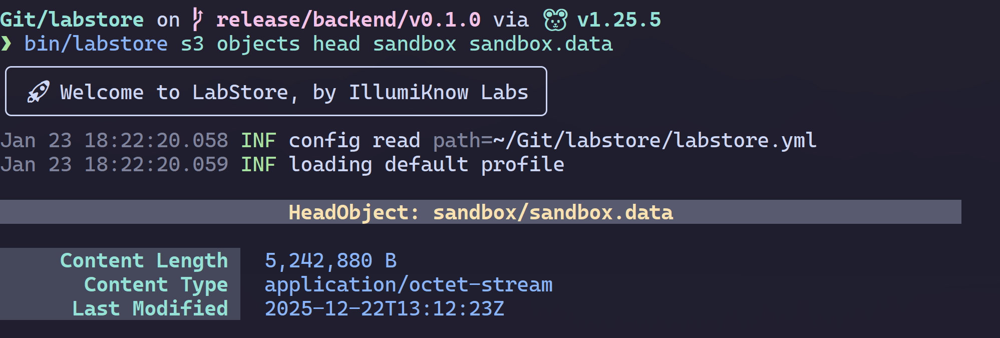

## Summary

Learn how to build a CLI for your monorepo, with [cobra](https://cobra.dev/) and the [charm stack](https://charm.land/libs/). With this blog post and video, you will easily learn the basics—and beyond—on how to use `cobra` for building a CLI, from persistent pre runs that propagate, to command annotations for custom control, or handling your own errors manually. We'll also teach you how to manage multiple services, on separate ports, within a single `serve` command, how to manage client-side credentials easily, and how to design a basic TUI, including color palettes and styling with [lipgloss](https://github.com/charmbracelet/lipgloss), as well as custom components with [bubbletea](https://github.com/charmbracelet/bubbletea). Finally, you'll learn how easy it is to embed a static site into a Go binary so that you can serve your own web UI. One binary to rule them all!

Follow this series with IllumiKnow Labs, and let's see where this journey takes us. Hopefully you'll learn a lot along the way!

<div style="position: relative; padding-bottom: 56.25%; height: 0; overflow: hidden; max-width: 100%;">
	<iframe
		src="https://www.youtube.com/embed/fvjtAzvGVGI"
		frameborder="0"
		allow="accelerometer; autoplay; clipboard-write; encrypted-media; gyroscope; picture-in-picture; web-share"
		referrerpolicy="strict-origin-when-cross-origin"
		allowfullscreen
		style="position: absolute; top: 0; left: 0; width: 100%; height: 100%;">
	></iframe>
</div>

## Taming the CLI

Creating a command line interface is not, by itself, a hard task. And it's not any different with Go. In fact, this is quite straightforward when using [Cobra](https://cobra.dev/).

In this blog post, we describe our approach to accommodating the CLI for LabStore:

- Changes to the codebase, including to the CI workflow;
- Basics of Cobra for CLI design;
- How to cleanly manage multiple HTTP services in a single `serve` command;
- How generics and type constraints helped simplify a few CLI display tasks;
- The new `credentials.yaml` file, meant for direct user editing;
- A light introduction to TUI design, focusing on styling and the progress bar component;
- File embedding in Go, and how to serve a web UI as a static site, directly from Go, via `http.FileServer`.

## Changes to the Codebase

### Centralizing Commands

We started from two main Go projects, `backend` and `cli`, we well as a secondary `shared` directory to drop any additional subprojects, required by other projects in our monorepo. Our `backend` project already provided its own `cmd/labstore-server` implemented in Cobra, but it quickly became clear that this should be centralized in `cli`. Initially, we were considering importing `cmd/labstore-server/serve.go` directly from `cli`, but this would essentially make the `labstore-server` binary irrelevant, so we opted to move all commands into `cli`.

We dropped `backend/cmd/labstore-server` and consolidated its commands into `cli/cmd/labstore` instead, thus turning `backend` into a library, which we renamed to `server`, for clarity.

We also started a new `client` project, a library to handle S3 and IAM requests. At first, we dropped it into `shared/client`, but we quickly realized this should be a top-level project, so it now lives in the root of the repo as `client`.

Finally, because we had to reuse a lot of code from `server` (or, previously, `backend`), we ended up having to do some refactoring, so that this could be exposed under `server/pkg`. This included types and errors, as well as most of the authentication logic and other common components, like logging or helpers. In the future, we'll most likely refactor some of these into subprojects, under `shared`, as well as split the `helpers` into semantically clearer packages.

For now, this is what we expose from `server`:

```
server/pkg/
├── auth
├── config
├── constants
├── errs
├── helper
├── iam
├── logger
├── profiler
├── router
├── security
└── types
```

### Using `go work` for Development

Our individual projects—`server`, `client`, and `cli`—all have their own `go.mod`—but we don't use a common `go.mod` at the repo root, and we also do not release each project individually. This is perhaps adding needless complexity, and something to revise later. Regardless, we needed a way for projects to import from each other.

The legacy approach was to use `replace` inside each `go.mod` file, like so:

```
module github.com/IllumiKnowLabs/labstore/cli

go 1.25.5

require (
    github.com/IllumiKnowLabs/labstore/server v0.0.0
)

replace github.com/IllumiKnowLabs/labstore/server => ../server
```

However, there is a cleaner, more modern approach, using `go.work`. In the repo root, run:

```bash
go work init ./server ./client ./cli
go work sync
```

If you need to add another project later, you can use something like:

```bash
go work use ./share/logging
go work sync
```

Running `go work sync` will produce a `go.work.sum`, ensuring that workspace dependencies are consistent across all projects. Both files can be committed to your repo to ensure reproducibility, as well as for CI workflows.

### Building and CI

#### Linting with Pre-Commit

Since we moved to a monorepo with cross-project dependencies, we also had to update our CI workflows, making sure that our GitHub Actions for linting and testing still worked as expected.

Since we now have three projects for linting, we updated our `.pre-commit-config.yaml` as follows:

```yaml
repos:
  - repo: https://github.com/golangci/golangci-lint
    rev: v2.6.2
    hooks:
      - id: golangci-lint
        name: golangci-lint (server)
		files: ^server/
        entry: bash -c 'golangci-lint run ./server/...'
        language: system
        pass_filenames: false
      - id: golangci-lint
        name: golangci-lint (client)
		files: ^client/
        entry: bash -c 'golangci-lint run ./client/...'
        language: system
        pass_filenames: false
      - id: golangci-lint
        name: golangci-lint (cli)
		files: ^cli/
        entry: bash -c 'golangci-lint run ./cli/...'
        language: system
        pass_filenames: false
```

We use three similar `golangci-lint` entries (one per project), where we dropped `types: [go]`, replacing it with `pass_filenames: false`, as we explicitly pass the file arguments to the linter. Here, we simply use the same prefixes as the ones defined for `go.work`. For example, `./server/...` will cover all Go files under the `server` project.

If we, instead, tried to use a single entry with `./...`, then we would get the following error:

```
ERRO [linters_context] typechecking error: pattern ./...: directory prefix . does not contain modules listed in go.work or their selected dependencies
0 issues.
```

When using `go.work`, make sure that linting is done for each individual module directory.

#### GitHub Actions

We defined two workflows, one for linting, where we call `pre-commit`, and another one for testing, where we call `go test -v` for each module.

Both `lint.yml` and `test.yml`, which exist under `.github/workflows`, call a common composite action defined under `.github/actions/setup`, which will setup `go` and `node`, and build the `web` project, copying `web/build` to `server/pkg/router/assets`, where it lives, to be embedded during `server` building.

This is how the `jobs` entry for `lint.yml` looks like:

```yaml
jobs:
  pre-commit:
    runs-on: ubuntu-latest
    steps:
      - uses: actions/checkout@v6

      - name: setup
        uses: ./.github/actions/setup

      - name: golangci-lint
        uses: golangci/golangci-lint-action@v9
        with:
          version: v2.8
          install-only: true

      - name: run pre-commit
        uses: pre-commit/action@v3.0.1
        with:
          extra_args: --all-files
```

We install `golangci-lint` without running it (`install-only: true`) and then we call `pre-commit` to run it. This way, we share the same linting code for CI and `git commit`.

This is how the `jobs` entry for `test.yml` looks like:

```yaml
jobs:
  go-tests:
    runs-on: ubuntu-latest
    steps:
      - uses: actions/checkout@v6

      - name: setup
        uses: ./.github/actions/setup

      - name: go test (server)
        run: go test -v ./server/...

      - name: go test (client)
        run: go test -v ./client/...

      - name: go test (cli)
        run: go test -v ./cli/...
```

In here, we have to make sure we reference the modules defined in `go.work`, so we wouldn't be able to run `go test -v ./...` from the repo root.

#### Makefile

Finally, we had to adapt our `Makefile` to make sure our `cli` project was the only Go project being built, and that it depended on `web`. We also had to sync the static site files built for `web` with the `assets` directory on our `server` module.

These are the relevant targets to achieve what we just described:

```makefile
$(BIN_DIR):
	mkdir -p $(BIN_DIR)

WEB_SRCS := $(shell find $(WEB_SRC_DIRS) -type f)

$(WEB_BUILD_DIR): $(WEB_SRCS)
	cd $(WEB_DIR) && npm ci
	cd $(WEB_DIR) && npm run build

ASSETS_SRCS := $(shell find $(WEB_BUILD_DIR) -type f)

$(ASSETS_DIR): $(ASSETS_SRCS)
	rsync -a --delete web/build/ $(ASSETS_DIR)/

CLI_SRCS = $(shell find $(CLI_DIR) $(SERVER_DIR) $(CLIENT_DIR) -name '*.go')

$(CLI_CMD): $(CLI_SRCS) | $(BIN_DIR)
	cd $(CLI_DIR) && go build -o ../$(CLI_CMD) ./cmd/labstore

assets: web $(ASSETS_DIR)

cli: assets $(CLI_CMD)

web: $(WEB_BUILD_DIR)

build: cli
```

Running `make` will result in the targets `web`, `assets`, and `cli` being run, building the node project, rsyncing the output to the `assets` directory under `server`, and building `cli/cmd/labstore` .

## Using Cobra to Produce Commands

The entry point for the [Cobra](https://github.com/spf13/cobra) library is a root command. Commands can receive a context, and handle a return `error`. We take advantage of both options. This how our `main` package looks like under `cli/cmd/labstore`.

First, we enable the option to run all persistent pre-run and post-run from parents, as opposed to simply overriding them:

```go
func init() {
	cobra.EnableTraverseRunHooks = true
}
```

This means that anything defined on a persistent pre-run will always be run downstream.

Then, we create a root command using our own `NewRootCmd()`, and pass it a context that captures interrupt signals. This will help us control user interruptions, i.e., `ctrl+c` or `SIGINT`:

```go
func main() {
	rootCmd := NewRootCmd()

	ctx, stop := signal.NotifyContext(
		context.Background(),
		os.Interrupt,
	)
	defer stop()

	if err := rootCmd.ExecuteContext(ctx); err != nil {
		// ...
	}
}
```

We handle errors manually, so we set the following options for the root command:

```go
cmd.SilenceErrors = true
cmd.SilenceUsage = true
```

We then detect `errs.RuntimeError`, which we use to signal that an error has already been handled upstream, and only print the error and usage for any other errors (default behavior):

```go
func main() {
	// ...

	if err := rootCmd.ExecuteContext(ctx); err != nil {
		var runtimeError *errs.RuntimeError
		if errors.As(err, &runtimeError) {
			os.Exit(2)
		}

		cmd, _, cmdErr := rootCmd.Find(os.Args[1:])
		if cmdErr == nil {
			cmd.PrintErrln(err)
			helper.CheckFatal(cmd.Usage())
			os.Exit(1)
		}
	}
}
```

### Root Command

Our root command is defined in the `NewRootCmd()` constructor. First, we create a `*cobra.Command` instance:

```go
var cmd = &cobra.Command{
	Use:   strings.ToLower(constants.Name),
	Short: fmt.Sprintf("%s, by %s", constants.Name,
		constants.Author),
	Long:  fmt.Sprintf("%s - %s, by %s", constants.Name,
		constants.Description, constants.Author),

	PersistentPreRun: func(cmd *cobra.Command, args []string) {
		baseCmd := topLevelCommand(cmd)
		if baseCmd.Name() == "completion" {
			return
		}

		if cmd.Annotations["show-default-secret"] == "yes" {
			config.DisplayDefaultAdminSecretKey = true
		}

		if cmd.Annotations["mode"] == "daemon" {
			slog.SetDefault(slog.New(
				slog.NewTextHandler(io.Discard, nil)))
			config.Load(cmd)
			return
		}

		bootstrap(cmd)
	},
}
```

Here, `Use` will represent the command name (`labstore` for the root command, same as the binary name).

### Positional Arguments

For subcommands, `Use` can also contain the expected positional arguments, e.g. `labstore iam users create` requires a `USERNAME`:

```go
func NewUsersCreateCmd() *cobra.Command {
	var cmd = &cobra.Command{
		Use:   "create USERNAME",
		Short: "Create an IAM user",
		Args:  cobra.MinimumNArgs(1),
		RunE: func(cmd *cobra.Command, args []string) error {
			handler := cmd.Context().Value(handlerKeyCtx).(*handlers.IAMHandler)
			return handler.CreateUser(args[0])
		},
	}

	return cmd
}
```

Notice that `Args` is set to `cobra.MinimumNArgs(1)`, to ensure `USERNAME` will be set.

We also set a `Short` description, displayed when listing commands, and we can set an optional `Long` description, if we want to display further details when showing the help for that specific command.

### Run Hooks

Then, we can make use of several run methods:

- `PersistentPreRun` / `PersistentPreRunE`
- `PreRun` / `PreRunE`
- `Run` / `RunE`
- `PostRun` / `PostRunE`
- `PersistentPostRun` / `PersistentPostRunE`

For the persistent variants, depending on whether `cobra.EnableTraverseRunHooks` is `true` or `false`, we'll get different behaviors. For `true`, persistent hooks will trigger in-order from outer to inner level (pre) or from inner to outer level (post). For `false`, the inner-most definition will take precedence, in overridable fashion.

For the `E` suffix variants, our function must return `error`. This is automatically handled by Cobra, although, like we stated above, we disabled this default behavior and handled it ourselves.

### Annotations

We can also find a few annotation checks. Each command can store a `map[string]string` containing app-specific metadata to help handle the flow. For example, our `serve` command is configured as follows, with the `show-default-secret` annotation:

```go
var cmd = &cobra.Command{
	Use:   "serve",
	Short: "Run server",
	Long:  "Run server for S3, IAM, and admin services",
	Run: func(cmd *cobra.Command, args []string) {
		adminPass := cmd.Flags().Lookup("admin-pass")
		if adminPass != nil && adminPass.Changed {
			slog.Warn("setting admin pass via the command line is insecure")
		}

		router.Start()
	},
	Annotations: map[string]string{
		"show-default-secret": "yes",
	},
}
```

This annotation is then handled on our root command, determining whether to display a default admin secret key, when it hasn't been specified by the user elsewhere on the config (this will be handled internally by the `config` package):

```go
if cmd.Annotations["show-default-secret"] == "yes" {
	config.DisplayDefaultAdminSecretKey = true
}
```

### Flags and Subcommands

Once the `cmd` is instanced in the `NewRootCmd()` constructor, then we can add flags or persistent flags (i.e., common to all subcommands), as well as the subcommands, each having a similar constructor:

```go
cmd.SilenceErrors = true
cmd.SilenceUsage = true

cmd.PersistentFlags().Bool("debug", false, "Set debug level for logging")
cmd.PersistentFlags().Bool("pprof", false, "Enable profiler")
cmd.PersistentFlags().String("pprof-host", "localhost", "Profiler host")
cmd.PersistentFlags().Int("pprof-port", 6060, "Profiler port")

cmd.AddCommand(NewServeCmd())
cmd.AddCommand(NewS3Cmd())
cmd.AddCommand(NewIAMCmd())
cmd.AddCommand(NewAdminCmd())
cmd.AddCommand(NewTUICmd())
AddDaemonCommands(cmd)
```

### Help Message

This is what running the `labstore` command without any options will print:

```
LabStore - An S3-Compatible Object Store, by IllumiKnow Labs

Usage:
  labstore [command]

Available Commands:
  admin       Admin client
  completion  Generate the autocompletion script for the specified shell
  help        Help about any command
  iam         IAM client, designed for learning
  restart     Restart LabStore server
  s3          S3 client, designed for learning
  serve       Run server
  start       Start LabStore server
  status      Check if LabStore server is running
  stop        Stop LabStore server
  tui         TUI and helper commands

Flags:
      --debug               Set debug level for logging
  -h, --help                help for labstore
      --pprof               Enable profiler
      --pprof-host string   Profiler host (default "localhost")
      --pprof-port int      Profiler port (default 6060)

Use "labstore [command] --help" for more information about a command.
```

Here's a semantically organized listing of the supported commands as well—something that would be nice do in Cobra as well, without having to create subcommands, for improved readability, like `just` does with groups:

- **Server**
	- `server` – used to start the services for the LabStore server (admin, S3, IAM, and web UI).
- **Clients**
	- `admin` – admin service client (does nothing at this time).
	- `iam` – IAM client designed for learning, not usability (maps one-to-one to the IAM service implementation).
	- `s3` – S3 client designed for learning, not usability (maps one-to-one to the S3 service implementation).
- **Daemon** – convenience commands for a better UX when testing LabStore, so you can manage the server without having to deploy our Docker container, or setup your own systemd service.
	- `start`
	- `stop`
	- `restart`
	- `status`
- **Helpers**
	- `tui palette` – as of now, it displays the color scheme for our palette and, in the future, its parent command will be the home for our TUI as well.
	- `completion` – automatic shell completion scripts provided by Cobra (supports bash, zsh, fish, and PowerShell).
	- `help` – go-style help and usage messages.

### Shell Autocompletion

As shown in the help, in the future, after you `go install` LabStore, you'll also be able to setup autocompletion for your shell. For example, for fish, you just add this to your `~/.config/fish/config.fish`:

```fish
labstore completion fish | source -
```

With `cobra`, you get autocompletion for your CLI, out-of-the-box, at a zero-cost.

## Managing Multiple HTTP Services

When we run `labstore serve`, we start multiple `http.Server` instances concurrently using goroutines. In order to manage this, we define the following type:

```go
type ServerDescriptor struct {
	Name    string
	Server  *http.Server
	Healthy atomic.Bool
}
```

The `Name` (e.g., S3-Compatible API, or IAM) will be used to display a message letting the user know where to connect for each service:

```
🌐 S3-Compatible API listening on http://0.0.0.0:6789
🌐 IAM listening on http://0.0.0.0:6788
🌐 Web UI listening on http://0.0.0.0:6790
🌐 Admin API listening on http://0.0.0.0:6787
```

The URL will be extracted from `Server.Addr`. Once the server is started, its `Healthy` status will be set to `true`. This will be monitored by our admin service, which will return `HTTP 200 (OK)` when all services are healthy, or `HTTP 503 (Service Unavailable)` when any of the S3, IAM, or Web UI services are down.

We instance each service using values from config, e.g.:

```go
webServerDescriptor := NewWebServerDescriptor(
	config.App.Web.Address.Host,
	config.App.Web.Address.Port,
)
```

We then handle the lifecycle under `router.Start()` as follows:

```go
var wg sync.WaitGroup
errCh := make(chan error, len(serverDescriptors))

for _, sd := range serverDescriptors {
	wg.Add(1)
	go runServer(sd, &wg, errCh)
	sd.Healthy.Store(true)
}

go shutdownServers(ctx, serverDescriptors)
go waitAndClose(errCh, &wg)

for err := range errCh {
	if err != nil {
		slog.Error("server error", "err", err)
	}
}

slog.Info("all servers shut down cleanly")
```

We monitor the error channel `errCh`, shared among all services. Each service is started in a goroutine using `go runServer(...)` and setting its healthy status to `true`—if an error occurs or it terminates, it will be set to `false`. Errors are sent to `errCh`, which also blocks the flow until completion:

```go
for err := range errCh {
	if err != nil {
		slog.Error("server error", "err", err)
	}
}
```

The `shutdownServers` goroutine will immediately block until the context is done:

```go
func shutdownServers(
	ctx context.Context,
	serverDescriptors []*ServerDescriptor,
) {
	<-ctx.Done()
	slog.Info("shutdown signal received")

	shutdownCtx, cancel := context.WithTimeout(
		context.Background(),
		5*time.Second,
	)
	defer cancel()

	for i := len(serverDescriptors) - 1; i >= 0; i-- {
		s := serverDescriptors[i]
		slog.Info("shutting down server", "addr", s.Server.Addr)
		_ = s.Server.Shutdown(shutdownCtx)
	}
}
```

And the context is instanced in `router.Start()`, as follows, to listen for `SIGINT` or `SIGTERM`:

```go
ctx, stop := signal.NotifyContext(
	context.Background(),
	os.Interrupt,
	syscall.SIGTERM,
)
defer stop()
```

Again, notice that `runServer`, `shutdownServers`, and `waitAndClose` are all started concurrently, but `shutdownServers` will immediately block due to `<- ctx.Done()`, which only resumes on interruption (`SIGINT` or `SIGTERM`). This is how simple and powerful channels are in Go!

Once each server is shutdown, `runServer` will return and call `wg.Done()`:

```go
func runServer(
	sd *ServerDescriptor,
	wg *sync.WaitGroup,
	errCh chan<- error,
) {
	defer wg.Done()

	fmt.Printf(
		"🌐 %s listening on http://%s\n",
		sd.Name,
		sd.Server.Addr,
	)

	err := sd.Server.ListenAndServe()
	if err != nil && err != http.ErrServerClosed {
		sd.Healthy.Store(false)
		errCh <- err
	}
}
```

Finally, we wait for all goroutines to be done, and close `errCh` to exit:

```go
func waitAndClose(errCh chan error, wg *sync.WaitGroup) {
	wg.Wait()
	close(errCh)
}
```

Server errors are printed as they arrive, but the whole program is blocked until the `errCh` is closed, at which time it prints a log message:

```
Jan 23 17:09:46.263 INF all servers shut down cleanly
```

## Managing Client-Side Credentials

Since we're implementing an S3 client, we'll need a way to manage client-side credentials. This is usually done using some kind of config file. As we know, the `aws` CLI tool uses the concept of profile. We adopted a lightweight approach of this same idea.

We questioned whether we should:

1. Extend our config file format to include client configs (i.e., a top-level `client` entry), with overrides via CLI args and env vars.
2. Same as previous, with a config file, but without overrides.
3. Create a simpler YAML file for credentials.

We ended up going with option 3, creating a `~/.config/labstore/credentials.yml`, automatically initialized when not found, and based on profiles. Something like this, but empty by default:

```yaml
default_profile: default
profiles:
  default:
    access_key: admin
    secret_key: adminadmin
```

After editing this file, the user can then call authenticated commands without specifying a profile, in which case the profile set in `default_profile` will be used, unless overridden by `--profile`. Since credentials are prone to fail due to server or client side config issues, we decided that having a single source of truth would reduce any potential debugging there.

## First Look at TUI Design

Our next release will focus on the TUI, but, for the CLI, we already used a few TUI tricks based on [lipgloss](https://github.com/charmbracelet/lipgloss) and [bubbletea](https://github.com/charmbracelet/bubbletea), from the [charm stack](https://charm.land/libs/).

We used `lipgloss` to create CLI styles—color scheme, width, alignment, margin, padding,setting bold, etc.— and we used `bubbletea` for its progress bar component, that we needed to track uploads (`PutObject`) and downloads (`GetObject`).

### Color Palette

Our color palette was defined using a custom type containing multiple `lipgloss.Color` entries:

```go
type Palette struct {
	TextPrimary  lipgloss.Color
	TextMuted    lipgloss.Color
	TextInverted lipgloss.Color

	Surface      lipgloss.Color
	SurfaceAlt   lipgloss.Color
	SurfaceHover lipgloss.Color

	Accent      lipgloss.Color
	AccentMuted lipgloss.Color

	Success lipgloss.Color
	Warning lipgloss.Color
	Error   lipgloss.Color

	Border lipgloss.Color
}
```

The actual final color will depend on the terminal you're using, and whether it supports 16-colors, 256-colors, or true color, but `lipgloss` will handle the fallback for you transparently—it might not look good, if you don't test it thoroughly, but it will work.

We then define two variables of type `Palette`, named `DefaultPalette` and `ActivePalette`. At this time, both variables are the same, but, in the future, we can easily extend this to support external color scheme loading (e.g., load an external file format to override `DefaultPalette` entries).

### Styling

A common styling strategy with `lipgloss` is to instance `lipgloss.NewStyle()` and, using method chaining to set all the required display properties. It looks something like this:

```go
metaLabelStyle := lipgloss.NewStyle().
	Width(20).
	Bold(true).
	Align(lipgloss.Right).
	PaddingRight(1).
	MarginRight(2).
	Background(ActivePalette.Surface).
	Foreground(ActivePalette.TextPrimary).
	Render
```

If you're defining the final style, you can simply return `Render`, like we do, which is the method you call to render a string with the given display options. A few examples in the `lipgloss` repo use this same strategy, so we generically adopted it. Notice that padding and margin is defined as multiples or columns or lines—if you're coming from web design, remember that designing for a TUI is more limited due to the constraints of the display support—the terminal, rather than the browser.

### Generics and Type Constraints in Go

In Go, we often do not need generics (or at least I haven't), so it's worth mentioning a use case where generics were helpful. Since we often had to display metadata (i.e., key-value style information), we ended up creating a custom `Metadata` type, with its own `Render` method:

```go
type Metadata map[string]Meta

type Meta struct {
	Value  any
	Format func() string
}
```

We wanted to be able to customize the display of generic strings and numbers, as well as dates (`time.Time`) and sizes (`int64`). In particular for numbers, we wanted to accept any of the supported types in Go, which also meant distinguishing from sizes.

We approached this by using generics and the following type constraint:

```go
type Number interface {
	~float32 | ~float64 |
		~int | ~int8 | ~int16 | ~int32 | ~int64 |
		~uint | ~uint8 | ~uint16 | ~uint32 | ~uint64
}
```

Such an interface can only be used with generics to limit the acceptable types. The tilde means that any type with the same underlying type will match (e.g., based on `~int64`, it would accept `type MyInt int64`).

Then we defined a constructor per type. For example, we defined `NewNumber` as follows:

```go
func NewNumber[T Number](value T) Meta {
	return Meta{
		Value: value,
		Format: func() string {
			p := message.NewPrinter(language.English)

			switch val := any(value).(type) {
			case float32, float64:
				return p.Sprintf("%.6f", val)
			default:
				return p.Sprintf("%d", val)
			}
		},
	}
```

This will format numbers with thousands commas, with floats having 6-decimals—anything else will be an integer.

In `Metadata.Render` we define the styles to use and then iterate over the keys in the map, after sorting them (`labels`):

```go
for _, label := range labels {
	metaRow := lipgloss.JoinHorizontal(
		lipgloss.Top,
		metaLabelStyle(label),
		MetaValueStyle(metadata[label].Format()),
	)
	rows = append(rows, metaRow)
}

metaView := lipgloss.JoinVertical(
	lipgloss.Left,
	rows...,
)

return metaView + "\n"
```

As you can see, `lipgloss` provides a `JoinHorizontal`, as well as a `JoinVertical`, that can be quite useful in designing our TUI.

This will render to something like this:



### Designing a Progress Bar Component

We also implemented a progress bar, in order to track uploads (`PutObject`) and downloads (`GetObject`). This was based on the [progress-animated](https://github.com/charmbracelet/bubbletea/tree/f9233d51192293dadda7184a4de347738606c328/examples/progress-animated) example straight from the `bubbletea` repo, with an optional console output component, to divert the logger to, while `bubbletea` takes over the CLI.


Since we do not have an actual TUI, and we do not relinquish control to `bubbletea` completely (i.e., the main program loop is not exclusively running a `tea.Program`), we needed to take extra care in designing our architecture.

In order to display a `bubbletea` component, we must first define a type that implements the `tea.Model` interface, providing `Init()`, `Update()`, and `View()` methods.

This is how our progress bar model looks like:

```go
type ProgressBarModel struct {
	Ctx            context.Context
	Bar            progress.Model
	MaxConsoleSize int
	Debug          bool

	Progress chan client.Progress
	Message  chan string
	done     chan struct{}

	cancel  context.CancelFunc
	program *tea.Program
	width   int
	height  int
	console []string
```

In Go, as a rule of thumb, always pass the context. Everything, from Cobra to the standard HTTP library, uses a context. Simply passing the context will make it easier to receive interruption or cancellation signals. This is our `Ctx`.

We define a `Bar` that uses the `bubbles` `progress.Model` component.

We define `MaxConsoleSize` to determine the maximum number of lines to display at once for our console output—if we hadn't limited this, the program would progressively slow down, as it had to keep in memory the whole console output and update it every time it called `View()`.

Then we pass `Debug`, based on the `--debug` flag from the CLI.

On the next segment, we define channels—`Progress` will serve to update the current value in the progress bar, while `Message` will write a message to the console component; `done` just signals that the progress bar terminated.

The remaining variables are helpers—`cancel` ensures the context is cancellable, `program` runs the TUI component, `width` and `height` track current terminal dimensions, and `console` keeps the last `MaxConsoleSize` messages being displayed.

The two most relevant methods in our progress bar are `Update()` and `Run()`—this last one replaces the usual TUI starter on `main()`. The `Init()` method only calls `Bar.Init()`, while the `View()` method is just regular `lipgloss` styling, like we've seen in the previous sections.

#### Processing Update Events

The `Update()` method looks like this:

```go
func (m *ProgressBarModel) Update(msg tea.Msg) (tea.Model, tea.Cmd) {
	switch msg := msg.(type) {
	case SomeEvent:
		// handle and produce a tea.Cmd
		return m, cmd

	// ...

	default:
		return m, nil
	}
}
```

This is our event loop, where we process each event (e.g., `SomeEvent`, which is not real), and return the model and a `tea.Cmd` to execute.

Let's go through each event. First, let's take a look at how we handle updating the progress bar's current value:

```go
type progressMsg struct {
	current int
	total   int
}
```

```go
case progressMsg:
	pct := float64(msg.current) / float64(msg.total)

	if pct >= 1.0 {
		cmd := m.Bar.SetPercent(1.0)
		return m, tea.Sequence(cmd, tea.Quit)
	}

	cmd := m.Bar.SetPercent(pct)
	return m, cmd
```

This receives the current and total values as integers, and computes the percentage to set the progress bar to. If we reach 100%, then we trigger `tea.Quit`, as a part of a `tea.Sequence` of commands, where the first command sets the percentage to 100% before quitting. Otherwise, we just set the percentage.

Secondly, we handle our console messages:

```go
type consoleMsg string
```

```go
case consoleMsg:
	m.console = append(m.console, string(msg))
	if len(m.console) > m.MaxConsoleSize {
		m.console = m.console[len(m.console)-m.MaxConsoleSize:]
	}
	return m, nil
```

This is essentially a circular or ring buffer—we delete older messages as we hit the limit set by `MaxConsoleSize`.

Finally, we handle `bubbletea` and `bubble` specific events:

```go
case tea.KeyMsg:
	if msg.Type == tea.KeyCtrlC {
		fmt.Println("SIGINT caught, quitting...")
		return m, tea.Quit
	}
	return m, nil

case progress.FrameMsg:
	progressModel, cmd := m.Bar.Update(msg)
	m.Bar = progressModel.(progress.Model)
	return m, cmd

case tea.WindowSizeMsg:
	m.width, m.height = msg.Width, msg.Height
	m.Bar.Width = min(msg.Width, 80)
	return m, nil
```

Here, `tea.KeyMsg` handles key presses—we capture `ctrl+c` and exit. Then, `progress.FrameMsg` will handle the animation, triggering at a given frame rate, as opposed to instantly updating, and `tea.WindowSizeMsg` signals terminal size changes, so we can handle it properly.

#### Running and Consuming Channels

Running our program means starting the `tea.Program` by calling `program.Run()`, but also handling channel consumption and program message sending, as well as context cancelling.

The overall structure of `Run()` looks like this:

```go
func (m *ProgressBarModel) Run() {
	defer close(m.done)

	var wg sync.WaitGroup
	wg.Add(2)

	output := &consoleWriter{ctx: m.Ctx, ch: m.Message}
	revert := logger.Swap(output, logger.WithDebugFlag(m.Debug))

	go func() {
		// consume Progress channel
	}()

	go func() {
		// consume Message channel
	}()

	_, err := m.program.Run()
	m.cancel()
	wg.Wait()
	revert()

	if err != nil {
		slog.Error("progress bar", "err", err)
		return
	}

	slog.Debug("progress bar done")
}
```

As you can see, we defer the closing of the `done` channel, so that it is called when the function returns and unblocks any termination routine (like we did for the multiple HTTP services, described in a [previous section](#managing-multiple-http-services)). We also define a wait group with two tasks, one for each channel consumer (defined in the `go func()` calls).

Let's take note of the `logger.Swap` logic:

```go
output := &consoleWriter{ctx: m.Ctx, ch: m.Message}
revert := logger.Swap(output, logger.WithDebugFlag(m.Debug))
```

Our `logger.Swap` method is simple. It will create a new logger, with the given output, and set it as the default, while saving the previous logger, that can be restored by calling `revert()`. What we're doing here is diverting the logger into a `consoleWriter`, which takes a channel—the `Message` channel is used—and writes messages to that channel instead of `stdout` or `stderr`. This is how we produce the console messages you've seen us handle in the `Update()` method above.

We then start a consumer in a goroutine for the `Progress` and `Message` channels, and we run the program. Once the program exits, we cancel the context, we wait for each consumer to finish, and we revert the logger.

Channel consumers look similar, but, for the `Progress` channel, we ensure we consume all remaining messages before releasing:

```go
go func() {
	defer wg.Done()
	for {
		select {
		case <-m.Ctx.Done():
			for {
				// Consume remaining
				select {
				case msg, ok := <-m.Progress:
					if !ok {
						return
					}
					m.program.Send(progressMsg{
						current: msg.Current,
						total:   msg.Total,
					})
				default:
					return
				}
			}

		case msg, ok := <-m.Progress:
			if !ok {
				return
			}
			m.program.Send(progressMsg{
				current: msg.Current,
				total:   msg.Total,
			})
		}
	}
}()
```

As you can see, we have an infinite `for` loop, where we call `select`. This is a reserved keyword used to randomly poll channels and handle the first that isn't blocked—`default` will be triggered when all channels are blocked.

We separate two cases:

1. Either the context is done, and we must finish up;
2. Or we're reading a `Progress` message.

We'll block otherwise, as we do not have a `default` case.

When we receive a `Progress` message, we send `progressMsg` to our `program`, synchronously. When the context is done, we process all remaining `Progress` messages and then unblock and return with the `default` case. Once the goroutine returns, the wait group will signal that this task is done.

Due to the complexity of this workflow, we still have some issues where the progress bar terminates without updating completely, despite having reached 100%—use `--debug` if you need to confirm this is happening. It will be fixed in the future, perhaps for release `v0.2.0`! 😅

## One Binary to Rule Them All

Finally, let's close with something interesting about Go programs.

We often install Go apps using `go install`, and surely you have noticed that there is no `go uninstall`. This is because `go install` will download, build, and install a single command, usually copying the binary to `~/go/bin`—which should be a part of your `PATH`. Uninstall can be done simply by deleting the binary, with `rm ~/go/bin/<command>`.

That said, in Go, we are able to embed files directly into our binary, which is perfect if we want to keep it in line with the installation approach I just described.

### Embedding and Serving the Web UI

Our web UI is planned as a SvelteKit app, to be deployed as a static site. Our original approach to deploying this to production was to produce a `Dockerfile.web` that built the static site and deployed it using Nginx. But why do this when we can just embed the static site directly into our `server` library and serve it with `http.FileServer`? How hard can it be, right?

Well, as it turns out, it's not hard at all:

```go
//go:embed assets/**
var frontendFiles embed.FS

func NewWebServerDescriptor(host string, port uint16) *ServerDescriptor {
	slog.Info("web ui server", "host", host, "port", port)

	addr := fmt.Sprintf("%s:%d", host, port)

	contentFS := helper.Must(fs.Sub(frontendFiles, "assets"))
	httpFS := http.FS(contentFS)
	handler := http.FileServer(httpFS)

	server := http.Server{
		Addr:    addr,
		Handler: handler,
	}

	serverDescriptor := &ServerDescriptor{
		Name:   "Web UI",
		Server: &server,
	}

	return serverDescriptor
}
```

The previous code is from `server/pkg/router/web.go`. First, we need to make sure that the `web/build` directory is synced to `server/pkg/router/assets/`, which we have done using our `Makefile`, as described in a [previous section](#makefile), although this will have to change in the future, if we want to use `go install`.

Then, we simply define a variable with a special `go:embed` comment pointing to the `assets` directory. This comment is the magic sauce:

```go
//go:embed assets/**
var frontendFiles embed.FS
```

Once set, we can access our files using `fs.Sub`, which returns an `fs.FS` instance, and serve them using `http.FS`, which returns an `http.FileSystem` instance. We pass this to an `http.FileServer`, which provides an HTTP handler that we can serve as usual.

That's it! Pretty sweet, right?

We end up with a single 21 MiB binary that has it all—one binary to rule them all! 😎

```bash
❯ du -h bin/labstore
21M     bin/labstore
```

This binary provides the S3 and IAM server, the web UI server (no Nginx required), and the clients for S3 and IAM. And, next time, it will also provide the TUI for S3 and IAM! 🚀
