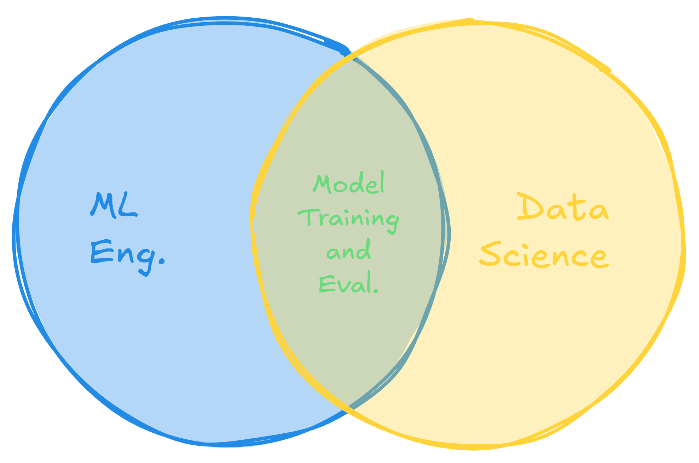
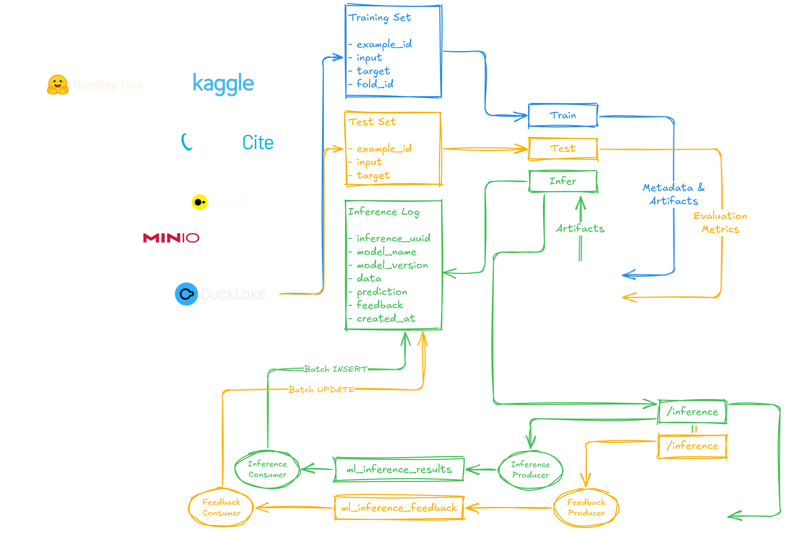
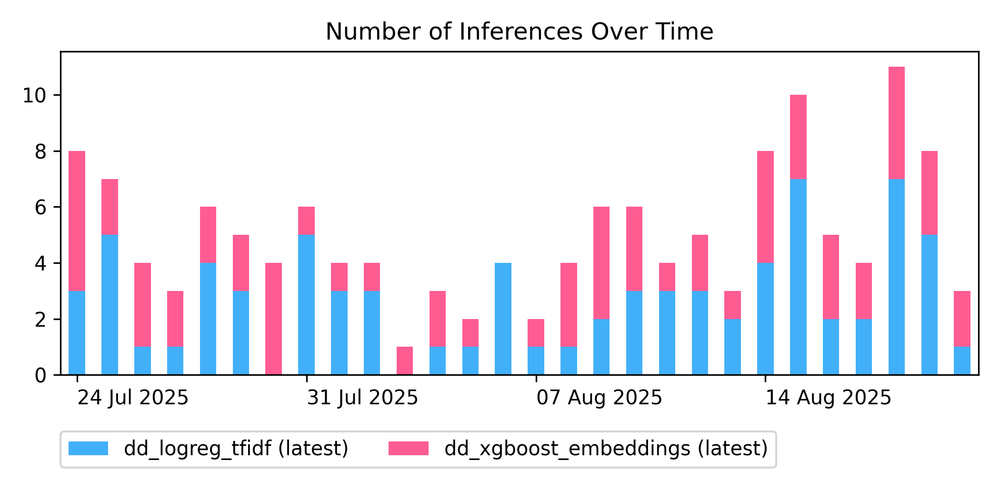
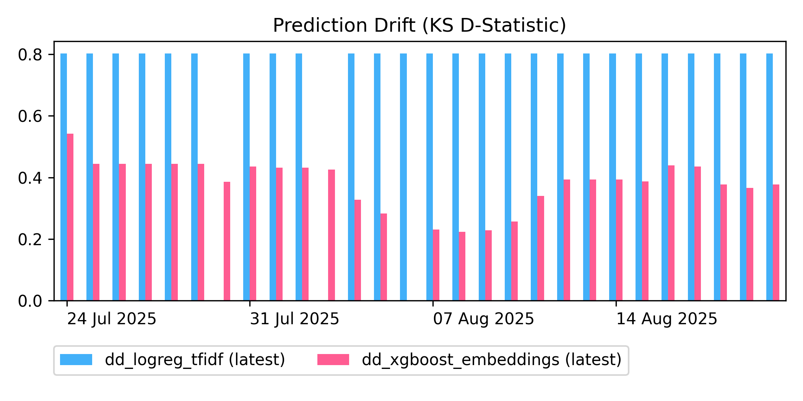
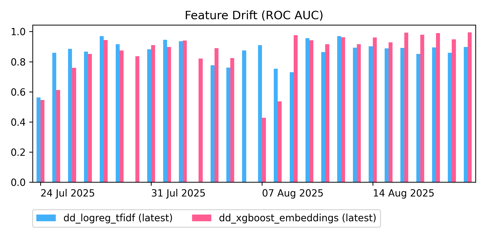
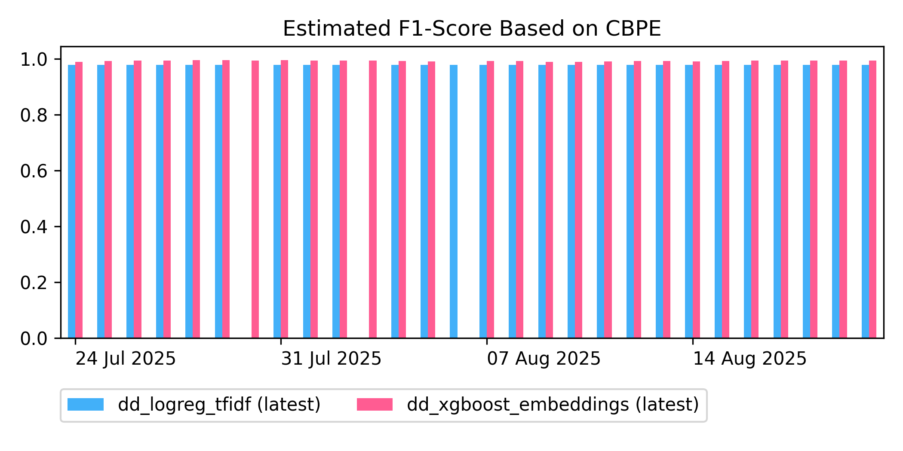
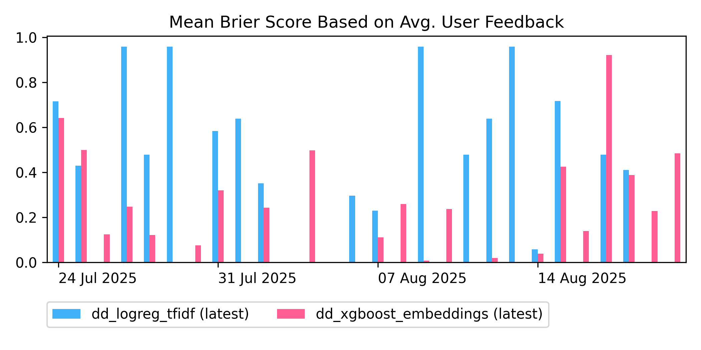

## Summary

Learn how to implement an end-to-end machine learning workflow, from data ingestion, to A/B testing and monitoring, using MLflow, Kafka and DuckLake. We'll discuss model training and tracking with MLflow, real-world deployment approaches, how to track inferences and feedback in your data lakehouse using Kafka and DuckLake, and how to compute monitoring statistics such as prediction drift, feature drift, or estimated performance, for unlabeled data, as well as taking advantage of user feedback to estimate model error. This should give you the tools you need to build and maintain your own ML lifecycle.

<div style="position: relative; padding-bottom: 56.25%; height: 0; overflow: hidden; max-width: 100%;">
	<iframe
		src="https://www.youtube.com/embed/MGuj13NcdjE"
		frameborder="0"
		allow="accelerometer; autoplay; clipboard-write; encrypted-media; gyroscope; picture-in-picture; web-share"
		referrerpolicy="strict-origin-when-cross-origin"
		allowfullscreen
		style="position: absolute; top: 0; left: 0; width: 100%; height: 100%;">
	></iframe>
</div>

## Organizational Roles

I'll start with a bit of a comment on organizational roles in a data team, and their responsibilities. This will help clarify a design choice I made in the architecture diagram below.



We're considering a team with a Data Engineer, a Data Scientist, and a ML Engineer. As most ops roles, the ML Engineer has responsibilities that overlap with other areas covered by other roles, but these usually have a distinct focus when compared to those other roles.

For example, both a Data Scientist and a ML Engineer will work with model training and evaluation in some capacity, but the Data Scientist is usually more interested in picking the right algorithm, hyperparameters and features for training, or the right evaluation metrics for the problem at hand, while the ML Engineer is concerned with making sure that these processes can be tracked in a way that models are properly registered and information is easily available to make a decision on the best model and its staging or production readiness.

Similarly, the Data Engineer also overlaps with the ML Engineer, particularly regarding the data quality aspects of the training and test datasets.

## Architecture

In the diagram below, we highlight the Data Engineering, Data Science, and ML Engineering responsibilities. In blue, you'll be able to tracking any the training flow, in yellow the evaluation flow, and in green the inference flow. The middle layer is an overview on the data schemas for DuckLake tables and Kafka topics. On the bottom, you'll find the service layer, with the REST API, and the Kafka producers and consumers.



In our implementation, FastAPI was responsible for initializing the Kafka producers and consumers, but in a real-world scenario this would be done separately, each running in their own container.

Why Kafka and not something else, like gRPC or Redis Pub/Sub? Kafka acts as an event log, so it provides topic replayability, which is great for compliance, but also for debugging. It can also front-face your product in a way that more brokers can be deployed in groups, handling partitioned messages to the same topic, which is a great way to scale up and down as required. The trade-off is that a controller and a single broker will require ~600 MiB of RAM to run, which is usually acceptable, but, depending on your priorities, it might be too much for basic RPC or queuing, and this will only provide replayability as an advantage, but not partitioning or the reliability of multiple brokers.

## Orchestration

Previously, you hadn't implemented any approach for orchestration on [datalab](https://github.com/DataLabTechTV/datalab/), but with the new ML package, this gained more relevance, so we opted to use a [just](https://just.systems/man/en/) for handling tasks via the command line. This is yet another great tool in Rust, that mimics the `make` command, but it's built specifically for running tasks, as a opposed to building files. Implementing tasks in a `Makefile` usually requires that those targets are added as dependencies of the `.PHONY` target, so that `make` knows they won't produce a file. This would avoid that a task with a name matching an existing file would skip running due to the file existing and being up-to-date. Instead, when using a `justfile`, all targets are essentially `.PHONY`. In addition, since `just` is a tool specifically designed to run tasks, it also provides several utilities that simplify your life. For example, preloading your existing `.env` is as easy as adding:

```just
set dotenv-load
```

And while `make` will run using `/bin/sh` by default, `just` will use your login shell by default. Additionally, `just` also supports positional parameters with default values, and it provides a simple way to list all tasks and their parameters:

```just
just -l
```

A good way to setup your `justfile` is to use this as your first task:

```just
default:
    just -l
```

The first task is the one that's just by default when invoking `just` without any arguments. And yes, `just` can call `just` from other tasks. For example, we do this:

```just
check-init-sql:
    test -r {{init_sql_path}} || just generate-init-sql
```

It also distinguishes internal variables from environment variables:

```just
engine_db_path := join(local_dir, env_var("ENGINE_DB"))

check-engine-db:
    test -r {{engine_db_path}}
```

So, if your orchestration needs don't require something like [Apache Airflow](https://airflow.apache.org/) or [Prefect](https://www.prefect.io/), and `make` or shell scripting don't quite do it, you should consider just using [just](https://just.systems/).

## Training and Tracking

As a way to test our workflow, we decided to train a model to classify user-generated text as depression or not depression. For training and testing, we used the [ShreyaR/DepressionDetection](https://huggingface.co/datasets/ShreyaR/DepressionDetection) dataset from Hugging Face. This was ingested and transformed as usual, using our [dbt and DuckLake workflow](https://youtu.be/zn69Q7FiFfo?si=4vDV_nYxjRtujjLV).

We then trained four models, combining two algorithms and two feature sets:

1. Logistic Regression + TF-IDF
2. Logistic Regression + Embeddings (`all-MiniLM-L6-v2`)
3. XGBoost + TF-IDF
4. XGBoost + Embeddings (`all-MiniLM-L6-v2`)

For each model, we tracked the following metadata and artifacts on MLflow:

- Metadata
	- Data source
	- Hyperparameter grid
	- Input/output data schema and shape
	- Algorithm/method used
	- Features used
	- Evaluation metrics
- Artifacts
	- Serialized model
	- Model signature (input/output format)
	- Python dependencies

We used the following two helper functions, at the beginning and end of our training function, which helped to keep the training code clean.

At the beginning of a run (training starting), we pointed to the correct MLflow server, created the Experiment, if it didn't exist, and started a run with name based on the algorithm/method and feature set. Then, we use `mlflow.set_tags` to track metadata, including dataset based metadata, which is not yet visible in the UI when associated with a logged dataset directly. We also use `mlflow.log_inputs` to log the schema and size of the training and test sets. See next:

```python
def mlflow_start_run(
    experiment_name: str,
    run_name: str,
    tags: dict[str, Any],
    datasets: list[Dataset],
    dataset_tags: dict[str, Any],
):
    tracking_uri = env.str("MLFLOW_TRACKING_URI")
    mlflow.set_tracking_uri(tracking_uri)
    log.info("MLflow tracking URI: {}", tracking_uri)

    mlflow.set_experiment(experiment_name)
    log.info("MLflow experiment: {}", experiment_name)

    mlflow.start_run(run_name=run_name)
    log.info("MLflow run: {}", run_name)

    log.info("MLflow: logging tags and input datasets")

    mlflow.set_tags(tags | dataset_tags)

    contexts = [ds.name for ds in datasets]
    tags_list = [dataset_tags for _ in datasets]
    mlflow.log_inputs(
        datasets=datasets,
        contexts=contexts,
        tags_list=tags_list
    )
```

At the end of a run (training finished), we log the Python requirements, the serialized model, the best parameters from cross-validation (CV), and the metrics from CV and test set evaluation. See next:

```python
def mlflow_end_run(
    model_name: str,
    model: Pipeline,
    params: dict[str, Any] | None = None,
    metrics: dict[str, Any] | None = None,
    train: pd.DataFrame | None = None,
):
    signature = None

    if train is not None:
        log.info("MLflow: inferring model signature")
        model_output = model.predict(train.input)
        signature = infer_signature(train.input, model_output)

    log.info("Extracting pip requirements from uv")
    pyproject = tomllib.load(open("pyproject.toml", "rb"))
    requirements = (
        pyproject
        .get("project", {})
        .get("dependencies", {})
    )

    log.info("MLflow: logging model")

    mlflow.sklearn.log_model(
        sk_model=model,
        name=model_name,
        registered_model_name=model_name,
        signature=signature,
        pip_requirements=requirements,
    )

    if params is not None:
        log.info("MLflow: logging parameters")
        mlflow.log_params(params)

    if metrics is not None:
        log.info("MLflow: logging metrics")
        mlflow.log_metrics(metrics)

    mlflow.end_run()

```

### MLflow Artifact Storage

MLflow uses a database, such as SQLite or PostgreSQL, as its backend store to log metadata. However, for artifacts, it can either log them locally (mostly just for testing), directly on S3, or by acting as an artifact proxy, transparently pointing to either a local or S3 backed location. Here's an overview on how to setup these two options, when starting MLflow:

1. Direct S3 Storage
	- Set `--default-artifacts-root` to an S3 path (e.g., `s3://mlflow/artifacts`).
	- Preferred when each user has its own AWS/S3 credentials.
2. Artifact Proxy
	- Set `--serve-artifacts`.
	- Set `--artifacts-destination` to a local or S3 path.
	- Artifacts will be stored under the default root of `mlflow-artifacts:/`.
	- Preferred when users have no direct interaction with AWS/S3, or to simplify model serving (no need to create S3 credentials for inference services).

Please see our [docker-compose.yml](https://github.com/DataLabTechTV/datalab/blob/v0.6.0/docker-compose.yml) file for details on setting up MLflow as an artifact proxy, with SQLite for the backend store. And also checkout the [Common Setups](https://mlflow.org/docs/latest/ml/tracking/#tracking_setup) section on the official documentation, where you'll be able to find a diagram of the three most common MLflow deployment options.

## Evaluation and Inferencing

We used a train/test split of 80/20, and then split our training set into 3-folds for validation. Our models were trained and optimized using cross-validation and F1 scoring over a minimal hyperparameter grid. For each model, we provided the accuracy and F1 score for the best fold, as well as for the test set. These were logged into MLflow, as described above.

Out of the four models, we selected our best model, which was XGBoost + Embeddings, and Logistic Regression + TF-IDF, which was the most different model, and served these models through a unique endpoint, randomly selecting one of them per request, for A/B testing.

Each inference was assigned a UUID and a creation date, and then sent to a Kafka topic. A topic consumer buffered these requests until hitting a large enough batch or a given timeout, at which point they were flushed into a DuckLake catalog with encrypted storage (remember, this is user data). An example of how to call this endpoint is provided in the `justfile`:

```just
mlops_test_inference_payload := '''
{
    "models": [
        {
            "name": "dd_logreg_tfidf",
            "version": "latest"
        },
        {
            "name": "dd_xgboost_embeddings",
            "version": "latest"
        }
    ],
    "data": "...bc i have depression how are you all d",
    "log_to_lakehouse": true
}
'''

mlops-test-inference: check-curl
    curl -f -X POST "http://localhost:8000/inference" \
        -H "Content-Type: application/json" \
        -d '{{mlops_test_inference_payload}}'
    @echo
    curl -f -X GET "http://localhost:8000/inference/logs/flush"
```

We also provided an API endpoint where users were able to provide a feedback score (1.0 or 0.0 for our depression classifier), based on the inference UUID. Multiple requests with the same inference UUID appended the feedback to the `feedback DOUBLE[]` column.

## Deployment

Below, we cover two approaches for model deployment:

1. Using MLflow to build a Docker image per model.
2. Building your own custom FastAPI REST endpoint.

The MLflow approach provides a more straightforward and standard way to deploy, but each model requires its own separate deployment, and you can't control the output—for example, if you want to return the output from `predict_proba` for a scikit-learn model, instead using `predict`, then you'd need to code that into your model's prediction function before logging it to MLflow.

The custom approach provides more flexibility and potential for optimization—for example, resource sharing for multiple models, or a custom environment with reduced dependencies. Moreover, you can still create your own Docker images when implementing your own REST endpoint. This is the preferred approach by seasoned ML Engineers, and this is what we do here as well, since our inference results return probabilities and need to be logged to DuckLake via Kafka.

### MLflow Models

While MLflow provides an out-of-the-box approach to deploy logged models, the Docker images it produces tend to be huge by default (~25 GB for the `datalab` project). You'll need to properly determine the minimum required dependencies when logging your model, if you want to make sure that the resulting image's size is optimized. Even then, this deployment approach will produce individual images per model, which is good for isolation, but harder on resource management and cost. Instead, you might want to build your own custom solution for deployment based on something like FastAPI, which we will describe in the following section. Meanwhile, here's an example of how to use the MLflow's workflow for deployment.

In order to create a Docker image for your model, you can simply run the following command, providing it a model URI and the target image name:

```bash
mlflow models build-docker \
	-m "models:/dd_logreg_tfidf/latest" \
	-n "mlflow_model_dd_logreg_tfidf"
```

You can then run a container based on the produced image, optionally limiting the number of workers (which defaults to all CPU cores) by setting `MLFLOW_MODEL_WORKERS`:

```bash
docker run -d \
	-p 5001:8080 \
	-e MLFLOW_MODELS_WORKERS=4 \
	"mlflow_model_dd_logreg_tfidf"
```

In order to classify a batch of examples for a model that takes a DataFrame with a single column `input`, you can `POST` JSON to the `/invocations` path:

```bash
curl -X POST "http://localhost:5001/invocations" \
	-H "Content-Type: application/json" \
	-d '{
			"dataframe_split": {
				"columns": ["input"],
				"data": [
					["...bc i have depression how are you all d"],
					["...we were really so lucky..."]
				]
			}
		}'
```

### Custom API

Like we said, in practice, it's more common to deploy models using a custom REST API, usually created using FastAPI, often chosen due to its self-documentation via Swagger UI and ReDoc. This also lets you produce your own Docker image, optimizing it as much as you'd like, and you can also serve multiple models using the same API, which you cannot do with the MLflow approach.

Imagine a 25 GiB image for each of your classifiers, the time it would take to build and deploy, and the resources it would require! This is why most ML engineer create their own web services to deploy their models.

Our API provides the following two main endpoints, which encapsulate the whole workflow logic.

`POST /inference` to `INSERT` inference results:

```python
@app.post("/inference")
async def inference(
    inference_request: InferenceRequest,
    request: Request
):
    try:
        inference_result = predict(inference_request)
    except ModelNotFound:
        return JSONResponse(
            {"error": "Model not found"},
            status_code=status.HTTP_404_NOT_FOUND,
        )

    if inference_request.log_to_lakehouse:
        log.info("Queuing lakehouse insertion for inference result")
        await queue_inference_result(
            request.app.state.inference_result_producer,
            inference_result,
        )

    return inference_result
```

`PATCH /inference` to `UPDATE` an inference result by appending to its `feedback`:

```python
@app.patch("/inference")
async def inference(
    inference_feedback: InferenceFeedback,
    request: Request
):
    log.info("Queuing lakehouse append for inference feedback")

    await queue_inference_feedback(
        request.app.state.inference_feedback_producer,
        inference_feedback,
    )

    return Response(status_code=status.HTTP_204_NO_CONTENT)
```

## Monitoring Strategy

During monitoring, we compare reference data with the current data. Our reference data is always based on the training set (e.g., prediction labels over the training set, features from the training set). Our current data, on the other hand, is based on a sliding window of 7 days, that we compute per day.

Below, we will describe the metrics that we considered, along with our particular implementation, which you can find in the [datalab](https://github.com/DataLabTechTV/datalab/blob/v0.6.0/ml/monitor.py) codebase, under `ml.monitor`.

### Prediction Drift

Prediction drift, or concept drift, is concerned with comparing the reference and current prediction probability distributions.

While there are multiple possible statistical approaches to compare these distributions, we use a Kolmogorov–Smirnov test, particularly looking at the D-statistic, which illustrates the largest possible gap between the two distributions. The higher the D-statistic, the higher the prediction drift.

### Feature Drift

Feature drift, or data drift, is usually concerned with comparing the distributions of individual features. Drift scores for individual features can be aggregated into a global feature drift score, but feature drift can also be computed over all the feature set directly. Below, we briefly explain both approaches, per feature or dataset.

#### Per Feature

We start by comparing each feature individually for reference and current data. For example, if our features are text, we might compare term distributions or the distributions of TF-IDF over all examples. If we're working with embeddings, it's similar—assuming rows are examples and columns are features, we simple compare equivalent columns on the reference and current data.

Again, there are several statistical approaches that we can use here, but let's assume we're again working with a Kolmogorov–Smirnov test, which provides the D-statistic, as well as the p-value.

Once we compare all pairs of features, we'll end up with 1D array with a final metric. If this metric is the D-statistic, it's common for us to take the median, which is less sensitive to outliers, and compute an aggregate feature drift score. Another, less informative, approach is to count the fraction of p-values < 0.05, which just tells us how many features drifted significantly, thus imputing drift to the overall data.

This is not our implementation here. Instead, we relied on a per dataset feature drift, as described next.

#### Per Dataset

For this approach, all features are used simultaneously. A simple way to achieve this is by concatenating reference and current data, assigning each subset its own label:

- Reference → 0
- Current → 1

Keep in mind that these are not the labels in your original data, so, for example, our depression training set contained label 0 for not depression and label 1 for depression, but here the whole dataset will have label 0, regardless of whether we're considering a negative or positive example of depression. Now, instead, we're trying to distinguish between the data in reference and current.

After training a simple classifier (e.g., logistic regression) with the described dataset, we evaluate using ROC AUC.

- If AUC ~ 0.5, the classifier is no better than random guessing, so it cannot distinguish between the datasets, which means there is no feature drift.
- If AUC > 0.5, the classifier is able to distinguish both datasets, so they are not the same and there is as much drift as the AUC.
- If AUC < 0.5, the interpretation is similar to that of AUC > 0.5 in regards to drift, but it also tells us that the classifier is predicting in reverse (this should never happen).

### Estimated Performance

Inspired by [NannyML](https://nannyml.readthedocs.io/en/v0.10.3/index.html), which was incompatible with our remaining dependencies, we implemented confidence-based performance estimation (CBPE).

For the model we want to test (e.g., logistic regression with TF-IDF features), we train an isotonic regression model to predict correctness based on the output probabilities of the model we're testing. The isotonic regressor is trained over a dataset with a single feature in the format:

$\text{pred\_prob} \mapsto (\text{pred\_label} = \text{correct\_label})$

Where $\text{pred\_prob}$ is the output of `predict_proba` for the model we're testing, over examples in the original training set, $\text{pred\_label}$ is corresponding the binary output after applying the decision threshold (e.g., $\text{pred\_label} \leftarrow \text{pred\_prob} \ge 0.5$), and $\text{correct\_label}$ is the target on the original training set, used to train the model we're testing.

Once we have the isotonic regressor (one per model to test), we'll be able to predict the inference correctness for new unseen examples, and from that we'll be able to obtain true and false positives and negatives, and calculate evaluation metrics like accuracy or F1 score.

### User Feedback

Finally, based on user feedback, we'll also be able to a calculate Brier score per inference result, comparing our binary prediction to a probabilistic user feedback score. We can then average the Brier scores to obtain a global error-like metric (notice the similarity with mean-squared error, MSE):

$\displaystyle\text{Avg}(BS) = \frac{1}{n}\sum_{i=1}^n\left(\text{prediction}_i - \frac{1}{m}\sum\_{j=1}^m\text{feedback}\_{ij}\right)$

Where:

- $\text{prediction}_i \in \{0, 1\}$
- $\text{feedback}_{ij} \in [0, 1]$.

Similarly to MSE, lower average Brier scores are better:

- 0 is a perfect calibration.
- 1 is the worst possible outcome.

### Extending Observability

Other elements that we might track to extend observability would be:

- Data Quality
	- Shared responsibility with data engineering.
	- Rule-based validations (e.g., check for all zeros in predictions, or missing values).
	- For example, expressed as an aggregated score of rule compliance.
- Model Explainability
	- [SHAP](https://shap.readthedocs.io/en/latest/) (SHapley Additive exPlanations)
	- [LIME](https://github.com/marcotcr/lime) (Local Interpretable Model-agnostic Explanations)

## Simulating Inferences and Feedback

Since we do not have a production system, we simulate inference requests and user feedback, in order to obtain credible data to test our monitoring statistics with. We use a dataset external to our train/test set, also from Hugging Face, to help with this task: [joangaes/depression](https://huggingface.co/datasets/joangaes/depression). We call this our monitor set. This follows a similar structure to the train/test set, with a text column and a label column for depression or not depression.

Using this data, we simulate inference and feedback assignment in multiple passes (default 3) over the monitor set, where we:

1. Sample a fraction of the dataset (default 0.01, or 1%).
2. Run inference over all examples using a given decision threshold (default 0.5).
3. Log results to the data lakehouse with a random date (default range of 4 weeks).
4. Provide feedback for a fraction (default $[0.45, 0.55]$) of those results...
5. ...simulating wrong feedback by using the complement over a fraction of feedback outputs (default $[0.10, 0.25]$) of the considered results.

This data should contain mostly correct feedback, with a few errors, simulating a real-world scenario. Inferences might have no feedback, or any number of feedback scores up to the number of passes, i.e., 0 to 3 feedback scores.

## A/B Testing Results

Based on the simulated inferences and user feedback, we now look at and interpret the monitoring statistics.

### Inferences Over Time

We track the number of inferences ran per day, over the simulated period of one month. This also shows how many times each model was randomly selected per day. Volume is higher for mid-August and although model selection is uniform, the logistic regression model using TF-IDF features seems to have been selected more frequently when looking at daily aggregations.



### Prediction Drift

Also known as concept drift, we measure prediction drift based on the D-statistic from the Kolmogorov–Smirnov test. The lower the D-statistic the less prediction drift there is. As we can see, prediction drift is reaching critical levels for the logistic regression model, while being much lower for the XGBoost model, despite still showing a considerable magnitude. However, the logistic regression is particularly concerning, as the D-statistic is not only high, but also extremely consistent over time, indicating an issue with that model, beyond just optimization.



### Feature Drift

Also known as data drift, feature drift is measured based on ROC AUC. As such, we are looking for values of ~0.5, indicating no feature drift. As we can see, there is also considerable feature drift for both models. This indicates that the training data was not representative of incoming examples for inference. It might also be the case that data preprocessing requires a few normalization steps to make sure the text is formatted similarly in both the reference and current data. For our models, we're probably suffering from both problems, as we didn't put much effort into the preprocessing stage. This goes to show the importance of good data engineering.



### Estimated Performance

While previous metrics indicate that our models are not properly calibrated, we're still predicting evaluation scores as high as the ones obtained during testing. On one side, this matches expected behavior, on the other side we know that we have other problems to solve, before we can trust this score overall.



### User Feedback

Finally, based on user feedback, we're obtaining inconsistent average Brier scores over time, most likely due to the small monitor set sample that we used. However, overall, the lowest (better) values seem to be for the XGBoost model, indicating we might obtain better results by investing on that model, but we'd need more information.



## Final Remarks

Hopefully, this is enough to get you started on MLOps and ML Engineering, providing a comprehensible example of an end-to-end workflow and the types of tasks we're expected to work on as ML Engineers. In future videos and blog posts, I expect to go deeper into the infrastructure side of Data Engineering and MLOps, moving into model deployment, and real-time model monitoring.
