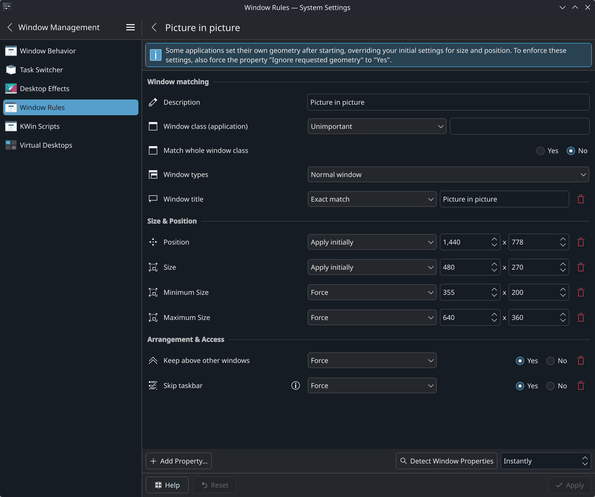
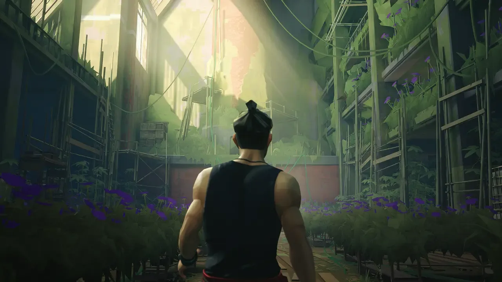
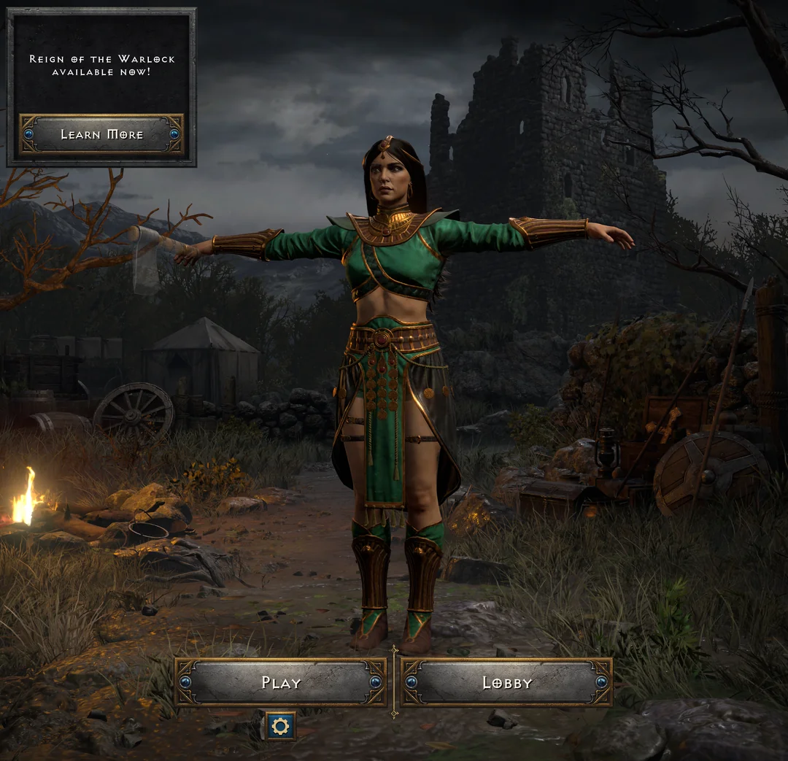
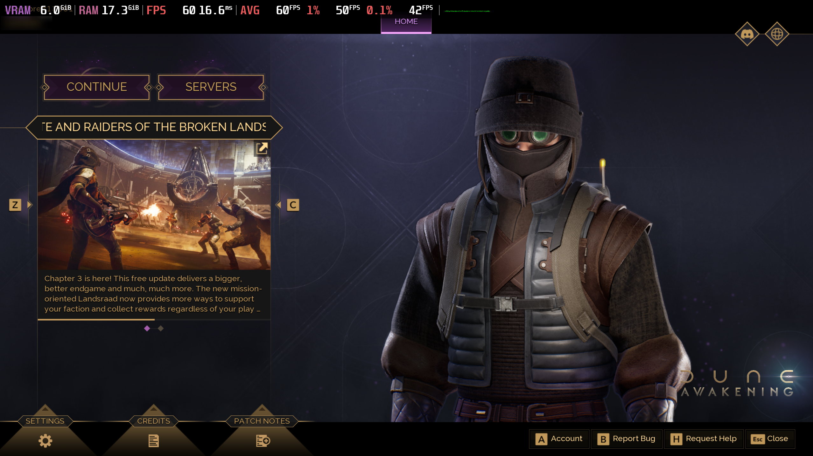

## Summary

Wanna know how it really feels to switch to Linux? Is it finally the year of the Linux desktop? What changes with immutable distros? What about apps, tooling, and gaming? I just switched from Windows 11 to Bazzite as my main desktop. In this blog post, I talk about KDE Plasma, essential applications to manage Flatpak, and the basics of gaming in Linux.

<div style="position: relative; padding-bottom: 56.25%; height: 0; overflow: hidden; max-width: 100%;">
    <iframe
        src="https://www.youtube.com/embed/TBD"
        frameborder="0"
        allow="accelerometer; autoplay; clipboard-write; encrypted-media; gyroscope; picture-in-picture; web-share"
        referrerpolicy="strict-origin-when-cross-origin"
        allowfullscreen
        style="position: absolute; top: 0; left: 0; width: 100%; height: 100%;">
    ></iframe>
</div>

## KDE Plasma

In the early 2000s, I started as a GNOME user, and I always preferred GTK, purely due to the fact that the majority of apps I needed existed as GTK, and I preferred Nautilus over the KDE alternative. Even as I switched to blackbox/fluxbox, and then tiling window managers, like dwm and i3, I kept preferring GTK.

But when I installed Bazzite, it defaulted to KDE Plasma. I always heard good things about it, so I decided to give KDE and Qt apps a chance this time. Also, for the first time, I had the particular goal o replacing Windows as a desktop, so it felt right to start there. I dropped my Nautilus restriction for Dolphin, and adopted all KDE native apps I could find. And you know what, I don't regret it a bit! I love KDE and how easy it is to customize the UI with Plasma, and Qt apps look a bit more professional to me nowadays. GNOME feels a bit balloonish now—I'm not a big fan of the decision to integrate the title bar with the app workflow.

KDE Plasma is like the Mac of Linux. It just works. And, although it's not perfect, it's surely getting there, as new releases are dropping. I'll give KDE Plasma a good run, and I'll even rice it up a little bit. Then, if I really want something different, I'll try out Niri with the Noctalia shell—they both use KDL for configuration, which feels like a good decision to me. I'm not sure whether I'll like the scrolling tiling wm paradigm, fearing it might feel unnecessarily complex, but this is something that needs to be tested in daily use.

### Alt+Tab Issue with Window Rules

In order to properly use picture-in-picture in Brave, I had to add a rule under Settings → Apps & Windows → Window Management → Window Rules. This rule matches windows with the title "Picture in picture", moving it to the bottom right corner of the screen, right above the task bar, applying and initial size of `480x270`, a minimum size of `355x200`, and a maximum size of `640x360`. We also keep this above all windows, and hide the icon from the task bar. This means that the PIP window will open with an average size, but we'll be able to keep the 16:9 ratio when resizing up or down.



However, there is a bug with the Alt+Tab order when Window title matches are being used to define rules. Unfortunately, I wasn't able to match the PIP window any other way for the Brave Browser, so I usually turn the rule off when I'm working, otherwise Alt+Tabbing between two windows will randomly switch to a third window, which drives me crazy. This seems to be a [reported issue](https://bugs.kde.org/show_bug.cgi?id=470087) and it has been [discussed on Reddit](https://www.reddit.com/r/kde/comments/1n40erq/windows_randomly_changing_order_in_task_switcher/) as well.

### Waking Up From Sleep With NVIDIA

With  latest NVIDIA driver, 590.48.01, whenever I set the computer to sleep from KDE and wake it back up, I randomly get visual artifacts. This has been [reported in an issue](https://github.com/ublue-os/bazzite/issues/2645). Visual artifacts usually go away if the window is minimized and then restored and, for KDE, if Plasma is restarted with:

```bash
kquitapp6 plasmashell && sleep 3 && kstart plasmashell
```

Let me just tell you that my next graphics card will definitely be an AMD. The proprietary, closed source approach for NVIDIA is honestly hurting them at this point. It's just ridiculous. There's no way they'll be able to offer proper Linux support, with Linux being such an heterogeneous environment. They really need to let the open source community do their work!


### Getting Spectacle to Record Video

There is currently a bug with the libva driver that prevents Spectacle from recording screencasts. The workaround is to unset the `LIBVA_DRIVER_NAME` env var. I recommend you add the following to `~/.config/environment.d/spectacle-video-fix.conf`:

```bash
LIBVA_DRIVER_NAME=disabled
```

You must then logout in order for this change to be picked up, but you can temporarily start Spectacle from the terminal to test it out:

```bash
LIBVA_DRIVER_NAME=disabled spectacle
```

### Printer & Scanner

This was the most trivial printer and scanner setup I've ever done anywhere. I just went into the KDE settings and my HP printer showed up with two options, IPP or DNS-SD. From what I understand, this impacts discovery, but the underlying protocol is IPP regardless, so I picked DNS-SD and asked to install the recommended driver. Everything worked with the defaults, with zero issues here. It was actually more reliable to configure than anywhere else I can remember, including both Windows and Mac.

For the scanner, I had planned to use NAPS2, which I already used in Windows, but this wasn't available in the Bazaar, as a Flatpak, so I did some digging and it seems like Skanpage is recommended for KDE. I installed it via the Bazaar and it detected three options to connect to my scanner, `eSCL`, `HPAIO`, and `AirScan`. It was between `eSCL` and `AirScan`, as `HPAIO` is for `HPLIP`, which is proprietary (and we like to avoid those). I ended up picking `AirScan` following the same logic as the printer, that the IP might change and I want discover to work properly over DHCP. Other than that, from what I understand, both protocols are essentially the same.

## Applications

### Utilities

Here are some of the utilities you should get familiar with on Bazzite. Some of them are preinstalled, while others can be found on Flathub through Bazaar.

| App         | Description                                                                                                                                                                                                                        |
| ----------- | ---------------------------------------------------------------------------------------------------------------------------------------------------------------------------------------------------------------------------------- |
| Bazaar      | App store for Bazzite, a direct connection to Flathub. Use it to install Flatpak applications.                                                                                                                                     |
| Warehouse   | Central location to manage anything Flatpak related, besides options and permissions (use Flatseal for that). Let's you manage installed packages, remote repositories, user data, and even save a snapshot of installed packages. |
| Gear Lever  | Useful GUI to help manage AppImages, moving them to `~/AppImages` on install, and adding proper menu shortcuts via `.desktop` files.                                                                                               |
| ProtonPlus  | Manage Proton versions for your game launchers. You can select it on the top left. By default it should list Steam and Lutris, but I've confirmed that Heroic is also displayed when installed.                                    |
| DistroShelf | GUI to help manage distrobox containers. This is useful if you need mutable features on an immutable OS. I use it to setup my dev env.                                                                                             |
| Filelight   | Useful to track storage usage. If you like the CLI, this is equivalent to `ncdu`.                                                                                                                                                  |

Personally, I also installed Cryptomator, to manage encrypted folders that I keep in-sync with Syncthing, as well as Mousam for weather information, and MangoJuice to configure MangoHud.

### Flatseal

Flatseal is a GUI to manage your Flatpak options and permissions. Use it when you need to set an environment variable, e.g., to fix the DPI, or when you want to force Wayland over X11, or force toggle GPU support.

Sometimes you might need access to a device, which you can set here as well, or you can enable communication with other processes, like `kwallet6`. For instance, for Signal, I set `SIGNAL_PASSWORD_STORE=kwallet6` and made sure that `org.kde.kwalletd6` was listed under Session Bus Talks.

Flatseal also let's you manage access to system and user files. For example, you can enable *All user files*, or set permissions for specific directories, if you are having trouble copy-pasting images to share on a chat app. For a tighter security, make sure you limit the permissions you give your app!

### OBS

I imported my scenes from OBS on Windows and it mostly got correctly imported. Everything works, although I would prefer not to get so many popups asking me to update the capture source for windows that aren't there anymore, or switched title. It's a bit annoying. From what I understand, this is not an OBS bug but rather a `xdg-desktop-portal` feature—and it needs to be fixed ASAP!

Recording worked fine, but there were some skips in the video, likely due to me recording directly to a NAS device over a 1 Gbps connection. We can buffer the webcam, but it felt like it was gonna lag, so I didn't. Also, changing the settings for the webcam was weird—every time I changed something (e.g., the brightness), the webcam would cycle to off and on again, and I do mean with each skip of the slider. I ended up having to update the value manually, but each type resulted in another cycling.

### Kdenlive

I decided to switch from DaVinci Resolve to Kdenlive for editing and, at first, I kinda regretted it. Kdenlive's UI is top notch, well designed and fluid, but the effect stack felt a little subpar compared to Resolve's. I had some trouble engineering the voice over audio, but equalization proved to be central to make it sound good, or at least good enough for now, as I haven't tuned it in depth yet. At first, it felt like getting good audio was not possible, but I quickly realized there is potential in Kdenlive's audio stack as well. Although I need to put some more work on it, it now feels like I have a good degree of control—I even created my first custom effect stack for 'YouTube VO', which I can simply dragon onto clips, directly applying a sequence of preconfigured audio effects.

There is also a bit of audio crackling during playback, when moving from one clip to the next. This might be due to me editing directly on a samba share though. I used to have very limited disk space, so I edited directly on the NAS, but now I could do it locally, probably. I might test this in the future, just to make sure the issue lied here. And the Chroma Key green screen removal could be better, as it left a green border around the object even after I played around with the settings quite a lot.

One thing I thoroughly enjoyed in Kdenlive was doing in/out editing. I'm not sure whether this is possible in Resolve as well, but I wasn't using it. This works by selecting a clip that you want to cut to add to the timeline, but, instead adding it and later cutting it in the timeline, we play the clip and mark the beginning by pressing `i` for 'in', and then the end by pressing `o` for 'out'. This marks a segment that we can save with `ctrl+i` to later drag to the timeline. And we can keep going by pressing `i` again and then `o` and `ctrl+i`, until all segments are properly cut. In the end we just drag these into the timeline.

### Obsidian

Installed via Flatpak, it uses X11 by default, but the it won't memorize window position or zoom level. Forcing Wayland via Flatseal will fix this, but you'll notice that, on Alt+Tab, you'll see the yellow Wayland icon instead of Obsidian's icon. Running the following command and clicking Obsidian will let us know its `resourceClass`:

```bash
qdbus org.kde.KWin /KWin queryWindowInfo
```

That must match the `.desktop` name for the icon to appear correctly.  For X11, we could set `StartWMClass`, but not for Wayland. Instead,  since the `resourceClass` was `obsidian`, I just renamed it:

```bash
mv ~/.local/share/applications/md.obsidian.Obsidian.desktop \
	~/.local/share/applications/obsidian.desktop
```

## Gaming

I missed all the progress with Proton in the last few years, as I gamed in Windows exclusively, so, getting back to Linux, I have a lot to learn here. Lutris or Heroic? How do I manage Proton versions, and which versions work the best for me? What is DXVK and VKD3D and how do these affect my gaming performance and experience? Should I use a Proton or a Wine runner in Lutris? What are the essential environment variables, flags, and what do `gamescope` or `mangohud` do?

Most games work out of the box, while others can work quite well after some tinkering,  but there are a few issues I haven't been able to solve completely yet. An annoying one is performance degradation in some games. So far, I've noticed this in Sifu, when running it via Lutris on the Epic Store, and on The Eternal Life of Goldman Demo, when running it from Steam.

### Sifu



While I haven't been able to completely solve the issue with performance degradation on Sifu, here are my current options, that seem to mitigate the issue the most:

| Option                                       | Value                              |
| -------------------------------------------- | ---------------------------------- |
| Wine version                                 | Proton-GE Latest                   |
| Enable DXVK                                  | ON                                 |
| Enable D3D Extras                            | ON                                 |
| D3D Extras version                           | v2 (default)                       |
| Enable Esync                                 | ON                                 |
| Enable Fsync                                 | ON                                 |
| Enable AMD FidelityFX Super Resolution (FSR) | OFF                                |
| `DXVK_ENABLE_MEMORY_DEFRAGMENTATION`         | `1`                                |
| `DXVK_GC_FRAME_INTERVAL`                     | `100`                              |
| `DXVK_HUD`                                   | `compiler`                         |
| `DXVK_MEMORY_LIMIT`                          | `8192`                             |
| `DXVK_PRESENT_MODE`                          | `fifo`                             |
| `MESA_GL_VERSION_OVERRIDE`                   | `4.4COMPAT`                        |
| `__GL_SHADER_DISK_CACHE`                     | `1`                                |
| `__GL_SHADER_DISK_CACHE_PATH`                | `/home/dlt/Games/epic-games-store` |

Despite my best efforts, the issue still happened from time to time, but pressing Alt+Enter twice usually restores performance. I'm not sure whether it's the Epic Store overlay, or something else, that is causing the issue, but it seems fixable.

### D2R T-Pose Bug

After installing Diablo II: Resurrected using Lutris, I ended up being affected by the infamous T-pose bug. This happened for the sorceress class only. I tried different Proton versions, Wine-GE, setting multiple env vars and flags, but nothing worked for me.



 At some point, I tried installing the PTR version and the bug wasn't present, so I knew then that it wasn't a configuration issue. I'm not completely sure what had happened, but I believe I initially opened the game with an unsupported runner, and maybe it didn't properly trigger animation loading, likely caching the output. Since I didn't know exactly which cache to clean—and I had tried several paths already—I decided to try and uninstall completely. That fixed it!


### Dune: Awakening Performance

Sometimes, a game will work, but not perform adequately. If that happens, you can go into the [ProtonDB](https://www.protondb.com/) website and search for the game to find out if there's a Proton version or some flags that worked for other people. Games are also labeled as Platinum (best), Gold, Silver, Bronze, or Borked (worst). Most games nowadays are either Platinum or Gold, where Platinum should run out-of-the-box and Gold requires a little tuning.

You can set these flags as environment variables under the game properties inside Steam, or, for other launchers, inside Lutris or Heroic. For Steam games, you do this by editing the *Launch Options*. For *Dune: Awakening*, I tested with the following flags:

```bash
MANGOHUD=1
VKD3D_CONFIG=single_queue
PROTON_DISABLE_HIDRAW=1
PROTON_DLSS_UPGRADE=1
PROTON_ENABLE_WAYLAND=1
__GL_SHADER_DISK_CACHE_SIZE=10737418240
DXVK_HUD=compiler
%command% -USEALLAVAILABLECORES
```

The game was just running with a much lower framerate than it did on Windows. None of these really fixed it, but let's go through each env var and flag, to understand what's happening.

| Option                                     | Description                                                                                                                                                                                                                                                                          |
| ------------------------------------------ | ------------------------------------------------------------------------------------------------------------------------------------------------------------------------------------------------------------------------------------------------------------------------------------ |
| `MANGOHUD`                                 | This one just toggles the MangoHud, so we can track FPS and all other stats. Install [MangoJuice](https://flathub.org/en/apps/io.github.radiolamp.mangojuice), if you want to customize your display. You can also simply add `mangohud` before your `%command%`.                    |
| `VKD3D_CONFIG`                             | Disables work parallelization, which might improve stability, but reduce performance. In some cases, it might be worth it.                                                                                                                                                           |
| `PROTON_DISABLE_HIDRAW`                    | This usually affects controller detection. By default (`HIDRAW` enabled), the game has raw controller access. Sometimes disabling `HIDRAW` can help with detection, but this doesn't affect game performance, apart from a slight change in input lag.                               |
| `PROTON_DLSS_UPGRADE`                      | If DLSS or some of its features are not detected in-game, this can help. Personally, this never changed anything for me.                                                                                                                                                             |
| `PROTON_ENABLE_WAYLAND`                    | This forces the game to run on Wayland, as a opposed to Xwayland. From what I understand, this is usually autodetected. You rarely need to touch it for newer Proton versions.                                                                                                       |
| `__GL_SHADER_DISK_CACHE_SIZE`              | Now, this helps quite a lot, as to avoid stutter due to shaders compiling, if you set a large enough cache size (here, I use `10737418240` bytes, which is 10 GiB). See `DXVK_HUD` below.                                                                                            |
| `DXVK_HUD`                                 | You can set `DXVK_HUD=compiler` to help you understand if shader compilation is causing stutter, as it will display a message on the bottom left whenever shaders are compiling in-game. This is usually enabled by default on Lutris.                                               |
| `%command%`                                | This is the placeholder for the game launcher command (i.e., the executable for the game, or its launcher).                                                                                                                                                                          |
| `-USEALLAVAILABLECORES`                    | This option is specific to Unreal Engine games, and it can be used to force all CPU cores to be used by the game. Enabling this for *Dune: Awakening* seemed to help.                                                                                                                |
| Disabling Steam Overlay                    | This can be helpful to fix slow performance sometimes.                                                                                                                                                                                                                               |
| Custom Proton: `cachyos-10.0-20260227-slr` | It was when I switched to this version of Proton that the game's performance seemed to stabilize. This triggered the *Processing Vulkan shaders* message. I have since switched back to the default, disabling most flags, and the game seems to have a stable framerate regardless. |

If you're trying to get *Dune: Awakening* to a good framerate level, I would pick the following *Launch Options*:

```bash
__GL_SHADER_DISK_CACHE_SIZE=10737418240
mangohud %command% -USEALLAVAILABLECORES
```

And force to the latest CachyOS Proton version, which is currently `cachyos-10.0-20260227-slr`. If you're on a 4K display, also look for a larger mouse cursor when opening the game. I'm not sure why, but I usually get FPS issues when the mouse cursor is smaller during game start—treat it as an indicator that some fix still needs to be applied.

This is how it runs for me with those launch options, Steam overlay disabled, and MangoHud enabled, so we can track system stats. For GPU, I've got a NVIDIA RTX 3060 Ti, with 8 GiB VRAM, running on a system with an AMD Ryzen 9 3900X 12-Core Processor, and 32 GiB DDR4.



I was unable to capture a screenshot after loading the game, as it seems to run in some exclusivity mode, but I was getting around 45-50 FPS with the following settings:

| Graphics                               | Setting     |
| -------------------------------------- | ----------- |
| Quality Preset                         | Custom      |
| Window Mode                            | Fullscreen  |
| Resolution                             | 2560x1440   |
| Upscaling Quality                      | Low         |
| Upscaling Method                       | DLSS        |
| Frame Generation Method                | OFF         |
| Override Upscaling Preset              | ON          |
| Resolution Scale                       | 42          |
| DLSS Upscaling Quality                 | Performance |
| NVIDIA Reflex                          | Disabled    |
| Shadows                                | Medium      |
| Virtual Shadow Maps (Experimental)     | OFF         |
| GI Quality                             | Low         |
| Enable Lumen                           | OFF         |
| Reflections Quality                    | Low         |
| Low End Laptop Mode (Experimental)     | OFF         |
| Limit Process CPU Usage (Experimental) | OFF         |
| View Distance                          | Medium      |
| Post Processing                        | Medium      |
| Effects Quality                        | Medium      |
| Texture Quality                        | Medium      |
| Foliage Quality                        | Medium      |

Overall, the game feels more fluid and stable than in Windows, despite the FPS being fairly equivalent.
