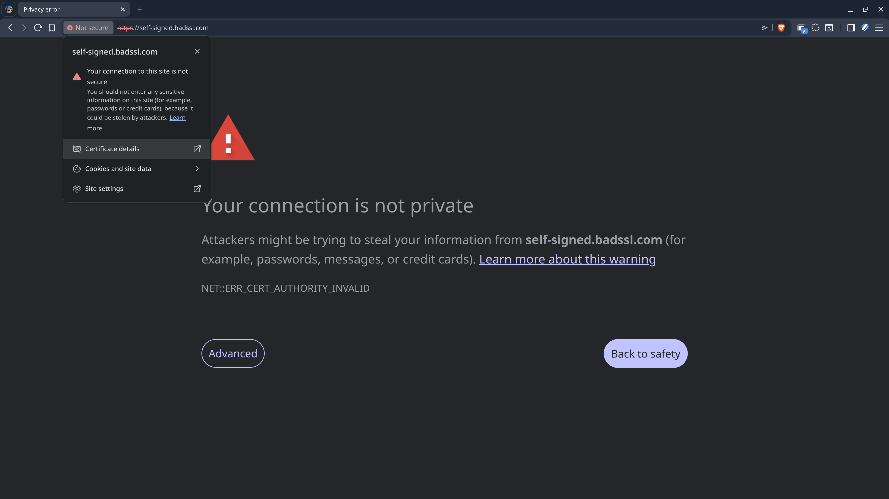
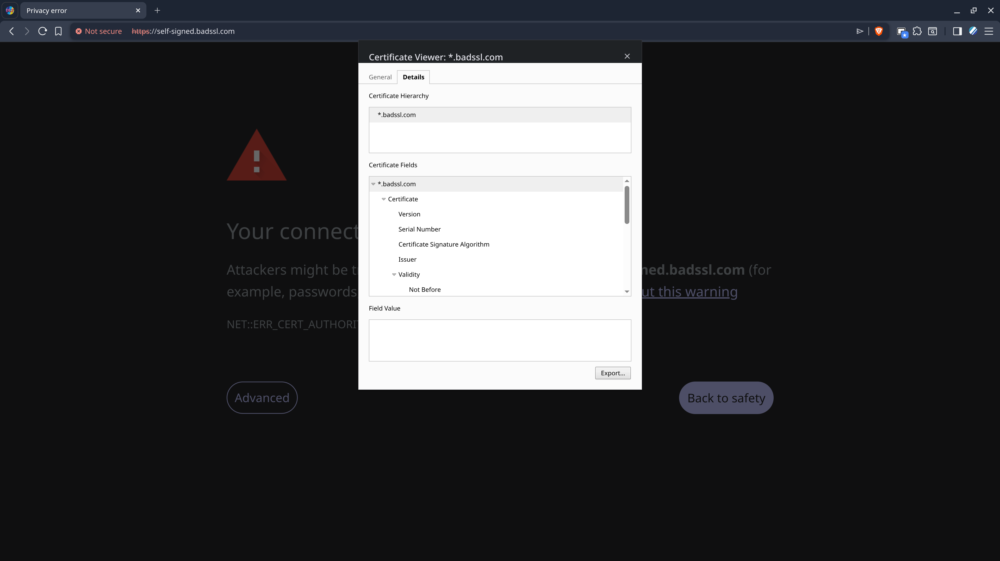

## Summary

Sometimes, you don't want to spin-off a full-blown certificate authority for your network, but you still need to trust a self-signed certificate. When that certificate is needed inside a Flatpak, where exactly do you put it? A good example of this is when you're using Obsidian with the Remotely Save plugin, and you want to sync via WebDAV, when it's using HTTPS, serving from your NAS, with an untrusted certificate. On this blog post I'll show you just how to handle this in Bazzite, if you're stuck.

<div style="position: relative; padding-bottom: 56.25%; height: 0; overflow: hidden; max-width: 100%;">
    <iframe
        src="https://www.youtube.com/embed/TBD"
        frameborder="0"
        allow="accelerometer; autoplay; clipboard-write; encrypted-media; gyroscope; picture-in-picture; web-share"
        referrerpolicy="strict-origin-when-cross-origin"
        allowfullscreen
        style="position: absolute; top: 0; left: 0; width: 100%; height: 100%;">
    ></iframe>
</div>

## Overview

Bazzite relies on the `p11-kit` trust store globally to manage trusted certificates. Flatpak also uses `p11-kit` to access the host's trusted certificates, so, as long as your trusted certificates are dropped under `/etc/pki/ca-trust/source/anchors/` on the host and you run `update-ca-trust`, they will also be valid inside your Flatpaks. As simple as that!

You can download the certificate directly through the browser, or directly from the CLI using the `openssl` command, as described in the following sections.

## Export Certificate from Browser

For example, to download it from a Chromium-based browser, like Brave, just click the menu beside the location base and navigate to *Certificate details* (or similar, depending on the certificate validity status).



Then, switch to the *Details* tab and click *Export*. Save your certificate as a `.pem` file or `.crt`, and manually copy it to `/etc/pki/ca-trust/source/anchors/`.



## Download Certificate with OpenSSL

Another alternative is to do all this purely from the command line, which can be achieved as follows:

```bash
openssl s_client -connect nas.lan:443 -showcerts < /dev/null \
	| openssl x509 -outform PEM \
	| sudo tee -a /etc/pki/ca-trust/source/anchors/nas.pem
```

## Update Trusted Certificates

Once the certificate is in place, run the following command to ensure it gets picked up system-wide by any applications that require TLS verification, including Flatpaks:

```bash
sudo update-ca-trust
```

## Flatpak Use Case

Manually trusting certificates is useful for instance if you're running Obsidian with the Remotely Save plugin, using WebDAV with TLS to sync with your NAS.

If the the certificate for the WebDAV server on the NAS is self-signed (usually the default), then Obsidian will fail to connect, and there is no option to disable TLS verification.

In that case, an easy workaround is to export/download the certificate directly from the host, and add it to `/etc/pki/ca-trust/source/anchors/`.

Also make sure that you connect using a valid hostname or IP, as defined in the certificate.
