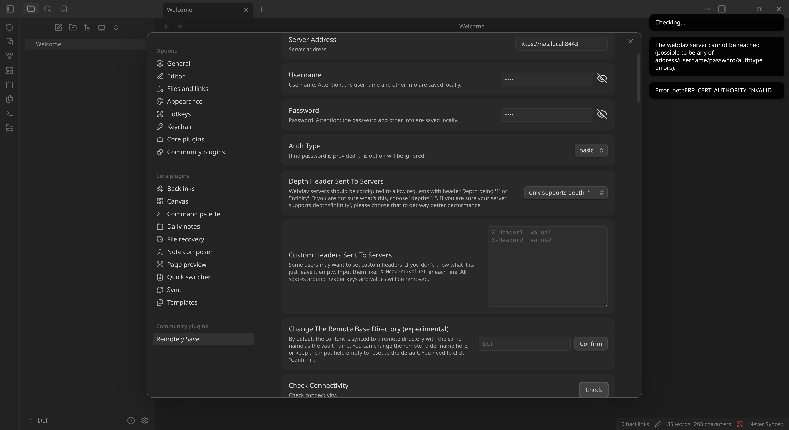
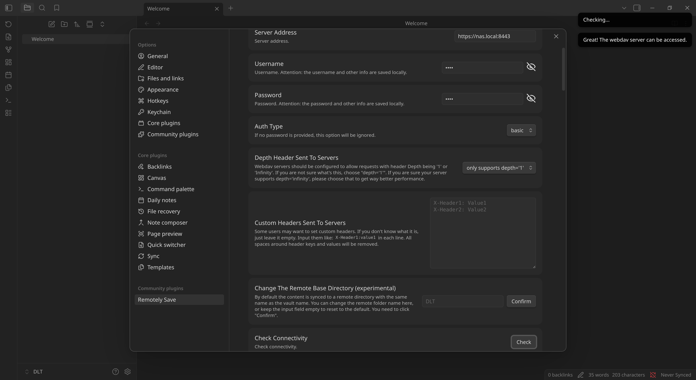

## Summary

Sometimes, you don't want to spin-off a full-blown certificate authority for your network, but you still need to trust a self-signed certificate. When that certificate is needed inside a Flatpak, where exactly do you put it? A good example of this is when you're using Obsidian with the Remotely Save plugin, and you want to sync via WebDAV, when it's using HTTPS, serving from your NAS, with an untrusted certificate. On this blog post I'll show you just how to handle this in Bazzite, if you're stuck.

<div style="position: relative; padding-bottom: 56.25%; height: 0; overflow: hidden; max-width: 100%;">
    <iframe
        src="https://www.youtube.com/embed/Qq-tt6s2DGo"
        frameborder="0"
        allow="accelerometer; autoplay; clipboard-write; encrypted-media; gyroscope; picture-in-picture; web-share"
        referrerpolicy="strict-origin-when-cross-origin"
        allowfullscreen
        style="position: absolute; top: 0; left: 0; width: 100%; height: 100%;">
    ></iframe>
</div>

## Overview

Bazzite relies on the `p11-kit` trust store globally to manage trusted certificates. Flatpak also uses `p11-kit` to access the host's trusted certificates, so, as long as your trusted certificates are dropped under `/etc/pki/ca-trust/source/anchors/` on the host and you run `update-ca-trust`, they will also be valid inside your Flatpaks. As simple as that!

You can download the certificate directly through the browser, or directly from the CLI using the `openssl` command, as described in the following sections.

## Fetching and Trusting a Certificate

We'll cover two ways to retrieve a certificate—through the browser or the CLI—with instructions on how to trust it system-wide on Bazzite.

### Export Certificate from the Browser

For example, to download it from a Chromium-based browser, like Brave, just click the menu beside the location base and navigate to *Certificate details* (or similar, depending on the certificate validity status).


Then, switch to the *Details* tab and click *Export*. Save your certificate as a `.pem` file or `.crt`, and manually copy it to `/etc/pki/ca-trust/source/anchors/`.


### Download Certificate from the CLI

Another alternative is to do all this purely from the command line, using the `openssl` command, which can be achieved as follows:

```bash
openssl s_client -connect nas.lan:443 -showcerts < /dev/null \
	| openssl x509 -outform PEM \
	| sudo tee -a /etc/pki/ca-trust/source/anchors/nas.pem
```

### Update Trusted Certificates

Once the certificate is in place, run the following command to ensure it gets picked up system-wide by any applications that require TLS verification, including Flatpaks:

```bash
sudo update-ca-trust
```

This will add the certificate to `/etc/pki/ca-trust/extracted/openssl/ca-bundle.trust.crt`, which is automatically imported by Chrome-based browsers, like Brave, but not by Firefox. For Firefox, you'll need to explicitly trust the certificate instead.

## Flatpak Use Case

Manually trusting certificates is useful for instance if you're running Obsidian with the Remotely Save plugin, using WebDAV with TLS, to sync up with your NAS.

If the the certificate for the WebDAV server on the NAS is self-signed (usually the default), then Obsidian will fail to connect, and there is no option to disable TLS verification.

In that case, an easy workaround is to run the steps we previously described to trust the certificate. Also make sure that you connect using a valid hostname or IP, as defined in the certificate.

### Mockup Test

We'll do a complete mockup based on `mkcert`, to create  your own certificate authority (CA) alongside a self-signed certificate, which we will then use to serve WebDAV via `rclone`, so that we can test this in the Obsidian Flatpak.

Make sure you are inside a distrobox, if running this from Bazzite. Remember, the system is immutable! For example:

```bash
distrobox enter devbox
```

#### Self-Signed Certificate

First, we install `mkcert` on our distrobox with:

```bash
sudo dnf install -y mkcert
```

Then, we initialize `mkcert` with:

```bash
mkcert -install
```

This will create the root certificates under `~/.local/share/mkcert`:

```
Permissions  Size User Group Date Modified Name
.r--------@ 2.4Ki dlt  dlt   10 Mar 07:47   rootCA-key.pem
.rw-r--r--@ 1.6Ki dlt  dlt   10 Mar 07:47   rootCA.pem
```

Then, we add a hostname to `/etc/hosts`:

```
127.0.0.1   nas.local
```

And we create a certificate for that host and IP to use with our mockup WebDAV server:

```bash
mkdir /tmp/webdav && cd /tmp/webdav
mkcert nas.local 127.0.0.1
```

The result is:

```
Permissions  Size User Group Date Modified Name
.rw-------@ 1.7Ki dlt  dlt   10 Mar 07:58   nas.local+1-key.pem
.rw-r--r--@ 1.5Ki dlt  dlt   10 Mar 07:58   nas.local+1.pem
```

#### WebDAV Server

We install `rclone` on the distrobox:

```bash
sudo dnf install -y rclone
```

We setup a temporary data directory for our WebDAV server:

```bash
cd /tmp/webdav && mkdir data
```

And then we run a WebDAV server using the self-signed certificate:

```bash
rclone serve webdav data/ \
  --addr "nas.local:8443" \
  --user "demo" \
  --pass "demo" \
  --cert "nas.local+1.pem" \
  --key "nas.local+1-key.pem"
```

#### Obsidian

1. Install the Obsidian Flatpak from Flathub using the Bazaar.
2. Create an empty vault (or your use your own).
3. Enable *Community plugins* and install *Remotely Sync*.
4. Go to the plugin settings and, under *Choose A Remote Service*, select `WebDAV`.
5. Under *Server Address* enter `https://nas.local:8443`.
6. Input `demo` for both *Username* and *Password*.
7. Press *Check* to check connectivity.

On a clean install, after step 7, you'll get a certificate error:

```
Error: net::ERR_CERT_AUTHORITY_INVALID
```



Trust the certificate as instructed previously, and retry step 7. In our case, we must trust the root certificate installed by `mkcert`, since our self-signed certificate was signed by it. This will solve the `net::ERR_CERT_AUTHORITY_INVALID` error.

```bash
sudo cp ~/.local/share/mkcert/rootCA.pem /etc/pki/ca-trust/source/anchors/
sudo update-ca-trust
```

Close the Obsidian Flatpak completely (i.e., all vaults you might be running), open it back up, and you should now be able to connect and sync your files. Pressing *Check* should now work without errors, as shown below.


