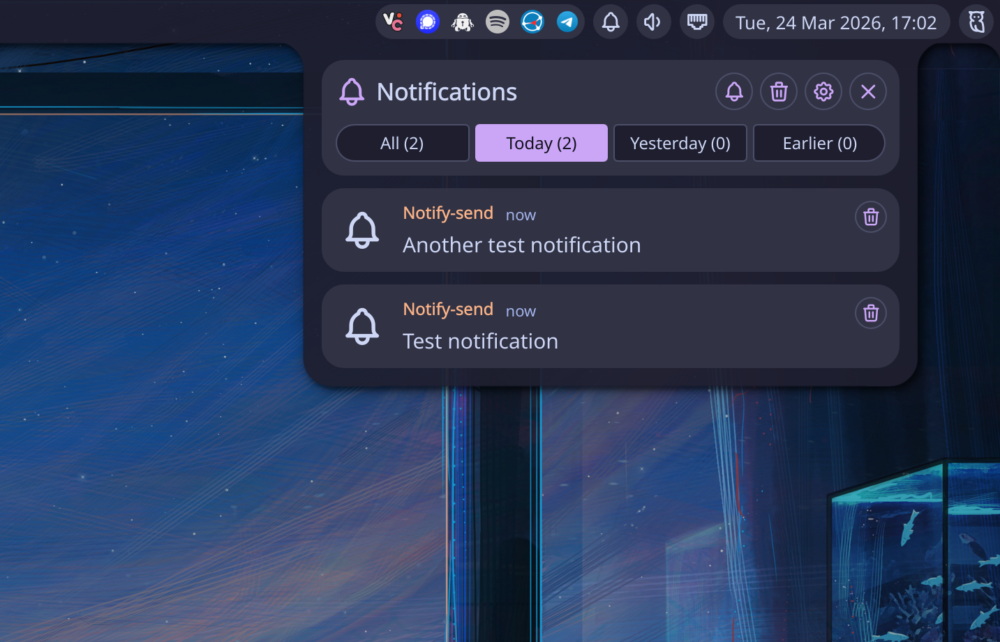
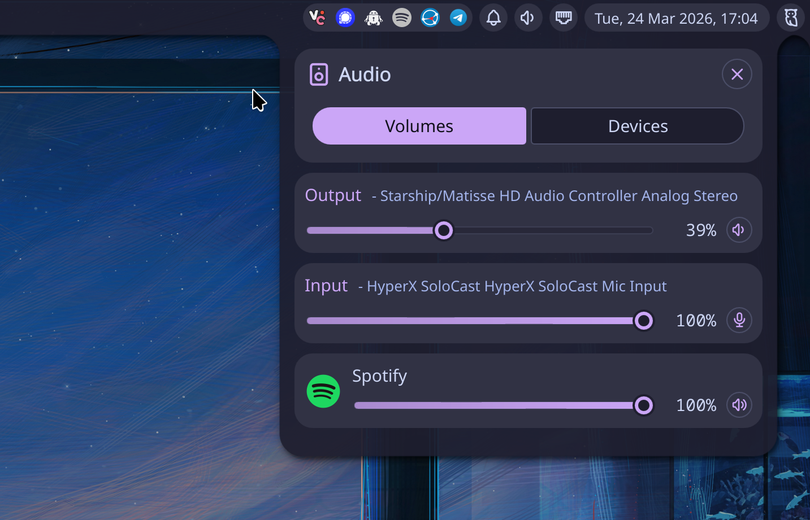
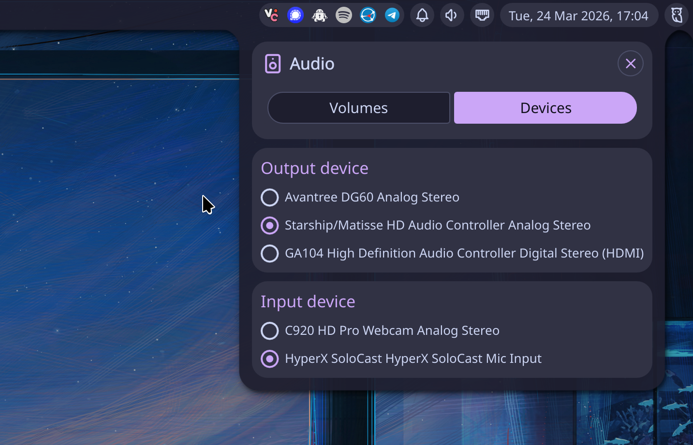
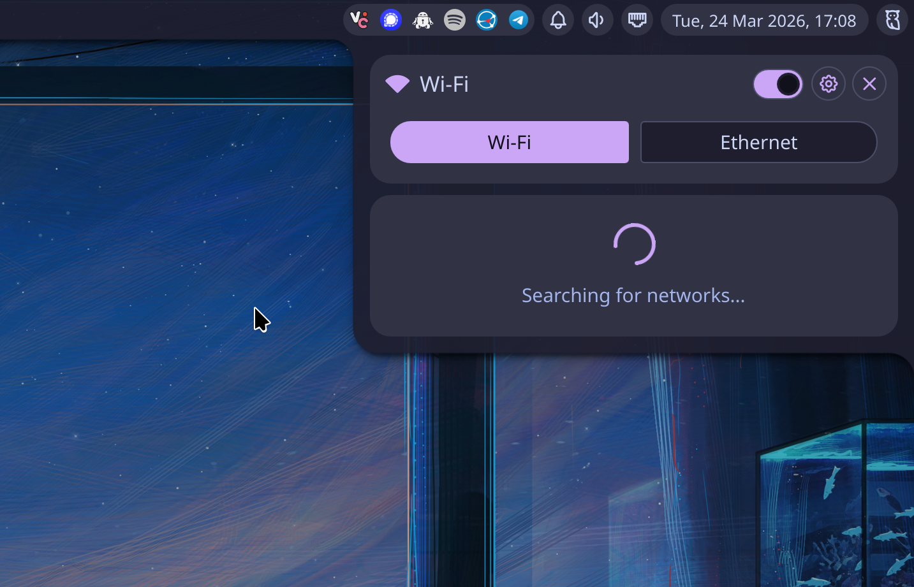
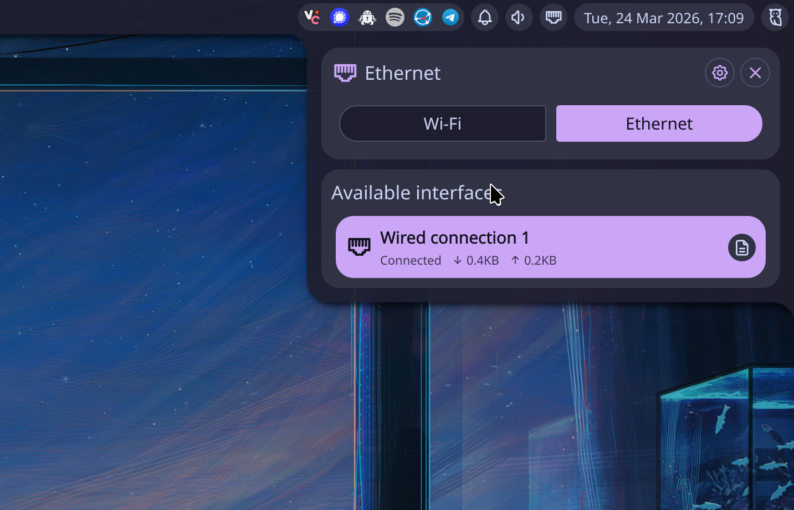
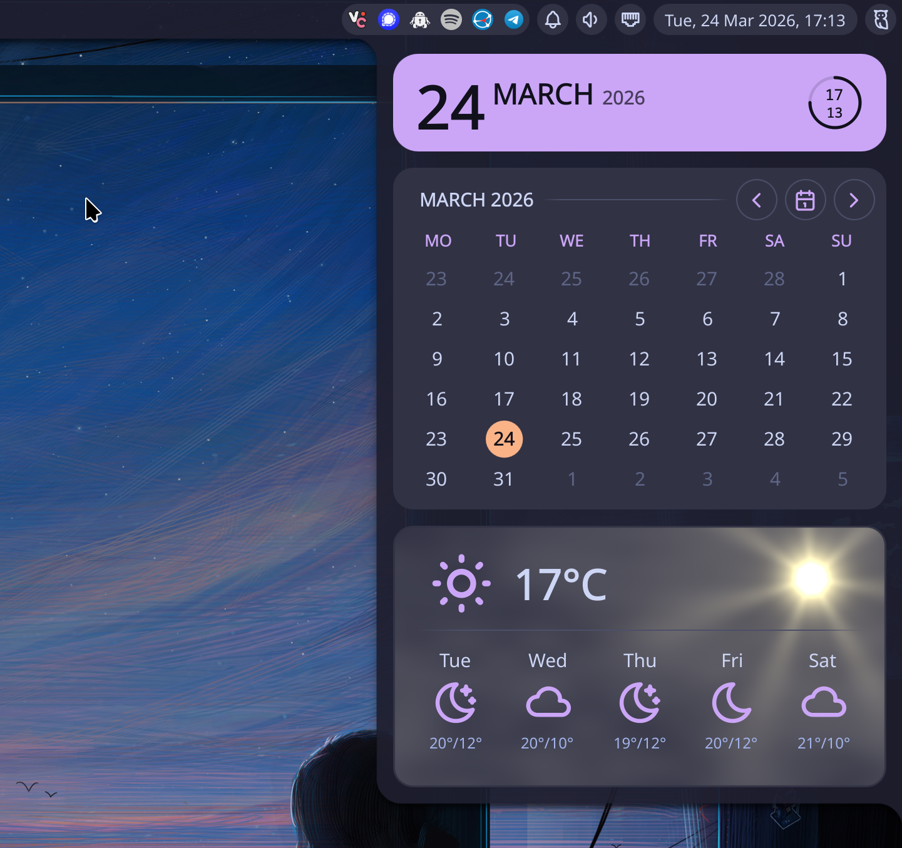
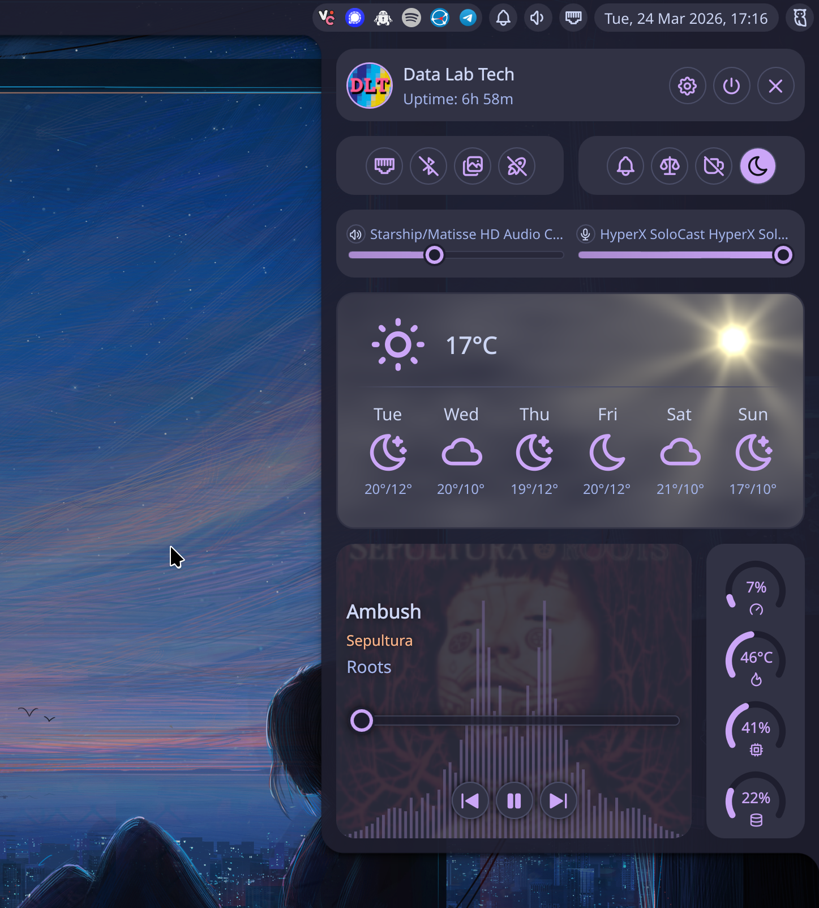

## Summary


<div style="position: relative; padding-bottom: 56.25%; height: 0; overflow: hidden; max-width: 100%;">
    <iframe
        src="https://www.youtube.com/embed/TBD"
        frameborder="0"
        allow="accelerometer; autoplay; clipboard-write; encrypted-media; gyroscope; picture-in-picture; web-share"
        referrerpolicy="strict-origin-when-cross-origin"
        allowfullscreen
        style="position: absolute; top: 0; left: 0; width: 100%; height: 100%;">
    ></iframe>
</div>

## Our Setup

[Niri](https://niri-wm.github.io/niri/) is a compositor, which means it provides a way to render and manage windows, workspaces, and other panels, but not much beyond that. It's not a fully integrated desktop environment, like KDE, rather being functionally equivalent to [KWin](https://github.com/KDE/kwin) in KDE.

This is why we usually add a shell on top of niri, just like you have the [Plasma Shell](https://kde.org/plasma-desktop/) for KDE. We could, of course, simply use something more minimal like [Waybar](https://github.com/Alexays/Waybar), but we opted to go with a full-blown shell instead. We decided to use [Quickshell](https://quickshell.org/),  described in their official website as "a toolkit for building status bars, widgets, lockscreens, and other desktop components using [QtQuick](https://doc.qt.io/qt-6/qtquick-index.html)". More specifically, we decided to install the [Noctalia](https://noctalia.dev/) shell, which is available on the [Terra](https://terrapkg.com/) COPR, a major community repository for Fedora and its derivatives, by [Fyra Labs](https://fyralabs.com/). Terra is available on the Bazzite image, despite being disabled by default.

We also considered installing [Vicinae](https://www.vicinae.com/), but ended up deciding against this, as Noctalia already provides its own integrated launcher.

Transitionally, we're also keeping KDE installed, and we'll be using most of the tools available on KDE, like [kwallet6](https://github.com/KDE/kwallet). For theme management, we decided to switch to [qt6ct](https://www.opencode.net/trialuser/qt6ct/). For screen capturing, we tried using [xdg-desktop-portal-kde](https://github.com/KDE/xdg-desktop-portal-kde), since it was already available from the installed KDE, however it didn't work correctly, so we switched to [xdg-desktop-portal-gnome](https://gitlab.gnome.org/GNOME/xdg-desktop-portal-gnome), as suggested in niri's documentation on [Screencasting](https://niri-wm.github.io/niri/Screencasting.html).

We also hit an issue where not all tray icons would appear on the Noctalia bar, but we ended up fixing by creating a custom launch script named [tray-launch](https://github.com/DataLabTechTV/dltos/blob/afaa221f41751173451f9c562119c587c4b4accf/system_files/usr/bin/tray-launch).

Our niri config is split between two files, the base system-wide config, and our user config, where we `include` the system-wide config and expand from there. We were also required to create a config for portals and setup a few environment variables. We configured Noctalia manually via its UI. We'll cover all of these configs below.

## System Configs

We added two system configs to our user account, that we describe below:

1. `~/.config/xdg-desktop-portal/portals.conf`
2. `~/.config/environment.d/niri.conf`

### Portals

Here are a few notes about portals. The system will install portal configs by default under `/usr/share/xdg-desktop-portal`. In [DLT OS](https://github.com/DataLabTechTV/dltos) you'll find `niri-portals.conf` and `kde-portals.conf`, preinstalled by KDE and niri, respectively. By default, `niri-portals.conf` should be used. However, we currently still use `kwallet6`, and we haven't added `gnome-keyring` yet, so, for now, we suggest you create a custom config under `~/.config/xdg-desktop-portal/portals.conf` with the following configs:

```toml
[preferred]
default=gnome
org.freedesktop.impl.portal.FileChooser=kde
org.freedesktop.impl.portal.ScreenCast=gnome
org.freedesktop.impl.portal.Screenshot=gnome
```

 Please also notice that the `xdg-desktop-portal-gnome` package has been bugged since 2022. When adding multiple capture sources, or reselecting the window for the source, it will not respond correctly. Follow their [#40](https://gitlab.gnome.org/GNOME/xdg-desktop-portal-gnome/-/issues/40) issue about this problem.

### Qt Theming

We use `qt6ct` for theming Qt apps on niri. This is optional, but if you want to use it, the best approach is to create an environment config under `~/.config/environment.d/niri.conf` containing:

```bash
QT_QPA_PLATFORM=wayland
QT_QPA_PLATFORMTHEME=qt6ct
QT_QPA_PLATFORMTHEME_QT6=qt6ct
```

Make sure to run the following command the logout afterward:

```bash
systemctl --user daemon-reexec
```

## Niri Configs

Our niri config is split between two files, the base system-wide config, and our user config, where we `include` the system-wide config and expand from there.

### System Essentials

These are the non-negotiable configs required to ensure niri integrates correctly with [PAM](https://www.linuxjournal.com/article/2120) and [D-Bus](https://www.freedesktop.org/wiki/Software/dbus/), as well as that it launches the Noctalia shell.

First we unlock `kwallet6` automatically with:

```kdl
spawn-at-startup "/usr/libexec/pam_kwallet_init"
```

Then, we import environment variables into systemd:

```kdl
spawn-at-startup "systemctl" "--user" "import-environment" "WAYLAND_DISPLAY" "XDG_CURRENT_DESKTOP"
```

And update D-Bus activation environment with those env vars:

```kdl
spawn-at-startup "dbus-update-activation-environment" "--systemd" "WAYLAND_DISPLAY" "XDG_CURRENT_DESKTOP=niri"
```

Finally, we start Noctalia, which will render the top bar, as well as a dock with running applications:

```kdl
spawn-at-startup "qs" "-c" "noctalia-shell"
```

Most people disable the dock. When you first run Noctalia, it will ask you for a few default settings, one of which let's you directly disable the dock.

### Defaults

Niri has an integrate screenshot tool. We set the `screenshot-path` to `~/Pictures/Screenshots`, with each filename including a timestamp. We disable client-side decorations with `prefer-no-csd` (i.e., no window borders), and hide unset keybinds from the hotkey overlay.

The keyboard layout defaults to `us`, with NumLock on, and mouse acceleration is set to flat—gamers, I gotchu! The mouse cursor uses the Breeze theme, same as KDE.

We set a 16px gap around windows, as well as 16px rounded corners, and we let single windows appear centered on screen. We also add preset column widths for 1/3, 1/2, and 2/3 of the screen—these can be toggled with the `Mod+R` keybind. Windows can also be maximized with `Mod+M`.

You can check all these defaults by taking a look at the [config.kdl](https://github.com/DataLabTechTV/dltos/blob/afaa221f41751173451f9c562119c587c4b4accf/system_files/etc/niri/config.kdl) on the DLT OS repo. In order to be able to control the audio player using the media keys, you should also ensure `playerctl` is installed, as keybinds will depend on it.

### User Configs

We also provide a few suggestions and tools for a niri user config that builds upon the system config we describe above. If you need an example, one is also available on the [config.kdl](https://github.com/DataLabTechTV/dotfiles/blob/1e3fbe46ce399e98f0a78b8570828bf07de98137/dot_config/niri/config.kdl) of our dotfiles repo. Keep in mind this is my personal config, so you'll want to change it, particularly the `spawn-at-startup` entries.

#### Autostart

Don't forget to disable the autostart option for each individual application, before adding it to niri's config using `spawn-at-startup`. You might have to delete entries from `~/.config/autostart` as well, e.g., if you were previously using KDE and added entries through the Autostart GUI.

You might also have issues starting some of the applications in a way that displays its tray icon. If this happens to you and the app in question is X11 only, make sure that `xwayland-satellite` is running:

```bash
ps aux | grep xwayland-satellite
```

Otherwise, if the problem persists, try the [tray-launch](https://github.com/DataLabTechTV/dltos/blob/afaa221f41751173451f9c562119c587c4b4accf/system_files/usr/bin/tray-launch) script from the DLT OS repo, which essentially just starts the program you pass it, which whatever arguments it requires, after waiting for the tray area to be loaded with:

```bash
gdbus wait --session org.kde.StatusNotifierWatcher
```

#### Overriding Defaults

We can also override any defaults from the included system-wide niri config at the user level. For my config, I personally disable the hotkey overlay completely with `skip-at-startup`, change the keyboard layout to `pt` (use the layout for your own language here), setup display scaling to 200% (`2.0`), and add a fourth custom column width preset that I specifically use for a presentation scene on OBS during recording.

Finally, I also use this config as a trial area for settings that should be moved to the system-wide config on the DLT OS repo. You'll usually find these after a comment like this:

```kdl
// TODO: move to system-wide
```

## Noctalia Configs

While all my configs in Noctalia were set directly via the UI, these can be backed up as regular dotfiles, available under `~/.config/noctalia`. I currently don't track these configs, as they are quite effortless to reproduce, but I might add them to the [dotfiles](https://github.com/DataLabTechTV/dotfiles) repo in the future, alongside niri's user configs.

### Requirements

There are two optional features in Noctalia that require external packages to be available, the night light, and the audio visualizers.

For the night light to work, you'll need to make sure `wlsunset` is installed in your system, while for the audio visualizers you'll need to install the `cava` package.

### A Tour of the Shell

I have slightly customized Noctalia, reordering some of the widgets in the bar. Below is a screenshot tour of my setup and Noctalia in general. I'l show you most of the screens and widgets, except for the dock, which I do not use.

#### Launcher & Bar

When you press `Mod+Space`, this will toggle Noctalia's launcher, by running the following command:

```bash
qs -c noctalia-shell ipc call launcher toggle
```


Wallpaper is by [RicoDZ](https://www.deviantart.com/ricodz). I found it through [wallhaven.cc](https://wallhaven.cc/w/pkvw9p), but it's originally found on [DeviantArt](https://www.deviantart.com/ricodz/art/Halley-s-Comet-900201745).

Here, you can also see the top bar. I've moved widgets around in the settings, enabling the network widget. You can also see the MediaMini widget, which displays the title of the audio that is playing, and optionally an audio visualizer based on `cava`. You can also enable a standalone visualizer widget, but it felt redundant, so I didn't.

#### System Monitor

On the left of the bar, the first button will toggle the launcher that we see above, and, right next to it, you'll the the system monitor widget, which is fairly configurable. By default, which is what you see here, it will be in compact mode, showing only CPU usage, CPU temperature, and memory usage, as a tiny bar. You can, however, disable compact mode, which will toggle the numeric value for each resource. Notice how the widget changed on the top left, after disabling compact mode.


Also notice that, in compact mode, it's possible to display individual bars for each CPU core.


#### Tray & Notifications

On the middle, you'll find the workspace widget. If you use the mouse wheel to scroll over it, you'll switch workspaces. And then, on the right you'll see the tray icons, and the the notification bell, where you can also toggle the Do Not Disturb option.



#### Volume

Right next to the notification bell, you'll find the volume control and audio device selection widget.





#### Network

Then you'll find then network widget, where you can connect to Wi-Fi networks or find information about your Ethernet wired connection, including the interface, the MAC address, the bandwidth, and the IPs for the interface, gateway, and DNS.

Here is the widget searching for available Wi-Fi networks:



And the Ethernet wired connection, with the Info button on the bottom right:



#### Clock & Calendar

I have moved the clock to the right and changed the display format to match my taste. When we click on this widget, we'll get a more detailed view of date and time, as well as a navigable calendar—it needs better navigation based on month and year selection, but it works in a pinch—and the weather widget.



#### Control Center

Finally, the rightmost widget is the Control Center for Noctalia. This is where you'll find the Settings, or the Session menu to logout, suspend, reboot, or shutdown the system. You can also select the Wallpaper directly from here, after you configured a wallpaper's directory under settings.



#### Settings

As you can see, a lot is going on with this single panel, but let's focus on the cogwheel for now, which will takes us to the settings panel. I will not cover all features here, but I'll show you some of the most relevant below.

In the General settings, you'll be able to setup an avatar for your user. By default, this points to `~/.face`, which is what I used here—I just copied my avatar there to this file. Also notice the Setup wizard option. This is the wizard that is displayed when you first boot Noctalia.


For wallpapers to be selectable, make sure you set a Wallpaper folder that points to a path with a reasonable number of wallpapers. I created a folder just for ricing here, and that's the one I'll use.


Finally, notice that, under Bar, you'll be able to select which widgets to display, moving them to the left, center, or right areas, and reordering them within each area:


#### Wallpaper

Pressing the Wallpaper Selector button, either on the previous screen or directly in the Control Center panel, will take you to the following selection dialog:


Notice that you can either select a color theme—Catppuccin here—or, by pressing the button on the left of the theme selector, you'll be able to automatically set the color theme based on the colors of the wallpaper—you'll also be able to select from multiple color modes, ranging from a zero saturation grey scheme to a vivid colored scheme with the colors of the wallpaper.

#### Session Menu

You can also select which actions to show on the Session Menu. For example, I've disabled Hibernate and Reboot to UEFI, as I don't want to use them from the menu. My keybind for the Session Menu is `Mod+Alt+S`, and it will show the following options:


If you press one of the numbers of click the corresponding button, a timer will show up—a 10 second countdown by default—and the action will occur after the timer expires, or when you press the the number or click the button a second time for confirmation. I love this!

## Final Remarks

There's a lot to like both in Niri and Noctalia, and not that many negatives to point out. If anything, I'd like for both of them to use less memory. I've used i3 in the past, on X11, and was a lot more minimal than this. On my system, Niri is using 738 MiB of VRAM, and QuickShell with Noctalia is using 449 MiB of VRAM, a total of 1.16 GiB, which is not bad for a modern desktop environment, but it's still far from suckeless numbers. Either way, I'm free to use Waybar instead of a fully featured shell to bring this number down.

Overall, I definitely recommend Noctalia + Niri for a highly productive desktop user. And we haven't even touched details like tabs or consume/expel keybinds that further increase your productivity!

If you're on Bazzite (NVIDIA only) and want to test out this setup, you can switch the our custom DLT OS image:

```bash
sudo bootc switch ghcr.io/datalabtechtv/dltos:latest
```

Once you reboot, you'll be able to pick niri from the SDDM login manager and test this configuration directly. If you don't like, you can simply go back to regular Bazzite with the following command, followed by a reboot:

```bash
sudo bootc switch ghcr.io/ublue-os/bazzite-nvidia-open:stable
```

Again, make sure you've got a NVIDIA GPU on your system. Our image does not support non-NVIDIA systems at the time (don't worry, I'm not shilling DLSS 5 here, it's just the GPU I've got).

## Resources

### Niri

- [Xwayland - niri](https://niri-wm.github.io/niri/Xwayland.html)
- [Window Rules - niri](https://niri-wm.github.io/niri/Configuration%3A-Window-Rules.html)
- [Screencasting - niri](https://niri-wm.github.io/niri/Screencasting.html)

### System

- [KDE Wallet - Arch Wiki](https://wiki.archlinux.org/title/KDE_Wallet)
- [XDG Desktop Portal - ArchWiki](https://wiki.archlinux.org/title/XDG_Desktop_Portal)

### Software

- [probeldev/niri-float-sticky: A utility to make floating windows visible across all workspaces in niri — similar to "sticky windows" in other compositors.](https://github.com/probeldev/niri-float-sticky)
- [Satty-org/Satty: Satty - Modern Screenshot Annotation.](https://github.com/Satty-org/Satty)

### Issues

- [Can't select screen share source when multiple pipewire sources are initializing on GNOME / Wayland · Issue #6465 · obsproject/obs-studio](https://github.com/obsproject/obs-studio/issues/6465)
- [Multiple screen share dialogs overlap and prevents interacting with any of them (#40) · Issue · GNOME/xdg-desktop-portal-gnome](https://gitlab.gnome.org/GNOME/xdg-desktop-portal-gnome/-/issues/40)

### Examples

- [cachyos-niri-settings/etc/skel/.config/niri/cfg at master · CachyOS/cachyos-niri-settings](https://github.com/CachyOS/cachyos-niri-settings/tree/114bce2cc341eeeb8e88e51d6e4437647d6fb047/etc/skel/.config/niri/cfg)
- [niri-btw/niri/config.kdl at master · tonybanters/niri-btw](https://github.com/tonybanters/niri-btw/blob/33d8c723b98266b481f23ea4280f79c348ef44c0/niri/config.kdl)
